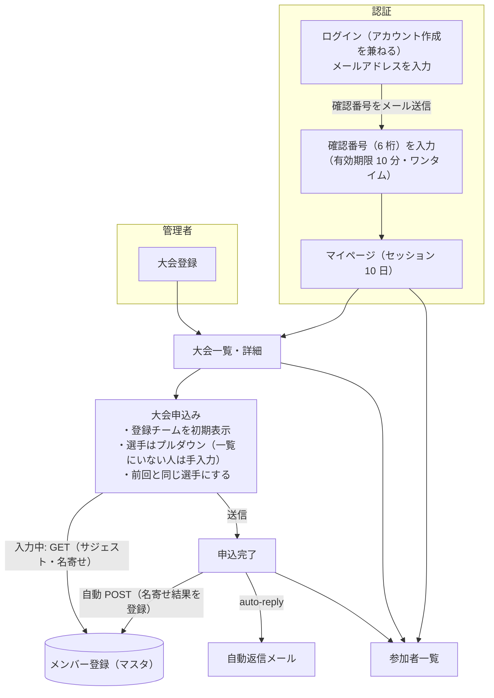
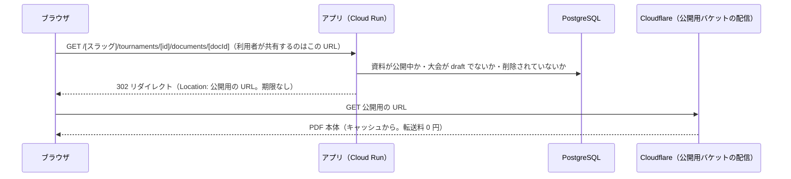
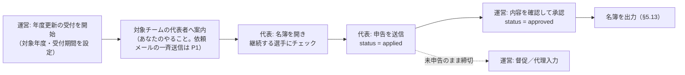
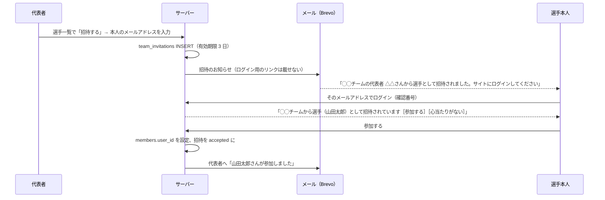
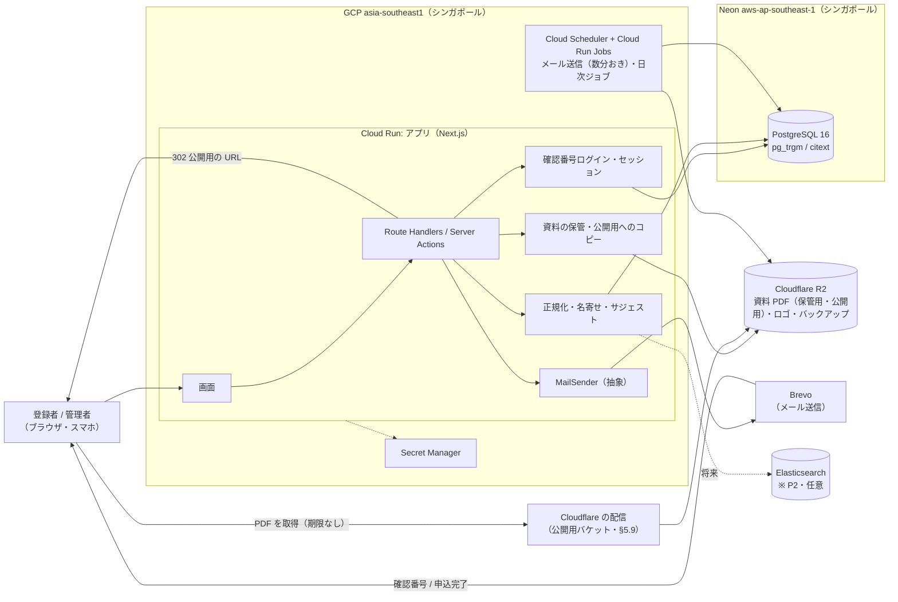
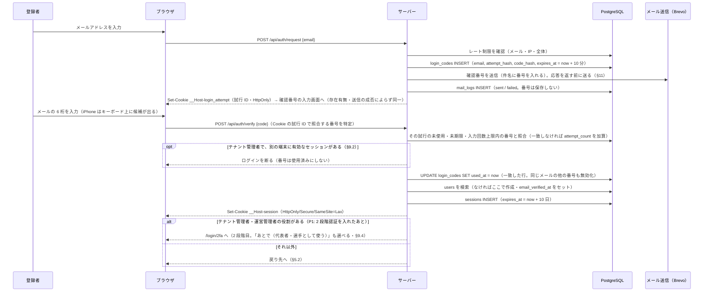

# ビーチボール大会申し込みサイト【仮】 — システム構成・設計書

| 項目 | 内容 |
|---|---|
| 版 | v0.9.5（ドラフト） |
| 作成日 | 2026-09-07（v0.2〜v0.5: 2026-09-08、v0.6〜v0.8: 2026-09-14、v0.9〜v0.9.3: 2026-09-15、v0.9.4〜v0.9.5: 2026-09-17） |
| 元資料 | 手書きラフスケッチ（IMG_4680.JPG） |
| 状態 | `decisions-v0.9.md`〜`decisions-v0.9.2.md` の回答を反映（§14.9・§14.11・§14.13）。**未回答の質問はなし**。回答から解釈して反映した箇所は `decisions-v0.9.3.md`（違っていれば訂正してもらう） |

**v0.9.5 の変更点**
- サイト名を「**ビーチボール大会申し込みサイト**」【仮】にした。サイトの名前が必要な場所（タブの題名・協会に属さないページのヘッダ・協会に属さないメール・規約）ではこれを使い、コードでは 1 か所に置く（§1・§11）
- アプリのドメインを変えることになった場合の扱いを決めた。パスキーは管理者に登録し直してもらう（§11.1）

**v0.9.4 の変更点**: 実装を小分けのタスク（`p0-tasks.md`）で進めるための追記だけ。仕様の変更はない。
- ローカルでは、資料などのファイルを R2 の代わりにファイル保存で扱う（`STORAGE_DRIVER=local`・§6.2・§6.3）。http://localhost では `__Host-` の Cookie と `Secure` 属性を使わない（§9.2）
- 設計書を節ごとのファイル（`docs/design/`）に分けて、作業に必要な節だけを読ませる（`tools/split-design.sh`・§6.4・§13）

**v0.9.3 の変更点**: `decisions-v0.9.2.md` の回答を反映。一覧は §14.13。
- **大会資料の掲示を P0 に**した。2027-03-28 の大会の大会冊子から、このシステムの大会ページで PDF を配る。2 月の前半に作る（Phase 1c）。年度更新は Phase 1d（2/15〜3/12）に移した（§5.9・§13）
- 5 年の保存期間で人物を消しても、申込の氏名・性別・年齢は大会の記録として残し、生年月日だけ消す（§5.16）
- 年払いの協会の 4 名目からの追加分: 年の初めの人数で 12 か月分を前払いし、途中で増えた分は月ごとに請求する（§5.20）
- 資料の種別に「大会冊子」を足した（§5.9・付録 A）

**v0.9.2 の変更点**: `decisions-v0.9.1.md` の回答を反映。一覧は §14.11。
- 申込の選手の候補（サジェスト・「この方ですか？」）は、**申し込む人が代表者を務めるチームの選手だけ**にした。協会内のほかの人は候補に出さない。「協会員だけを表示」のスイッチで絞れる。そこにいない人は生年月日・性別まで手入力する（§5.5・§8.3・§8.4）
- 申込は**無期限に残す**（大会の記録）。申込の変更履歴は開催日から 1 年（§5.16・§12）
- 2027 年度の年度更新の受付は **4〜6 月**。画面の「来年度」を年度の数字に変え、受付期間中の表示を足した（§5.12）
- チームの解散は代表者が協会に連絡し、テナント管理者が削除する（§5.11）
- 利用料: 年額 22,000 円、テナント管理者はその月の最大人数で数える、**契約のページで領収書をダウンロードできる**（P1・§5.20）
- 未成年の選手がいるため、同意の文言を「ご本人（未成年の方は保護者）」にした（§5.18）

**v0.9.1 の変更点**: `decisions-v0.9.md` の回答を反映。主な変更は次のとおり。一覧は §14.9。
- 日程: **次の大会は 2027-03-28、募集開始は 2027-02-20 頃、システムの期限は 2027-01-31**。フェーズを見積もり直し、暦に合わせて組み直した（§13）
- 優先度: **問い合わせフォーム・申込一覧 CSV・年度更新の受付開始・プライバシーポリシーと利用規約・メールアドレスの変更・アカウントの削除・人物の統合（最小）を P0 に**。**2 段階認証はすべて P1 に**（§2）
- チームの考え方: **登録のチーム（組織の運営・年度更新）と大会に出るチーム（その場限りも多い）を区別**。個人登録では申し込まない。サジェストは名簿への追加ではなく**申込で選手を選ぶときに使う**（§5.5・§5.11・§8.4）
- 業務ルール: 年度更新の対象はチームが自分で設定、年度途中の追加の申告、締切前なら承認済みでも直せる、重複の警告は**同一大会**（部をまたいでも）で代表者にも出す、テナント管理者は定員を超えて登録できる、代表者の操作は「選手一覧から外す」の 1 つ（§5.4・§5.5・§5.11・§5.12）
- 管理者: テナント管理者（＝協会の契約者）は**招待して本人が承諾**。**同時ログインは 1 つまで**（新しいログインを断る）（§5.14・§9.2）
- 大会資料: **署名 URL をやめ、公開の資料は期限なしで開ける**配信に変更（§5.9）
- 追加: テナントの色・ロゴ（P1・§5.17）、プライバシーポリシー・利用規約（§5.18）、アカウントの管理（§5.19）、利用料（§5.20）、記録の保存期間（§12）

**v0.9 の変更点**: v0.8 の通しレビュー（`review-v0.8.md`）のうち、**人の判断を要しない指摘**を反映。主な変更は次のとおり。判断が必要な指摘は **§14.8** にまとめた。
- 権限: §3.2 の権限表を唯一の正とし、古い記述を修正。404 と 403 の判定規則を 2 段で明文化（§3.1）
- テナント分離: テナントに属する全テーブルに `association_id` と複合外部キーを追加（§7・付録 A）。RLS が実際に効くように DB ロールを分け、`FORCE ROW LEVEL SECURITY` を付けた（§5.14・付録 A）。API のパスにもスラッグを入れた（§10）。協会をまたぐ画面の作り方を決めた（§5.14）
- 認証: 確認番号の照合を、番号を発行したブラウザに紐づけた（§9.2）。管理者のセッションと 2 段階認証を 1 つのモデルに整理（§9.4）
- 運用: メールの送信待ちの表（§11）、日付は日本時間で扱う（§7.0）、デプロイ・監視（§6.6・§6.7）、テスト方針（§12.1）

**v0.8 の変更点**: **権限を 6 段階に整理**（アンノウン・登録者・選手・代表者・テナント管理者・運営管理者。§3）。**運営管理者**（全テナント横断）と**テナントの切り替え**を追加し、**URL の先頭にテナントのスラッグ**を入れる（§5.14）。**選手のログイン（招待でアカウントと名簿の人物を紐づける）を P0** に（§5.15）。代表者の権限をアカウント単位の `team_admins` に分離。**テナント管理者・運営管理者は 2 段階認証**（§9.4）。

**v0.7 の変更点**: トップページを**テナントごとにカスタマイズできるダッシュボード**に（§5.17）。**マイクロインタラクション**の方針と一覧を追加（§4.5）。申込フォームに**チーム名の入力欄**（登録チーム名を初期表示・変更可）を追加（§5.5）。生年月日を**和暦でも入力**可能に（§4.3）。手入力した選手が登録済みの人と同じ名前なら「**この方ですか？**」と確認（§5.5・§8.3）。NFKC の注意書きは**残す**。

**v0.6 の変更点**: **利用者の 9 割が Web 操作に不慣れな人（高齢者を含む）**という前提で全体を見直し。ログインを**マジックリンクからメール確認番号（6 桁）に変更**し、アカウント作成とログインの入口を 1 つに統合（§5.1・§5.2・§9）。インフラを確定（**Cloud Run・Neon ともシンガポール**、Cloudflare R2、Brevo・§6.5）。大会資料は **PDF のみ**とし、署名 URL で R2 から直接配信（§5.9）。申込画面を「登録チームを初期表示・選手はプルダウン・一覧にいない人は手入力で自動登録」に変更（§5.5）。**画面の用語対応表**を追加（§4.4）。**削除は論理削除を原則とし、物理削除は運営のみ**（§5.16）。**個人登録**（チームに所属しない人）を追加（§5.11）。運営の電話窓口は設けない（§1.2）。

**v0.2 の変更点**: §14 の回答を各章に反映（部門マスタ §5.4 / 未ログイン公開 §5.6 / ホスティング §6.2 / スライディングセッション §9.2 / 送信ドメイン §11）。新規機能として問い合わせフォームと大会資料の掲示を追加。Excel 名簿の初期投入はスコープから削除。

**v0.5 の変更点**: 大会申込に**チーム登録を必須**と確定（寄せ集めチームも登録。選手のトラッキングが目的）。**同じ人が複数チームに所属し、代表を務めるチームと選手として出るチームが異なる**ケースを正式にモデル化（§5.11・§5.15）。テナントは**完全分離**と確定し、保険として PostgreSQL の行レベルセキュリティ（RLS）の採用を提案（§5.14）。

**v0.4 の変更点**: **チーム**を第一級の概念として導入し、協会員の登録・年度更新をチーム代表に委譲（§5.12〜§5.14）。**マルチテナント（協会）をデータモデルに前倒しで導入**（部門をテナントごとに持つため・§7.0）。合計年齢の判定は運営に委ね、システムは**計算して見せるだけ**に変更（§5.5e）。年齢基準日は大会ごとの設定項目に昇格。混合の男女比（男 1 名以上・女 2 名以上、コート 4 名）をバリデーションに追加。名簿の CSV/TSV/MD/PDF 出力を追加（§5.14）。

**v0.3 の変更点**: **生年月日を必須収集**とし、年齢部門のバリデーションを実装対象に追加（§5.5e）。**部門ごとの締切**を追加（§5.4）。**協会員区分**を追加（§5.11）。**モバイルファースト方針**を明文化（§4.3）。DNS は自身で操作可能なため送信ドメインを確定（§11.1）。検索エンジン非掲載を確定（§5.6）。生年月日の収集により個人情報の取り扱い要件を引き上げ（§12）。

**凡例**

- 【S】 スケッチに書かれていた内容
- 【追加】 スケッチにはないが必要と判断して補った内容（提案）
- 【仮】 仮置きの値・判断（§14 で確認したい）

---

## 1. 目的・背景

早良区協会（ビーチボール【仮】）の大会申込（エントリー）業務を Web 化する。

**サイト名**（v0.9.5）: **ビーチボール大会申し込みサイト**【仮】。サイトの名前が必要なときは、すべてこの名前を使う。

- 使う場所: ブラウザのタブの題名（協会のページは「ページ名｜協会名」、協会に属さないページは「ページ名｜ビーチボール大会申し込みサイト」）、協会に属さないページ（`/`・`/login`・`/mypage`・`/invitations`・`/privacy`・`/terms`・`/contact` など）のヘッダ、協会に属さないメールの件名と差出人名（§11）、プライバシーポリシー・利用規約の「本サービス」（§5.18）
- コードでは `src/lib/site.ts` の `SITE_NAME` の 1 か所だけに書く。仮の名前なので、決まったらそこと規約の文面（`docs/legal/`）だけを直せばよいようにする

狙い:

1. 申込の受付・集計を手作業（メール／紙／表計算）からシステムに寄せる
2. 過去の参加者名をサジェストし、前回申込をコピーできるようにして、登録者の入力負荷を下げる 【S】
3. 申込データからメンバーマスタ（メンバー登録）を自動的に育てる 【S】（自動 POST）
4. パスワードを持たない（メールに届く確認番号でログインする）ことで、パスワード忘れ対応と漏えいリスクをなくす 【S】（スケッチはマジックリンク。v0.6 で確認番号に変更・§9.3）
5. **協会員の登録・年度更新をチーム代表に委譲**し、運営が Excel で名簿を集約する作業をなくす（v0.4 追加）
6. **複数の協会（テナント）で使える**構造にする。部門構成は協会ごとに異なる（v0.4 追加）

### 1.1 ゴール

| # | ゴール | 測り方 |
|---|---|---|
| G1a | 初回の代表者が「アカウント作成 → チーム作成 → 選手 4 人の登録」を**スマホで** 10 分以内に完了できる 【仮】（v0.9.1 で G1 を分割） | 試験運用での実測 |
| G1b | 選手一覧がある状態で、大会の申込を**スマホで** 3 分以内に完了できる 【仮】 | 同上 |
| G2 | 2 回目以降は「前回コピー」でスマホから 2 分以内 【仮】。生年月日は前回値が入るので再入力不要 | 同上 |
| G5 | 部門の資格違反（年齢・人数）が締切後に判明する件数をゼロに近づける | 運営の差し戻し件数 |
| G3 | 管理者が締切後 5 分以内に参加者一覧（CSV）を得られる | 同上 |
| G4 | インフラ費が月額 0〜2,000 円程度 【仮】 | 請求額 |

### 1.2 非ゴール（v1 ではやらない）

| 非ゴール | 理由 |
|---|---|
| 参加費のオンライン決済 | 現行の集金方法を踏襲。参加費は大会の説明文に書いて表示するだけ（専用の項目・集計は持たない・§14-4） |
| 試合の組み合わせ・結果の**作成・管理** | 別システム／手作業の範囲。ただし作成済みの PDF（大会冊子・組み合わせなど）を大会ページに**掲示**する機能は入れる（§5.9）。未ログイン者の主な利用シーンがこれのため。**2027-03-28 の大会の大会冊子から、このシステムで配る**（v0.9.3 で P0・Phase 1c・§13） |
| 参加資格の最終確認 | システムは入力時のバリデーション（警告・エラー）まで。**最終的な資格確認は運営が行う**（§14-14） |
| テナント（協会）のセルフサインアップ | **データモデルにはテナントを最初から入れ、分離は完全にする**（§5.14・§7.0）。テナントの作成は運営管理者が行う。テナントの切り替えは v0.8 で P0 に変更 |
| 会費の決済・請求 | 会員資格の管理までがスコープ。集金は現行の運用（§5.13） |
| パスワードログイン、外部 ID 連携（Google 等） | メール確認番号のみで十分 【S】 |
| マジックリンク | 確認番号と両方あると混乱のもとになる。ブラウザをまたぐとログインできない問題もある（§9.3） |
| 電話での問い合わせ窓口 | 運営は非営利で、日中は各自仕事をしている。問い合わせはフォームのみ（§5.10）。画面にも電話番号は載せない |
| モバイルアプリ | スマホ対応の Web で足りる |

---

## 2. スコープ・優先度

| 優先度 | 機能 | 出典 |
|---|---|---|
| P0 | ログイン・アカウント作成（**入口は 1 つ**。メールアドレスを入れるだけ） | 【S】+v0.6 |
| P0 | **メール確認番号（6 桁）でログイン**（有効期限 10 分・ワンタイム）／ セッション 10 日・スライディング更新 | 【S】を変更+§14-9 |
| P0 | マイページ（自分の申込一覧） | 【S】 |
| P0 | 大会登録（管理者） | 【S】 |
| P0 | 大会申込み（**登録チームを初期表示・選手はプルダウン・一覧にいない人は手入力して自動登録**） | 【S】+v0.6 |
| P0 | メンバーサジェスト（氏名・ふりがなの部分一致。**申込で選手を選ぶときに使う。候補は申し込む人が代表者を務めるチームの選手だけ**・§8.4） | 【S】+v0.9.2 |
| P0 | 前回コピー | 【S】 |
| P0 | 送信時の名寄せ ＆ メンバーマスタ自動登録（自動 POST） | 【S】 |
| P0 | 申込完了画面・自動返信メール | 【S】 |
| P0 | 参加者一覧（未ログインは個人情報を伏せた公開版） | 【S】+§14-2 |
| P0 | **大会公開ページ**（未ログインでも閲覧可。概要・参加チーム名まで） | §14-2 |
| P0 | **申込の変更・取消（締切まで本人が自由に編集。締切後は読み取り専用）** | §14-3 |
| P0 | **部門マスタ**（プリセットから選択。混合／MIX の表記ゆれを code で吸収） | §14-1 |
| P0 | **生年月日の収集と部門バリデーション**（性別・年齢・混合の男女比。合計年齢は表示のみ） | §14-14, §14-20 |
| P0 | **チーム管理**（チーム作成、名簿の追加・修正・脱退、代表の権限） | 追加要望 1 |
| P0 | **協会員登録と年度更新の申告**（チーム代表が実施）。**受付開始（対象年度と締切の設定）**、年度更新の対象チームの設定、年度途中の追加の申告を含む | §14-22, 追加要望 1, v0.9.1 |
| P0 | **テナント（協会）をデータモデルに導入**。部門はテナントごと | 追加要望 2 |
| P0 | **年齢基準日を大会ごとに設定**（大会要項によって異なる） | §14-21 |
| P0 | **部門ごとの締切**（既定は大会共通、部門単位で上書き可） | 追加仕様 2 |
| P0 | **モバイルファーストの申込 UI**（選手の 9 割以上がスマホ） | 追加仕様 1 |
| P0 | **協会員区分**（申込時に選手が協会員かどうかが分かる） | §14-19 |
| P0 | **個人登録**（チームに所属しない人の、本人の情報の管理と年度更新。**大会に出るときはチームを作る**・v0.9.1） | v0.6 |
| P0 | **論理削除**（削除はすべて論理削除。物理削除は運営のみ） | v0.6 |
| P0 | **画面の用語の統一**（内部の用語を画面に出さない・§4.4） | v0.6 |
| P0 | **マイクロインタラクション**（押した・変わった・終わった・間違えたを伝える・§4.5） | v0.7 |
| P0 | **権限の 6 段階**（アンノウン・登録者・選手・代表者・テナント管理者・運営管理者・§3） | v0.8 |
| P0 | **運営管理者**（全テナントの一覧、テナントの作成、**テナント管理者の招待**）と**テナントの切り替え**、**URL へのテナントのスラッグ**（§5.14） | v0.8+v0.9.1 |
| P0 | **選手のログイン**（代表者の招待でアカウントと名簿の人物を紐づける・§5.15） | v0.8 |
| P0 | **テナント管理者の同時ログインは 1 つまで**（新しいログインを断る・§9.2） | v0.9.1 |
| P0 | **日次ジョブ**（DB バックアップ、**申込一覧 CSV のバックアップ**、期限切れの確認番号・セッション・招待の処理、保存期間を過ぎた記録の削除）と**メールの送信ジョブ**（§6.5.1・§11） | v0.9（他の P0 の前提）+v0.9.1 |
| P0 | **問い合わせフォーム**（締切後の変更依頼、確認番号が届かないとき、削除の依頼などの窓口。ログインしなくても使える・§5.10） | §14-3、v0.9.1 で P1 から変更 |
| P0 | **申込一覧の CSV**（管理者。締切後は日次ジョブが R2 にも保存・§5.5） | 【追加】、v0.9.1 で P1 から変更 |
| P0 | **プライバシーポリシー・利用規約**のページと、ログイン画面・選手を追加する画面での同意の案内（§5.18） | v0.9.1 |
| P0 | **メールアドレスの変更**・**アカウントの削除**（本人がマイページから・§5.19） | v0.9.1 |
| P0 | **人物の「要確認」の解消と、2 つの人物をまとめる最小の画面**（テナント管理者・§5.8） | 【追加】、v0.9.1 で P1／P2 から変更 |
| P0 | **大会資料（大会冊子・組み合わせ・結果）の PDF の掲示**。2027-03-28 の大会の大会冊子から使う（Phase 1c・2 月・§5.9） | §14-2、v0.9.3 で P1 から変更 |
| P1 | **テナント管理者・運営管理者の 2 段階認証**（パスキー／認証アプリ／リカバリーコード・§9.4）と、**管理者のログイン通知**（新しい端末で 2 段階目を確認したとき） | v0.8、v0.9.1 で P0 から変更 |
| P1 | **名簿の出力（CSV / TSV / Markdown / PDF）** | §14-22 |
| P1 | 年度更新の依頼メールの一斉送信と督促 | §14-22 |
| P1 | 前年度の会員名簿の一度きりの取り込み（運営管理者・初年度の年度更新用・§5.12） | v0.9.1 |
| P1 | **トップページのカスタマイズ**（テナントごとのダッシュボード）と、**協会ごとの色・ロゴ**（§5.17） | v0.7+v0.9.1 |
| P1 | **契約のページ**（プラン・テナント管理者の人数・**領収書のダウンロード**）と、請求に使う情報（協会ごとのテナント管理者のその月の最大人数）の表示（§5.20） | v0.9.1+v0.9.2 |
| P2 | メンバー統合（merge）の本格的な UI（候補の自動提示、一括の統合など） | 【追加】 |
| P2 | Elasticsearch（ngram）によるサジェスト | 【S】→ v1 では見送りを提案（§8.5） |
| P2 | テナントのセルフサインアップ・テナント間の名簿共有 | 追加要望 2 |
| P2 | 会費の請求・入金管理 | §14-27 |

---

## 3. ユーザーとロール

### 3.1 ロール v0.8

| ロール | 誰 | 持ち方 | 任命・招待する人 | ログイン |
|---|---|---|---|---|
| **運営管理者** | システムの運営者（ones）。全テナントを横断して確認する | `platform_admins` | **システムの所有者**が DB に直接登録する（画面からは付与・解除できない）。2 名以内【仮】 | メール確認番号（**2 段階認証は P1**・§9.4） |
| **テナント管理者** | 協会の役員。**協会の契約者**でもある（§5.20） | `association_admins` | **運営管理者が招待し、本人が承諾して有効になる**（v0.9.1・§5.14）。テナント管理者は他の管理者を追加できない。1 協会 5 名以内（§14-5） | メール確認番号（**2 段階認証は P1**）。**同時ログインは 1 つまで**（§9.2） |
| **代表者**（チーム管理者） | チームの代表者・監督 | `team_admins`（チーム × アカウント） | **チームを登録した人**が自動で代表者になる。代表者は**ほかの人に権限を委譲（追加）**できる | メール確認番号 |
| **選手** | チームの選手一覧に載っている本人 | `members.user_id`（人物とアカウントの紐づけ・§5.15） | 代表者が**招待**し、本人が承諾する | メール確認番号 |
| 登録者 | ログインしたが、まだどこにも所属していない人 | `users` のみ | — | メール確認番号 |
| アンノウン | ログインしていない人 | — | — | — |

- 役割は**テナント・チームごと**に持つ。**1 人が複数の役割を持つ**ことを前提にする（例: A 協会のテナント管理者で、X チームの代表者で、Y チームの選手）
- 判定は「どのテナントの、どのチームに対して」の 2 段で行い、**上位は下位を含む**（テナント管理者 ⊇ そのテナントの全チームの代表者 ⊇ 選手）。運営管理者は、切り替えたテナントの中ではテナント管理者と同じ権限を持つ（§5.14）
  - **包含は認可の判定だけに使う**（v0.9）。申込フォームのチームの初期表示・マイページ・「あなたのやること」に出すのは、`team_admins` に自分の行があるチームだけ。テナント管理者が他のチームを操作するのは `/admin` 系の画面からに限る
  - **P0 では、テナント管理者・運営管理者としての権限は役割の行（`association_admins` / `platform_admins`）があれば付く**（v0.9.1。2 段階認証を P1 に移したため）。**P1 で 2 段階認証を入れたら、2 段階目の確認が期限内のときだけ付く**ようにし、期限外は同じ人でも代表者・選手・登録者として判定する（§9.4）。判定は `src/lib/authz.ts` の 1 関数に集約し、P1 ではこの関数に条件を足すだけで済む形にしておく
- 権限は**サーバー側で必ず検査する**（UI の出し分けだけに頼らない）
- **404 と 403 の判定規則**（v0.9 で明文化）。次の順に判定する
  1. URL のスラッグから協会が決まらない → **404**
  2. 対象の資源（大会・チーム・申込など）が見つからない、または **URL の協会と資源の協会が違う** → **404**（存在自体を知らせない）
  3. 資源は URL の協会にあるが、その操作の権限がない → **403**（未ログインも 403。ログインボタンを表示）
  4. 権限はあるが、締切後・上限到達など業務上の条件で受け付けられない → **409**（理由を画面に出す。403 の「権限がありません」と混ぜない）
  - 協会の公開ページ（トップ・大会詳細・参加チーム一覧・資料）は誰でも開ける。チームの作成・個人登録はログインしていれば開ける。**協会に役割の行がないことを理由に 404 にはしない**
- **権限のないページを開いたときは、ログイン画面などへ自動で移動（リダイレクト）させず、403 を返す**（v0.8 で確定）。403 のページの文言は状況で 3 つに分ける（v0.9・§4.4）。未ログインなら「このページを見るにはログインが必要です」＋「ログインする」ボタン（押すとログインし、元のページに戻る）。セッションが切れていれば「しばらく操作がなかったため、もう一度ログインしてください」＋同じボタン。ログイン中で権限がなければ「このページはチームの代表者だけが見られます」のように**誰なら見られるか**を書く
- 代表者は 1 チームに複数置ける。最後の 1 人の代表者は外せない（自分で降りることもできない）。**例外はテナント管理者による代表者の付け替え**（新しい代表者を入れてから外すので、代表者が 0 人になる瞬間はない）
- 締切後にテナント管理者が申込を変更した場合は `entry_audits` に「運営が変更」と残し、ほかのテナント管理者も履歴を見られる。**自分が代表者のチームでも変更は制限しない**（v0.8 で確認）

### 3.2 権限表 v0.8

凡例: ○ できる／× できない／本人 = 自分自身の情報だけ

| 情報・操作 | アンノウン | 登録者 | 選手（自チーム） | 代表者（自チーム） | テナント管理者 | 運営管理者 |
|---|---|---|---|---|---|---|
| 大会の概要・部・申込期間、参加チーム名・チーム数、公開資料、トップページ | ○ | ○ | ○ | ○ | ○ | ○ |
| トップページの「あなたのやること」 | × | ○ | ○ | ○ | ○ | ○ |
| チームの作成・個人登録 | × | ○ | ○ | ○ | ○ | ○ |
| 自チームのチーム名・チームメイトの氏名 | × | × | ○ | ○ | ○（全チーム） | ○※ |
| 自チームの申込（大会・部・出場選手名） | × | × | ○ | ○ | ○（全チーム） | ○※ |
| 選手の生年月日・年齢・性別 | × | × | 本人 | ○ | ○（全チーム） | ○※ |
| 協会員かどうか | × | × | 本人 | ○ | ○（全チーム） | ○※ |
| チームの連絡先（メール・電話） | × | × | × | ○ | ○（全チーム） | ○※ |
| 大会への申込・変更・取消 | × | × | × | ○（締切まで・定員まで） | ○（締切後も・定員を超えても） | ○※ |
| 選手一覧の編集・選手の招待 | × | × | × | ○ | ○ | ○※ |
| 代表者の委譲（追加）・解除 | × | × | × | ○ | ○ | ○※ |
| 年度更新の申告 | × | × | × | ○ | ○（代理） | ○※ |
| 自チームの名簿出力 | × | × | × | ○ | ○ | ○※ |
| 他チームの情報 | × | × | × | × | ○ | ○※ |
| 大会・部・資料・トップページの管理 | × | × | × | × | ○ | ○※ |
| 会員の承認・協会全体の名簿出力 | × | × | × | × | ○ | ○※ |
| 物理削除（§5.16）・人物の統合（§5.8） | × | × | × | × | ○ | ○※ |
| 契約の内容・領収書のダウンロード（P1・§5.20） | × | × | × | × | ○ | ○ |
| テナント管理者の招待・解除 | × | × | × | × | × | ○ |
| テナントの作成、全テナントの件数・状態の確認 | × | × | × | × | × | ○ |

※ 運営管理者が個人情報を含む画面を見るには、そのテナントに**切り替えて入る**必要があり、その記録が残る（§5.14）。

- 選手が見られない「個人情報」: **他の人の**生年月日・年齢・性別、連絡先、協会員かどうか。**自分の情報はすべて見られる**が、直せるのは代表者だけ。システムの中に修正を依頼する機能は作らず（v0.9.1 で確定）、自分の情報の近くに「情報の修正はチームの代表者だけができます。代表者に直接お伝えください」と書く
- 選手は申込を操作できない（自分が出る申込でも）。操作するのは代表者
- **「選手（自チーム）」の判定**（v0.9）: 自分のアカウントが紐づいた人物（`members.user_id`）が、そのチームの**現役の選手一覧**（`team_members` の `left_at` と `deleted_at` が NULL）にいること。脱退・削除されたチームは選手として見られなくなる
- **API の返却項目もこの表に従う**（v0.9）。同じ API でも、選手には他の人の生年月日・年齢・性別・協会員かどうか・連絡先を含めない形で返す（§10）
- **サジェストも例外にしない**（v0.9.2 で確定）。申込で選手を選ぶときの候補（サジェスト・「この方ですか？」）は、**申し込む人が代表者を務めるチームの選手だけ**。協会内のほかのチームの人・個人登録の人は候補に出さない（協会内の全員を候補に出すと、個人情報の漏えいと受け取られるため）。それ以外の人は手入力する（§5.5・§8.4）。選手一覧への追加ではサジェストを使わない
- **代表者の操作は「選手一覧から外す」の 1 つだけ**（v0.9.1。内部は脱退 `team_members.left_at`）。人物そのもの（`members`）は複数のチームで共有されているため、人物の削除と、誤登録の行の削除（`team_members.deleted_at`）はテナント管理者だけが行う（§5.11・§5.16）
- **アカウントと人物の紐づけの解除**は、本人とテナント管理者だけが行える（v0.9）。紐づけは協会内のすべてのチームに効くため、1 つのチームの代表者には解除させない（§5.15）

---

## 4. 業務フロー・画面遷移

### 4.1 全体フロー（スケッチの再構成）



### 4.2 画面一覧

**テナントに属する画面のパスは、先頭にテナントのスラッグが付く**（例: `/sawara/tournaments/[id]`。§5.14）。下表では省略する。テナントに属さない画面は `/`、`/mypage` 系、`/login` 系、`/invitations`、`/account/security`、`/platform` 系、`/privacy`、`/terms`、`/contact`（§5.14）。「管理者」はテナント管理者を指す。

| # | 画面 | パス | 権限 | 概要 |
|---|---|---|---|---|
| 0 | 入口 | `/`（テナント外） | 登録者（未ログインは 403） | 自分が役割を持つ協会の一覧（各協会のトップへのリンク）。リダイレクトはしない（§5.14） |
| 1 | トップ（協会のダッシュボード） | `/[スラッグ]/` | 誰でも | テナント管理者が並べたブロック（お知らせ・受付中の大会・資料など）を表示。ログイン中は「あなたのやること」を上に出す（§5.17） |
| 2 | ログイン（アカウント作成を兼ねる） | `/login` | 誰でも | メールアドレスだけを入力 → 確認番号を送信。登録済みかどうかを利用者に意識させない。利用規約とプライバシーポリシーへの同意の一文とリンク（§5.1・§5.18） |
| 3 | 確認番号の入力 | `/login/code` | 誰でも | メールに届いた 6 桁を入力 → ログイン完了 → 元いたページへ戻る。アプリを切り替えて戻っても入力途中の状態を保つ（§9） |
| 4 | メールが届かないとき | `/login/help` | 誰でも | 迷惑メールフォルダ・受信設定の確認手順、**入力したアドレスを直して送り直す欄**、問い合わせフォームへの導線（§11.3） |
| 5 | マイページ | `/mypage`（テナント外） | 登録者 | 協会ごとに、代表者を務めるチーム・選手として所属するチーム・自分が関わる申込、返事待ちの招待、表示名の変更、**メールアドレスの変更**（`/mypage/email`）、**アカウントの削除**（`/mypage/delete`）、ログアウト（§5.3・§5.19） |
| 5a | チーム作成・個人登録 | `/teams/new` | 登録者 | 「チームで登録」はチーム名だけで作成（「協会員の登録をするチーム」のチェックは任意）、「個人で登録」は本人の情報だけで作成。作成者が自動的に代表になる（§5.11） |
| 5b | **チーム管理（ホーム）** | `/teams/[id]` | 選手・代表者（選手には §3.2 の範囲だけ表示） | 名簿、協会員の状況、年度更新の案内、大会申込履歴（§5.12） |
| 5c | チーム名簿の編集 | `/teams/[id]/members` | チーム代表 | 選手の追加・修正・**選手一覧から外す**、**選手の招待**、**代表者の委譲（追加）**、チームの設定（協会員の登録をするチームか・無効化）（§5.11・§5.15） |
| 5d | **協会員登録・年度更新** | `/teams/[id]/membership` | チーム代表 | その年度も登録する人を選んで申告。締切後は追加の申告（§5.12） |
| 5e | 名簿の出力 | `/teams/[id]/export` | チーム代表 | CSV / TSV / Markdown / PDF（§5.13） |
| 6 | 大会詳細（公開ページ） | `/tournaments/[id]` | 誰でも | 概要・申込期間・部門・「申し込む」。**未ログインでも閲覧可**（§5.6） |
| 7 | 大会申込み（入力） | `/tournaments/[id]/entry` | 登録者（送信時に、そのチームの代表者かを検査。チームがなければその場で作る・§5.5） | **登録チームを初期表示** → 出場する部 → **選手を選ぶ**（申し込むチームの選手一覧からプルダウン、代表者を務めるほかのチームの選手をサジェストで。「協会員だけを表示」のスイッチあり。どちらにもいない人は手入力。ほかのチームから選んだ人と手入力の人は送信時に選手一覧へ自動登録）→ 備考（§5.5） |
| 7a | 大会申込み（確認） | `/tournaments/[id]/entry/confirm` | チーム代表 | 入力内容と選手の年齢・性別を表示 → 「申し込む」。「入力に戻る」で入力内容を保ったまま戻れる（§5.5） |
| 8 | 申込完了 | `/entries/[id]/complete` | その申込のチームの代表者／管理者 | 申込内容の確認、メール送信済みの案内 |
| 9 | 申込の確認・変更 | `/entries/[id]` | チーム代表／管理者 | 締切前は編集・取消可。締切後は読み取り専用＋問い合わせ導線（§5.5d） |
| 10 | 参加チーム一覧 | `/tournaments/[id]/entries` | 誰でも | 未ログイン・ログイン中とも: 部門・チーム名・チーム数のみ。自チームの選手はチーム管理（5b）で見る。管理者: 選手名・連絡先まで（§5.6） |
| 11 | 大会資料（大会冊子・組み合わせ・結果） | `/tournaments/[id]/documents` | 誰でも | 管理者がアップロードした PDF の閲覧。**期限なしで開ける**（**P0**・Phase 1c・§5.9） |
| 12 | 問い合わせ | `/[スラッグ]/contact`（`?tournament=[id]`・`?entry=[id]`）、`/contact`（テナント外） | 誰でも | 締切後の変更依頼、確認番号が届かない、チームやアカウントの削除の依頼など。協会の連絡先メールへ転送。テナント外の `/contact` では宛先（協会／サイトの運営者）を選ぶ（**P0**・§5.10） |
| 13 | 大会登録・編集 | `/admin/tournaments`, `/admin/tournaments/[id]` | 管理者 | 大会 CRUD、部門、申込期間、公開状態、資料アップロード |
| 14 | 申込管理 | `/admin/tournaments/[id]/entries` | 管理者 | 全申込の閲覧・編集・取消、**CSV（P0）**、運営の確認対象の印 |
| 15 | メンバー管理 | `/admin/members` | 管理者 | 検索、編集、生年月日の確認、**要確認の解消と 2 つの人物をまとめる最小の画面（P0・§5.8）** |
| 16 | **チーム管理（運営）** | `/admin/teams`, `/admin/teams/[id]` | 管理者 | 全チームの閲覧・編集、代表の付け替え、チームの無効化・削除（§5.11「チームの無効化と削除」） |
| 17 | **会員管理・年度更新の締め** | `/admin/memberships` | 管理者 | 年度更新の受付開始、年度ごとの申告状況（対象チームのうち未申告のもの）、承認（追加の申告を含む）、督促（P1）、名簿出力（P1）（§5.12・§5.13） |
| 18 | テナント設定 | `/admin/association` | 管理者 | 協会名、連絡先メール、年度の開始月、**部門プリセットの編集**（§5.4・§7.0） |
| 19 | 削除済みデータ | `/admin/trash` | 管理者 | 論理削除されたデータの一覧、復元、**物理削除**（§5.16） |
| 20 | トップページの編集 | `/admin/home` | 管理者 | **ロゴ・協会の色（プレビューしながら設定、ロゴからおすすめの色）**・ブロックの表示／並び順・お知らせの編集、スマホ幅のプレビュー、公開（P1・§5.17） |
| 21 | 招待への返事 | `/invitations`（テナント外） | 登録者 | 届いている招待（選手として／代表者として／**協会の管理者として**）に「参加する」「心当たりがない」で返事をする（§5.14・§5.15） |
| 22 | 2 段階認証 | `/login/2fa`, `/account/security`（テナント外） | テナント管理者・運営管理者 | ログイン時の 2 段階目、パスキー・認証アプリの登録、リカバリーコード（**P1**・§9.4） |
| 23 | 協会の切り替え | 画面右上のメニュー | 複数の協会に関わる人・運営管理者 | 自分が役割を持つ協会（運営管理者は全協会）へ移動（§5.14） |
| 24 | 運営管理 | `/platform`, `/platform/associations/[id]`（テナント外） | 運営管理者 | 全テナントの一覧と件数（テナント管理者の人数を含む）、テナントの作成、**テナント管理者の招待・解除**、アクセス記録、サイトの運営者宛ての問い合わせ（§5.10・§5.14）。2 段階認証のリセット、プランの設定と領収書・請求書のアップロードは P1（§5.20） |
| 25 | エラーページ | （全画面共通） | 誰でも | 403（§3.1 の 3 種類の文言）、404「ページが見つかりません」、409（締切後など。理由と問い合わせ導線）、500「しばらくしてからもう一度お試しください」。どれにも協会のトップへ戻るボタンを置き、内部の用語やエラーコードは出さない |
| 26 | プライバシーポリシー・利用規約 | `/privacy`, `/terms`（テナント外） | 誰でも | 運営者が用意した文面を表示する。改定日を載せる（**P0**・§5.18） |
| 27 | 契約・領収書 | `/admin/contract` | 管理者 | プラン・料金、今月のテナント管理者の最大人数、領収書・請求書のダウンロード（P1・§5.20） |

### 4.3 UI 方針（モバイルファースト）追加仕様 1

**選手側（申込・マイページ・公開ページ）は 9 割以上がスマホからの利用**という前提で作る。運営側の管理画面は PC 主体だが、大会当日はスマホからも触る。

さらに **利用者の 9 割は Web 操作に慣れていない人（PC をほとんど使ったことのない高齢者を含む）**である（v0.6）。「スマホで表示できる」だけでなく「慣れていない人が迷わない」ことを基準にする。

| 対象 | 方針 |
|---|---|
| 選手側の全画面 | **375px 幅を基準に設計**し、PC は中央 1 カラムを広げるだけ。デザインを 2 系統に分けない |
| 画面の分け方 | **1 画面 1 問のような細切れにはしない**（ページ遷移の多さ自体が混乱のもとになる）。1 ページの情報量とページ数の釣り合いを取る。申込は「**入力 → 確認 → 完了**」の 3 ページとし、上部に今どこにいるかを表示する |
| 用語 | 内部の用語・英語・カタカナ語（エントリー、ステータス、セッションなど）を画面に出さない。§4.4 の対応表に従う |
| 日付 | 曜日を付ける。締切は「**9月30日（水）まで　あと5日**」の形。時刻（23:59 など）は出さない |
| 申込フォーム | 選手は**選手枠ごとのプルダウン**で選ぶ（§5.5）。枠は下限人数分を最初から表示し、「選手を追加」で上限まで増やす。横スクロールするテーブルは使わない |
| 生年月日の入力 | **和暦でも入力できる**（v0.7 で確定）。「昭和・平成・令和・西暦」を大きなボタンで選び（既定は昭和【仮】）、年・月・日を数字キーボードで入力する（`inputmode="numeric"`、「元年」は 1）。入力するそばに「（1965年）・61歳」と西暦と年齢を表示し、打ち間違いに気づけるようにする。**今日時点で 15 歳未満か 80 歳以上になったときは、「◯歳で合っていますか？」と確かめ、「はい、合っています」を押すまで次へ進めない**（v0.9.1。平成 5 年のつもりで昭和 5 年のまま入れる、などの誤りに気づけるように。既定の元号は昭和のまま）。元号の範囲外（昭和65年、平成1年1月7日など）はその場でエラー。OS の日付ピッカーは今日から遡るスクロールが長いため使わない。保存は `date` 型。確認ページでは「1965年（昭和40年）5月3日」と併記する。サジェストや「この方ですか？」で登録済みの選手を選んだ場合は自動で埋まり、入力そのものが発生しない |
| サジェスト | 候補はモーダルではなく入力欄直下のリスト。タップ領域は 44px 以上 |
| ボタン | 主要操作（次へ・申込する）は画面下部に固定（サムゾーン内）。誤タップ防止のため「取消」は下部固定に置かない |
| 入力補助 | メールは `type="email" inputmode="email" autocomplete="email"`、ふりがなは `inputmode="kana"`。オートコンプリート属性を正しく付ける |
| 通信 | 申込送信は二重タップを抑止（送信中はボタンを無効化）。電波が切れた場合に備え、**入力内容をローカルに一時保存**して復帰できるようにする（v0.9 で確定。§4.5 の受け入れ条件の前提）。保存先はブラウザの `localStorage`（キーは協会・画面・大会の ID）。**生年月日を含むため、送信が完了したら、またはログアウトしたら消す**。保存から 7 日【仮】経ったものも消す |
| 管理画面 | PC 前提のテーブル UI でよいが、申込一覧と当日使う画面（参加チーム確認）はスマホでも読める最低限のレスポンシブ対応をする |
| 問い合わせ | 困ったときの行き先は**問い合わせフォームだけ**。電話番号は載せない（§1.2） |
| 検証 | E2E テストの少なくとも 1 本は 375×667 のビューポートで実行する。加えて §12「動作確認の範囲」の端末条件（小さい画面・文字サイズ拡大）でスクリーンショットを撮り、はみ出し・重なりがないことを確認する |

### 4.4 画面の用語 v0.6

内部の用語（テーブル名・状態値・設計上の概念）は画面に出さない。画面の文言は次の対応表に従う。新しい用語が出てきたらこの表に足す。

| 内部の用語 | 画面の表示 | 備考 |
|---|---|---|
| テナント / `associations` | （出さない）協会名を表示 | |
| 部門 / `tournament_categories` | 「部」（例: 男子40歳以上の部）。見出しは「出場する部」 | |
| チーム代表 / `team_admins` | 代表者 | |
| テナント管理者 / `association_admins` | 協会の管理者 | |
| 運営管理者 / `platform_admins` | 運営管理者 | 本人の画面にだけ出る |
| 招待 / `team_invitations` | 「◯◯チームから選手として招待されています」 | |
| 2 段階認証 | 2段階認証 | パスキーは「顔認証・指紋認証でログイン」と併記 |
| テナントの切り替え | 協会を切り替える | |
| 名簿 / `team_members` | 選手一覧 | |
| 脱退 / `team_members.left_at` | 選手一覧から外す、外しました［元に戻す］ | 代表者の操作はこれだけ。「脱退」「削除」とは書かない（§5.11） |
| 年度更新の対象 / `teams.membership_renewal_target` | 協会員の登録をするチーム | 「大会に出るためだけのチーム」はチェックしない（§5.11） |
| 追加の申告 / `memberships.source = additional` | 協会員の追加の登録 | 年度の途中に入った人（§5.12） |
| 個人登録 / `teams.kind = individual` | 個人で登録、あなたの登録情報 | 「チーム」と呼ばない（§5.11） |
| テナント管理者の招待 | 「◯◯協会の管理者として招待されています」 | §5.14 |
| 管理者の同時ログインの制限 | 別の端末（またはアプリ）でログインしています。そちらでログアウトしてから、もう一度お試しください | §9.2 |
| 定員を超えての登録（管理者） | この部は定員（10チーム）を超えています（11チーム目） | 管理者の画面だけに出る（§5.4） |
| 生年月日の確認 | 61歳で合っていますか？［はい、合っています］ | §4.3 |
| 人物マスタ / `members`、名寄せ、サジェスト | （出さない） | 候補は「登録済みの選手」 |
| 申込 / `entries` | 申し込み | 「エントリー」は使わない |
| `entries.status = submitted` | 申し込み済み | |
| `entries.status = cancelled` | 取り消し済み | 操作名は「申し込みを取り消す」 |
| 締切（`effectiveDeadline`） | 9月30日（水）まで　あと5日 | 締切後は「受付は終了しました」 |
| 年齢の基準日 | 年齢は◯年◯月◯日の時点で数えます | |
| 合計年齢（`total_age`） | 合計年齢：○歳〜○歳（出場する4人によって変わります。運営が確認します） | §5.5(e) |
| 年度更新の申告 | 2027年度も登録する人を選ぶ | 「来年度」「次年度」とは書かず、年度の数字で書く（受付が年度の初めにあるため・§5.12） |
| 受付期間中で、昨年度の会員の今年度の申告がまだ | 更新の受付中（昨年度は協会員） | 代表者・管理者の画面（§5.12） |
| 申込の選手の候補を協会員に絞る | 協会員だけを表示 | スイッチ（§5.5） |
| `memberships.status = applied` | 運営の確認待ち | |
| `memberships.status = approved` | 協会員（2026年度） | |
| `memberships.status = declined` / 行なし | 協会員ではない | |
| 確認番号 / `login_codes` | 確認番号（6けた） | |
| セッション切れ（最終操作から 10 日） | しばらく操作がなかったため、もう一度ログインしてください | |
| セッション切れ（発行から 90 日の上限・強制ログアウト） | 安全のため、もう一度ログインしてください | 「しばらく操作がなかった」とは書かない |
| 403（未ログイン） | このページを見るにはログインが必要です［ログインする］ | §3.1 |
| 403（権限がない） | このページはチームの代表者だけが見られます | 誰なら見られるかを書く |
| 409（締切後など） | 受付は終了しました。変更は問い合わせフォームからご連絡ください | 「権限がありません」とは書かない |
| 管理機能で 2 段階目の確認が必要（P1） | 協会の管理者の機能を使うには、顔認証・指紋認証などで確認してください［確認する］ | §9.4 |
| 申込の変更方法（完了画面・メール） | 締切（9月30日（水））までは、下のページから変更・取り消しができます。［申し込み内容を見る］ | 申込ページの URL を載せる。ログインのためのリンクではない（§5.7） |
| 論理削除 / `deleted_at` | 削除しました | 利用者には論理・物理の区別を見せない |
| `needs_review` | （利用者には出さない）運営画面は「確認が必要」 | |

### 4.5 マイクロインタラクション v0.7

操作に慣れていない人は「押せたのか」「今待てばいいのか」「終わったのか」「何が間違っているのか」が分からずに手が止まり、連打や離脱につながる。**小さな動きと文字でそれを伝える**。

#### 原則

1. **目的は「押した・変わった・終わった・間違えた」を伝えること**。飾りのための動き（紙吹雪、揺れ続けるアイコン、背景アニメーション）は入れない
2. **動きには必ず文字を添える**。動きを見逃しても、文字を読めば分かるようにする
3. **短く控えめに**: 動きの長さは 150〜300 ms。点滅はしない
4. **勝手に消えるメッセージに頼らない**。成功・エラーのメッセージは自動で消さず、次の操作をするかページを離れるまで残す（高齢の利用者は読むのに時間がかかる）
5. OS の「視差効果を減らす」（`prefers-reduced-motion`）が ON なら、揺れ・スライドをなくし、色と文字の変化だけにする
6. 同じ内容を `aria-live` で読み上げ対象にする
7. スワイプ・長押し・ドラッグなどのジェスチャーを**操作に使わない**。振動（バイブレーション）も使わない（iPhone の Safari が対応していないため挙動がそろわない）

#### 共通

| 場面 | 動き | 伝えること |
|---|---|---|
| ボタンを押した | 押した瞬間に色が濃くなり、わずかに沈む（100 ms） | 押せた |
| 送信中 | ボタンの文字が「送信しています…」になり回転アイコンが付く。ボタンは押せなくなる | 待てばよい。二度押しは要らない |
| 読み込みが 1 秒を超えた | 内容の形をした薄い骨組み（スケルトン）を表示 | 何かが表示されようとしている |
| 読み込みが 3 秒を超えた | 骨組みの上に「少々お待ちください」 | 止まっていない（コールドスタート対策・§6.5.2） |
| 保存・完了 | 緑のチェックが描かれ（300 ms）、「保存しました」を表示 | 終わった |
| 入力の誤り | 該当欄が赤枠になり、1 回だけ小さく横に揺れる。欄の下に理由。ページ上部に「2 か所に入力の誤りがあります」を出し、タップするとその欄へ移動 | どこが、なぜ間違っているか |
| 電波が切れた | 画面上部に帯「電波が届いていません。入力した内容は残っています」。戻ったら「つながりました」に変わる | 入力は消えていない |
| 外した・削除した | 行がふわっと消え、「外しました［元に戻す］」「削除しました［元に戻す］」の帯を出す。［元に戻す］は**直前の操作の取り消し専用**で、**その操作をした本人だけ**が押せる（v0.9.1・§5.11・§5.16） | 消えたが取り返せる |
| 内容が変わった | 変わった箇所を薄い黄色で 1 秒強調 | どこが変わったか |
| 締切が近い | 「あと3日」以内は橙、当日は赤で「今日まで」 | 急ぐ必要がある |
| PDF を開く | タップ後に「開いています…」 | 待てばよい |

#### ログイン

| 場面 | 動き・表示 |
|---|---|
| 確認番号を送った | 封筒のアイコンが 1 回動き、「◯◯@docomo.ne.jp にメールを送りました」。「もう一度送る」は 30 秒後に押せるようになり、それまで「あと 25 秒で送れます」と数える。2 回目以降は待ち時間を 60 秒・120 秒と延ばす【仮】。送信の上限（§9.2）に達したら「◯時◯分まで送れません。迷惑メールフォルダも見てください」と時刻で示し、`/login/help` へのリンクを出す |
| 6 桁を入れ終わった | 自動で照合する（「ログイン」ボタンも残す） |
| 番号が正しい | チェックが描かれ、「ログインしました」のあと元のページへ移動 |
| 番号が違う | 入力欄が 1 回揺れ、**入力した番号は消さずに全選択の状態**にする（見比べて直せるように。打ち直すと置き換わる）。「番号が違います（あと◯回）」。何度か送った場合は「届いたメールのどの番号でも使えます」を添える |

#### 大会申込

| 場面 | 動き・表示 |
|---|---|
| 選手をプルダウンで選んだ | 枠が選手カードに変わり、氏名・年齢・性別が表示される |
| 人数 | 「選手 4人（7人まで）」。下限に届いたら緑になる |
| **部の条件をその場で表示** | 選手を選ぶたびに「男子1人・女子3人　混合の条件を満たしています ✓」や「女子があと1人必要です」を更新する。「確認へ」を押す前に気づける。合計年齢の部は「合計年齢：○歳〜○歳」をその場で更新 |
| 選手を追加 | 新しい枠が下から入り、その枠まで自動でスクロール |
| 前回と同じ選手にする | 選手が上から順に入り、入った枠を一瞬強調。外した人がいれば理由を表示 |
| この方ですか？ | 手入力の氏名欄を離れたとき、候補カードが欄の下に出る（§5.5） |
| 生年月日（和暦） | 入力するそばに「（1965年）・61歳」を表示 |
| 進み具合 | 「入力 → 確認 → 完了」の現在位置が色で進む |
| 申込完了 | 大きなチェックが描かれ、「申し込みが完了しました」と申込番号を表示 |

#### 年度更新・管理画面

| 場面 | 動き・表示 |
|---|---|
| 今年度も登録する人にチェック | 「12人中10人を2027年度も登録します」をその場で更新。昨年度の会員には「昨年度の会員」ラベル |
| トップページの編集で並び替え | 「↑」「↓」ボタンで入れ替えると、ブロックが入れ替わる動き（200 ms）。プレビューに即反映（§5.17） |

#### 実装

- CSS の transition / animation を基本とし、`transform` と `opacity` だけを動かす（性能の低い端末でもカクつかない）。アニメーション用のライブラリは入れない【仮】
- View Transitions API は対応ブラウザでだけ使う（未対応でも操作には影響しない）
- 動きの長さ・イージングはデザイントークン（`--motion-fast: 120ms` / `--motion-base: 200ms` / `--motion-slow: 300ms`）で一元管理する
- ボタン・入力欄・メッセージ・「元に戻す」の帯は共通コンポーネントにし、画面ごとにばらばらな動きにしない

受け入れ条件

- [ ] OS の「視差効果を減らす」を ON にすると、揺れ・スライドがなくなり、文字の表示は変わらない
- [ ] 成功・エラーのメッセージが自動で消えない
- [ ] 送信ボタンを連打しても申込は 1 件だけ作られる
- [ ] 通信を切ると帯が表示され、入力内容が残っている
- [ ] 混合の部で女子が足りないとき、「確認へ」を押す前に不足が表示される

---

## 5. 機能仕様

### 5.1 ログイン・アカウント作成（入口は 1 つ）【S】+v0.6

- **アカウント作成とログインの画面を分けない**。利用者は自分が登録済みかを覚えていないため、画面は「メールアドレスを入力してください」だけにする
- 入力: メールアドレスのみ。表示名は聞かない（必要ならマイページで後から入力）
- 処理: **登録済みかどうかにかかわらず確認番号を送り、画面の文言・所要時間を同じにする**（存在有無を漏らさない）。この時点では `users` を作らない（v0.9）。他人のアドレスを入れるだけで未検証のアカウントが大量に作られるのを防ぐため
- 確認番号の入力に成功した時点で、未登録なら `users` を作成し `email_verified_at` をセットする
- **メールアドレスの入力欄の下に「ログインすると、[利用規約] と [プライバシーポリシー] に同意したものとします」と書き、リンクを置く**（v0.9.1・§5.18）。`users` を作るときに、同意した版（`terms_version`）と日時（`terms_accepted_at`）を保存する

受け入れ条件

- [ ] 不正なメール形式は拒否される
- [ ] 同一メール（大文字小文字違いを含む）で二重登録されない
- [ ] 未登録・登録済みどちらでもレスポンスの文言・所要時間が同じ

### 5.2 ログイン（メール確認番号）【S】を変更

- パスワードなし。メールアドレス入力 → **6 桁の確認番号をメールで送る** → **同じ画面で番号を入力** → ログイン → 戻り先へ移動
- **戻り先の決め方**（v0.9）: ① ログインボタンを押した元のページ（`?next=`） → ② 協会のページから来たならその協会のトップ → ③ 役割を持つ協会が 1 つだけならその協会のトップ → ④ `/mypage`。`next` は**同じサイト内の相対パス（`/` で始まり `//` で始まらない）だけ**を受け付け、それ以外は無視する（外部サイトへ飛ばされる悪用を防ぐ）
- 有効期限 10 分、1 回使ったら無効（スケッチのマジックリンクの条件を確認番号に引き継ぐ）
- **マジックリンクは使わない**（v0.6）。理由は §9.3
- セッション 10 日・スライディング更新・上限 90 日（§14-9。延長しない）。Cookie は HttpOnly / Secure / SameSite=Lax
- **テナント管理者は同時に 1 つのセッションまで**。別の端末で有効なセッションがあれば、新しいログインを断る（v0.9.1・§9.2）
- 詳細は §9

### 5.3 マイページ 【S】

- **代表者を務めるチーム**と、その申込一覧（大会名・部門・チーム名・状態・締切）
- **選手として所属するチーム**と、**自分が出る申込**（v0.8。招待で紐づいた場合・§5.15）
- 返事待ちの招待（§5.15）
- 受付中の大会へのショートカット
- 複数の協会に関わる場合は協会ごとに分けて表示。**マイページはテナントに属さない画面**（`/mypage`）で、協会ごとの読み方は §5.14「協会をまたぐ画面」に従う
- 表示名の変更（任意・§14-13）
- **メールアドレスの変更**・**アカウントの削除**（v0.9.1・§5.19）
- 選手として所属するチームでは、自分の情報の近くに「情報の修正はチームの代表者だけができます。代表者に直接お伝えください」と書く（§3.2）
- ログアウト

### 5.4 大会登録（管理者）【S】

- 項目: 大会名、開催日、会場、説明（参加費もここに書く・§14-4）、申込開始日・**締切日（必須）**、部門（複数）、チーム人数の下限／上限、申込上限（任意）、公開状態（draft / open / closed / archived）
- **申込開始・締切は日付だけで入力する**（v0.9）。画面に時刻を出さない方針（§4.3）に合わせ、開始は**その日の 0:00**、締切は**その日の 23:59:59（日本時間）**として保存する。夕方に締め切ったのに利用者は「今日まで」と思っていた、というずれを作らない
- チーム人数は既定で **下限 4 名・上限 7 名**（§14-1）。大会ごとに変更可能にしておく
- 締切日時を過ぎたら自動で申込不可にする（status を手動で `closed` にしなくても締まる。逆に `closed` にすれば締切前でも締まる・下表）

**大会の状態と受付の可否**（v0.9 で明文化）。受付できるかは `isEntryOpen(tournament, category, now)` の 1 関数で判定し、画面・API・ジョブのすべてで使う（付録 D）。

| status | 公開ページ | 申込（代表者） | 用途 |
|---|---|---|---|
| `draft` | 出さない（404） | 不可 | 準備中 |
| `open` | 出す | **申込開始〜有効な締切の間だけ可**。期間外は 409 | 通常 |
| `closed` | 出す | 不可（期間内でも手動で締め切れる）。409 | 定員に達したなど、早めに締め切るとき |
| `archived` | 出す（一覧の「過去の大会」へ） | 不可 | 開催後 |

- テナント管理者は §3.2 のとおり、締切後・`closed` でも申込の作成・変更・取消ができる（`draft` と `archived` を除く）

**申込上限**（v0.9 で明文化）

- 大会の `max_entries` と部門の `max_entries` の**両方**を見て、どちらかに達したら受け付けない（NULL は上限なし）
- 数えるのは `status = submitted` かつ削除されていない申込だけ（取消は数えない）
- 同時に申し込まれたときに上限を超えないよう、数える前に大会の行をロック（`select … for update`）して 1 件ずつ処理する
- 上限に達したら 409 で「この部は定員に達しました」と表示する
- **テナント管理者は上限を超えて登録できる**（v0.9.1。締切後の代理修正と同じく運営の例外）。管理者の画面に「この部は定員（10チーム）を超えています（11チーム目）」と出し、確かめてから送信する。上限を超えた申込も数に含める（代表者はそれ以降も申し込めない）

**設定値の整合性**（v0.9）: 次は保存時に検証する。1 つのテーブルの中で完結するものは DB の CHECK 制約でも防ぐ（付録 A）。チーム人数の下限 ≦ 上限、下限 ≧ コート上の人数（`court_size`）、混合の男子の最少人数＋女子の最少人数 ≦ コート上の人数、部門の締切 ≧ 大会の申込開始

#### 部門（カテゴリ）の設計 §14-1

部門は大会ごとに構成が変わり、同じ部門でも呼び方が変わる（混合 / MIX）。さらに **部門の構成はテナント（協会）ごとに異なる**（追加要望 2）。そこで **テナントごとのプリセット（`category_presets`）から選んで大会に追加する**方式にする。

- `association_id`: **どの協会のプリセットか**。他協会のプリセットは見えない・使えない
- `code`: 協会内で不変の識別子。前回コピー・年度比較・集計はこの `code` で突き合わせる（一意性は `(association_id, code)`）
- `label_default`: 既定の表示名。大会ごとに `tournament_categories.label` で上書きできる（「混合160オーバーの部」↔「MIX160オーバーの部」）
- `gender`: `male` / `female` / `mixed`、`rule_type`: `free`（制限なし） / `min_age`（全員が N 歳以上） / `total_age`（合計年齢が N 以上）
- `court_size`: コート上の人数（既定 **4**・§14-20）
- `mixed_min_male` / `mixed_min_female`: 混合部門の男女比（既定 **男 1 名以上・女 2 名以上**・§14-20）。協会や部門によって変わりうるため設定値として持つ

下表は**早良区協会の初期値**であり、他テナントは独自に定義する。新しいテナントを追加したときは、この 18 件をテンプレートとしてコピーし、テナント側で編集できるようにする。

| code | label_default | gender | rule_type | value |
|---|---|---|---|---|
| `m_free` | 男子フリーの部 | male | free | — |
| `m_18` / `m_30` / `m_40` / `m_50` / `m_60` / `m_70` | 男子{18,30,40,50,60,70}歳以上の部 | male | min_age | 18 / 30 / 40 / 50 / 60 / 70 |
| `w_free` | 女子フリーの部 | female | free | — |
| `w_18` / `w_30` / `w_40` / `w_50` / `w_60` / `w_70` | 女子{18,30,40,50,60,70}歳以上の部 | female | min_age | 18 / 30 / 40 / 50 / 60 / 70 |
| `x_free` | 混合フリーの部 | mixed | free | — |
| `x_160` / `x_180` / `x_200` | 混合{160,180,200}オーバーの部 | mixed | total_age | 160 / 180 / 200 |

- 大会作成時は「よく使う部門」をチェックボックスで一括追加できるようにする（毎回 18 個手入力させない）
- 大会単位の表記（混合 / MIX）は、大会作成画面に「混合部門の表記」トグルを置き、選択に応じて `label` を一括生成する
- **性別・年齢・混合の男女比はシステムでバリデーションする**（§5.5e）。**合計年齢は計算して見せるだけで、判定は運営が行う**（§14-20）
- プリセットは**テナント設定画面（`/admin/association`）から管理者が編集できる**。早良区協会の 18 件は seed で投入する

#### 年齢の基準日 §14-21

**基準日は大会要項ごとに異なる**ため、大会の必須項目とする。

- `tournaments.age_reference_date`: **必須**。大会作成時に既定値として開催日を入れておき、要項に合わせて変更してもらう
- 部門ごとに基準日が違う要項があれば `tournament_categories.age_reference_date`（NULL 可）で上書きできる。有効な基準日は `coalesce(部門, 大会)`
- 大会詳細ページと申込フォームに「年齢は◯年◯月◯日時点で判定します」と明示する
- 基準日を後から変更したとき、既存の申込の年齢判定は**再計算して警告一覧に出す**（勝手に申込を無効化しない）
  - 保存済みの `entry_players.age_at_event`（申込時点の年齢）は、**テナント管理者が警告一覧で「新しい基準日で確定する」を押したときに**再計算して上書きし、`entry_audits` に残す（v0.9）。押すまでは申込時点の値のまま
  - 警告一覧は大会の管理画面（§4.2 #13）に出す

#### 部門ごとの締切 追加仕様 2

締切は原則として大会共通だが、部門単位で別に設定したい場合がある。

- `tournaments.entry_end_at` を **大会の既定**、`tournament_categories.entry_end_at`（NULL 可）を**部門ごとの上書き**とする
- 有効な締切 = `coalesce(部門の締切, 大会の締切)`。判定ロジックは 1 か所（`effectiveDeadline(category)`）に集約し、画面・API・バッチのすべてでこれを使う
- 部門の締切は大会の申込開始日時より後であること。大会の締切より後に設定することも許す（一部の部門だけ延長するケースがあるため）
- 画面表示: 部門ごとに締切が違う大会では、部門選択欄と参加チーム一覧に部門ごとの締切を出す。全部門が同じ場合は大会の締切だけを表示してノイズを増やさない
- 締切後の挙動（読み取り専用化・問い合わせ導線）は**部門単位**で判定する。ある部門が締め切られても、締切が後の部門はまだ申込できる
- 大会の締切を後から変更したとき、部門の上書きは**自動では追従しない**。管理画面で「部門の締切も揃える」チェックを用意する

受け入れ条件

- [ ] `draft` の大会は一覧に出ない
- [ ] プリセットから複数部門を一括追加でき、大会ごとに表示名を変更できる
- [ ] 表示名を「MIX160オーバーの部」に変えても `code = x_160` は変わらず、前回コピーで正しく対応づく
- [ ] 部門 A の締切だけを過ぎた状態で、代表者の部門 A への申込は 409、部門 B への申込は成功する
- [ ] 部門の締切が未設定なら大会の締切が適用される
- [ ] 申込が付いている部門は削除できない
- [ ] 申込期間外は、代表者が URL を直接打っても（API を直接叩いても）サーバー側で 409 になる。テナント管理者は成功する（§3.2）
- [ ] `closed` にした大会は、締切前でも代表者は申し込めない
- [ ] 締切日を 9/30 にすると、日本時間 9/30 23:59:59 までは受け付け、10/1 0:00 からは受け付けない（サーバーの時刻が UTC でも同じ）
- [ ] 上限 10 件の部に 2 件が同時に 10 件目として送信されても、1 件だけが成功する
- [ ] 上限に達した部に、代表者は 409、テナント管理者は成功する（「定員を超えています」の確認を経て）

### 5.5 大会申込み 【S】

**申込はチーム単位で、そのチームの代表が行う**（追加要望 1・§14-25）。チーム登録は必須（**個人登録では申し込めない**・v0.9.1・§5.11）。画面は「**入力 → 確認 → 完了**」の 3 ページ（§4.3）。

**登録のチームと、大会に出るチームは別の考え方**（v0.9.1）。登録のチーム（チーム登録・個人登録）は組織の運営と協会員の年度更新のためのもの。大会に出るチームは、その場限りの即席のチーム、個人登録の人やほかのチームの人との混成であることが多い。そのため申込の選手は、申し込むチームの選手一覧に加えて、**申し込む人が代表者を務めるほかのチームの選手**からも選べ、それ以外の人（代表者を務めていないチームの人・個人登録の人）は手入力する（v0.9.2 で確定）。**協会内のほかの人を候補に出すことはしない**。

**入力ページ**（v0.6 で変更）:

1. **チーム**: 大会ページの「申し込む」を押すと、**ログイン中の人が代表を務めるチームが初期表示されている**。選び直す操作は不要
   - 代表を務めるチームが複数あるときだけ、チームのプルダウンを出す（既定は前回申し込んだチーム）
   - 自分が選手として所属しているだけのチームは出さない（§5.15）。テナント管理者でも、ここに出すのは自分が代表者のチームだけ（§3.1）
   - 代表を務めるチームが 1 つもない場合は、その場で「チーム名」だけ入力して作成できる（別ページに飛ばさない・§5.11）
   - **そのため入力ページはログインした人（登録者）なら開ける**（v0.9）。送信時にサーバーが「選んだチームの有効な代表者か」を検査し、違えば 403。チームをその場で作る場合は、チームの作成・代表者の登録・申込を **1 つのトランザクション**で行う（途中で失敗したらチームも作られない）
   - **チーム名（公開されます）**: 入力欄に登録チームの名前を初期表示し、**この申込に限って変更できる**（v0.7）。参加チーム一覧に出るのはこの欄の値（`entries.team_name`）。変更しても登録チームの名前（`teams.name`）は変わらない
   - **個人登録はチームの候補に出さない**（v0.9.1）。個人登録の人が大会に出るときは、その場で即席のチームを作るか、ほかのチームの申込に選手として入れてもらう。その場で作ったチームは「協会員の登録をするチーム」にしない（§5.11）
2. **出場する部**: プルダウンで選ぶ。部の条件（性別・年齢・基準日・締切）を選択欄の下に文章で表示する
3. **選手**: 選手枠ごとに、次のどちらかで選ぶ（v0.9.2 で確定）
   - **選手を選ぶ**: 枠のプルダウンに**申し込むチームの選手一覧**を出す。枠に氏名かふりがなを 2 文字以上入れると、**申し込む人が代表者を務めるほかのチームの選手**も候補に出る（サジェスト・(a)）。協会員かどうかに関係なく、選手一覧の全員が候補になる（チームには協会員の登録をしない選手もいるため）
   - 候補の上に「**協会員だけを表示**」のスイッチを置く。既定は切。大会の開催日の年度の協会員（`approved`）だけに絞る。その年度のデータがなければスイッチを出さない（§5.12）
   - **協会内のほかの人（代表者を務めていないチームの人・個人登録の人）は候補に出さない**。協会内の全員を候補に出すと、個人情報の漏えいと受け取られるため
   - プルダウンの末尾の「**＋ 一覧にいない人を入力する**」: その枠が氏名・ふりがな・生年月日・性別の入力欄に切り替わる。欄の上に「**ご本人（未成年の方は保護者）の同意を得て入力してください**」と書く（§5.18）。ほかのチームの人や個人登録の人を入れるときも、ここで生年月日・性別まで入力する
   - 枠は大会の下限人数（既定 4）を最初から表示し、「選手を追加」で上限（既定 7）まで増やせる
   - ほかの枠で選んだ選手は選べない（二重選択を防ぐ）
   - **手入力した選手と、代表者を務めるほかのチームから選んだ選手は、送信時に自動で申し込むチームの選手一覧に登録する**（「一覧にも登録しますか？」とは聞かない）
   - **「この方ですか？」の確認**（v0.7。v0.9.2 で候補の範囲を限定）: 手入力の氏名を入れて欄を離れたとき、**申し込む人が代表者を務めるチームの選手に同じ名前の人がいれば**、候補をカードで出して確かめる。同じ人を二重に登録しないため
     - 候補は氏名・所属チーム・年齢で示す
     - 「はい、この方です」→ その選手を選ぶ。生年月日・性別は登録済みの情報で埋まる
     - 「いいえ、別の方です」→ 新しい選手として登録し、運営の確認対象（`needs_review`）にする
     - 申し込むチームの選手一覧にすでにいる人なら「この方はすでに選手一覧にいます」と出し、プルダウンでの選択に切り替える
     - 候補がいなければ何も出さない。協会内のほかのチームにいる同じ人とは、送信時の名寄せ（§8.3。氏名・生年月日・性別の一致）で、画面に出さずに結びつける
   - 「前回と同じ選手にする」ボタンで前回の選択を復元できる（(b)）
4. **備考**（任意）
5. 「確認へ」を押した時点で部門の資格バリデーション（(e)）を行い、エラーは入力ページの該当する選手枠の下に表示する

**確認ページ**: チーム名・部・選手の氏名／年齢／性別・備考を表示し、「申し込む」で送信。**完了ページ**: §5.7。

- 確認ページの上と下に「**入力に戻って直す**」を置く。戻っても入力内容は消えない（一時保存・§4.3）
- 送信時にサーバーで拒否された場合（締切を過ぎた、定員に達した、資格の条件を満たさない）は、**入力ページに戻して理由を該当箇所に表示**する（確認ページに留めない）
- 入力ページを開いたときに**送信用のワンタイムの値**を発行し、送信時に消費する。完了後にブラウザの「戻る」で確認ページに戻って再送しても 2 件目は作られず、「この申し込みはすでに完了しています」と完了ページへ案内する
- 入力の途中でセッションが切れて送信した場合は、入力内容を保ったまま同じ画面に「ログインする」ボタンを出し、ログイン後に入力内容を戻す（§4.3 の一時保存を使う）

入力: チーム（必須）、部門（必須）、選手 4〜7 名、備考。選手数は大会の `team_size_min`〜`team_size_max`（既定 4〜7）の範囲。チーム名は申込フォームの「チーム名」欄の値（初期値は登録チームの名前）を `entries.team_name` に保存する（後で登録チームの名前が変わっても過去の申込は変わらない）。

> 名簿から選ぶ方式にしたことで、**2 回目以降は生年月日・性別の入力が発生しない**。初回のチーム名簿作成が最も重い作業になるので、和暦入力と年齢の確認（§4.3）で打ち間違いを防ぐ。

選手 1 名あたりの入力項目（名簿に登録するとき）:

| 項目 | 必須 | 備考 |
|---|---|---|
| 氏名 | 必須 | サジェスト対象 |
| ふりがな | 推奨【仮】 | サジェスト・名寄せの精度が上がる |
| **生年月日** | **必須（§14-14）** | 年齢部門の判定に使う。和暦でも入力できる（§4.3）。サジェスト・「この方ですか？」で選ぶと自動で埋まる |
| **性別** | **必須**（男 / 女） | 男子・女子・混合部門の判定に使う（§14-20） |
| 協会員区分 | 自動 | 年度ごとの会員資格を表示（§5.13）。申込フォームでは入力しない |

**(a) メンバーサジェスト 【S】**

- 使う場面: 申込の選手枠で選手を選ぶとき（v0.9.2 で確定）。**チームの選手一覧（名簿）への追加では使わない**（§5.11）
- **候補は、申し込む人が代表者を務めるチームの現役の選手だけ**（申し込むチームを含む）。協会内のほかの人は出さない。そのため、検索回数の 1 日の上限は設けない
- 氏名／ふりがな欄に入力し、**正規化後に 2 文字以上**になったらサジェストを表示（200 ms デバウンス・§8.4）
- 候補: 正規化後の部分一致で最大 10 件。前方一致 → 類似度 → 参加回数 → 最終参加日 の順。「協会員だけを表示」を入れると、大会の開催日の年度の協会員だけに絞る
- 候補を選ぶと氏名・ふりがな・生年月日・性別が入り、`member_id` が紐づく（`match_type = picked`）。候補はすべて代表者自身のチームの選手で、代表者はその生年月日を見られる（§3.2）ため、生年月日は伏せない（v0.9.1 の「生年月日を出さない」はやめた）
- 同姓同名の取り違えに備え、確認ページで所属チームと生年月日を再表示する
- 詳細は §8.4

**(b) 前回コピー 【S】**

- 「前回と同じ選手にする」ボタンで、そのチームの直近の申込（取消・削除でないもの）から選手枠のプルダウンの選択状態を復元。脱退・削除済みの選手は復元せず、「◯◯さんは選手一覧にいないため外しました」と表示する
- 部門は**同じ `code` の部門**が今回の大会にあれば自動選択、なければ空（表示名が「混合」→「MIX」に変わっていても対応づく）
- 転記後は自由に編集できる

**(c) 送信時の処理（名寄せ・自動 POST）【S】**

1. 入力を正規化（§8.1）
2. 部門の資格バリデーション（§5.5e）。エラーがあれば保存しない
3. 手入力の選手を名寄せ（§8.3）: 既存メンバーに紐づける／新規メンバーを自動登録
4. 手入力の選手と、代表者を務めるほかのチームから選んだ選手を、**申し込むチームの選手一覧（`team_members`）に自動追加**する（v0.6・v0.9.2）。すでにいる人は追加しない
5. `entries` / `entry_players` を保存（チームをその場で作る場合はその作成も含め、3〜7 を 1 トランザクション）
6. `members.entry_count` / `last_entry_at` を更新
7. 申込完了メールを**送信待ちの表に積む**（`mail_logs` に `status = queued` で INSERT・§11）。同じトランザクションに含め、実際の送信は送信ジョブが行う。送信に失敗しても申込は成立している
8. 申込完了画面へ

バリデーション

- **部門の締切**（`coalesce(部門, 大会)`）を過ぎている・申込上限到達は拒否（サーバー側）
- 同じ申込の中で、**同じ人物**（同じ `member_id`）、または**氏名（正規化後）と生年月日の両方が同じ**選手が 2 回入っていたら拒否。氏名が同じでも生年月日が違えば別人として受け付ける（同姓同名の親子など）
- 同一チーム・同一大会・同一部門の再申込は警告のみ（複数チームを出す場合があるため禁止しない【仮】）
- **同じ大会の別の申込に、同じ人物が登録されている場合は警告**を出す（v0.9.1 で「同一部門」から「同一大会」に変更。部が違っても、チームが同じでも対象）。**代表者にも見せる**。エラーにはせず、管理画面の印も立てない（チーム同士で解決してもらい、運営は関わらない・§14.9 C-1）
- 生年月日が未来日・150 年以上前は拒否

**警告と「運営の確認対象」の印**（v0.9 で一覧化）。エラーは送信できない。警告は送信できる。`entries.needs_admin_check` は管理画面の申込一覧に印を出すためのもの。

| 条件 | 種類 | 代表者の画面 | `needs_admin_check` |
|---|---|---|---|
| 性別・年齢・混合の男女比の条件を満たさない | エラー | 該当する選手の下に理由 | — |
| 合計年齢の部 | 表示のみ | 合計年齢の幅を表示 | 立てる |
| 同じ大会の別の申込（部・チームが違っても）に、同じ人物が登録されている | 警告 | 「この方は、この大会の別の申し込み（◯◯チーム・◯◯の部）にも登録されています」。先に申し込んだ側の代表者にも、申込の確認ページで同じ警告を出す | 立てない（v0.9.1） |
| 同一チーム・同一大会・同一部門の 2 件目の申込 | 警告 | 「このチームはこの部にすでに申し込んでいます」 | 立てない |
| 手入力の選手が名寄せで `needs_review` になった | — | 出さない | 立てる |

- 印は、テナント管理者が申込一覧で「確認済み」にすると外れる

受け入れ条件（選手の選び方・警告。v0.9.2）

- [ ] サジェストと「この方ですか？」の候補に、申し込む人が代表者を務めていないチームの選手・個人登録の人が出ない（同じ協会でも）。代表者を務めるチームがなければ候補は 0 件
- [ ] 「協会員だけを表示」を入れると、大会の開催日の年度で承認済みの人だけが候補に出る。その年度のデータがなければスイッチが出ない
- [ ] 手入力した人と、代表者を務めるほかのチームから選んだ人は、申し込んだチームの選手一覧に追加される。すでにいる人は重ねて追加されない
- [ ] 同じ人物が同じ大会の別の部に別チームから登録されると、2 件目の代表者に警告が出て送信は成功し、1 件目の申込の確認ページにも警告が出る。`needs_admin_check` は立たない

**申込はスナップショット**（v0.9 で明記）: `entry_players` は申込時点の氏名・生年月日・性別を持つ。あとで選手が脱退・削除されても、申込の内容は変わらない。締切前に代表者が申込を開くと、脱退・削除された選手は「選手一覧にいません」と印を付けて表示し、外すか残すかを代表者が選ぶ

**(e) 部門の資格バリデーション（P0）§14-14, §14-20**

システムは入力時にチェックするが、**最終的な資格確認は運営が行う**。特に**合計年齢部門はシステムで判定せず、計算結果を見せるだけ**にする（§14-20 の回答による）。

判定は `category_presets` の設定値で行う。コート上の人数は **4 名**。

| 部門 | ルール | システムの扱い |
|---|---|---|
| 男子◯◯の部 | `gender = male` | 全選手が男性でなければ **エラー**（送信不可） |
| 女子◯◯の部 | `gender = female` | 全選手が女性でなければ **エラー** |
| 混合（MIX）の部 | `gender = mixed`, `mixed_min_male = 1`, `mixed_min_female = 2`, `court_size = 4` | 登録名簿に**男子 1 名以上・女子 2 名以上**がいなければ **エラー**。コート 4 名で「男 1 以上・女 2 以上」を満たす編成が組めない登録は受け付けない（例: 男 3・女 1 のみの登録） |
| ◯◯歳以上の部 | `rule_type = min_age` | **全選手**が基準日時点で `rule_value` 歳以上でなければ **エラー** |
| ◯◯オーバーの部 | `rule_type = total_age` | **判定しない（運営が確認）**。申込画面・完了画面・管理画面に、登録選手の年齢一覧と「**合計年齢：○歳〜○歳（出場する4人によって変わります。運営が確認します）**」を 1 行で**表示するのみ**（○歳〜○歳は年齢の低い順 4 名の合計〜高い順 4 名の合計・v0.6）。基準に届かない可能性があるときは注意文を出すが、送信は止めない |

混合の男女比について（`court_size = 4`, 男 1 以上・女 2 以上）:

- コート上に立てる組み合わせは「男 1・女 3」または「男 2・女 2」
- したがって**登録名簿の条件は「男子 1 名以上かつ女子 2 名以上」**。これを満たせば当日の編成で条件を満たせる
- 男子が 3 名以上いても構わない（登録は 7 名まで）。エラーになるのは男子が 0 名、または女子が 1 名以下のとき
- 数値は `category_presets` の設定値であり、協会や部門が変われば変えられる（ハードコードしない）

その他:

- **基準日**は大会（必要なら部門）の設定値を使う（§5.4「年齢の基準日」）。`ageAt(birthDate, referenceDate)` に集約し、境界（誕生日当日、うるう年 2/29）のテストを必ず書く
  - 2/29 生まれの人は、平年は **2/28 の時点ではまだ加齢せず、3/1 に加齢する**とみなす【仮】（誕生日の前日の終わりに年を取る、という年齢計算の考え方と同じ結果になる）。要項に別の定めがあれば合わせる（v0.9 で期待値を明記）
- エラーはフォームの該当選手カードの下に「この部門は◯歳以上が対象です（山田太郎さんは 38 歳）」のように**誰がどう不足しているかを名指しで**表示する。「入力に誤りがあります」だけにしない
- 合計年齢の表示は「運営が確認します」と添える。**システムが OK と言ったから大丈夫、という誤解を作らない**
- 部門の条件（基準日・年齢要件・男女比）は大会詳細ページと申込フォームの部門選択欄にも文言で表示する

受け入れ条件

- [ ] 40 歳以上の部に 39 歳の選手を含めて送信するとエラーになり、その選手名と年齢が表示される
- [ ] 基準日の前日が誕生日のケース、2/29 生まれのケースのテストがある
- [ ] 男子の部に女性選手を含めるとエラーになる
- [ ] 混合の部に男 3・女 1 で申し込むとエラー、男 1・女 3 と男 2・女 2 は成功する
- [ ] 合計年齢が基準に届かなくても**送信できる**（エラーにしない）。合計年齢は画面に表示される
- [ ] `mixed_min_female` を 1 に変えると、男 3・女 1 が通るようになる（設定値で挙動が変わる）

**(d) 変更・取消（P0）§14-3**

- **締切まで**はチーム代表が自由に編集・取消できる（回数制限なし）。取消は `status = cancelled`（物理削除しない）。締切は**その申込の部門の締切**（§5.4）
- **取消は元に戻せない**（v0.9）。取り消したあとで出ることになったら、締切前なら新しい申込として申し込み直す（前回コピーで選手を戻せる）。取消の確認画面に「取り消すと元に戻せません。もう一度出る場合は申し込み直してください」と書く
- **締切後**は本人・一般ユーザーには読み取り専用。画面に「変更は運営へお問い合わせください」と問い合わせフォーム（§5.10）への導線を出す
- 締切後も管理者は編集・取消できる（`entries.updated_by` に管理者を記録）。**頻度は 1 大会あたり 1〜2 チーム（§14-18）**のため、専用 UI は作り込まず、申込フォームを管理者権限で再利用する。ただし変更履歴が後から追えるよう `entry_audits` に before/after を JSON で残す
- 変更時の名寄せは、**その変更で新たに手入力された選手だけ**に行う（v0.9）。すでに紐づいている選手や、「いいえ、別の方です」と答えた選手を変更のたびに結び直さない。編集で外れた選手のメンバーマスタは削除しない（`entry_count` のみ再計算）
- 変更・取消時は、**そのチームの有効な代表者全員**へ確認メールを送る（§11）

受け入れ条件

- [ ] 締切 1 秒後に編集 API を叩くと、代表者は 409、代表者でない人は 403、管理者は成功する（画面を隠すだけにしない）
- [ ] 管理者が締切後に編集すると `entry_audits` に 1 件記録される
- [ ] 締切後の申込詳細ページに問い合わせ導線が表示される
- [ ] 取消済みの申込は参加チーム一覧・CSV に出ない

**(f) 申込一覧と CSV（管理者・P0）** v0.9.1 で P1 から変更

- 管理画面の申込一覧（§4.2 #14）から、大会ごとの CSV を出力する（UTF-8 BOM 付き・§5.13 の CSV と同じ書き方）。ゴール G3（締切後 5 分以内に参加者一覧）の前提
- 行は **1 選手 1 行**【仮】。申込の情報は各行に繰り返す（表計算で部・チームごとに絞り込み・並べ替えしやすいため）。取消済み・削除済みの申込は出さない
- 列（既定）: 申込番号、部、チーム名（申込）、選手の順番、氏名、ふりがな、性別、年齢（基準日時点）、協会員区分（大会の開催日の年度・§5.12。その年度のデータがなければ空欄）、運営の確認対象の印、備考、申込日時、最終更新日時。**生年月日は既定で含めず、チェックを入れたときだけ含める**（§5.13 と同じ）
- 出力は `export_logs` に記録する（§5.13）。直前の 2 段階目の再確認は P1（§9.4）
- **締切後のバックアップ**（v0.9.1）: 日次ジョブが、すべての部の締切を過ぎた大会について、**開催日の翌日まで毎日**【仮】申込一覧 CSV（既定の列。生年月日は含めない）を作り、DB バックアップと同じく暗号化して **R2 のバックアップ用バケット**に保存する（§6.5.3）。アプリや DB が止まっても、大会の運営に必要な一覧を取り出せるようにするため。保持は DB バックアップと同じ

受け入れ条件

- [ ] 生年月日の列は、チェックを入れたときだけ CSV に出る
- [ ] CSV を出力すると `export_logs` に 1 件記録される
- [ ] すべての部の締切を過ぎた大会について、日次ジョブが R2 のバックアップ用バケットに CSV を保存する

### 5.6 公開範囲と参加チーム一覧 §14-2

未ログイン者の想定利用シーンは「ログイン者から共有された大会情報（組み合わせ・結果など）を見るだけ」。したがって **読み取りは公開、個人情報は非公開** とする。

ロールごとの詳細は §3.2 の権限表に従う。参加チーム一覧まわりを抜き出すと次のとおり。

| 情報 | アンノウン・登録者 | 選手 | 代表者 | テナント管理者 |
|---|---|---|---|---|
| 大会名・日程・会場・説明・部門・申込期間 | ○ | ○ | ○ | ○ |
| 参加チーム数、部門ごとのチーム数、チーム名 | ○ | ○ | ○ | ○ |
| 選手の氏名 | × | 自チームのみ | 自チームのみ | ○ |
| **選手の生年月日・年齢・性別** | × | 本人のみ | 自チームのみ | ○ |
| **会員資格（年度別・§5.12）** | × | 本人のみ | 自チームのみ | ○ |
| 代表者名・メールアドレス・電話番号 | × | × | 自チームのみ | ○ |
| 組み合わせ・結果の掲示物（§5.9） | ○ | ○ | ○ | ○ |
| 申込フォーム（入力ページ） | アンノウンは 403（ログインボタンを表示・§3.1）。登録者は開ける（送信時に代表者か検査・§5.5） | ○（送信は自分が代表者のチームだけ） | ○ | ○ |

- 参加チーム一覧に出るチーム名は、**申込フォームで入力されたチーム名**（`entries.team_name`・§5.5）
- チーム名に個人名を入れる利用者がいるため、申込フォームのチーム名欄と公開ページの注意書きに「チーム名は公開されます」と明記する
- 大会が `draft` の間は公開ページ自体を出さない（404）
- **検索エンジンには載せない（§14-16 で確定）**。到達経路は協会サイトからのリンクを基本とする。具体的には
  - 全ページに `<meta name="robots" content="noindex,nofollow">` と `X-Robots-Tag: noindex, nofollow` ヘッダを付与
  - `robots.txt` は `Disallow: /`（ただし robots.txt は「クロールしない」であって「インデックスしない」ではないため、上の noindex と併用する。両方必要）
  - sitemap.xml は生成しない。OGP は最小限（大会名・日付のみ。参加者情報を含めない）
  - URL は推測されにくい UUID とする
- **生年月日は公開ページの API レスポンスに一切載せない**。生年月日・年齢・性別を見られる範囲は §3.2 の権限表のとおり（代表者は自チーム、選手は本人、テナント管理者は全チーム）
- API も同じ判定を通す。未ログインの `GET /api/tournaments/:id/entries` は選手情報を含まないレスポンスを返す（フィルタはサーバー側。フロントで隠すだけにしない）

受け入れ条件

- [ ] 未ログインで参加チーム一覧の API を叩いても、選手名・メール・電話が JSON に含まれない
- [ ] ログイン済みの一般ユーザーが他チームの選手名を取得できない（サジェストの候補も、代表者を務めるチームの選手だけ・§3.2・§8.4）
- [ ] 選手がチームメイトの生年月日・年齢・性別を API で取得できない（自分の分は取得できる）
- [ ] `draft` の大会 URL は未ログインで 404

### 5.7 申込完了・自動返信メール 【S】

- 完了画面: 申込番号、大会名、部門、チーム名、選手一覧、締切、変更方法
- 変更方法の文言は §4.4 の定型文を使い、**申込の確認・変更ページ（`/[スラッグ]/entries/[id]`）の URL を載せる**。ログイン用のリンクではなく、開いてログインしていなければ 403 のページからログインする（§9.3 の方針と矛盾しない）
- メール: 同内容を**そのチームの有効な代表者全員**へ（auto-reply）。管理者画面から再送できる（P1）。生年月日はメールに載せない

### 5.8 メンバー登録（メンバーマスタ）【S】

- **チーム代表による名簿登録**（§5.11）と、申込時の追加入力から作られる。v0.3 までの「申込から自動で生える」経路も残す（名簿にいない助っ人への対応）
- 属性: 氏名、ふりがな、正規化列、**生年月日、性別**、所属チーム（`team_members` 経由）、参加回数、最終参加日、状態（`active` / `needs_review` / `merged`）
- 会員資格は `members` ではなく **`memberships`（年度別）**で持つ（§5.12）
- `needs_review`: 名寄せで「同名だが生年月日が違う」など判断保留になったもの。管理者が確認して解消（**P0**・下記）
- 生年月日が入ったことで**名寄せの精度が大きく上がる**（§8.3）。同姓同名は生年月日で機械的に分けられる
- 生年月日を見られる範囲は §3.2 の権限表のとおり（代表者は自チームの選手、選手は本人、テナント管理者は全員）。サジェストの候補は、申し込む人が代表者を務めるチームの選手だけ（§8.4）
- **自動では統合しない**。統合はテナント管理者の操作だけ

#### 要確認の解消と、2 つの人物をまとめる最小の画面（P0）v0.9.1

同じ人が、登録のチーム（チーム登録・個人登録）で別の人物として二重に登録されると、招待を承諾できずに「要確認」で止まる（§5.15）。統合の画面が P2 のままでは行き止まりになるため、**最小の画面を Phase 1b に入れる**。

- 画面（`/admin/members`）: 「確認が必要」の人物の一覧 → 1 人を開くと、**同じ氏名（正規化後）の人物**と、**ふりがなと生年月日が同じ人物**を横に並べて表示する（氏名・ふりがな・生年月日・性別・所属チーム・申込の件数・アカウントの紐づけの有無）
- 操作は 2 つ
  - 「別の人です」→ `needs_review` を外して `active` にする
  - 「同じ人です（まとめる）」→ 残す人物を選び、内容を確かめてから 2 段階で確定する。元に戻す操作は作らない
- まとめる処理（1 トランザクション）
  - 消える側の `team_members` を残す側に付け替える（同じチームに両方いれば残す側だけにする）
  - `memberships` を付け替える（同じ年度に両方あれば `approved` → `applied` → `declined` → `expired` の順で優先して 1 つ残す）
  - `entry_players.member_id` を付け替える（申込の氏名などのスナップショットは変えない）
  - 消える側への返事待ちの `team_invitations` は取り消す
  - アカウントの紐づけ（`members.user_id`）は、片方だけにあれば残す側に移す。**両方が別のアカウントに紐づいていたらまとめられない**（どちらかの紐づけを先に解除する・§5.15）
  - 消える側は `status = merged`・`merged_into_id` を設定する（行は残す）。残す側の `entry_count` / `last_entry_at` を再計算する
  - `admin_access_logs` に記録する（`merge_members`。対象の ID だけ）
- 候補の自動提示・一括の統合・統合の取り消しは P2

受け入れ条件

- [ ] 2 つの人物をまとめると、選手一覧・会員資格・申込の選手の紐づけが残す側に移り、消える側は `merged` になってサジェストに出なくなる
- [ ] 両方が別のアカウントに紐づいている人物はまとめられない
- [ ] 「別の人です」にすると `needs_review` が外れる

### 5.9 大会資料の掲示（P0）§14-2・v0.9.3 で P1 から変更

- **2027-03-28 の大会の大会冊子から、このシステムの大会ページで配る**（v0.9.3）。2 月の前半に作る（Phase 1c・§13）。公開用の配信方法（下記「配信の仕組み」の第 1〜3 案）は Phase 0 で必ず決めておく
- 管理者が大会ごとに PDF（大会冊子、組み合わせ表、結果、要項）をアップロードし、公開ページに一覧表示する。大会冊子にはコート割・組み合わせ・参加チームが載る
- **形式は PDF のみ**（v0.6）。PDF と画像が混在すると利用者が迷うため一方に揃える。これまで PDF での問い合わせはなかった
- 種別: `大会冊子` / `要項` / `組み合わせ` / `結果` / `その他`（v0.9.3 で `大会冊子` を追加）、タイトル、公開／非公開、並び順
- 制限: 1 ファイル 10 MB まで【仮】、拡張子 `pdf` のみ、Content-Type（`application/pdf`）とファイル先頭の `%PDF-` も検証する
- 保存先は **Cloudflare R2**（確定・§6.5）。資料は大会に関係のない人にも拡散されて繰り返しダウンロードされうるが、R2 は転送料がかからないため請求が増えない

#### 配信の仕組み（v0.9.1 で署名 URL をやめた）

大会資料は、**公開したら誰でも期限なしで開ける**ものとする（v0.9.1 で確定）。v0.9 までの「5 分だけ有効な署名 URL へ転送する」方式はやめる。大会冊子を LINE などで共有し、あとから何度でも開けるようにするため。



- 利用者が共有するのはアプリの URL（期限なし）。公開用の URL も期限なしで、どちらを共有しても開ける
- **公開用の URL の配信方法は Phase 0 で決める**（§13）
  1. 第一候補: R2 の**公開用バケット**を独自ドメイン（例: `files.entry.fukuoka-city-beachball.org`）で配信する。Cloudflare のキャッシュが効き、転送料もかからない。**Cloudflare でそのドメインを扱えることが前提**（§6.5.1・§14.9 D-4）
  2. 1 が使えない場合: Cloudflare Workers（`*.workers.dev`）で公開用バケットを読み出して返す（無料プランの 1 日のリクエスト数の上限は要確認）
  3. どちらも使えない場合: アプリが R2 から読み出して返す（Cloud Run の転送量に料金がかかるため、費用を確かめてから）
- **バケットを 2 つに分ける**: アップロードした原本を置く**非公開の保管用**と、**公開用**。公開中の資料だけを公開用にコピーし、非公開にした・削除した・大会を `draft` に戻したときは公開用から消す。公開用のファイル名は推測されにくいランダムな名前にし、差し替えたときは新しい名前にする
- Cloudflare のキャッシュの期間は短め（1 時間【仮】）にし、非公開にしたときはキャッシュも消す。消せない方式の場合は、最長その時間は開けることを管理画面に書く
- 公開用のファイルには `Content-Type: application/pdf` と `Content-Disposition: inline; filename*=UTF-8''<タイトル>.pdf` を付けて置く（ブラウザ内で開き、保存時は分かりやすい名前にする）
- 実装は `@aws-sdk/client-s3` を R2 のエンドポイント（`https://<ACCOUNT_ID>.r2.cloudflarestorage.com`）に向けて使う（アプリは保管用・公開用への書き込みと削除だけを行う）
- **アップロードはアプリを経由する**（v0.9 で変更）: 管理画面からアプリにファイルを送る → アプリがサイズ（10 MB 以下）・Content-Type・**ファイル先頭の `%PDF-`** を検証 → アプリが R2 に PUT → `tournament_documents` を作成。ブラウザから R2 に直接 PUT する方式では、サーバーが中身を検証できないため。10 MB 以下・管理者だけの操作なので、Cloud Run の負荷は問題にならない。R2 の CORS 設定は不要になる
- R2 の読み取り回数の課金（無料枠あり）は残る。Cloudflare のキャッシュで R2 まで届く回数を減らす
- **掲示物の中身（選手名が載った組み合わせ表など）は協会の判断で公開される**。システム側では中身を検査しないため、管理画面に「個人情報が含まれていないか確認してください」と注意書きを出す

### 5.10 問い合わせフォーム（P0）§14-3・v0.9.1 で P1 から変更

- 確認番号が届かない人の最後の行き先で、チームの解散の連絡・アカウントの削除の相談（§5.11・§5.19）の窓口でもあるため、P0 にする
- 入力: 種別（申込内容の変更 / 取消 / ログインできない・メールが届かない / チームの解散・アカウントの削除 / その他）、大会（任意・URL から自動選択）、氏名、返信先メール、本文
- **宛先**（v0.9.1）: 協会のページ（`/[スラッグ]/contact`）からはその協会。テナントに属さない `/contact` では「どちらへのお問い合わせですか？」で協会（役割を持つ協会、なければ全協会の一覧）か「このサイトの運営者（ログインなど）」を選ぶ。`/login/help` からは、協会のページから来ていればその協会の `/[スラッグ]/contact`、そうでなければ `/contact` へ案内する
- サイトの運営者宛ては `platform_contact_messages` に保存し、`CONTACT_TO`（運営者の連絡先）へ転送する。運営管理者が `/platform` で一覧する
- ログイン済みならメール・氏名を自動補完する
- **申込の確認・変更ページから開いた場合は、大会・部・チーム名・申込番号を自動で入れる**（`contact_messages.entry_id`）。利用者に申込番号を書き写させない
- 送信先は**その協会の連絡先メール**（`associations.contact_email`・テナント設定で編集）。未設定のときだけ `CONTACT_TO` 環境変数を使う。`contact_messages` テーブルにも保存し、そのテナントの管理画面で一覧できるようにする
- スパム対策: honeypot フィールド ＋ 送信間隔チェック（同一 IP から 5 件/時まで・同一メールアドレスから 5 件/時まで）【仮】。CAPTCHA は入れない。回数は DB で数える（§9.2 のレート制限と同じ仕組み）
- 送信者には受付控えメールを自動返信する
- **ログインしなくても使える**。確認番号のメールが届かない人の行き先でもあるため、`/login/help`（§11.3）からも入れる
- **電話窓口は設けない**（§1.2）。受付控えメールと画面に「運営はボランティアのため、返信に数日かかることがあります」と書いておく【仮】

### 5.11 チーム管理（P0）追加要望 1

チームを第一級の概念にする。理由は 3 つ:

1. 協会員のメンテナンスをチーム代表に委譲したい（追加要望 1）
2. 申込のたびに選手を入力し直す運用をやめたい（名簿から選ぶだけにできる）
3. 年度更新の申告単位がチームである（§5.13）

#### チームの作り方

- **大会申込にはチーム登録が必須**（§14-25 で確定）。当日限りの寄せ集めチームも登録してもらう。理由は運営側で**選手をトラッキングできる**ようにするため
- ログインした利用者は誰でもチームを作れる（承認不要・即時）。**チームを登録した人**が自動的に**代表者（`team_admins`）**になる
- 寄せ集めチームの作成が面倒にならないよう、**入力は「チーム名」だけで作成完了**にする（連絡先などは任意・後から追記可）
- チームは**テナント（協会）に属する**。v1 は 1 テナント運用なので既定テナントに紐づく
- 項目: チーム名、ふりがな、代表者の連絡先（メール・電話は任意）、活動地域（任意）、**協会員の登録をするチームか**（`membership_renewal_target`・v0.9.1）、状態（`active` / `inactive`）
- チーム名の重複は禁止しない（同名の別チームがありうる）。ただし作成時に「同名のチームがあります」と警告し、誤って新規作成するのを防ぐ
- チーム作成ページ（`/teams/new`）のほか、**大会申込の入力ページからもその場で作れる**（§5.5）
- **登録のチームと大会に出るチームは考え方が違う**（v0.9.1）。登録のチームは組織の運営（協会員の登録・年度更新）のためのもの。大会に出るチームは、その場限りの寄せ集めや、個人登録の人・ほかのチームの人との混成が多い。どちらも同じ `teams` に持ち、「協会員の登録をするチーム」の設定で区別する
- **協会員の登録をするチームか**は、**チーム自身（代表者）が設定する**（v0.9.1。組織として運営しているチームか寄せ集めかは本人たちにしか分からないため）。テナント管理者も変えられる。`/teams/new` の「チームで登録」ではチェック欄（既定は外れている）を置き、チーム名だけでも作成できる状態は保つ。申込の画面でその場で作ったチームは外れた状態で作る。あとから選手一覧の画面で変えられる

#### 個人登録（チームに所属しない人）v0.6

チームに所属しない個人もいるため、**個人でも登録できる**ようにする。

- 作成ページで「**チームで登録**」か「**個人で登録**」を選ぶ。個人で登録すると、本人の選手情報（氏名・ふりがな・生年月日・性別）を入力するだけで完了する
- 内部的には `teams.kind = 'individual'` のチームとして持ち、選手一覧は本人 1 名だけ。**チームと同じ仕組み（権限・名簿・年度更新）にそのまま乗せる**ため、別のテーブルは作らない
- 個人登録でできること: 本人の情報の管理と、**協会員の年度更新の申告**（§5.12）だけ（v0.9.1）。**個人登録では大会に申し込めない**。大会に出るときは、その場で即席のチームを作るか、ほかのチームの申込に選手として入れてもらう（§5.5）
- 画面上は「チーム」と呼ばない（「個人で登録」「あなたの登録情報」・§4.4）
- `teams.name` は本人の氏名を既定にする。個人登録では申し込まないので、この名前が参加チーム一覧に出ることはない。個人登録は常に「協会員の登録をする」（`membership_renewal_target = true`）
- 1 人が 1 協会で持てる個人登録は 1 つまで【仮】。チームにも所属している人が個人登録を持つことは妨げない
- **個人登録を作るとき、本人のアカウントがその協会の人物にすでに紐づいている場合**（選手として招待を承諾済みなど）は、新しい人物を作らず**その人物を使う**（v0.9）。氏名などの入力は省き、確認だけにする。協会内で 1 アカウント = 1 人物の一意制約（付録 A）とぶつからないようにするため

#### 名簿の管理

- チーム代表が選手を追加・修正・脱退させる。項目は §5.5 の選手項目（氏名・ふりがな・生年月日・性別）と同じ
- 追加は**本人の情報を入力する**（v0.9.1 で変更。**サジェストは使わない**・§5.5(a)）。入力欄の上に「ご本人（未成年の方は保護者）の同意を得て入力してください」と書く（§5.18）。生年月日は §4.3 の確認（15 歳未満・80 歳以上）を通す
- 保存時に名寄せ（§8.3）を行う。同じ協会に**氏名・生年月日・性別が一致する人物がちょうど 1 人**いれば、新しい人物を作らずその人物を選手一覧に加える（他のチームから移ってきた人や、複数のチームに所属する人を二重に登録しないため。代表者は生年月日を自分で入力しているので、他人の生年月日を知ることにはならない）。判断が付かないときは新しい人物として登録し、運営の確認対象にする（§8.3・§5.8）
- **代表者の操作は「選手一覧から外す」の 1 つだけ**（v0.9.1）。内部は脱退（`team_members.left_at` と `left_by`）で、物理削除しない。過去の申込は当時の所属のまま残る。人物（`members`）は他のチームの選手一覧からも参照されているため、代表者の操作では消さない
- 外した直後の「外しました［元に戻す］」は、**外した本人だけが、外してから 30 分【仮】以内に**押せる（`left_at` と `left_by` を消す）。それを過ぎたら、選手をもう一度追加する（名寄せで同じ人物に結びつく）
- **誤登録の行の削除**（`team_members.deleted_at`。なかったことにする）と人物の削除は、テナント管理者だけが行う（§3.2・§5.16）
- **代表者自身が選手でもある場合**（v0.9）: 選手の追加画面に「**自分を選手として登録する**」を置く。本人の情報を入力すると、選手一覧に追加し、**招待を挟まずにその人物を自分のアカウントに紐づける**（本人の操作なので承諾は不要）。すでに同じ協会の別の人物に紐づいている場合は §5.15 の制約に従う
- **選手は複数チームに所属できる**。**代表を務めるチームと、選手として出るチームが別**であることも普通に起きる（§14-25・§5.15）
- **代表者の委譲**（v0.8）: 代表者は、ほかの人に代表者の権限を渡せる（追加する）。渡す相手は「選手として紐づいている人」から選ぶか、メールアドレスで**代表者として招待**する（§5.15）。**どちらの経路も、相手が承諾して初めて代表者になる**（v0.9 で統一）。選手から選んだ場合も `team_invitations`（`kind = admin`）を作り、本人の `/invitations` に出す。委譲した人（`team_admins.granted_by`）を記録する
- 代表者を外すこともできる。最後の 1 人の代表者は外せない（自分で降りることもできない）
- 選手本人がアカウントを持っている必要はない。**名簿は「人物の情報」であって「利用者アカウント」ではない**。本人がログインして自分の情報やチームの申込を見たい場合は、代表者の**招待**で紐づける（§5.15・P0）

#### チームの無効化と削除 v0.9.1

| 操作 | できる人 | 条件・動き |
|---|---|---|
| 無効化（`status = inactive`） | 代表者・テナント管理者 | **締切前の申込（取り消していないもの）が残っていれば、代表者は無効化できない**（409）。先に代表者が自分で取り消す（申込をシステムが自動で取り消すことはしない・v0.9.2 で確定）。テナント管理者は無効化できるが、そのときも申込は自動で取り消さない |
| 有効に戻す | 代表者・テナント管理者 | いつでもできる |
| 削除（論理削除） | **テナント管理者だけ**（v0.9.2 で確定） | **チームを解散するときは、代表者が問い合わせフォームで協会に連絡する**（§5.10）。連絡を受けたテナント管理者が削除する。締切前の申込が残っていれば削除できない（409） |
| 無効化・削除したチームの扱い | — | 申込のチームの候補に出さない（申し込めない）。**返事待ちの招待はすべて取り消す**。代表者の行は残す（有効に戻した・復元したときにそのまま使える）。年度更新の未申告の一覧に出さない。締切後・開催済みの申込はそのまま残る |

#### 権限

§3.2 の権限表に従う。

受け入れ条件

- [ ] チームを作成した利用者が代表になり、名簿を編集できる
- [ ] 代表者でない選手が名簿編集 API を叩くと 403
- [ ] 同じ協会の他チームの名簿を取得しようとすると 403。別の協会のチーム ID を URL の協会の下で指定すると 404（§3.1 の判定規則）
- [ ] 代表者が選手を外すと `left_at` と `left_by` が入る。`members` の行は変わらず、その人物が載っている他のチームの選手一覧はそのまま
- [ ] 外してから 30 分以内なら、外した本人は元に戻せる。別の代表者は戻せない。代表者は `deleted_at` を入れる操作ができない（403）
- [ ] 氏名・生年月日・性別が一致する人物が協会にちょうど 1 人いるとき、選手を追加しても新しい人物は作られない
- [ ] 締切前の申込が残っているチームを代表者が無効化しようとすると 409。無効化したチームは申込のチームの候補に出ず、返事待ちの招待は取り消される
- [ ] 最後の代表が自分を降格しようとすると拒否される
- [ ] 脱退した選手の過去の申込は消えない

### 5.12 協会員登録と年度更新（P0）§14-22

**会員資格は年度で切り替わる**。年度の初めの受付期間（早良区協会の 2027 年度は **4 月〜6 月**・v0.9.2）に、チーム代表が「その年度も登録する選手」を申告する。現在は Excel で提出してもらっているものを、サイト上で完結させる。

#### モデル

- `memberships`: （`association_id`, `member_id`, `year`）ごとに 1 行。`status`: `applied`（申告済み） / `approved`（承認済み） / `declined`（更新しない） / `expired`
- `membership_declarations`（v0.9）: （`association_id`, `team_id`, `year`）ごとに 1 行。**チームが申告を送信したこと**を表す（送信日時・送信者・最終更新）。人物ごとの `memberships` だけでは「チェックを全部外して送信したチーム」と「まだ送信していないチーム」を区別できないため。未申告一覧はこの表に行がないチーム
- 申告で**チェックを外した選手**は、前年度の会員であれば当年度の `memberships` を `declined` で作る（「更新しない」と明示された記録）
- 「協会員かどうか」は**年度を指定して問い合わせる**（`isMember(memberId, year)`）。単一のフラグでは表現できないため、v0.3 の `members.membership_status` は**廃止**する
- 年度の定義は**テナント設定**（`associations.fiscal_year_start_month`、既定 4 月）で持つ。2026 年度 = 2026/4〜2027/3（§14-30）

#### 申告フロー



- 代表の画面は「名簿にチェックを入れて送信するだけ」。前年度の会員には初期チェックを入れておく（初年度は前年度のデータがないため、下記の取り込み（P1）を使うまでは初期チェックなし）
- 新規の選手はその場で名簿に追加してから申告できる
- **締切前なら、承認済みでも代表者が直せる**（v0.9.1 で変更）。直した人（チェックを入れた人・外した人）だけが変わり、変えていない人の状態はそのまま。チェックを入れた人は「運営の確認待ち」（`applied`）になり、自動承認（`auto_approve`）なら承認済みになる。チェックを外した人は `declined` になる。締切後の修正は運営に依頼する（§5.10 の問い合わせ）
- 「代表の申告＝ `applied`、運営が一括承認して `approved`」の 2 段階（§14-27）。会費の入金確認を挟む運用に対応できる。承認を省きたい場合は `membership_periods.auto_approve = true` にする
- 未申告のチーム（**年度更新の対象のチームだけ**・下記）が一覧で分かる。督促メールをまとめて送れる（P1）
- 運営は代理で申告・修正できる

#### 受付開始（P0）v0.9.1 で P1 から変更

- テナント管理者が `/admin/memberships` で**対象年度・受付期間（開始日・締切日）・承認を省くか**を設定して受付を開始する（`membership_periods`）。日付だけで入力し、締切はその日の 23:59:59（日本時間）とする（§5.4 と同じ）
- 受付を開始すると、対象のチームの代表者のトップページの「あなたのやること」と、チーム管理の画面に案内が出る（§5.17）
- **依頼メールの一斉送信と督促は P1**（§11.2 の 1 日の送信数の上限に合わせて複数日に分けて送る作りが要るため）

#### 年度更新の対象チーム v0.9.1

- 対象は `teams.membership_renewal_target = true` のチーム（§5.11）。**チーム自身（代表者）が設定し、テナント管理者も変えられる**
- 未申告の一覧、督促（P1）、「あなたのやること」の年度更新の案内は、**対象のチームだけ**に出す（大会ごとに作る寄せ集めチームにまで督促が届かないように）
- 個人登録は常に対象。申込の画面でその場で作ったチームは対象にしない
- 対象でないチームには、協会員の申告の画面を出さない（対象に変えれば出る）

#### 年度の途中の追加の申告 v0.9.1

- 受付期間の締切を過ぎたあとも、**その年度の末日まで**、代表者が**追加の申告**を送れる（新しく入った選手、年度の途中にできたチーム・個人登録）。協会に追加の申告の制度があるため
- 追加の申告でできるのは**会員を増やすことだけ**【仮】（外すのは運営に依頼する）
- **自動承認の設定にかかわらず、テナント管理者の承認が必要**（`memberships.source = 'additional'`、`status = applied`）
- 運営の画面（§4.2 #17）に「追加の申告」を分けて出し、承認する。依頼・督促のメールは送らない
- その年度の受付が一度も開始されていない年度には送れない【仮】

#### 初年度の取り込み（P1）v0.9.1

- 初年度は前年度のデータがなく「前年度の会員に初期チェック」ができない。そこで**運営管理者だけが使う一度きりの取り込み**を用意する（§14-6「Excel 名簿の初期投入はしない」の例外）
- 入力: 前年度の会員名簿の CSV（氏名・ふりがな・生年月日・性別・年度）
- 各行を名寄せ（§8.3）して人物に結びつけ、その年度の `memberships` を `approved`（`source = 'import'`）で作る。一致する人物がいなければ人物を作る（どのチームの選手一覧にも入れない。あとで代表者が選手を追加すると、名寄せで同じ人物に結びつく）。判断が付かない行は取り込まずに一覧で返す
- 取り込みは `admin_access_logs` に記録する。同じ協会・同じ年度には 1 回だけ【仮】
- P1 のため、初年度の年度更新に間に合わない場合は、初期チェックなしで全チームが選ぶ

#### 表示

- チーム管理画面に、選手ごとに「今年度: 会員 / 未申告 / 非会員」を表示
- 申込一覧・名簿出力に会員区分の列を出す。参加費が会員・非会員で異なる運用に使える
- **申込一覧の会員区分は、大会の開催日が属する年度で判定する**（v0.9）。3 月に申し込んで 4 月に開催する大会では、新年度の会員かどうかを出す。名簿出力は画面で選んだ年度で判定する
- **その年度の会員のデータがシステムにない場合**（受付を開始しておらず、取り込みもしていない年度）は、**協会員区分を画面に出さない**（v0.9.2。データがあれば出す。システムを使い始めた年度に、全員が非会員に見えないように）。CSV では列を残して空欄にする（列の並びを大会ごとに変えないため）
- **受付期間中（締切前）で、昨年度に協会員（`approved`）だった人の今年度の申告がまだのとき**は、「協会員ではない」ではなく「**更新の受付中（昨年度は協会員）**」と表示する（v0.9.2。受付が年度の初めの 3 か月にあり、その間に開かれる大会で昨年度の会員が非会員に見えないように）。会員判定（`isMember`）の結果は変えない
- **会員かどうかは一般ユーザーに公開しない**（§5.6）

受け入れ条件

- [ ] 年度をまたぐと会員状態が自動的に切り替わる（前年度の `approved` は今年度の会員ではない）
- [ ] 代表が申告すると当該年度の `memberships` が作られ、運営画面の未申告一覧から消える
- [ ] 締切後は代表が申告を編集できない（運営は可能）。追加の申告は送れる
- [ ] 締切前なら、承認済みの申告を代表者が直せる。チェックを入れた人は「運営の確認待ち」になり（自動承認なら承認済み）、変えていない人の状態は変わらない
- [ ] 自動承認の年度でも、追加の申告は承認待ちになる
- [ ] 年度更新の対象でないチームは、未申告の一覧にも「あなたのやること」にも出ない
- [ ] 受付期間中、昨年度の会員で今年度の申告がまだの人は「更新の受付中（昨年度は協会員）」と表示され、`isMember` は false を返す
- [ ] 受付も取り込みもない年度は、協会員区分が画面に出ず、CSV では空欄になる
- [ ] 会員判定はどの画面でも同じ関数を通る（年度を渡さない呼び出しを型で禁止する）

### 5.13 名簿の出力（P1）§14-22

運営が会員名簿を扱えるよう、**CSV / TSV / Markdown / PDF** で出力できるようにする。

| 形式 | 用途 | 実装 |
|---|---|---|
| CSV | 表計算・他システムへの取り込み | UTF-8 BOM 付き（Excel で文字化けさせない）。改行・カンマはクォート |
| TSV | 貼り付け用 | UTF-8 BOM 付き |
| Markdown | 議事録・共有ドキュメントへの貼り付け | パイプ表。セル内のパイプはエスケープ |
| PDF | 印刷・提出用 | HTML を組んでブラウザ印刷（`window.print()`）を第一候補にする。サーバー側 PDF 生成はフォント同梱が必要でコンテナが重くなるため、必要になってから |

- 出力単位: 協会全体（運営のみ）／チーム単位（そのチームの代表も可）
- 出力項目は選べるようにする。既定は 氏名・ふりがな・性別・年齢・チーム名・会員区分。**生年月日は既定で含めず、チェックを入れたときだけ含める**
- 出力にはヘッダに「出力日時・対象年度・出力者」を入れる。名簿が独り歩きしたときに古さが分かるようにするため
- **誰がいつ名簿を出力したかを記録する**（§12 の個人情報要件）。記録先は `export_logs` だけ（出力の範囲・形式・対象年度・件数・**生年月日を含めたか**）。`admin_access_logs` には出力を記録せず、2 段階目の再確認だけを残す（v0.9 で二重定義を解消）
- 出力する人が代表者かテナント管理者かにかかわらず記録する。管理者による**協会全体・他チームの名簿、申込一覧 CSV の出力**は、直前に 2 段階目の再確認を求める（**P1**。2 段階認証と一緒に入れる・§9.4）。代表者による自チームの出力には求めない

### 5.14 マルチテナント（協会）追加要望 2, §14-26

**テナント同士は完全に別もの**と確定（§14-26）。協会をまたいだデータのやりとりは一切しない。チーム登録も選手登録も協会ごとに行う。

- `associations`: 協会。名前、スラッグ、年度開始月、既定の設定
- `association_admins`: 協会 × 管理者
- **テナントに属するもの**（すべて `association_id` を持ち、RLS を張る・v0.9 で全列挙）: `association_admins`, `association_admin_invitations`, `association_home_layouts`, `association_slug_history`, `category_presets`, `tournaments`, `tournament_categories`, `tournament_documents`, `teams`, `team_members`, `team_admins`, `team_invitations`, `members`, `member_aliases`, `memberships`, `membership_periods`, `membership_declarations`, `entries`, `entry_players`, `entry_audits`, `contact_messages`, `export_logs`, `deletion_logs`, `billing_documents`（P1）
- **テナントに属さないもの**: `associations`, `users`, `sessions`, `login_codes`, `platform_admins`, `platform_contact_messages`, `rate_limits`, `user_passkeys`, `user_totp`, `user_recovery_codes`（最後の 3 つは P1）
- **どちらにもまたがるもの**: `admin_access_logs`, `mail_logs`（`association_id` は NULL 可。確認番号のメールなど協会に属さない行があるため）。アプリ用ロールからは INSERT だけを許し、読むのは管理画面用の関数経由にする（付録 A）
- **子テーブルは親と同じ協会の行しか指せないようにする**（v0.9）: 親に `unique (association_id, id)` を置き、子は `(association_id, 親の id)` の複合外部キーで参照する。アプリの不具合で別の協会の大会・チーム・人物を指しても、DB が拒否する（付録 A）
- 同じ人が 2 協会で活動していれば、**`members` は 2 レコード、`teams` も別々**。名寄せもサジェストもテナント内で完結する
- 階層（県協会 → 区協会）は作らない。集計や横断参照が必要になったら、そのときに別の仕組みを考える

#### ログインアカウントだけは共通にする

「完全に別もの」はデータの話で、**ログインアカウント（`users`）まで分けると同じ人がメールアドレスを 2 つ用意する羽目になる**。そこで:

- `users` はグローバル。1 つのメールアドレスで両協会に関われる
- ただし**アカウントは何の権限も持たない**。**権限が要る情報・操作**は、すべて「そのテナントの `association_admins` / `team_admins` / `members.user_id` に行があるか」で決まる。協会の公開ページとチームの作成は、行がなくても使える（§3.2）。唯一の例外が運営管理者（下記）
- 協会 A のアカウントで協会 B のデータに触れることは一切できない。404 と 403 の分け方は §3.1 の判定規則に従う（URL の協会と資源の協会が違えば 404、同じ協会で権限がなければ 403）
- この方針が受け入れられない（アカウントも完全に分けたい）場合は §14.6-31 で扱う

#### 漏れを機構で防ぐ

テナント分離は「クエリに条件を書き忘れた 1 箇所」で崩れる。人の注意力に頼らない仕組みを二重にかける。

1. **リポジトリ層で `associationId` を必須引数にする**（省略できない型にする）
2. **PostgreSQL の行レベルセキュリティ（RLS）を有効にする**（提案・【仮】）
   - テナントに属する全テーブルで RLS を有効化し、`USING (association_id = current_setting('app.association_id', true)::uuid)` のポリシーを張る（本文と付録 A で同じ書き方にする。第 2 引数 `true` で、未設定なら NULL → 0 件になる）
   - リクエストのトランザクション冒頭で `SET LOCAL app.association_id = '…'` を実行する
   - 条件を書き忘れたクエリは**結果が 0 件になる**（他テナントのデータが返らない）
   - 代償: 接続プール使用時に `SET LOCAL` を毎トランザクション必ず実行する必要があり、忘れると全件見えなくなる（＝安全側に倒れる）
   - **v1 で入れるかは判断が要る**（§14.6-32）。入れるなら最初から入れるほうが安い。後付けは既存クエリ全部の検証が必要になる
3. **RLS を実際に効かせるための DB ロールの分離**（v0.9。RLS を入れる場合は必須）
   - PostgreSQL の RLS は**テーブルの所有者と `BYPASSRLS` を持つロールには効かない**。マイグレーションで作ったロールのままアプリを動かすと、ポリシーを張っても素通りになる
   - ロールを 3 つに分ける: `app_owner`（テーブルの所有者。マイグレーションだけが使う）、`app_user`（アプリの実行時。所有者ではなく、`BYPASSRLS` を持たない。必要なテーブルに SELECT / INSERT / UPDATE / DELETE だけを付与）、`app_job`（日次ジョブ。協会ごとに `SET LOCAL` して処理する。バックアップだけは読み取り専用で `BYPASSRLS` を持つ `app_backup` を使う）
   - 全テーブルに `ALTER TABLE … FORCE ROW LEVEL SECURITY` も付ける（所有者で誤って接続した場合にも効かせる）
   - 接続文字列は `DATABASE_URL`（`app_user`）と `MIGRATION_DATABASE_URL`（`app_owner`）の 2 つに分け、Cloud Run のアプリには前者だけを渡す（§6.3）
   - テスト: `app_user` で接続し、`SET LOCAL` をしないクエリが 0 件になること、別協会の ID を `SET LOCAL` すると自協会の行が見えないことを CI で確認する（§12.1）
4. **接続とトランザクションの規約**（v0.9）
   - Neon の**プール経由の接続**（pooled、トランザクション単位のプール）を使う。`SET LOCAL` はトランザクションの中でだけ効くため、**DB を読むすべての処理を `withTenant(associationId, async (tx) => …)` で包み**、その中で `BEGIN` → `SET LOCAL` → クエリ → `COMMIT` を行う。セッション単位の `SET` は使わない（プールで別のリクエストに漏れる）
   - アプリ側のプールの接続数 × Cloud Run の最大インスタンス数が、Neon の接続上限を超えないように設定する（§6.6）
#### URL とテナント v0.8

**URL の先頭にテナントのスラッグを入れる**（例: `https://entry.fukuoka-city-beachball.org/sawara/tournaments/[id]`）。

スラッグ（`sawara`）と UUID のどちらを使うか:

| 観点 | スラッグ（採用） | UUID |
|---|---|---|
| 読める | どの協会の URL か見て分かる。LINE で共有されても、印刷した大会要項に載せても迷わない | 読めない。書き写せない |
| 推測されにくさ | 推測できる。ただし協会の存在は秘密ではなく（協会サイトからリンクされる）、データは権限で守っているので問題にならない | 推測されにくい |
| 変更への強さ | 名前が変わると URL が変わる → 旧スラッグからの転送で対処（下記） | 変わらない |

- **内部の参照（外部キー・RLS）は UUID のまま**。スラッグは URL でだけ使い、`resolveAssociation(request)` で UUID に変換する（解決処理はここ 1 か所）
- 大会・チーム・申込などの ID は引き続き UUID（§5.6）
- スラッグの規則: 英小文字・数字・ハイフンで 3〜30 文字。予約語（`admin`, `api`, `login`, `logout`, `mypage`, `platform`, `invitations`, `account`, `auth`, `me`, `webhooks`, `health`, `privacy`, `terms`, `contact`, `site-contact`, `_next`, `static` など）は使えない
- **スラッグは原則変えない**。変える場合は旧スラッグを `association_slug_history` に残し、恒久的に新しい URL へ転送する（共有済みの URL・印刷物を壊さない）
  - 変更できるのは運営管理者だけ（§4.2 #24）。現行のスラッグと履歴のスラッグは**合わせて一意**にする（他の協会の旧スラッグも新しいスラッグに使えない）
  - **URL の解決順**（v0.9）: ① 予約語なら協会の画面ではない → ② `associations.slug` に一致すればその協会 → ③ `association_slug_history` に一致すれば、パスの残りと検索文字列を保ったまま新しいスラッグへ **308**（恒久的な転送。POST も転送される）→ ④ どれでもなければ 404
- テナントに属さない画面: `/`、`/mypage` 系、`/login` 系、`/invitations`、`/account/security`、`/platform` 系、`/privacy`、`/terms`、`/contact`
- **API もテナントのスラッグの下に置く**（v0.9）: `/api/[スラッグ]/…`（例: `POST /api/sawara/teams`）。`resolveAssociation(request)` は画面と API の両方で同じ解決をする。テナントに属さない API は `/api/auth/…`、`/api/me/…`、`/api/account/…`、`/api/platform/…`、`/api/site-contact`、`/api/webhooks/…`、`/api/health` だけ（§10）
- `/` の挙動（v0.8 で確定）: **自動で別のページへ移動（リダイレクト）はしない**。ログイン中なら、自分が役割を持つ協会の一覧（各協会のトップへのリンク）を表示する。未ログインなら 403（協会の入口は各協会のトップ `/[スラッグ]/` で、協会サイトからリンクする）
- ログイン画面は共通だが、協会のページから来た場合は協会名・ロゴを出し、ログイン後はそのページに戻る

#### テナントの切り替え v0.8

- 画面右上のメニューに「**協会を切り替える**」を置く。出すのは**自分が何かの役割を持つ協会だけ**（運営管理者は全協会）。関わっている協会が 1 つだけの人には出さない
- 切り替えは、別の協会の URL（`/[スラッグ]/…`）に移動するだけ。**一般の利用者については**、サーバー側に「今どの協会か」の状態を持たない（URL が唯一の正）
- 運営管理者だけは例外で、「切り替えて入った」状態をサーバーに持つ（`sessions.entered_association_id` と `entered_until`。下記）。URL の協会と入った協会が一致し、期限内のときだけ、テナント管理者と同じ権限で判定する。一致しなければ運営管理者としての権限は付かない（一般の利用者として判定）

#### 協会をまたぐ画面 v0.9

RLS は「常に 1 つの協会」を前提にしているため、協会をまたいで自分の情報を集める画面は、次のように読む。

| 画面・API | 読み方 |
|---|---|
| `/`、協会の切り替えメニュー、`GET /api/me/associations` | `my_association_ids()` 関数（`SECURITY DEFINER`。**ログイン中のユーザー ID だけ**を引数に取り、そのユーザーが役割を持つ協会の ID だけを返す）で協会を列挙する |
| `/mypage`、`GET /api/me/teams`・`/api/me/entries` | 上の関数で協会を列挙し、**協会ごとに `withTenant` で `SET LOCAL` して**通常のクエリを流し、結果を協会ごとにまとめる（関わる協会は数個なので問題にならない） |
| `/invitations`、`GET /api/me/invitations` | `my_pending_invitations()` 関数（`SECURITY DEFINER`。ログイン中のユーザーの**確認済みメールアドレス**宛ての返事待ち招待だけを、協会名・チーム名・招待した人の表示名とともに返す） |

- `SECURITY DEFINER` の関数は付録 A に定義し、引数に他人のユーザー ID を渡せないよう、ユーザー ID はアプリが `SET LOCAL app.user_id` した値から読む
- これ以外の方法（RLS を外したロールでの横断クエリ）は使わない

#### 運営管理者（テナント分離の唯一の例外）v0.8

「テナントは完全に別もの」（§14-26）の例外として、全テナントを横断して確認できる**運営管理者**を置く。乗っ取られると全協会の個人情報に届くため、次の制約をかける。

- **任命**: システムの所有者が DB に直接登録する（seed スクリプトを GCP の権限を持つ人が実行）。**画面からは付与・解除できない**。2 名以内【仮】
  - （P1。2 段階認証と一緒に入れる）seed スクリプトは、運営管理者の行と一緒に**期限付き（24 時間）の登録用コード**を発行し、実行した人の端末にだけ表示する（DB にはハッシュ）。そのメールアドレスで初めてログインしたとき、2 段階目の登録にこのコードの入力を必須にする（v0.9）。メールを受け取れる人が先回りして 2 段階目を登録するのを防ぐため
- **ログイン**: P0 はメール確認番号だけ（v0.9.1）。P1 で 2 段階認証を必須にし、運営管理者としての権限は 2 段階目の確認から 8 時間【仮】にする（§9.4）
- **横断画面（`/platform`）では選手の個人情報を出さない**: テナントの一覧と、件数・状態（チーム数、選手数、受付中の大会、テナント管理者、最終ログイン）だけ。ここでいう個人情報は**選手（`members`）とチームの連絡先**のこと。テナント管理者の招待・解除（と P1 の 2 段階認証のリセット）に必要な、**テナント管理者のメールアドレスと表示名は表示してよい**（v0.9 で明確化）
- **個人情報を見るには、そのテナントに「切り替えて入る」**。入るときに（P1 では 2 段階認証を再確認し）、`admin_access_logs` に「誰が・どのテナントに・いつ」を記録する。入っている間は画面上部に「運営管理者として ◯◯協会を表示中」の帯を出す
  - 入った状態は `sessions.entered_association_id` / `entered_until`（入ってから 1 時間【仮】）に持つ。期限が切れたら入り直す（再確認と記録がもう一度行われる）。「出る」ボタンで即座に解除する
- **RLS を素通しにしない**: 切り替えたテナントの ID を `SET LOCAL app.association_id` する（常に 1 テナントずつ）。横断画面の件数は、`platform_association_stats()` 関数（`SECURITY DEFINER`。協会ごとの件数だけを返し、行の中身を返さない。運営管理者のセッションでのみ呼ぶ）から取る
- 運営管理者だけができること: テナントの作成、**テナント管理者の招待・解除**、スラッグの変更、（P1）テナント管理者の 2 段階認証のリセット

#### テナントの作成 v0.9

- 入力: 協会名、スラッグ、年度開始月（既定 4）、協会の連絡先メール、最初のテナント管理者のメールアドレス（1 名以上）
- 部門プリセットの**テンプレートはコード内の定数**（`src/lib/presets/default.ts`。早良区協会の 18 件と同じ内容）とし、作成時にその協会の `category_presets` へコピーする。コピー後は協会ごとに編集でき、テンプレートの変更は既存の協会に波及しない
- 協会の行・プリセットのコピー・**最初のテナント管理者への招待**（`association_admin_invitations`）・トップページの既定の並び・`admin_access_logs` への記録を **1 つのトランザクション**で行う（v0.9.1 で「即座に任命」から招待に変更）
- 招待したテナント管理者には招待のメールを送る（下記・§11）
- 早良区協会は付録 A の初期データで同じ手順を再現する
- プライバシーポリシーに「システムの運営者が、運用のために登録情報を閲覧することがある」旨を書く（§5.18）
- **協会の状態**（`associations.status`）: 利用中（`active`）のほかの状態（停止中など）と、そのときにできることは、利用料の未払い時の扱いと一緒に決める（§5.20）。**テナントは物理削除しない**方向（停止＝論理削除で扱う・§14.9 D-6）

#### テナント管理者の招待 v0.9.1

テナント管理者は**協会の契約者**（§5.20）。運営者と協会が契約したうえで、**運営管理者が招待し、本人が承諾して**有効になる。v0.9 までの「運営管理者がメールアドレスを入れると即座に任命」はやめる（アドレスの打ち間違いで別人が管理者になるのを防ぐ）。

- 運営管理者が `/platform/associations/[id]` でメールアドレスを入れて招待する（`association_admin_invitations`）。1 協会 5 名まで（返事待ちの招待も数える・§14-5）
- 招待のメールには、協会名・協会のトップの URL・**ログインに使うアドレス**・期限を書く。ログイン用のリンクは載せない（§9.3）
- 本人がそのアドレスでログインし、`/invitations` で「参加する」を押すと `association_admins` に行が入る。「心当たりがない」なら無効になり、運営管理者に知らせる
- 期限は 7 日【仮】。状態の移り方・再送・取り消しは選手の招待と同じ（§5.15）
- 承諾の時点で、招待が期限内か、ログイン中のアカウントの確認済みメールアドレスが招待のアドレスと一致するか、協会の管理者が 5 名に達していないかを確かめる
- 承諾したら、そのアカウントの**ほかのセッションを終了する**（テナント管理者は同時に 1 つまで・§9.2）
- 契約の相手と招待するアドレスが同じ人かの確認は、契約の手続きの中で行う。手順を運用手順書（`docs/ops.md`）に書く
- P1 で 2 段階認証を入れたら、承諾のあとに 2 段階認証の登録を求める（§9.4）
- 解除は運営管理者が行う。解除したら、その人のセッションから管理者の権限が外れる（§9.2）

受け入れ条件

- [ ] 運営管理者が招待しただけでは管理者の権限は付かず、本人が承諾すると付く
- [ ] 招待と違うメールアドレスでログインしたアカウントは承諾できない
- [ ] 管理者と返事待ちの招待が合わせて 5 名の協会には、それ以上招待できない

### 5.15 人・アカウント・チームの関係（重要）§14-25

v0.5 で確定した「**登録者が、別のチームの選手として参加することもある**」を正しく扱うため、3 つの概念を分けて持つ。ここを混同すると後から直しにくい。

| 概念 | テーブル | 何を表すか |
|---|---|---|
| アカウント | `users` | **ログインする人**。メールアドレスが本体。テナントに属さない |
| 人物（選手） | `members` | **名簿に載る人**。氏名・ふりがな・生年月日・性別。テナントに属する。ログインできるとは限らない |
| 所属 | `team_members` | **どの人物がどのチームの選手一覧にいるか**（名簿） |
| 代表者 | `team_admins` | **どのアカウントがどのチームを管理できるか**（v0.8）。選手でなくてもよい（監督など） |
| 本人 | `members.user_id` | **その人物本人のアカウント**（v0.8）。協会内で 1 人物 = 1 アカウント。招待で紐づける |

> v0.7 までは代表者を `team_members.role = 'admin'` で持っていたが、それだと「選手一覧に載らない代表者（監督）」を表せず、代表者にも生年月日などの入力が必要になっていた。v0.8 で**代表者（アカウントの権限）と名簿（人物の情報）を分けた**。

これで次のケースがすべて表現できる:

- **A さんはチーム X の代表者であり、同時にチーム Y の選手**: `team_admins` に（X, A さん）、`team_members` に（Y, A さんの人物）、その人物の `user_id` が A さん。X の申込は A さんが操作でき、Y は選手として閲覧だけできる
- **選手ではない監督が代表者**: `team_admins` にだけ行がある。選手一覧には載らない
- **寄せ集めチームを作って申し込む**: その都度チームを作る（承認不要・即時）。選手は、代表者を務めるほかのチームの選手一覧から選ぶか、手入力する（§5.5）。手入力でも送信時の名寄せ（氏名・生年月日・性別）で同じ人物に結びつくので、**同じ人が別のチームで出てもトラッキングできる**（§14-25 の目的）
- **ログインしない選手**: `members.user_id` が NULL。名簿に載っているだけで何も困らない
- **個人登録**: 登録した人が代表者になり、本人の人物にも自分のアカウントが紐づく。大会には個人登録では出ない（ほかのチームの申込に入れてもらうか、即席のチームを作る・§5.11）

注意点:

- **申込を操作できるのは、そのチームの代表者だけ**。「自分が選手として載っている申込」を編集することはできない（チーム Y の申込を A さんは編集できない）
- マイページには、代表者を務めるチームの申込と、**選手として出る申込**の両方を出す（§5.3）

#### 選手のアカウントとの紐づけ（招待）v0.8・P0

**代表者が招待し、本人が承諾して紐づく**。本人の承諾を挟むのは、代表者がメールアドレスを打ち間違えたときに、別の人がチームの情報を見られるようになるのを防ぐため。



- 招待メールに載せるのは**招待した協会のトップページの URL（`/[スラッグ]/`）だけ**。ログイン用のリンクは載せない（§9.3）。未ログインでも開けるページで、ログインすると「あなたのやること」に招待が出る
- 招待メールには「**このメールを受け取ったアドレス（◯◯@docomo.ne.jp）でログインしてください**」と、ログインに使うアドレスを明記する（v0.9）。別のアドレスでログインすると招待が見えないため。`/invitations` に招待が 1 件もないときは「招待のメールを受け取ったアドレスでログインしているか確かめてください」と表示する
- 「心当たりがない」を選ぶと招待は無効になり、代表者に「招待が断られました。メールアドレスを確かめてください」と知らせる
- 招待はログイン後の画面（`/invitations`）と、トップページの「あなたのやること」に出る
- 招待の有効期限は **3 日**（v0.8 で確定）。招待メールと招待の画面に「9月17日（木）まで」と期限を書く。期限が切れたら代表者に「山田太郎さんへの招待の期限が切れました」と知らせる。代表者は返事待ち・期限切れの招待を再送（期限が 3 日延びる）・取り消しできる
- **招待の状態の移り方**（v0.9）: `pending` →（参加する）`accepted` ／（心当たりがない）`rejected` ／（代表者が取り消し）`cancelled` ／（日次ジョブが `expires_at` を過ぎたものを検出）`expired`。**再送は同じ行**の `expires_at` を「再送時刻 + 3 日」に更新し、`expired` なら `pending` に戻して、招待メールをもう一度送る。`accepted` / `rejected` / `cancelled` は再送できない（新しく招待する）
- 期限切れ・承諾・拒否の知らせは**招待した代表者**に送る。その人がすでに代表者でなければ、そのチームの有効な代表者全員に送る
- **返事待ちの招待は重ねない**（v0.9）: 選手としての招待は「協会内で同じ人物に `pending` は 1 件まで」、代表者としての招待は「同じチーム・同じメールアドレスに `pending` は 1 件まで」（部分一意インデックス・付録 A）。別のチームからの招待がすでにある人物には、代表者に「この方には別の招待が届いています」と出す
- **承諾の時点で前提をもう一度確かめる**: 招待が `pending` で期限内か、人物が削除されていないか、人物にまだ誰も紐づいていないか、チームが削除されていないか、ログイン中のアカウントの確認済みメールアドレスが招待のアドレスと一致するか。どれかを満たさなければ承諾させず、理由を表示する
- 1 つの人物に紐づくアカウントは 1 つ。すでに別のアカウントに紐づいている人物には招待できない（代表者に「すでにログインできる状態です」と表示）
- 同じ協会で、1 つのアカウントに紐づく人物は 1 人まで。承諾しようとしたアカウントが同じ協会の別の人物にすでに紐づいている場合は、「すでに別の登録（山田太郎・◯◯チーム）と結びついています。協会の管理者が確認します」と出して承諾させず、運営の確認対象（人物の重複の疑い・`needs_review`）にする。これは主に、同じ人が**登録のチーム（チーム登録・個人登録）で別の人物として二重に登録されている**ときに起きる。テナント管理者が 2 つの人物をまとめる（§5.8・P0）と、まとめた人物にアカウントが紐づくので、招待し直さなくても選手として見られるようになる（v0.9.1。行き止まりにしない）
- 一度紐づけば、その人物が載っている**すべてのチーム**の**現役の選手一覧にいる間**、選手として閲覧できる（チームごとに招待し直す必要はない。脱退・削除されたチームは見られなくなる・§3.2）
- **代表者としての招待**も同じ仕組み（`team_invitations.kind = 'admin'`）。承諾すると `team_admins` に行が入る（§5.11 の委譲）
- 紐づけの解除: **本人（マイページ）とテナント管理者**が解除できる（v0.9 で代表者を外した。紐づけは協会内のすべてのチームに効くため、1 チームの代表者の操作で他のチームの閲覧まで消さない）。代表者は、選手一覧から外す（§5.11）ことで自チームの閲覧を止められる。解除しても名簿の人物は残る
- **同じ大会の別の申込に同じ人物が登録された場合は警告を出す**（v0.9.1 で同一部門から同一大会に変更・§5.5）

### 5.16 削除の方針（論理削除）v0.6

**利用者・チーム代表・管理者が画面で行う「削除」はすべて論理削除**とする。**物理削除（データベースから本当に消す）はテナント管理者（`association_admins`）だけ**が行える（本節の「運営」はテナント管理者を指す）。

#### 論理削除

- 削除対象のテーブルに `deleted_at` / `deleted_by` を持たせ、削除時はここに値を入れるだけにする
- 論理削除したデータは、画面・API・CSV／名簿出力・サジェスト・名寄せ・前回コピーのすべてから見えなくなる
- 削除済みを除く条件は**リポジトリ層で既定にする**（テナントの `associationId` と同じく、条件の書き忘れで削除済みが表示されないようにする）。削除済みを読むのは運営の「削除済みデータ」画面だけ
- 一意制約は削除済みを除いた部分インデックス（`where deleted_at is null`）にする。削除したチーム名・選手を同じ内容で登録し直せるようにするため
- RLS（§5.14）のポリシーには `deleted_at is null` を**入れない**。入れると運営の削除済みデータ画面でも読めなくなるため【仮】
- 運営は「削除済みデータ」画面（`/admin/trash`）から**復元**できる

対象と、既存の状態列との関係:

| 操作 | 持ち方 | 削除との違い |
|---|---|---|
| 申し込みの取り消し | `entries.status = cancelled` | 業務上の状態。取り消し済みとして記録に残す |
| チームからの脱退 | `team_members.left_at` | 過去に所属していた事実は残す |
| チームの無効化 | `teams.status = inactive` | 活動停止。データは有効 |
| **削除** | `deleted_at` | 誤登録の取り消しなど「なかったことにする」操作 |

- `deleted_at` を持つテーブル: `users`, `teams`, `team_members`, `members`, `memberships`, `tournaments`, `tournament_categories`, `tournament_documents`, `entries`, `contact_messages`, `category_presets`, `billing_documents`
- 持たないテーブル: `login_codes`, `sessions`（期限切れを日次ジョブで物理削除する一時データ）、`entry_players`（`entries` に従う）、`entry_audits` / `mail_logs` / `export_logs` / `deletion_logs`（記録。§12 の保存期間の表に従って日次ジョブが物理削除する。`deletion_logs` は消さない）

#### 物理削除（運営のみ）

- `/admin/trash` で、**論理削除済みのデータに対してのみ**実行できる（いきなり物理削除はできない）
- 実行前に対象の内容と、一緒に消えるデータ（例: チームを消すと選手一覧の所属行も消える）を表示し、2 段階で確認する
- 物理削除の記録を `deletion_logs` に残す（テーブル名・ID・件数・実行者・日時・理由）。**消した中身は記録しない**（個人情報を消すための操作であるため）
- **申込そのものは大会の記録として無期限に残す**（v0.9.2・§12）。そのため、人物（`members`）を物理削除するときの申込の記録（`entry_players`）の扱いは、削除の理由で分ける（v0.9.3 で確定）
  - **保存期間（最終参加から 5 年）による削除**: 生年月日・正規化列・`member_id` を消す。氏名・ふりがな・性別・年齢（`age_at_event`）は大会の記録として残す
  - **本人からの依頼・誤登録による削除**: 氏名・ふりがな・生年月日も消して「（削除済み）」に置き換える
  - どちらも申込件数などの集計は崩さない。理由は `deletion_logs.reason` に残す
- **申込の変更履歴（`entry_audits`）の JSON には生年月日を入れない**（v0.9）。変更前後は選手の `member_id`・氏名・性別・年齢・部門など、判断に必要な項目だけを残す。人物を物理削除するときは、履歴の JSON に残る氏名も「（削除済み）」に置き換える
- 資料（`tournament_documents`）を物理削除するときは、R2 のファイルも削除する

**物理削除で何が起きるか**（v0.9 で一覧化）。外部キーの削除時の動作（付録 A）はこの表に合わせる。

| 消す対象 | 一緒に消えるもの | NULL・「（削除済み）」に置き換えるもの | 残るもの |
|---|---|---|---|
| 人物（`members`） | `team_members`、`memberships`、`member_aliases`、返事待ちの `team_invitations` | `entry_players`（生年月日・正規化列・`member_id`。本人の依頼・誤登録のときは氏名・ふりがなも）、`entry_audits` の JSON 内の氏名 | 申込（`entries`）と選手の人数・性別・年齢（保存期間による削除では氏名も） |
| チーム（`teams`） | `team_members`、`team_admins`、`team_invitations`、`membership_declarations` | `memberships.team_id` を NULL | 申込（`entries.team_id` は残すため、**申込が 1 件でもあるチームは物理削除できない**。先に申込を物理削除する） |
| 申込（`entries`） | `entry_players`、`entry_audits` | `mail_logs.entry_id`、`contact_messages.entry_id` を NULL | — |
| 大会（`tournaments`） | `tournament_categories`、`tournament_documents`（R2 のファイルも）、`entries` とその子 | `contact_messages.tournament_id` を NULL | — |
| 問い合わせ（`contact_messages`） | — | — | — |
| 資料（`tournament_documents`） | R2 のファイル | — | — |

- 物理削除は 1 トランザクションで行い、途中で失敗したら何も消えない。R2 のファイルは DB の削除が確定したあとに消す（失敗したら日次ジョブで消し直す）
- 個人情報の保存期間による削除（最終参加から 5 年・§12）と、本人からの削除依頼も、この物理削除で行う
- 物理削除は API でもサーバー側で運営権限を検査する（チーム代表が API を直接叩いても 403）

受け入れ条件

- [ ] チーム代表が選手を外すと、そのチームの `team_members.left_at` が入り、そのチームの選手一覧に出なくなる。行は残っている。`members` は変わらない（§5.11）。代表者は `team_members.deleted_at` を入れられない
- [ ] テナント管理者が誤登録の行を削除すると `team_members.deleted_at` が入る
- [ ] テナント管理者が人物を論理削除すると `members.deleted_at` が入り、すべての選手一覧・サジェストに出なくなる
- [ ] 本人の依頼で人物を物理削除すると、`entry_players` と `entry_audits` からその人の氏名・生年月日が消え、申込の件数は変わらない
- [ ] 保存期間による削除では、`entry_players` の生年月日だけが消え、氏名・性別・年齢は残る
- [ ] 運営が削除済みデータを復元すると、元どおり表示される
- [ ] 論理削除されていないデータは物理削除できない
- [ ] 運営以外が物理削除 API を叩くと 403
- [ ] 物理削除すると `deletion_logs` に 1 件記録され、中身（氏名など）は含まれない
- [ ] 削除した選手と同じ氏名・生年月日で登録し直せる

### 5.17 トップページ（協会のダッシュボード）P1・v0.7

トップページは**協会（テナント）ごとの入口**であり、協会ごとに載せたいものが違う。そこで**テナント管理者がカスタマイズできる**ようにする。ただし自由なページ作成にはせず、**決まった種類のブロックを選んで並べる**方式にする。見た目の崩れ・読みにくさ・スクリプトの埋め込み（XSS）を防ぐため。

#### 表示

- 未ログインの人: テナント管理者が並べたブロックを表示する
- ログイン中の人: ブロックの上に「**あなたのやること**」を出す（この枠は並び替え・非表示の対象外）
  - 例: 「2027年度も登録する人を選んでください（6月30日（水）まで　あと5日）」「◯◯大会の受付中です（まだ申し込んでいません）」「◯◯大会に申し込み済みです」
  - 自分が代表を務めるチーム・個人登録について出す。やることがなければ枠ごと出さない
- 新しいテナントや未設定のときは既定の並び（受付中の大会 → 今後の大会 → 新しい資料）

#### カスタマイズできること（`/admin/home`）

| 項目 | 内容 |
|---|---|
| ロゴ | PNG / JPEG、500 KB まで【仮】。すべての画面のヘッダに出す。R2 の公開用バケットから配信し（§5.9）、ファイル名にハッシュを入れて長期キャッシュする |
| 協会の色 | ベース・メイン・アクセントを**自由に指定**し、コントラスト比を自動で検査する。プレビューしながら設定し、ロゴからおすすめの色を入れられる（v0.9.1。下記「協会の色とロゴ」） |
| ブロック | 下表から選び、表示／非表示と並び順を変える |

| ブロック | 内容 | 設定 |
|---|---|---|
| お知らせ | 見出しと本文。複数置ける | 掲載開始日・終了日（期間外は自動で非表示） |
| 受付中の大会 | 受付中の大会と締切 | 表示件数 |
| 今後の大会 | 受付前・開催前の大会 | 表示件数 |
| 新しい資料 | 最近掲示された PDF（§5.9） | 表示件数 |
| 年度更新の案内 | 年度更新の受付期間中だけ表示（§5.12） | 文言 |
| リンク集 | 協会サイト・大会要項などへのリンク | 名前と URL |
| 自由文 | 挨拶文など | 本文 |

- 本文は**限定した書式**（見出し・太字・箇条書き・リンク）だけを使える。HTML やスクリプトは受け付けない。保存時にサーバー側でも検査する
- 外部サイトへのリンクには「外部のサイト」と分かる印を付ける
- 並び替えは**ドラッグではなく「↑」「↓」ボタン**（管理者にも操作に慣れていない人がいるため。スマホでも操作できる）
- **下書き → スマホ幅のプレビュー → 公開**の順。公開するまで利用者の画面は変わらない
- 公開した版は履歴に残し、**1 つ前の版に戻せる**
- トップページは公開のたびにキャッシュを作り直す（コールドスタート時でも表示を速くする・§6.5.2）

#### 協会の色とロゴ（P1）v0.9.1

協会ごとに色とロゴを設定し、**自分たちの協会のページだと分かる**ようにする。

- 設定できる色は 3 つ【仮】: **ベース**（ページの背景）、**メイン**（ヘッダ・主要なボタン）、**アクセント**（リンク・強調）。文字の色は設定させず、背景に対して読みやすいほう（黒か白）を自動で選ぶ
- 色は**自由に指定できる**（色の選択欄とカラーコードの入力欄）。v0.8 の「用意した 6 色から選ぶ」は置き換える
- **保存するときにコントラスト比を自動で検査し、足りなければ保存させない**。どの組み合わせが足りないかを文字で示す
  - ベースと本文の文字、メインとボタンの文字、ベースとアクセント（リンクの文字）: 4.5:1 以上
  - ベースとメイン（ボタンの形が見分けられるか）: 3:1 以上
  - **エラーの赤・完了の緑など、意味を持つ色は固定**で、協会ごとに変えさせない。ただしベースは変えられるため、**固定の色とベースの組み合わせも 4.5:1 以上か**を検査する
  - 検査は入力中の表示（ブラウザ）と保存時（サーバー）で同じ関数（`src/lib/theme/contrast.ts`）を使う
- **プレビューしながら設定する**: 色を変えるそばで、スマホ幅のプレビュー（ヘッダ・ボタン・リンク・入力欄・エラーと完了のメッセージ）に反映する。保存するまで利用者の画面は変わらない
- **ロゴからおすすめの色を入れる**: ロゴを登録したとき、ロゴに多く使われている色を取り出し、上の検査を満たすように明るさを調整したベース・メイン・アクセントの組をプレビューに出す。**「この色にする」を押したときだけ**入れ替える（押さなければ今の色のまま）。色の取り出しはブラウザの中で行う
- 色は画面全体で CSS の変数（デザイントークン）として使う。**P0 の画面も最初から変数で色を指定しておき**、P1 で協会ごとの値に差し替えるだけにする

#### データ

- `associations` にロゴ（`logo_storage_key`）と協会の色（`theme_colors`。`{base, main, accent}` のカラーコード。未設定なら既定の色・P1）を持つ
- `association_home_layouts`: テナントごとの並びを 1 版 1 行で持つ。`status`（`draft` / `published` / `archived`）、`blocks`（jsonb。種類・順番・表示・設定・本文の配列。保存時に zod で検査）、`published_at` / `published_by`
- テナント外のレイアウトは読めない（§5.14 の分離に従う）

受け入れ条件

- [ ] テナント管理者がブロックを並び替えて公開すると、トップページの並びが変わる。公開前は変わらない
- [ ] 本文に `<script>` を書いても実行されず、保存時に拒否される
- [ ] 掲載期間が終わったお知らせは自動で表示されなくなる
- [ ] 1 つ前の版に戻せる
- [ ] ログイン中で年度更新の申告がまだの代表者には「あなたのやること」に表示される
- [ ] 他のテナントのトップページ設定を編集しようとすると 404
- [ ] コントラスト比が足りない色の組み合わせは、サーバー側でも保存を拒否される
- [ ] ロゴからのおすすめの色は、「この色にする」を押すまで反映されない

### 5.18 プライバシーポリシー・利用規約（P0）v0.9.1

- `/privacy`（プライバシーポリシー）と `/terms`（利用規約）を置く。テナントに属さない（運営者の文面）。全画面のフッタにリンクを置く
- **文面は運営者（ones）が用意する**。テンプレートと推奨文面は `legal-templates.md`（本書と同じフォルダ）を使い、公開前に確定する（v0.9.2 で運営者の表示・管轄を記入済み）。リポジトリでは `docs/legal/privacy.md`・`docs/legal/terms.md` に置き、改定日と版（`TERMS_VERSION`）を持たせる
- **協会と運営者の役割**（v0.9.2 で確定）: 選手の情報は、協会が大会の運営と協会員の管理のために取り扱い、運営者は協会から委託を受けてシステムを提供する。運営者の屋号・氏名・住所をプライバシーポリシーと利用規約に載せる。**未成年の選手がいる**ため、保護者の同意の文言を入れる
- **同意の案内**
  - ログイン画面: 「ログインすると、利用規約とプライバシーポリシーに同意したものとします」とリンク。アカウントを作るときに、同意した版と日時を `users.terms_version` / `terms_accepted_at` に保存する（§5.1）
  - 選手を入力する画面（選手一覧への追加、申込の手入力）: 「**ご本人（未成年の方は保護者）の同意を得て入力してください**」（§5.5・§5.11）
  - 申込フォーム・選手の追加: 「生年月日は年齢別の部の資格確認と、同じ人の二重登録を防ぐためにだけ使います」（§12）
- 規約を改定したときに、改定後の初回ログインで同意を取り直すかは P1【仮】（`users.terms_version` と現在の版を比べれば判定できる形にしておく）
- **プライバシーポリシーに書くこと**（本書の内容から拾ったもの。テンプレートに反映済み）
  - 運営者の名称（屋号）・連絡先（問い合わせフォーム）、協会と運営者の役割
  - 集める情報: アカウント（メールアドレス・表示名）、選手（氏名・ふりがな・生年月日・性別）、チームの連絡先、申込の内容、問い合わせの内容、ログインと操作の記録
  - 利用目的: 大会の申込の受付と運営、協会員の管理、ログインと本人確認、問い合わせへの対応、不正な利用の防止
  - 見られる人の範囲（§3.2 の要約）と、運営者が運用のために登録情報を見ることがあること（§5.14）
  - **保存場所と外部の事業者**: データベースとアプリはシンガポールの設備（Google Cloud・Neon）、資料とバックアップは Cloudflare R2、メールは Brevo を経由する（§6.5・§12）
  - 保存期間（§12 の表の要約）、削除・開示・訂正の依頼の方法（問い合わせフォーム）
  - 未成年の選手の情報（保護者の同意を得て入力する）、Cookie（ログインのためだけに使う）、改定の方法
- **利用規約に書くこと**: サービスの内容、アカウント（**アカウントの共有・貸し借りの禁止**・v0.9.1）、他人の情報を入力するときは本人の同意を得ること、禁止事項、登録内容の正確さ、サービスの停止・変更、免責、アカウントの削除、規約の変更、準拠法・管轄
- 協会（テナント）との利用契約（料金・支払い・解約）は利用規約とは別に、運営者と協会の間で結ぶ（§5.20）

受け入れ条件

- [ ] `/privacy` と `/terms` は未ログインでも開け、全画面のフッタからたどれる
- [ ] 新しくアカウントを作ると、同意した版と日時が保存される

### 5.19 アカウントの管理（P0）v0.9.1

#### メールアドレスの変更

- マイページ（`/mypage/email`）で本人が変更する。携帯電話の会社を変えたなどでアドレスが変わっても、代表者の権限・選手としての紐づけ・管理者の役割を引き継げるようにするため
- 流れ: 新しいアドレスを入力 → **新しいアドレスに確認番号**を送る（`login_codes.purpose = 'email_change'`。有効期限・入力回数の上限・レート制限はログインと同じ・§9.2）→ 番号を入力して変更が確定 → **古いアドレスに「メールアドレスが変更されました。心当たりがなければ問い合わせてください」と知らせる**
- 新しいアドレスが別のアカウントで使われていたら、番号の入力のあとに「このメールアドレスは別のアカウントで使われています」と出して変更しない（アカウントをまとめる機能は作らない）
- 変更したら、操作したセッション以外の、そのユーザーのセッションをすべて終了する（§9.2）
- 招待はメールアドレス宛てに届くため、古いアドレス宛ての返事待ちの招待は新しいアドレスでは見えない。変更の画面に「返事待ちの招待がある場合は、変更の前に返事をしてください」と書く。変更後に届いた招待は、代表者に新しいアドレスで招待し直してもらう

#### アカウントの削除

- マイページ（`/mypage/delete`）で本人が削除する（v0.9.1）
- **削除できない場合**は、理由と次の手順を画面に出す
  - 代表者を務めているチーム（有効な `team_admins` の行）がある → 「代表者を務めているチームがあります。ほかの代表者に任せて降りるか、チームを解散する場合は問い合わせフォームで協会に連絡してください」（チームの削除は協会のテナント管理者が行う・§5.11）
  - テナント管理者・運営管理者である → 「協会の管理者のため削除できません。運営者にお問い合わせください」
- 確認: 削除すると何が起きるかを示し、確認番号をもう一度入力して確定する【仮】
- 削除の処理（1 トランザクション）
  - `users` を論理削除し、**メールアドレスを元に戻せない値に置き換え**、表示名を消す（`users` の行は、申込の作成者などの記録から参照されているため残す）
  - そのアカウントと人物の紐づけ（`members.user_id`）をすべて解除する。人物・選手一覧・申込は協会のデータとして残る
  - そのアカウントが送った返事待ちの招待と、そのアドレス宛ての返事待ちの招待を取り消す
  - セッションをすべて終了する（§9.2）
- 送信記録（`mail_logs`）・問い合わせに残るメールアドレスは、それぞれの保存期間（§12）が過ぎたら消える。削除の画面にもそう書く
- 同じメールアドレスで、あとから新しいアカウントを作れる（前の登録とはつながらない）

受け入れ条件

- [ ] 新しいアドレスに届いた確認番号を入力するまで、メールアドレスは変わらない。変更すると古いアドレスに知らせが送られる
- [ ] 代表者を務めているチームがあるアカウント、テナント管理者のアカウントは削除できない
- [ ] アカウントを削除すると、元のメールアドレスがどこにも残らず（保存期間内の送信記録・問い合わせを除く）、人物・申込は残り、紐づけは外れる

### 5.20 利用料（課金）v0.9.1

**決まっていること**

| 項目 | 内容 |
|---|---|
| 単位 | 協会（テナント）ごと。テナント管理者が協会の契約者 |
| 料金 | 月額 2,000 円（税抜き。テナント管理者 3 名分を含む）、または**年額 22,000 円**（お得なプラン・v0.9.2）。4 名目からは 1 名につき月 500 円（税抜き）を追加 |
| 年払いの協会の追加分 | **契約の年の初めの月の人数で、4 名目からの分を 12 か月分（1 名 6,000 円）年額と一緒に前払い**する。年の途中でその月の最大人数が前払いの人数を超えたら、超えた人数分をその月から月ごとに追加で請求する（v0.9.3）。追加分に年払いの割引は付けない。年の途中で減っても前払い分は返金しない【仮】 |
| 数える人 | テナント管理者（運営管理者・代表者・選手は数えない） |
| 人数の数え方 | **その月の最大人数**（v0.9.2。月の途中で増やして月末に解除しても、その月は数える） |
| 請求 | 運営者（ones。個人事業主・適格請求書発行事業者）が **freee 請求書**で作成して送る。システムに決済の機能は作らない |
| 領収書 | **テナント管理者が契約のページからダウンロードできる**（v0.9.2）。領収書は ones が freee 請求書で発行し、その PDF を載せる（システムでは領収書を作らない） |
| 早良区協会 | 最初から有料 |
| 考え方 | 赤字にならず、運用の手間に見合う利益が出る設定にする |

**システムに作るもの**（P1）

- **契約のページ**（`/admin/contract`・テナント管理者）: プラン（月払い・年払い）と料金、含まれる人数（3 名）、今月のテナント管理者の最大人数と追加の人数（年払いの協会は、前払いした人数と、それを超えた月の追加の人数）、領収書・請求書の一覧とダウンロード
- 運営管理者は `/platform/associations/[id]` で、プランを設定し、freee で発行した領収書・請求書の PDF をアップロードする（`billing_documents`）
- PDF は R2 の**保管用バケット**に置き、アプリがテナント管理者（または運営管理者）の権限を確かめてから読み出して返す。公開用バケットには置かない
- 月ごとの最大人数は、テナント管理者の招待の承諾と解除の記録（`admin_access_logs`）から計算する。`/platform` の協会の一覧にも出す（請求書を作るときに見る）

**あとで決めること**（§14.6）

- 利用料の未払い時の扱いと、協会の状態（利用中・停止中など）。前回の提案は「30 日の猶予、その間も申込は止めない」。**テナントは物理削除しない**方向（§14.9 D-6）
- 無料枠を超えたときの有料プランへの移行と、その費用を利用料に含めるか（§14.9 D-1）

---

## 6. システム構成

### 6.1 構成図



### 6.2 技術選定

| レイヤ | 推奨 | 理由 | 代替 |
|---|---|---|---|
| アプリ | Next.js（App Router）+ TypeScript | 画面と API を 1 リポジトリで持てる。AI エージェントに実装させる際の情報量が多い | Remix / SvelteKit / Rails |
| DB | PostgreSQL 16 + `pg_trgm` + `citext`（**Neon・確定**） | 名寄せ・集計は SQL が楽。トライグラムで日本語の部分一致・類似検索が DB だけで完結 | 不採用の理由は §6.5.3 |
| ORM／マイグレーション | Drizzle ORM + drizzle-kit | SQL に近く生成物が読める | Prisma |
| 認証 | 自前のメール確認番号（§9） | 「10 分・ワンタイム・10 日」を正確に制御したい。実装量は小さい | Auth.js、Supabase Auth、Firebase Auth |
| メール | **Brevo（確定）** | 無料枠が大きく実績がある。到達性（SPF/DKIM）と送信ログ。`MailSender` インターフェースで差し替え可能にしておく（§11.2） | Resend / SES（問題が出たときの切り替え先） |
| 検索 | PostgreSQL（`pg_trgm`） | 想定規模では十分。運用コストなし | Elasticsearch（§8.5） |
| ホスティング | **Cloud Run（GCP）+ Neon + Cloudflare R2（確定）**。Cloud Run と Neon は**どちらもシンガポール** | §6.5 参照。無料枠中心・商用利用の制約なし・スケール to ゼロ | — |
| ファイル保管 | **Cloudflare R2（確定）** | 大会資料 PDF（§5.9）。**転送料がかからない**ので、資料が拡散されても請求が増えない | GCS（不採用・§6.5.3） |
| ローカル開発 | docker compose（Postgres + Mailpit）。資料・バックアップなどのファイルは、R2 の代わりにファイル保存で扱う（`STORAGE_DRIVER=local`・v0.9.4） | 送信メールをブラウザで確認できる。ローカルに R2 の代わりのサービスを立てなくてよい。R2 との接続はデプロイの準備（`p0-tasks.md` の X-01）で確かめる | — |

> 各サービスの無料枠・料金・利用規約（非営利利用の可否など）は変動するため本書では断定しない。**採用前に公式サイトで要確認**（この表の料金観は出所未確認の情報を含む）。

### 6.3 環境と設定

- 環境: local / production。**staging は作らない**（v0.9.1 で確定。利用料の要素が固まったら作る・§14.9 D-3）。DB の構造変更は CI の使い捨ての DB と、1 つ前のバージョンのアプリのテスト（§12.1）で確かめる
- 環境変数

| 変数 | 用途 |
|---|---|
| `DATABASE_URL` | Postgres 接続文字列（**アプリ用ロール `app_user`**・プール経由・§5.14）。Cloud Run のアプリにはこれだけを渡す |
| `MIGRATION_DATABASE_URL` | マイグレーション用（テーブル所有者 `app_owner`・直接接続）。CI のデプロイ手順だけが使う（§6.6） |
| `JOB_DATABASE_URL` / `BACKUP_DATABASE_URL` | 日次ジョブ用（`app_job`）／バックアップ用（`app_backup`・読み取り専用）。Cloud Run Jobs だけに渡す |
| `APP_BASE_URL` | メール本文に載せるサイトの URL（例: `https://entry.fukuoka-city-beachball.org`） |
| `SESSION_SECRET` | セッション Cookie の署名**だけ**に使う |
| `LOGIN_CODE_HMAC_KEY` | 確認番号・リカバリーコード・登録用コードの HMAC の鍵（v0.9 で `SESSION_SECRET` から分離。片方を入れ替えてももう片方に影響しない） |
| `BACKUP_ENCRYPTION_KEY` | バックアップの暗号化（公開鍵方式なら公開鍵だけをジョブに渡し、秘密鍵はシステムの所有者が別に保管・§6.5.3） |
| `BREVO_WEBHOOK_TOKEN` | Brevo の Webhook の受け口の URL に含める秘密の値（§11.2） |
| `MAIL_PROVIDER` / `MAIL_API_KEY` / `MAIL_FROM` | メール送信（本番は `brevo`、local では `console` or `mailpit`）。本番の `MAIL_FROM` は §11 |
| `CONTACT_TO` | **サイトの運営者（ones）宛て**の問い合わせの転送先。協会の連絡先メール（`associations.contact_email`）が未設定のときの予備にも使う（§5.10） |
| `SUPER_ADMIN_EMAILS` | 運営管理者の初期登録に使う（**seed スクリプトだけが読む**。アプリの実行時には使わない。2 名以内・§3.1） |
| `TERMS_VERSION` | 利用規約・プライバシーポリシーの現在の版（例: `2027-01-31`）。アカウント作成時に `users.terms_version` に保存する（§5.18） |
| `WEBAUTHN_RP_ID` / `WEBAUTHN_ORIGIN` | パスキーの登録・認証（例: `entry.fukuoka-city-beachball.org`・§9.4。**P1**） |
| `MFA_ENCRYPTION_KEY` | 認証アプリ（TOTP）の秘密鍵を DB に暗号化して保存するための鍵（§9.4。**P1**） |
| `LOGIN_CODE_TTL_MINUTES=10` / `LOGIN_CODE_MAX_ATTEMPTS=5` | 確認番号の有効期限と、1 つの番号あたりの入力回数の上限（§9.2） |
| `SESSION_TTL_DAYS=10` / `SESSION_SLIDING=true` | セッション有効期限とスライディング更新（§9.2・§14-9） |
| `R2_ACCOUNT_ID` / `R2_BUCKET` / `R2_ACCESS_KEY_ID` / `R2_SECRET_ACCESS_KEY` | 大会資料の原本の保管用バケット（Cloudflare R2・S3 互換 API・§5.9） |
| `R2_PUBLIC_BUCKET` / `PUBLIC_FILES_BASE_URL` | 公開用バケットと、その配信の URL の先頭（例: `https://files.entry.fukuoka-city-beachball.org`。配信方法は Phase 0 で決める・§5.9）。資料とロゴに使う |
| `STORAGE_DRIVER` | `r2`（本番）または `local`（ローカル。`.local-storage/` に保存し、公開用のファイルは開発時だけのルートで返す・v0.9.4） |

- 秘密情報（`DATABASE_URL`, `MIGRATION_DATABASE_URL`, `JOB_DATABASE_URL`, `BACKUP_DATABASE_URL`, `SESSION_SECRET`, `LOGIN_CODE_HMAC_KEY`, `MFA_ENCRYPTION_KEY`, `BACKUP_ENCRYPTION_KEY`, `MAIL_API_KEY`, `BREVO_WEBHOOK_TOKEN`, `R2_*`）は **Secret Manager** に置き、Cloud Run から環境変数として参照する。**使うサービスにだけ**アクセス権を付ける（アプリにマイグレーション用・バックアップ用の値を渡さない）。リポジトリや GitHub Actions のログに出さない
- **時刻**: サーバーは UTC で動かしてよいが、**業務上の日付（締切・年度・年齢の基準日）は常に日本時間（`Asia/Tokyo`）で解釈する**（§7.0）。`TZ` 環境変数に頼らない

### 6.4 リポジトリ構成（案）

```text
src/app/                 画面・Route Handlers（Next.js App Router）
src/db/                  schema.ts, migrations/, client.ts
src/lib/normalize.ts     正規化（唯一の実装。保存時・検索時の両方で使う）
src/lib/matching.ts      名寄せ
src/lib/auth/            login code（確認番号）, session
src/lib/mail/            MailSender インターフェースと各実装（brevo / mailpit / console）
src/lib/storage/         R2 への保管、公開用バケットへのコピーと削除（§5.9）
src/lib/theme/           協会の色のコントラスト比の検査（ブラウザとサーバーで共用・P1・§5.17）
src/lib/repo/            リポジトリ層（associationId 必須・削除済みの除外を既定にする・withTenant で SET LOCAL）
src/lib/authz.ts         認可の判定（ロールの包含、運営管理者の「入った」状態、P1 で 2 段階目の期限・§3.1）
src/lib/date.ts          日本時間の日付の扱い（締切の 23:59:59、年度、今日の日付・§7.0）
src/lib/mail/outbox.ts   送信待ちの表への積み込みと送信ジョブ（§11）
src/lib/presets/         新しい協会にコピーする部門プリセットのテンプレート（§5.14）
src/jobs/                Cloud Run Jobs（メール送信、日次ジョブ、バックアップ）
src/lib/search/          MemberSearch インターフェース（pg 実装。将来 ES 実装を追加）
tests/unit, tests/e2e
docs/design.md           本書
docs/design/             本書を節ごとに分けたファイル（tools/split-design.sh で作る。作業ではこちらの必要な節だけを読む・v0.9.4）
docs/progress.md         進み具合と申し送り（作業の最初に読み、最後に更新する）
docs/adr/                決定記録（1 ファイル 1 決定）
tools/split-design.sh    本書を節ごと・テーブルごとに分けるスクリプト
```

### 6.5 ホスティング（確定）§14-7・v0.6

前提: 月間 1 万アクセス未満、無料枠に収めたい。

**⚠ 無料枠・料金・規約は変動する**。本節の数字は 2026 年 9 月時点の理解であり、契約前に各社の公式ページで確認すること。

#### 6.5.1 構成と契約先

| サービス | 用途 | リージョン |
|---|---|---|
| GitHub | リポジトリ、GitHub Actions（CI・デプロイ） | — |
| GCP Cloud Run | アプリ本体（コンテナ、スケール to ゼロ） | **asia-southeast1（シンガポール）** |
| GCP Artifact Registry | コンテナイメージの置き場 | asia-southeast1 |
| GCP Secret Manager | 秘密情報の一覧は §6.3 | — |
| GCP Cloud Scheduler + Cloud Run Jobs | 下記の 3 ジョブ（Cloud Scheduler の無料枠のジョブ数に収まるよう、日次の処理は 1 つのジョブにまとめる【仮】） | asia-southeast1 |
| GCP Workload Identity Federation | GitHub Actions から鍵ファイルなしでデプロイする | — |
| GCP 予算アラート | 無料枠を超えたときに気づく | — |
| **Neon** | PostgreSQL 16（無料プラン） | **aws-ap-southeast-1（シンガポール）** |
| **Cloudflare R2** | 大会資料 PDF の**保管用・公開用**のバケット（§5.9）とロゴ、**DB と申込一覧 CSV のバックアップ用の別バケット**（§6.5.3） | 自動（ロケーションヒントは APAC） |
| Cloudflare（配信） | 公開用バケットの独自ドメインでの配信とキャッシュ（§5.9）。`entry.` のサブドメインを Cloudflare に任せられるかを Phase 0 で確かめる（§14.9 D-4） | — |
| **Brevo** | 確認番号・申込完了などのメール（§11） | — |
| お名前.com（既存） | DNS。`entry.` と `mail.` のサブドメイン（§11.1） | — |

- **すべてのサービスのアカウントは運営者（ones）の名義で持ち、ones が支払う**（v0.9.1・§14.9 D-5）。担当者が欠けたときの引き継ぎ先は ones が決める（本書では定めない）

定期ジョブ（v0.9 で一覧化・すべて P0）:

| ジョブ | 間隔 | 内容 |
|---|---|---|
| メール送信 | 数分おき【仮】 | 送信待ちの表（`mail_logs` の `queued`）から送る。失敗は間隔を空けて再試行し、上限回数で `failed` にして運営に知らせる（§11） |
| 日次ジョブ | 毎日 3:00（日本時間） | ① DB バックアップ（`pg_dump` → 暗号化 → R2 のバックアップ用バケット） ② **締切後の申込一覧 CSV のバックアップ**（§5.5(f)） ③ 期限切れの確認番号・セッション・レート制限の記録の物理削除 ④ 期限切れの招待（選手・代表者・テナント管理者）を `expired` にして招待した人に知らせる（§5.14・§5.15） ⑤ **保存期間を過ぎた記録の物理削除**（§12 の表） ⑥ 物理削除・非公開化の後始末（R2 の保管用・公開用のファイル・§5.9・§5.16） ⑦ 大会・年度更新の締切前の最小インスタンス数の切り替え（§6.5.2） |
| 締切前の督促など一斉送信の分割 | 日次ジョブの中で | 一斉送信を複数日に分けて送信待ちの表に積む（§11.2・P1） |

- ジョブは協会ごとに `withTenant` で `SET LOCAL` して処理する（§5.14）。ジョブの失敗は §6.7 の監視で知らせる

採用理由:

1. 商用／非商用の線引きで悩まなくてよい（協会が寄付や参加費の案内を載せても規約上の問題が起きにくい）
2. アクセスが月 1 万件程度なら Cloud Run と Neon の無料枠に収まる見込み
3. Docker イメージと `pg_dump` だけで他所（別の協会、別クラウド、将来の東京リージョン）へ移せる
4. Broadleaf 側の GCP 運用知見が活きる

#### 6.5.2 リージョン（シンガポール）

- **Neon には東京リージョンがない**（2026-09 時点で公式ドキュメントを確認。アジアの選択肢はシンガポールとシドニー）。そのため **Cloud Run も同じシンガポールに置く**
- **アプリと DB は必ず同じリージョンに置く**。遅延が「何回」起きるかが違うため:

| 配置 | 遅延が起きる場所 | 1 ページあたりの影響（目安） |
|---|---|---|
| Cloud Run 東京 + Neon シンガポール（不採用） | **DB へのクエリ 1 回ごと**に往復約 70 ms。1 ページのクエリは 5〜20 回 | +0.3〜1.5 秒。クエリの書き方次第で数秒 |
| **Cloud Run シンガポール + Neon シンガポール（採用）** | **ブラウザとサーバーの往復 1 回ごと**に約 50 ms（東京比）。DB とは同じ場所なので約 1 ms | +0.1〜0.3 秒 |

- **数秒の待ちの主な原因は遅延ではなくコールドスタート**。しばらくアクセスがないと Cloud Run のインスタンスと Neon のコンピュートが両方止まり、最初の 1 人は 2〜4 秒待つことがある。慣れていない利用者は「壊れた」と思って連打しがちなので次の対策をとる
  - **大会と年度更新の締切前の 1 週間だけ**、Cloud Run の最小インスタンス数を 1 にする（v0.9.2。年度更新の受付は 3 か月あるため、期間全体にはしない）（その期間だけ費用が発生する。金額は要確認）
    - 切り替えは人の作業にしない（v0.9）。日次ジョブが全協会の「受付中の大会の有効な締切」と「年度更新の締切」を見て、どれかが 7 日以内なら 1、なければ 0 に Cloud Run の設定を更新する（ジョブのサービスアカウントに Cloud Run の設定変更権限だけを付ける）
    - Neon の無料プランはコンピュートの自動停止を止められないため、DB 側のコールドスタート（数百 ms〜1 秒程度）は残る。この期間はメール送信ジョブ（数分おき）が DB に触れるので、結果として止まりにくくなる
  - 画面の読み込み中は「読み込んでいます…」をはっきり表示し、送信ボタンは二重に押せないようにする（§4.3）
- **Phase 0 で実測する**: 試作をシンガポールにデプロイし、福岡のスマホ（4G 回線）から通常時とコールドスタート時の表示時間を測る。目標は通常時 1 秒以内、コールドスタート時 4 秒以内【仮】
- Neon が東京リージョンを提供したら、アプリと DB を一緒に東京へ移すことを検討する
- **個人情報を海外（シンガポール）に保存する**ことになる。プライバシーポリシーに保存場所を記載する（§12）

#### 6.5.3 採用しなかった選択肢

| 候補 | 採用しなかった理由 |
|---|---|
| GCS（ファイル保管） | ダウンロード量に比例して転送料がかかる。資料が大会関係者以外にも拡散されたり、ボットに繰り返し取得されたりすると請求額が読めない |
| Cloud SQL for PostgreSQL | 常時動いているため最小構成でも月 1,500〜2,000 円前後かかり、G4（月 0〜2,000 円）を使い切る |
| BigQuery | 分析用のデータウェアハウスで、1 件ずつの読み書きに向かない。一意制約を強制しない。`pg_trgm`・RLS が使えない |
| Firestore | 部分一致の検索が弱く、名寄せ・サジェストの設計を作り直す必要がある |
| Cloudflare Workers + Neon | Next.js を動かすのに OpenNext が必要で、Node ランタイム互換の制約によるハマりどころが増える |
| Vercel Hobby + Neon | Hobby プランは「個人の非商用利用」に限定されるとされ、協会運営のサイトは規約違反と判断される可能性がある |
| Supabase | 無料プロジェクトは一定期間アクセスがないと一時停止されるとされ、年に数回しか使わない大会サイトと相性が悪い |

補足:

- **DB を無料枠に置く以上、バックアップは自前でも取る**。日次で `pg_dump` を R2 に保存する（月数十 MB 程度）
  - **全員の生年月日を含むダンプなので、公開資料とは別のバケットに置く**（v0.9）。バケットは非公開、ジョブに渡す R2 のトークンは**そのバケットへの書き込みだけ**（読み取り・削除はできない）
  - アップロード前に**ジョブの中で暗号化**する（`age` などの公開鍵方式。ジョブには公開鍵だけを渡し、復号の秘密鍵はシステムの所有者が Secret Manager とは別の場所に保管する）
  - 保持は**日次 30 世代＋月初 3 世代**（v0.9.1 で確定・§12）。R2 のライフサイクル設定で古いものを消す。締切後の申込一覧 CSV のバックアップ（§5.5(f)）も同じバケット・同じ暗号化・同じ保持にする
  - **Phase 0 で一度、バックアップから別の DB へ復元できることを確かめる**（§13）
- ドメインは協会ドメインのサブドメイン（`entry.fukuoka-city-beachball.org`）を使う（§11）

### 6.6 デプロイとマイグレーション v0.9

| 手順 | 誰が・どこで | 使う権限 |
|---|---|---|
| 1. テスト | GitHub Actions（pull request ごと） | なし（CI 内の使い捨ての PostgreSQL） |
| 2. イメージの作成 | GitHub Actions（main へのマージ） | Workload Identity Federation で Artifact Registry への書き込みだけ |
| 3. マイグレーション | GitHub Actions が Cloud Run Jobs の「migrate」を実行 | `MIGRATION_DATABASE_URL`（`app_owner`）。このジョブだけが読める |
| 4. デプロイ | GitHub Actions | Cloud Run のリビジョン作成だけ |
| 5. 動作確認 | GitHub Actions が `/api/health` を叩く | なし。失敗したら直前のリビジョンにトラフィックを戻す |

- **マイグレーションは「前のバージョンのアプリでも動く」形にする**（列の追加 → アプリの切り替え → 古い列の削除を別のリリースに分ける）。手順 3 と 4 の間に古いアプリが動いているため
- マイグレーションには RLS のポリシー・`FORCE ROW LEVEL SECURITY`・ロールへの権限付与も含め、コードで管理する（画面から手で変えない）
- 本番の DB に人が直接つなぐのは障害対応だけ。その場合も作業内容を運用手順書（`docs/ops.md`・§13）に沿って記録する
- 接続数: アプリのプールは 1 インスタンスあたり 5 接続【仮】、Cloud Run の最大インスタンス数は 4【仮】。合計が Neon の pooled 接続の上限に十分収まるようにする

### 6.7 監視 v0.9

予算アラートだけでは、障害・ジョブの失敗・メールの停止に気づけない。次を無料の範囲で設定する。

| 見るもの | 方法 | 知らせ方 |
|---|---|---|
| サイトが応答するか | Cloud Monitoring の稼働時間チェック（`/api/health`。DB への簡単なクエリを含む） | メール（**Brevo を経由しない**。Cloud Monitoring の通知チャネルから運営の Gmail へ） |
| 5xx の急増 | Cloud Run のログベースの指標 | 同上 |
| ジョブの失敗 | Cloud Run Jobs の実行結果 | 同上 |
| メールが送れていない | 送信待ちの表に 30 分以上 `queued` のまま、または `failed` がある | 日次ジョブが検出し、Cloud Monitoring 経由で知らせる |
| Brevo の 1 日の送信数 | `mail_logs` で数える（§11.2） | 上限の 8 割で同上 |
| 費用 | GCP 予算アラート | 同上 |

- 知らせる先は運営者（ones）が決める（§14.9 D-5）

---

## 7. データモデル

### 7.0 テナント（協会）の扱い 追加要望 2

- `associations` を最上位に置き、**協会に属するデータはすべて `association_id` を持つ**（§5.14 に一覧）
- 一意制約はテナントを含める（例: `category_presets(association_id, code)`）
- テナントは URL の先頭のスラッグで決まる（§5.14）。早良区協会（`sawara`）は seed で作る。以後のテナントは運営管理者が `/platform` から作る
- テナントをまたぐデータ参照は行わない。404 と 403 の分け方は §3.1 の判定規則に従う
- **テナントに属するテーブルは、子テーブルも含めてすべて `association_id` を持つ**（v0.9。§5.14 に一覧）。親から辿れる場合も持たせる（RLS のポリシーを全テーブルで同じ形にするため）。子は `(association_id, 親の id)` の複合外部キーで親を参照し、別の協会の行を指せないようにする
- **日付と時刻**（v0.9）: 時刻は `timestamptz`（UTC で保存）。**締切・年度・年齢の基準日など業務上の日付は日本時間（`Asia/Tokyo`）で解釈する**。生年月日・基準日・開催日は `date` 型のまま、時刻もタイムゾーンも持たない「年月日」として計算する（JavaScript の `Date` に変換すると UTC で 1 日ずれるため。付録 D・F）。「今日」は `todayInTokyo()` の 1 関数から取る。CI のテストは `TZ=UTC` と `TZ=Asia/Tokyo` の両方で流す
- **RLS を採用する場合**（§5.14・§14.6-32）、テナントに属する全テーブルで有効化する。採否は Phase 0 で決める
- `users` はテナントに属さない。役割は `platform_admins` / `association_admins` / `team_admins` / `members.user_id` から導出する（§3・§5.15）
- **論理削除**: §5.16 に挙げたテーブルは `deleted_at timestamptz` / `deleted_by uuid` を持つ（ER 図では省略）。一意制約は `where deleted_at is null` の部分インデックスにする

### 7.1 ER 図

```mermaid
erDiagram
  associations ||--o{ association_admins : has
  associations ||--o{ category_presets : defines
  associations ||--o{ tournaments : hosts
  associations ||--o{ teams : contains
  associations ||--o{ members : contains
  associations ||--o{ memberships : grants
  users ||--o{ association_admins : is
  associations ||--o{ deletion_logs : records
  associations ||--o{ association_home_layouts : customizes
  users ||--o{ sessions : holds
  users ||--o| platform_admins : is
  users ||--o{ team_admins : manages
  teams ||--o{ team_admins : managed_by
  users |o--o{ members : is_person
  teams ||--o{ team_invitations : invites
  users ||--o{ user_passkeys : registers
  users ||--o{ admin_access_logs : records
  associations ||--o{ association_slug_history : renamed
  teams ||--o{ team_members : roster
  members ||--o{ team_members : listed_in
  members ||--o{ memberships : yearly
  teams ||--o{ entries : submits
  users ||--o{ entries : creates
  tournaments ||--o{ tournament_categories : has
  category_presets ||--o{ tournament_categories : instantiates
  tournaments ||--o{ tournament_documents : publishes
  tournaments o|--o{ contact_messages : about
  tournaments ||--o{ entries : receives
  tournament_categories ||--o{ entries : classifies
  entries ||--|{ entry_players : includes
  entries ||--o{ entry_audits : logs
  members o|--o{ entry_players : linked_to
  members ||--o{ member_aliases : has
  entries o|--o{ mail_logs : triggers
  entries o|--o{ contact_messages : about
  users ||--o| user_totp : registers
  users ||--o{ user_recovery_codes : holds
  associations ||--o{ membership_periods : opens
  teams ||--o{ membership_declarations : declares
  membership_periods ||--o{ membership_declarations : receives
  associations ||--o{ export_logs : records
  associations ||--o{ association_admin_invitations : invites
  users o|--o{ platform_contact_messages : sends
  associations ||--o{ billing_documents : bills

  associations {
    uuid id PK
    text name
    text slug UK
    citext contact_email "問い合わせの転送先"
    int fiscal_year_start_month "既定 4"
    jsonb theme_colors "base / main / accent（P1）"
    text logo_storage_key
    text billing_plan "monthly | annual（P1）"
    text status "物理削除はしない"
  }
  billing_documents {
    uuid id PK
    uuid association_id FK
    text kind "receipt | invoice"
    text title
    text storage_key "保管用バケット"
    uuid uploaded_by FK "運営管理者"
  }
  association_admin_invitations {
    uuid id PK
    uuid association_id FK
    citext email
    uuid invited_by FK "運営管理者"
    text status "pending | accepted | rejected | cancelled | expired"
    timestamptz expires_at "招待（再送）+ 7 日"
  }
  platform_contact_messages {
    uuid id PK
    uuid user_id FK
    text subject_type
    text sender_name
    text sender_email
    text body
    text status "new | done"
  }
  association_home_layouts {
    uuid id PK
    uuid association_id FK
    text status "draft | published | archived"
    jsonb blocks
    timestamptz published_at
    uuid published_by FK
  }
  association_admins {
    uuid association_id FK
    uuid user_id FK
    timestamptz granted_at
  }
  teams {
    uuid id PK
    uuid association_id FK
    text kind "team | individual"
    text name
    text kana
    text contact_email
    text contact_phone
    bool membership_renewal_target "協会員の登録をするチーム"
    text status "active | inactive"
    timestamptz created_at
  }
  team_members {
    uuid id PK
    uuid association_id FK
    uuid team_id FK
    uuid member_id FK
    timestamptz joined_at
    timestamptz left_at "選手一覧から外した（物理削除しない）"
    uuid left_by FK "外した代表者（元に戻せる人）"
  }
  memberships {
    uuid id PK
    uuid association_id FK
    uuid member_id FK
    int year "年度"
    text status "applied | approved | declined | expired"
    text source "renewal | additional | import"
    uuid applied_by FK
    timestamptz applied_at
    uuid approved_by FK
    timestamptz approved_at
  }

  users {
    uuid id PK
    citext email UK
    text display_name
    timestamptz email_verified_at
    timestamptz last_login_at
    text terms_version "同意した利用規約の版"
    timestamptz terms_accepted_at
  }
  platform_admins {
    uuid user_id PK
    timestamptz granted_at
  }
  team_admins {
    uuid id PK
    uuid association_id FK
    uuid team_id FK
    uuid user_id FK
    uuid granted_by FK "委譲した代表者"
    timestamptz revoked_at
  }
  team_invitations {
    uuid id PK
    uuid association_id FK
    uuid team_id FK
    uuid member_id FK "選手招待のとき"
    text kind "player | admin"
    citext email
    text status "pending | accepted | rejected | cancelled | expired"
    timestamptz expires_at
  }
  user_passkeys {
    uuid id PK
    uuid user_id FK
    text credential_id UK
    bytea public_key
    bigint sign_count
  }
  user_totp {
    uuid user_id PK
    bytea secret_encrypted
    timestamptz confirmed_at
  }
  user_recovery_codes {
    uuid id PK
    uuid user_id FK
    text code_hash
    timestamptz used_at
  }
  membership_periods {
    uuid id PK
    uuid association_id FK
    int year
    timestamptz opens_at
    timestamptz closes_at
    bool auto_approve
  }
  membership_declarations {
    uuid id PK
    uuid association_id FK
    uuid team_id FK
    int year
    uuid submitted_by FK
    timestamptz submitted_at
  }
  export_logs {
    uuid id PK
    uuid association_id FK
    uuid user_id FK
    text scope "association | team | tournament"
    text format "csv | tsv | md | pdf"
    int year
    bool includes_birth_date
    int row_count
  }
  admin_access_logs {
    uuid id PK
    uuid user_id FK
    uuid association_id FK
    text action
    timestamptz created_at
  }
  association_slug_history {
    text slug PK
    uuid association_id FK
  }
  login_codes {
    uuid id PK
    text purpose "login | email_change"
    uuid user_id FK "email_change のとき"
    citext email "users はまだないことがある"
    text attempt_hash "発行したブラウザの試行 ID"
    text code_hash "HMAC-SHA-256"
    timestamptz expires_at "発行 + 10 分"
    int attempt_count "上限 5"
    timestamptz used_at "ワンタイム"
  }
  deletion_logs {
    uuid id PK
    uuid association_id FK
    text table_name
    uuid record_id
    int cascaded_count
    text reason
    uuid deleted_by FK
    timestamptz deleted_at
  }
  sessions {
    uuid id PK
    uuid user_id FK
    text session_hash UK
    timestamptz expires_at "アクセスのたびに now + 10 日へ延長"
    timestamptz absolute_expires_at "発行 + 90 日（上限）"
    timestamptz last_seen_at
    timestamptz mfa_verified_at "管理者の権限の期限の起点（P1）"
    uuid entered_association_id "運営管理者が入った協会"
    timestamptz entered_until
  }
  tournaments {
    uuid id PK
    uuid association_id FK
    text name
    date event_date
    date age_reference_date "必須。要項ごとに異なる"
    text venue
    timestamptz entry_start_at "日付で入力、0:00 JST"
    timestamptz entry_end_at "必須。日付で入力、23:59:59 JST"
    int team_size_min "既定 4"
    int team_size_max "既定 7"
    int max_entries
    text status "draft | open | closed | archived"
    uuid created_by FK
  }
  category_presets {
    uuid id PK
    uuid association_id FK
    text code "協会内で一意"
    text label_default
    text gender "male | female | mixed"
    text rule_type "free | min_age | total_age"
    int rule_value
    int court_size "既定 4"
    int mixed_min_male "既定 1"
    int mixed_min_female "既定 2"
    int sort_order
  }
  tournament_categories {
    uuid id PK
    uuid association_id FK
    uuid tournament_id FK
    uuid preset_id FK
    text code "前回コピー・集計はこれで突合"
    text label "大会ごとの表示名（混合 / MIX）"
    timestamptz entry_end_at "NULL なら大会の締切を適用"
    date age_reference_date "NULL なら大会の基準日"
    int sort_order
    int max_entries
  }
  tournament_documents {
    uuid id PK
    uuid association_id FK
    uuid tournament_id FK
    text doc_type "大会冊子 | 要項 | 組み合わせ | 結果 | その他"
    text title
    text storage_key "保管用バケットのキー"
    text public_key "公開用バケットのキー（公開中だけ）"
    text content_type
    int size_bytes
    bool is_public
    int sort_order
  }
  contact_messages {
    uuid id PK
    uuid association_id FK
    uuid tournament_id FK
    uuid entry_id FK "申込から開いたとき"
    uuid user_id FK
    text subject_type "変更 | 取消 | ログイン | 削除 | その他"
    text sender_name
    text sender_email
    text body
    text status "new | done"
    timestamptz created_at
  }
  entries {
    uuid id PK
    uuid association_id FK
    uuid tournament_id FK
    uuid category_id FK
    uuid team_id FK
    uuid created_by FK
    text team_name "申込時点のスナップショット"
    text note
    text status "submitted | cancelled"
    bool needs_admin_check
    timestamptz submitted_at
    timestamptz cancelled_at
    uuid updated_by FK "締切後の管理者編集を記録"
  }
  entry_players {
    uuid id PK
    uuid association_id FK
    uuid entry_id FK
    int position
    text name
    text kana
    date birth_date "必須"
    text sex "male | female"
    int age_at_event "基準日時点の年齢"
    text name_normalized
    text kana_normalized
    uuid member_id FK
    text match_type "picked | auto_exact | auto_new | unmatched"
  }
  entry_audits {
    uuid id PK
    uuid association_id FK
    uuid entry_id FK
    uuid actor_id FK
    text action "create | update | cancel"
    jsonb before
    jsonb after
    timestamptz created_at
  }
  members {
    uuid id PK
    uuid association_id FK
    text name
    text kana
    date birth_date "名寄せキー"
    text sex "male | female"
    text name_normalized
    text kana_normalized
    text status "active | needs_review | merged"
    uuid merged_into_id
    int entry_count
    timestamptz last_entry_at
  }
  member_aliases {
    uuid id PK
    uuid association_id FK
    uuid member_id FK
    text name_normalized
    text kana_normalized
  }
  mail_logs {
    uuid id PK
    uuid association_id FK "NULL 可"
    text mail_type
    text to_email
    uuid user_id FK
    uuid entry_id FK
    jsonb params "本文を組むための ID だけ"
    text status "queued | sent | failed | bounced"
    int attempts
    timestamptz next_attempt_at
    text provider_message_id
    timestamptz sent_at
  }
```



### 7.2 テーブルの位置づけ

| テーブル | 出典 | 役割・補足 |
|---|---|---|
| `associations` | 追加要望2 | テナント（協会）。年度開始月・ロゴ・テーマ色などの設定を持つ |
| `association_home_layouts` | v0.7 | トップページのブロック構成（下書き・公開・履歴。§5.17） |
| `association_admins` | 追加要望2 | 協会 × 管理者。`users.role` の代わり |
| `association_admin_invitations` | v0.9.1 | テナント管理者の招待（運営管理者が招待し、本人が承諾・§5.14） |
| `platform_contact_messages` | v0.9.1 | サイトの運営者宛ての問い合わせ（テナントに属さない・§5.10） |
| `billing_documents` | v0.9.2 | 領収書・請求書の PDF（ones が freee で発行したもの。テナント管理者が契約のページでダウンロード・P1・§5.20） |
| `users` | 【S】 | アカウント。メールは `citext` で大文字小文字を同一視。**テナントに属さない** |
| `teams` | 追加要望1+v0.6 | チーム。テナントに属する。`kind = individual` が個人登録（§5.11）。`membership_renewal_target` で登録のチーム（年度更新の対象）と大会に出るためだけのチームを区別（v0.9.1） |
| `team_members` | 追加要望1 | チーム名簿。人物（`members`）との紐づけ、`left_at` で脱退。v0.8 で代表者の区別（`role`）と `user_id` を `team_admins` / `members.user_id` へ移した |
| `team_admins` | v0.8 | チームの代表者（アカウント × チーム）。委譲した人を記録。解除は `revoked_at` |
| `team_invitations` | v0.8 | 選手・代表者としての招待（§5.15） |
| `platform_admins` | v0.8 | 運営管理者。画面からは付与できない（§5.14） |
| `user_passkeys` / `user_totp` / `user_recovery_codes` | v0.8 | 2 段階認証（§9.4）。**P1 で作る** |
| `admin_access_logs` | v0.8 | 管理者の重要操作と、運営管理者のテナント切り替えの記録 |
| `association_slug_history` | v0.8 | 旧スラッグからの転送（§5.14） |
| `memberships` | §14-22 | **年度別**の協会員資格。`(association_id, member_id, year)` で一意。`source` で通常の申告・追加の申告・取り込みを区別（v0.9.1） |
| `membership_periods` | §14-22 | 年度更新の受付（対象年度・受付期間・承認の省略） |
| `membership_declarations` | v0.9 | チーム × 年度の申告の送信記録。未申告と「全員更新しない」を区別する（§5.12） |
| `export_logs` | §12 | 名簿・CSV の出力記録（範囲・形式・年度・件数・生年月日を含めたか。§5.13） |
| `rate_limits` | v0.9 | レート制限の回数（キーと時間枠ごと）。複数のインスタンスで共有するため DB に置く（§9.2） |
| `login_codes` | v0.6 | メール確認番号（HMAC のみ保存。入力回数を記録）。v0.5 までの `login_tokens` を置き換え。v0.9 でメールアドレスと試行 ID で持つ形に変更（§9.2）。v0.9.1 でメールアドレスの変更の確認番号も持つ（`purpose = email_change` のときだけ `user_id` を入れる・§5.19） |
| `deletion_logs` | v0.6 | 物理削除の記録。消した中身は持たない（§5.16） |
| `sessions` | 【S】+§14-9 | セッション（ハッシュのみ保存）。10 日・スライディング更新。ログアウト・強制失効のため DB 管理 |
| `tournaments` | 【S】 | 大会登録 |
| `category_presets` | §14-1+追加要望2 | **テナントごと**の部門プリセット（早良区協会の 18 件を seed）。`(association_id, code)` が識別子。コート人数・混合の男女比も保持 |
| `tournament_categories` | 【追加】+追加仕様2 | 大会に紐づく部門。`code` はプリセット参照、`label` で表記（混合／MIX）を上書き、`entry_end_at` で締切を上書き |
| `tournament_documents` | §14-2 | 大会冊子・組み合わせ・結果などの掲示ファイル（P0・§5.9）。原本は保管用、公開中は公開用バケットにも置く |
| `contact_messages` | §14-3 | 協会宛ての問い合わせフォームの受信箱（**P0**・§5.10） |
| `entries` | 【S】 | 申込（チーム単位）。`team_id` を持ち、`team_name` は申込時点のスナップショット。部門（`category_id`）は必須。連絡先はチーム（`teams`）に一本化し、申込には持たない（v0.9） |
| `entry_players` | 【追加】 | スケッチの `player1_name, kana …` の横持ちを縦持ちに変更（§14-11）。生年月日・性別を保持。**申込時点の値のスナップショット**であり、メンバーマスタ側が後で修正されても申込内容は変わらない |
| `entry_audits` | §14-18 | 申込の変更履歴（特に締切後の管理者代理修正）。before/after を JSON で保持 |
| `members` | 【S】（メンバー登録） | 人物マスタ。`*_normalized` がスケッチの normalized column。生年月日・性別を保持。**会員資格は持たない**（`memberships` に分離）。統合（§5.8）すると消える側は `merged` |
| `player_suggestions` | 【S】 | テーブルではなく `members` 上の **ビュー**として実装（DDL 付録 A）。ES に移す場合はここを差し替える |
| `member_aliases` | 【追加】 | 統合や表記ゆれの学習用（P2）。v1 は作成のみ |
| `mail_logs` | 【追加】 | **送信待ちの表を兼ねる**（v0.9・§11）。`queued` で積み、送信ジョブが `sent` / `failed` にする。本文は保存せず、組み立てに必要な ID だけを `params` に持つ |

### 7.3 インデックス（主要）

- `members(name_normalized)`, `members(kana_normalized)`: GIN `gin_trgm_ops`（部分一致・類似検索）
- `entries(tournament_id, status)`, `entries(created_by, submitted_at desc)`
- `login_codes(attempt_hash, created_at desc)`（その試行の番号の照合）・`login_codes(email, created_at desc)`（レート制限） / `sessions(session_hash)`: UNIQUE
- `association_admin_invitations(association_id, email) where status = 'pending'`: UNIQUE（返事待ちの招待を重ねない・§5.14）
- `teams(association_id) where membership_renewal_target and status = 'active' and deleted_at is null`（年度更新の未申告の一覧・§5.12）
- 論理削除のあるテーブルの一意制約・よく使う検索インデックスは `where deleted_at is null` の部分インデックス（§5.16）
- `teams(association_id, created_by) where kind = 'individual' and deleted_at is null`: UNIQUE（個人登録は 1 人 1 つ【仮】）
- `entry_players(entry_id, position)`: UNIQUE
- `tournament_categories(tournament_id, code)`: UNIQUE（前回コピーの突合キー）
- `entries(team_id, submitted_at desc)`（チームの申込履歴・前回コピー）
- `members(association_id, name_normalized, birth_date)`: 名寄せの主キー相当（UNIQUE にはしない。同姓同名かつ同一生年月日の別人が理論上ありうるため）。名寄せは必ず協会で絞るので先頭に `association_id` を置く（v0.9）
- `team_invitations`: 選手の招待は `(association_id, member_id) where status = 'pending'`、代表者の招待は `(team_id, email) where kind = 'admin' and status = 'pending'` を UNIQUE（§5.15）
- `mail_logs(status, next_attempt_at) where status = 'queued'`（送信ジョブ）
- `memberships(association_id, year, status)`（年度の名簿抽出）／ `memberships(association_id, member_id, year)`: UNIQUE
- `team_members(team_id, left_at)` / `team_members(member_id)`（所属の逆引き）
- `category_presets(association_id, code)`: UNIQUE
- `entry_audits(entry_id, created_at desc)`
- `contact_messages(association_id, status, created_at desc)`

---

## 8. 名前正規化・名寄せ・サジェスト

### 8.1 正規化（`normalizeName`）【S】

順序が重要（括弧の中身を消してから記号を消す）。

| # | 処理 | 出典 | 備考 |
|---|---|---|---|
| 1 | Unicode NFKC 正規化（全角／半角の統一） | 【S】「全角に統一」+§14-10 | **NFKC で確定**（英数字は半角・カナは全角に寄る）。表示用の原文は `name` / `kana` に別途保持する |
| 2 | 括弧付きの接頭／接尾辞を中身ごと除去: `(xxx)` `【xxx】` `[xxx]` `「xxx」` `『xxx』` `<xxx>` | 【S】 | NFKC 後は `（）［］＜＞` は ASCII に寄る |
| 3 | 空白除去（半角・全角 U+3000・タブ） | 【S】 | |
| 4 | 英字の小文字化 | 【S】 | |
| 5 | 記号・括弧の除去（文字・数字・長音「ー」以外を削除） | 【S】 | 中黒「・」も削除 |
| 6 | ひらがな → カタカナ | 【追加】 | ふりがなの表記ゆれ対策。氏名列に適用しても害はない |
| 7 | 異体字の統一（髙→高、﨑→崎、濵→浜 など） | 【追加・任意】 | **v1 では実装しない**（v0.9）。保存する正規化列が 1 本しかないため「サジェストにだけ使う」ができない。必要になったら、緩い一致用の列（`name_loose`）を追加してサジェストだけで使う。自動リンクの条件には使わない（別姓を同一視するリスク回避） |

#### 入力フォームの注意書き §14-10

正規化は保存後に効くため、利用者から見ると「入力した文字が変わった」ように見える。**フォームに事前の注意書きを出す**。

- 氏名・ふりがな欄の下に常時表示する短い注意書き（案）:
  > 全角の英数字は半角に、半角カタカナは全角に自動で変換されます。氏名の間のスペースや記号（（）・など）は検索用に取り除かれます。
- 表示・帳票には**入力された原文をそのまま使う**（正規化するのは検索・名寄せ用の内部列だけ）。この点も注意書きに 1 行入れておくと問い合わせが減る:
  > 表示は入力されたとおりに残ります。
- 入力欄を離れた時点（blur）で**正規化後のプレビューを出さない**【仮】。かえって混乱を招くため、注意書きだけにする

### 8.2 例（ユニットテストに流用）

| 入力 | `name_normalized` |
|---|---|
| `山田 太郎` | `山田太郎` |
| `山田　太郎（主将）` | `山田太郎` |
| `【代表】山田太郎` | `山田太郎` |
| `ﾔﾏﾀﾞ ﾀﾛｳ`（半角カナ） | `ヤマダタロウ` |
| `やまだ たろう` | `ヤマダタロウ` |
| `Yamada Taro` | `yamadataro` |
| `山田・太郎` | `山田太郎` |
| `髙橋` | `髙橋`（v1 は異体字を統一しない・§8.1） |
| `ｻﾄｳ-ﾀﾛｳ`（ハイフン入り） | `サトウタロウ` |
| `佐藤（旧姓：鈴木）花子` | `佐藤花子` |

### 8.3 名寄せルール（送信時）

入力: `n = name_normalized`, `k = kana_normalized`（空のことがある）, `b = birth_date`（**必須**）

生年月日が必須になったため、v0.2 のルールより判定が明確になる。

0. **チーム名簿から選ばれた選手はそもそも名寄せ不要**（`member_id` が確定している）。以下は名簿にいない選手を入力したときの処理
1. サジェスト、または「この方ですか？」で「はい」を選択済み（`member_id` あり）→ そのまま紐づけ（`picked`）
1a. 「この方ですか？」で「**いいえ、別の方です**」と答えた選手 → 以下の自動紐づけを行わず、**新規作成して `needs_review`**（利用者の判断を優先する。氏名＋生年月日が一致していても自動で結びつけない）（v0.7）
2. `n` と `b` と**性別**が一致する探索対象のメンバーが **ちょうど 1 件** → 紐づけ（`auto_exact`）。ふりがなが違っていても、氏名＋生年月日が一致すれば同一人物とみなす。`n` と `b` は一致するが性別が違う場合は、紐づけずに新規作成して `needs_review`（入力ミスの可能性）
3. `n` と `b` が一致するメンバーが複数 → **新規作成して `needs_review`**（`auto_new`。同姓同名・同一生年月日。実務上ほぼ起きないが、起きたら人が見る）。新規作成した人物をチームの選手一覧に加えるので、申込は止めない
4. `n` は一致するが `b` が違う → **別人として新規作成**（`auto_new`）。同姓同名を機械的に分けられる。ただし「入力ミスで生年月日を打ち間違えた」可能性もあるため、新規側に `needs_review` を立てて管理者に見せる
5. `n` が一致しないが `k` と `b` が一致 → 改姓の可能性。**紐づけず新規作成し、`needs_review`**（自動で結びつけない）。**`k` が入力側・既存側の両方で空でないときだけ**この判定をする（ふりがなが空同士を一致とみなすと、同じ生年月日の別人が大量に確認対象になるため・v0.9）
6. 上記以外 → 新規メンバーを作成（`auto_new`）
7. 自動での統合（merge）は一切しない。統合は管理者操作のみ（P2）

**選手一覧への追加でも同じルールを使う**（v0.9.1）。選手一覧の追加ではサジェストを使わないため（§5.11）、同じ人の二重登録はこの自動の結びつけ（ルール 2）で防ぐ。1・1a は申込の選手枠にだけある。

**探索対象**（v0.9 で明確化）: 同じ協会の `members` のうち、`status IN ('active', 'needs_review')` かつ削除されていないもの。`needs_review` も含めるのは、確認待ちの人物が次の申込で何度も新しく作られて増えるのを防ぐため。`merged` は除く。

**ルールと記録の対応**（v0.9）

| ルール | `entry_players.match_type` | 人物 | `needs_review` |
|---|---|---|---|
| 0・1（選択済み） | `picked` | 既存 | 変えない |
| 1a（いいえ、別の方） | `auto_new` | 新規 | 新規側に立てる |
| 2（1 件一致） | `auto_exact` | 既存 | 変えない |
| 2 で性別だけ違う・3・4・5 | `auto_new` | 新規 | 新規側に立てる |
| 6（該当なし） | `auto_new` | 新規 | 立てない |
| （人物の物理削除後） | `unmatched` | `member_id` は NULL | — |

**「この方ですか？」の候補の条件**（v0.9。v0.9.2 で範囲を限定）

- **申し込む人が代表者を務めるチームの現役の選手**のうち、`name_normalized` が**完全に一致**する人物（部分一致・ふりがな・異体字では出さない。サジェストとは別）。**協会内のほかの人は候補に出さない**（v0.7 の「同じ協会の同じ名前の人を出す」はやめた）
- 申し込むチームの選手一覧にすでにいる人は「この方はすでに選手一覧にいます」と出す（§5.5）
- 候補が複数なら最大 3 件をカードで並べ、「どれでもない（別の方です）」を最後に置く
- 取得は `POST /api/[スラッグ]/members/same-name`（§10）。入力は氏名だけで、返す項目はサジェストと同じ
- 協会内のほかのチームにいる同じ人との結びつけは、送信時のルール 2〜6 で行い、画面には出さない

> v0.2 では「氏名＋ふりがな一致」を自動リンクの条件にしていたが、生年月日のほうが安定した識別子なので **ふりがなは補助**に降格する。ふりがなはサジェストの検索キーとしては引き続き重要。

**チーム名は名寄せキーに含めない（§14-12 で確定）**。理由: チーム名は大会ごとに変わりうるため、キーに入れると同一人物が別人として増殖する。同姓同名は**生年月日**で分ける。

**探索範囲はテナント内に限る**（`association_id` で必ず絞る）。協会をまたいだ名寄せはしない（§5.14）。

また、**Excel 名簿の初期投入は行わない（§14-6）**。人物マスタは空の状態から始まる（例外は初年度の年度更新のための前年度の会員名簿の取り込みだけ・P1・§5.12）。v0.4 でチーム名簿ができたため、**最初の山は「各チームが自チームの名簿を作る」ところ**に移った。v0.9.1 の暦（§13）では最初の実運用は 2027-02-20 頃に始まる大会の申込になるため、その前（Phase 1a の試用のころ）に、登録のチームの代表者に選手一覧を作ってもらうよう協会から案内する。

### 8.4 サジェスト検索（`POST /api/[スラッグ]/members/suggest`）

- **使う場面は申込の選手枠だけ**（v0.9.2 で確定）。選手一覧（名簿）への追加では使わない（§5.11）
- **候補の範囲は、ログイン中の人が有効な代表者（`team_admins` の `revoked_at` が NULL）を務める、有効なチームの現役の選手一覧（`team_members` の `left_at` と `deleted_at` が NULL）にいる人物だけ**（v0.9.2）。協会内のほかの人は返さない（協会内の全員を候補に出すと、個人情報の漏えいと受け取られるため）。代表者を務めるチームがなければ 0 件
- **氏名は URL のクエリ文字列に載せず、POST の本文 `{q, members_only, year}` で受ける**（v0.9）。クエリ文字列は Cloud Run のリクエストログに残り、「個人情報をログに出さない」（§12）に反するため。本文はログに出さない
- `q` を `normalizeName` で正規化して `nq` にする（**保存時と同じ関数**を使う）
- **正規化後の `nq` が 2 文字未満なら候補を返さない**（v0.9 で §5.5(a) と統一。記号だけの入力で空になった場合も返さない）
- 条件: `name_normalized LIKE '%nq%'` OR `kana_normalized LIKE '%nq%'` OR（`nq` が 3 文字以上のとき）`similarity(…) > 0.3`（閾値は WHERE に明示する・付録 C）
- `members_only = true`（「協会員だけを表示」のスイッチ）なら、`year`（大会の開催日の年度）に `approved` の人だけに絞る
- 並び: 前方一致 → 類似度 → 参加回数 desc → 最終参加日 desc
- 上限 10 件。`status IN ('active','needs_review')`、`merged` と削除済みは除外
- レスポンス: `member_id, name, kana, birth_date, sex, team_names（その人が載っている、代表者を務めるチームの名前）, is_member（その年度の協会員か）, entry_count, last_entry_at`
- **生年月日を返してよいのは、候補がすべて代表者自身のチームの選手だから**（§3.2 で代表者は自チームの選手の生年月日を見られる）。v0.9.1 までの「年代だけを返す」「選んだときに年齢と性別だけを返す」はやめた
- 認可: ログインしている人（代表者を務めるチームがなければ 0 件）。レート制限 60 req/分/ユーザー【仮】（回数は DB で数える・§9.2）。1 日の上限は設けない（v0.9.2 で確定。協会内の名前を引き出せないため）
- 実装は `MemberSearch` インターフェース越しに呼ぶ（将来 ES へ差し替え可能）

### 8.5 Elasticsearch（ngram）について 【S】

スケッチでは Elasticsearch の ngram を想定していたが、**v1 では見送り**を提案する。

- 想定規模（メンバー数千件以下）では `pg_trgm` の GIN インデックスで体感差がない
- ES はインデックス同期・運用・費用が増える（マネージドでも月数千円〜という理解だが出所未確認）
- 移行の目安: メンバー 5 万件超、または「読み間違い・当て字」まで拾う曖昧検索が必要になったとき
- 移行しやすいよう `MemberSearch` インターフェースで抽象化し、`player_suggestions` ビューをそのまま ES のインデックス元にできる形にしておく

---

## 9. 認証・セッション

### 9.1 確認番号ログインのシーケンス



### 9.2 仕様

- 確認番号: 暗号論的乱数で生成した **6 桁の数字**（先頭 0 あり）。DB には `HMAC-SHA-256(LOGIN_CODE_HMAC_KEY, 試行 ID + code)` のみ保存する（v0.9 で鍵をセッション用と分けた・§6.3）。6 桁は総当たりで逆算できるため、鍵なしの単純なハッシュにはしない
- 有効期限 10 分 【S】。`used_at` で一回性を担保 【S】。照合と `used_at` の更新は 1 トランザクションで行い、同時送信の競合を防ぐ
- **照合は、番号を発行したブラウザに紐づける**（v0.9）。`/api/auth/request` の応答で、推測できない試行 ID を HttpOnly の Cookie（`__Host-login_attempt`・有効 15 分）で渡し、`login_codes.attempt_hash` にハッシュを保存する。`/api/auth/verify` は `{code}` だけを受け取り、**その Cookie の試行で発行した番号とだけ照合する**。他人のメールアドレスを知っているだけの第三者は、その人の番号を間違えさせて無効にしたり、照合の上限を使い切ったりできない
- **入力回数の上限**: 1 つの試行につき、間違いは合計 5 回まで。超えたらその試行の番号をすべて無効にし、「もう一度メールを送る」だけを出す（`attempt_count`）。加えてメールアドレス単位で 1 時間に 10 回まで、IP 単位で 1 時間に 30 回までの照合失敗【仮】。6 桁（100 万通り）を総当たりさせないため
- **再送しても、それまでに送った未期限の番号は無効にしない**。メールの到着が遅れ、先に送った番号のメールが後から届いたときに「番号が違います」とならないようにするため。同じ試行の中で、**直近に発行した 3 個まで**の未期限の番号のどれと一致してもログインでき（v0.9。同時に有効な番号を増やしすぎると当たる確率が上がるため）、一致した時点でそのメールアドレスの他の番号もすべて無効にする
- **照合の応答はそろえる**（v0.9）: 番号が違う・期限切れ・使用済み・試行がない、のどれでも同じ文言（「番号が違います」）と同程度の所要時間で返す。登録済みのアドレスかどうかは verify の応答からも分からないようにする
- **メールアドレスの変更の確認番号**（§5.19）も同じ `login_codes` で扱う（`purpose = 'email_change'`、`user_id` を入れる、`email` は新しいアドレス）。有効期限・入力回数の上限・レート制限・ブラウザへの紐づけはログインと同じ
- メールの**件名に番号を入れる**（例:「【早良区協会】確認番号 123456」）。メールを開かなくても通知で番号が見える
- 入力欄は `inputmode="numeric" autocomplete="one-time-code"`、6 桁を 1 つの入力欄にする（1 桁ずつ 6 つの欄に分けない。貼り付けや自動入力で崩れるため）。全角数字・空白・ハイフンは受け付けて取り除く
- **アプリを切り替えて戻っても入力画面が消えないようにする**: メールアプリを見に行った間にブラウザがタブを再読み込みすることがあるため、入力中のメールアドレスは `sessionStorage` に保持し、`/login/code` を開き直しても番号の入力から再開できる
- 番号を間違えたときの文言は「番号が違います。メールに書かれた 6 けたの数字を入れてください（あと◯回）」。上限に達したら「もう一度メールを送る」ボタンだけを出す
- セッション: 乱数 ID を Cookie（`__Host-session`。`Secure`・`Path=/`・`Domain` なし）に、DB にはハッシュ。10 日で失効 【S】
  - **ローカル（http://localhost）では `__Host-` の名前と `Secure` 属性を使わない**（v0.9.4）。http では受け付けないブラウザ（WebKit など）があり、E2E でログインできなくなるため。Cookie の名前と属性は設定 1 か所で切り替え、本番（https）だけに付ける。確認番号の試行 ID の Cookie（`__Host-login_attempt`）も同じ
- **スライディング更新（§14-9）**: アクセスがあるたびに `expires_at = now + 10 日` に延長し、Cookie の `Max-Age` も更新する。ただし
  - 書き込み削減のため、**前回更新から 1 日以上経過した場合のみ** DB を更新する（毎リクエスト UPDATE しない）
  - `absolute_expires_at`（発行から 90 日【仮】）を超えたら延長せず再ログインを求める。無期限に生き続けるセッションを作らないため
  - 延長時にセッション ID そのものは回し（rotate）ても回さなくてもよい。v1 は回さない【仮】
- **「10 日」「90 日」の値そのものは長くしない**（v0.6 で確認。上のスライディング更新はそのまま行う）。代表者が毎回同じ人とは限らず、年に数回しか使わない人は結局ログインし直すことになるが、確認番号のログインは 1 分程度で済むため、セキュリティを緩めてまで延ばす理由はない
- レート制限: 確認番号の発行 5 回/時/メール、20 回/時/IP、**確認番号メールの全体で 1 時間 150 通**【仮】（Brevo の 1 日の上限を攻撃で使い切られないため・§11.2）
  - **主な制限はメールアドレス単位・ユーザー単位**にし、IP 単位はゆるめにする（v0.9）。キャリアのスマホ回線は多数の利用者が同じ IP を共有するため、IP を厳しくすると無関係な人が巻き添えになる
  - 回数は **DB の `rate_limits` 表で数える**（キーと時間枠ごとに 1 行を UPSERT）。Cloud Run は複数のインスタンスで動くため、メモリ上の数え方では効かない。古い行は日次ジョブで消す
- ログアウトで `sessions` を削除。管理者はユーザーの全セッションを失効できる（P1）
- **テナント管理者の同時ログインは 1 つまで**（v0.9.1・P0）
  - 対象は `association_admins` に行があるユーザー（どの協会でも）。運営管理者・代表者・選手・登録者には制限しない（代表者のアカウントを共有しても利点がないため）
  - 確認番号が合っていても、そのユーザーに**別の有効なセッション**があれば、**新しいログインを断る**（古いセッションを自動で切らない。処理の途中で権限が切り替わって予期しない動きになるのを避けるため）。画面は「別の端末（またはアプリ）でログインしています。そちらでログアウトしてから、もう一度お試しください」。API は 409（`admin_session_exists`）。このとき確認番号は使用済みにしない（期限内なら、もう一方でログアウトしてから同じ番号で入れる）
  - **ログアウトし忘れたときの逃げ道**（v0.9.2 で確定。30 分は【仮】）: 既存のセッションの最後の操作から 30 分以上たっていれば、そのセッションを終了して新しいログインを受け付ける。そのため、テナント管理者のセッションだけは `last_seen_at` を 1 分に 1 回まで更新する（ほかの利用者は上のスライディング更新のとおり 1 日 1 回）
  - 同じブラウザの別のタブは同じセッションなので問題ない。**iPhone のホーム画面に追加したアプリや、LINE の中で開いたブラウザは、同じ端末でも別のセッション**になる。役員には、決まったブラウザ（Safari・Chrome）で使うよう、テナント管理者の招待メールと運用手順書（`docs/ops.md`）で伝える
  - 2 つのログインが同時に来ても両方は通らないよう、セッションを作る前にそのユーザーの行をロックする
- **セッションを自動で失効させる場面**（v0.9）

| きっかけ | 失効させるもの |
|---|---|
| メールアドレスの変更（§5.19・v0.9.1） | 操作したセッション以外の、そのユーザーの全セッション |
| テナント管理者の招待の承諾（§5.14・v0.9.1） | 承諾したセッション以外の、そのユーザーの全セッション |
| テナント管理者・運営管理者の解除 | そのユーザーの全セッションの `mfa_verified_at`（P1）と `entered_association_id` を消す（代表者・選手としてはログインしたまま） |
| アカウントの論理削除（§5.19） | そのユーザーの全セッション |
| 2 段階認証のリセット（運営管理者が実施・P1） | 対象ユーザーの全セッション |
| 2 段階認証の方式の追加・削除、リカバリーコードの再発行（P1） | 操作したセッション以外の、そのユーザーの全セッション |
| 2 段階目の照合の失敗が上限に達した（§9.4・P1） | そのセッション |

- CSRF: SameSite=Lax + POST 時の Origin ヘッダ検査
- 期限切れの確認番号・セッションは日次ジョブで物理削除（**P0**・§6.5.1。v0.9 で P1 から変更。他の章が前提にしているため）

受け入れ条件（P0）

- [ ] 他人の試行 ID を持たないブラウザから `/api/auth/verify` を何回叩いても、その人の番号は無効にならない
- [ ] テナント管理者が端末 A でログインしている間に端末 B でログインしようとすると 409 で断られ、端末 A のセッションは切れない。端末 A でログアウトすると、同じ番号で端末 B からログインできる
- [ ] 端末 A の最後の操作から 30 分以上たっていれば、端末 B からログインでき、端末 A のセッションは終了する【仮】
- [ ] 代表者（テナント管理者ではない人）は、複数の端末で同時にログインできる

### 9.3 マジックリンクを使わない理由 v0.6

スケッチ【S】ではマジックリンクだったが、確認番号に置き換え、**リンクは併用しない**。

| 理由 | 内容 |
|---|---|
| ブラウザをまたぐとログインできない | Safari でメールアドレスを入力し、メールアプリや LINE の中でリンクを開くと、**ログインがアプリ内の別のブラウザで完了**する。Safari に戻るとログインしていない状態で、利用者には「何度やってもログインできない」ように見える。確認番号は元の画面に入力するので、この問題が起きない |
| 両方あると迷う | 「リンクを押すのか、番号を入れるのか」「このリンクは何か」と迷わせる。操作は 1 つに絞る |
| 馴染みがある | 銀行・LINE・通販の認証と同じ形 |
| 確認ボタンの画面が要らなくなる | リンク方式ではメールのセキュリティスキャナがリンクを先に開いて無効化する事故を防ぐため、「ログインする」ボタンの画面を挟んでいた。番号方式ではこの 1 画面が不要になる |

リンクを残す理由として考えられるのは「PC で申し込み、スマホでメールを見る」ケースだが、**番号ならスマホで見て PC に打ち込めばよい**ので、リンクが必要な場面はない。

**有効期限を 10 分のままにする理由**（v0.6 で確認）: 10 分で入力できない人が 15 分なら入力できるようになるわけではない。遅れの原因になりやすいのは利用者の操作ではなくメールの到着の遅れであり、これは上記の「再送しても前の番号を無効にしない」で吸収する。

### 9.4 2 段階認証（テナント管理者・運営管理者）P1・v0.8

> **v0.9.1 で P0 から P1 に変更**。P0 のうちは身内の少人数（10 人未満）で使うため、漏えいしたときの被害が小さいと判断した。P0 の間は §3.1 のとおり、役割の行があれば管理者の権限が付く。P1 で入れるときは本節のとおり作る。**管理者のログイン通知**も P1 で本節に入れる（下記「いつ求めるか」）。

**テナント管理者と運営管理者は、メール確認番号に加えて 2 段階目の確認を必須にする**。メールアカウントを乗っ取られただけで、協会全体（運営管理者なら全協会）の個人情報に届かないようにするため。代表者・選手・登録者には求めない。

#### 2 段階目の方式

| 方式 | 位置づけ | 理由 |
|---|---|---|
| **パスキー**（スマホ・PC の顔認証／指紋認証／画面ロック） | **基本** | 番号を打たなくてよく、慣れていない人でも操作が簡単。偽サイトに入力させられる被害（フィッシング）に強い。スマホと PC など複数登録できる |
| 認証アプリ（Google Authenticator など・TOTP） | パスキーが使えない端末向けの代わり | 6 桁を入力する。秘密鍵は `MFA_ENCRYPTION_KEY` で暗号化して保存 |
| リカバリーコード（10 個・各 1 回限り） | 端末をなくしたとき | 登録時に 1 回だけ表示し、印刷・保管を促す。DB にはハッシュのみ |
| SMS | **使わない** | SIM の乗っ取りに弱く、送信に費用がかかる |

実装は WebAuthn（`@simplewebauthn/server`）と TOTP（`otplib`）を想定。

#### いつ求めるか

- **ログインのたびに**、メール確認番号のあとに 2 段階目を求める（`/login/2fa`）。「あとで（代表者・選手として使う）」を選ぶと、管理者の権限が付かない状態でログインが完了する
- 管理者になった人（テナント管理者の招待を承諾した人）は、次のログインで 2 段階目の登録を求められる。**登録するまで管理機能は使えない**（代表者・選手としての機能は使える）
- **重要な操作の前に再確認**する（直近 5 分以内に確認していなければ求める【仮】）: 物理削除、**管理者としての名簿・CSV の出力**（協会全体・他チームの名簿、申込一覧 CSV。代表者による自チームの出力は対象外・§5.13）、人物の統合、テナント管理者の招待・解除、運営管理者のテナント切り替え、2 段階認証の設定の変更
- 再確認・重要な操作は `admin_access_logs` に記録する（対象の ID のみ。個人情報は記録しない）。名簿・CSV の出力そのものは `export_logs` に記録する（§5.13）
- **ログイン通知**（v0.9.1 で方針を確定）: **管理者だけ**、**新しい端末で 2 段階目を確認したときだけ**、本人にメールで知らせる（「◯月◯日（◯）◯時◯分に、新しい端末でログインしました。心当たりがなければ運営者に連絡してください」）。アカウントの使い回しに気づけるようにするため。新しい端末かどうかは、2 段階目を確認した端末に長期間の Cookie（端末の ID。DB にはハッシュ）を置いて判定する。毎回は送らない（Brevo の 1 日の送信数を使うため・§11.2）

#### セッションと管理者の権限（v0.9 で 1 つのモデルに整理）

v0.8 では「管理者のセッションは 24 時間で失効」と「管理 API だけ拒否」が並んでいた。**セッションは全員同じにし、管理者の権限だけに期限を付ける**形に統一する。

| 対象 | セッション | 管理者としての権限が付く期間 |
|---|---|---|
| 全員（代表者・選手・登録者・管理者） | 10 日・スライディング・上限 90 日（§9.2） | — |
| テナント管理者 | 同上 | 2 段階目の確認（`sessions.mfa_verified_at`）から **24 時間**【仮】。延長しない |
| 運営管理者 | 同上 | 2 段階目の確認から **8 時間**【仮】。延長しない |

- 期間を過ぎてもログアウトはしない。**その人は代表者・選手・登録者として判定される**（§3.1）。管理画面を開くと「協会の管理者の機能を使うには、顔認証・指紋認証などで確認してください」と出し、2 段階目を確認すると続きから使える
- 判定は `src/lib/authz.ts` の 1 関数に集約し、`/admin` 系の API だけでなく、**テナント管理者の包含（全チームの代表者の権限）を使う全ての API**（`/api/[スラッグ]/teams/…` など）で同じ関数を通す。管理 API だけを検査すると、チームの API から全チームの個人情報に届いてしまうため
- 高齢の役員が代表者を兼ねる場合も、24 時間で追い出されることはない（代表者としての操作は 10 日のセッションで続けられる）

#### 登録の流れ v0.9

1. テナント管理者の招待を承諾したあと（P1 を入れた時点ですでに管理者の人は、入れたあとの最初のログイン）に `/account/security` に案内する。**承諾（または P1 を入れた日）から 7 日【仮】以内に登録しないと、管理者の権限は付かないまま**（役割は残り、運営管理者が期限を延ばせる）
2. パスキー: サーバーがチャレンジを発行（`POST /api/account/2fa/passkeys/options`・5 分で失効・1 回限り）→ 端末で作成 → 検証して保存（`POST /api/account/2fa/passkeys`）。検証条件は下記
3. 認証アプリ: 秘密鍵を生成して QR コードを表示 → **利用者が 6 桁を 1 回入力して一致したら `confirmed_at` をセット**して有効にする（入力までは使えない）
4. 最初の方式を登録した直後に**リカバリーコードを 10 個発行**し、1 回だけ表示する（印刷・保管を促す）。再発行すると古いコードはすべて無効
5. **最後の 1 つの方式は削除できない**（削除するには先に別の方式を登録する）
6. 登録・削除・再発行・リセットのたびに、本人に通知メールを送る（「心当たりがなければ運営管理者に連絡してください」）

**パスキーの検証条件**: `userVerification: "required"`（顔認証・指紋・画面ロックを必須）、RP ID は `WEBAUTHN_RP_ID`（本番ドメイン）、origin は `WEBAUTHN_ORIGIN` と完全一致、チャレンジは 1 回限り。`sign_count` が 0 より大きい端末で、保存値以下の値が来たら拒否して本人に通知する（複製の疑い）。

**2 段階目の照合の失敗**: 認証アプリの番号・リカバリーコードの間違いは、1 セッションで 5 回までで、超えたらそのセッションを破棄する。ユーザー単位で 1 時間に 10 回を超えたら 1 時間ロックし、本人に通知する【仮】。

**登録を手伝う運用**: 高齢の役員が自分で登録できない場合に備え、運営管理者（または登録済みの役員）が**対面で本人の端末を使って**登録を手伝う手順を運用手順書（`docs/ops.md`）に書く。他人の端末に本人のパスキーを登録しない。

#### 端末をなくしたとき

- テナント管理者: リカバリーコードでログインして登録し直す。コードもない場合は**運営管理者が 2 段階認証をリセット**する（本人からの連絡を受け、運営管理者が本人確認したうえで実施し、記録を残す）。リセットすると対象の全セッションを失効させ（§9.2）、本人に通知メールを送る。リセット後の登録は、招待の承諾直後と同じ手順で行う
- 運営管理者: リカバリーコードで復旧する。コードもない場合は、もう 1 人の運営管理者がリセットする。1 人しかいない場合は、GCP の権限を持つ人が Cloud Run Jobs の手順で DB をリセットする（手順書を用意し、実施を記録する）

受け入れ条件（P1）

- [ ] テナント管理者は、メール確認番号だけでは**管理者の権限が付かない**（管理 API は 403。代表者・選手としての API は使える）
- [ ] 2 段階目を登録していない新任のテナント管理者は、管理画面の API で 403 になる（代表者の機能は使える）
- [ ] 最後の 2 段階目の確認から 24 時間を過ぎたテナント管理者は、管理 API も、**自分が代表者でないチームの `/api/[スラッグ]/teams/…` も** 403 になる。自分が代表者のチームは使える
- [ ] 最後の 1 つの 2 段階認証の方式は削除できない
- [ ] 物理削除の直前に、5 分以上前の確認なら 2 段階目を再度求められる
- [ ] 新しい端末で 2 段階目を確認したときだけログイン通知が送られ、同じ端末でもう一度確認しても送られない
- [ ] 使用済みのリカバリーコードは再利用できない

---

## 10. API 一覧

**パスの決まり**（v0.9）

- **テナントに属する API は `/api/[スラッグ]/…`**（例: `POST /api/sawara/teams`）。下表では `[スラッグ]` を省略して `/api/…` と書く。画面の資料配信（`/[スラッグ]/tournaments/…`）も同じ
- **テナントに属さない API** は `/api/auth/…`、`/api/me/…`、`/api/account/…`、`/api/platform/…`、`/api/site-contact`、`/api/webhooks/…`、`/api/health` だけ。下表では「（テナント外）」と書く
- 権限と 404 / 403 / 409 の返し方は §3.1 の判定規則に従う。**締切後・定員など業務上の条件で受け付けないときは 409**（本文にエラーコード。例: `deadline_passed`、`capacity_reached`）
- **同じ API でも、呼んだ人のロールによって返す項目を変える**（§3.2）。権限に「選手・代表者」と書いた API は、選手には他の人の生年月日・年齢・性別・協会員かどうか・連絡先を含めずに返す
- **個人情報（氏名・メールアドレス・生年月日）を URL のパスやクエリ文字列に載せない**。検索語も含めて POST の本文で送る（Cloud Run のリクエストログに残るため・§8.4）

| メソッド | パス | 権限 | 概要 |
|---|---|---|---|
| GET | `/api/health`（テナント外） | 誰でも | 稼働確認（DB への簡単なクエリを含む・§6.7）。個人情報は返さない |
| POST | `/api/auth/request`（テナント外） | 誰でも | `{email}` → 確認番号を送信し、試行 ID の Cookie を渡す（`users` は作らない。応答は同一・§9.2） |
| POST | `/api/auth/verify`（テナント外） | 誰でも | `{code}`（試行 ID は Cookie）→ 未登録なら `users` を作成（同意した規約の版を保存）しセッション発行。テナント管理者に別の有効なセッションがあれば 409（`admin_session_exists`・§9.2） |
| POST | `/api/auth/logout`（テナント外） | 登録者 | セッション破棄 |
| GET | `/api/home` | 誰でも | 公開中のトップページ構成。ログイン中は「あなたのやること」を含む（§5.17） |
| GET | `/api/tournaments` | 誰でも | 公開中の大会一覧 |
| GET | `/api/tournaments/:id` | 誰でも | 大会詳細（部門含む） |
| GET | `/api/tournaments/:id/entries` | 誰でも | 参加チーム一覧。**未ログイン・一般は選手情報を含まない**（§5.6） |
| GET | `/api/tournaments/:id/documents` | 誰でも | 掲示ファイル一覧（P0・Phase 1c） |
| GET | `/[スラッグ]/tournaments/:id/documents/:docId`（画面のパス） | 誰でも | 公開中なら公開用の URL（期限なし）へ 302 リダイレクト（P0・Phase 1c・§5.9） |
| POST | `/api/tournaments/:id/entries` | 登録者（送信時にチームの代表者か検査。チームの同時作成も可・§5.5） | 申込作成（`team_id` または新しいチーム名、選手一覧・サジェストで選んだ人物の ID の配列、手入力の選手、送信用のワンタイムの値）。締切後・定員は 409（管理者は定員を超えられる・§5.4）。応答に同じ大会の別の申込との重複の警告を含む |
| GET / PATCH / DELETE | `/api/entries/:id` | そのチームの代表者（GET は選手も）／管理者 | 参照・変更・取消。**締切後の代表者の PATCH/DELETE は 409**（管理者は可）。選手には本人以外の生年月日・年齢・性別を返さない（§3.2） |
| POST | `/api/contact` | 誰でも | 協会宛ての問い合わせ送信（honeypot・レート制限あり・`entry_id` 任意・**P0**） |
| POST | `/api/site-contact`（テナント外） | 誰でも | サイトの運営者宛ての問い合わせ送信（`platform_contact_messages`・**P0**・§5.10） |
| GET | `/api/me/teams`（テナント外） | 登録者 | 代表者を務めるチーム・選手として所属するチームと、自分の権限（協会ごと・§5.14「協会をまたぐ画面」） |
| GET | `/api/me/entries`（テナント外） | 登録者 | 代表者として操作できる申込と、選手として出る申込 |
| GET | `/api/me/associations`（テナント外） | 登録者 | 自分が役割を持つ協会（`/`・切り替えメニュー用・§5.14） |
| GET | `/api/me/invitations`（テナント外） | 登録者 | 確認済みのメールアドレス宛ての返事待ちの招待 |
| POST | `/api/me/invitations/:id/accept` / `reject`（テナント外） | 登録者 | 招待（選手・代表者・テナント管理者）への返事。承諾時に前提を再検査（§5.14・§5.15） |
| PATCH | `/api/me/profile`（テナント外） | 登録者 | 表示名の変更 |
| POST | `/api/me/email/request` / `/api/me/email/verify`（テナント外） | 登録者 | メールアドレスの変更（新しいアドレスに確認番号 → 番号で確定・古いアドレスに通知・§5.19・**P0**） |
| DELETE | `/api/me`（テナント外） | 登録者 | アカウントの削除（代表者・管理者は 409。確認番号の再入力・§5.19・**P0**） |
| DELETE | `/api/me/member-links/:memberId`（テナント外） | 本人 | 自分のアカウントと人物の紐づけの解除（§5.15） |
| POST | `/api/auth/2fa/options`（テナント外） | テナント管理者・運営管理者 | 2 段階目のパスキーのチャレンジ発行（5 分・1 回限り・§9.4・**P1**） |
| POST | `/api/auth/2fa/verify`（テナント外） | テナント管理者・運営管理者 | 2 段階目の確認（パスキー／認証アプリ／リカバリーコード。失敗の上限あり・§9.4・**P1**） |
| POST | `/api/account/2fa/passkeys/options`（テナント外） | テナント管理者・運営管理者 | パスキー登録のチャレンジ発行（**P1**） |
| POST / DELETE | `/api/account/2fa/passkeys`, `/api/account/2fa/totp`（テナント外） | テナント管理者・運営管理者 | 2 段階認証の登録・削除（最後の 1 つは削除不可）。認証アプリは 6 桁の確認で有効化（**P1**） |
| POST | `/api/account/2fa/recovery-codes`（テナント外） | テナント管理者・運営管理者 | リカバリーコードの再発行（古いコードは無効・**P1**） |
| GET / POST | `/api/platform/associations`（テナント外） | 運営管理者 | 全テナントの一覧（件数・テナント管理者の人数）・テナントの作成（§5.14「テナントの作成」） |
| PATCH | `/api/platform/associations/:id`（テナント外） | 運営管理者 | 協会名・スラッグの変更（旧スラッグを履歴へ） |
| POST / DELETE | `/api/platform/associations/:id/admin-invitations`（テナント外） | 運営管理者 | テナント管理者の招待・再送・取り消し（§5.14・v0.9.1） |
| DELETE | `/api/platform/associations/:id/admins/:userId`（テナント外） | 運営管理者 | テナント管理者の解除 |
| POST | `/api/platform/associations/:id/memberships/import`（テナント外） | 運営管理者 | 前年度の会員名簿の一度きりの取り込み（§5.12・**P1**） |
| GET / PATCH | `/api/platform/contacts…`（テナント外） | 運営管理者 | サイトの運営者宛ての問い合わせの一覧・対応済み化（§5.10・**P0**） |
| PATCH | `/api/platform/associations/:id/billing`（テナント外） | 運営管理者 | プラン（月払い・年払い）の設定（P1・§5.20） |
| POST / DELETE | `/api/platform/associations/:id/billing-documents`（テナント外） | 運営管理者 | freee で発行した領収書・請求書の PDF のアップロード・論理削除（P1・§5.20） |
| POST | `/api/platform/users/:id/2fa/reset`（テナント外） | 運営管理者 | 2 段階認証のリセット（全セッション失効・通知・**P1**） |
| POST / DELETE | `/api/platform/associations/:id/enter`（テナント外） | 運営管理者 | テナントに切り替えて入る（記録。2 段階目の再確認は P1）／出る |
| POST | `/api/teams` | 登録者 | チーム作成・個人登録（`{kind: team or individual, name, membership_renewal_target, …}`。作成者が代表になる） |
| DELETE | `/api/teams/:id` | 管理者 | チームの**論理削除**（§5.11・§5.16。代表者はチームの解散を問い合わせフォームで協会に連絡する）。締切前の申込が残っていれば 409 |
| POST | `/api/teams/:id/members/:teamMemberId/leave` / `undo-leave` | チーム代表 | **選手一覧から外す**（`left_at`・`left_by`）／直前に外したのを元に戻す（外した本人・30 分以内【仮】・§5.11） |
| GET / PATCH | `/api/teams/:id` | 選手・代表者（PATCH は代表者） | チーム情報。連絡先は代表者以上にだけ返す。PATCH で協会員の登録をするチームか・無効化（締切前の申込が残っていれば代表者は 409）を変える |
| GET | `/api/teams/:id/members` | 選手・代表者 | 名簿。選手には他の人の生年月日・年齢・性別・協会員かどうかを返さない（§3.2） |
| POST / PATCH | `/api/teams/:id/members…` | チーム代表 | 名簿の追加（本人の情報を入力。保存時に名寄せ・§5.11。サジェストの `member_id` は受け付けない）・修正。「自分を選手として登録する」（§5.11） |
| DELETE | `/api/admin/teams/:id/members/:teamMemberId` | 管理者 | 誤登録の行の論理削除（`team_members.deleted_at`・§5.16） |
| POST / DELETE | `/api/teams/:id/invitations` | 代表者 | 選手・代表者としての招待の作成・取り消し・再送（§5.15） |
| DELETE | `/api/teams/:id/admins/:userId` | 代表者 | 代表者の解除（最後の 1 人は不可） |
| GET | `/api/teams/:id/entries/latest` | チーム代表 | 前回コピー用 |
| GET | `/api/teams/:id/memberships?year=` | 選手・代表者 | その年度の会員状況。**選手には本人の分だけ**返す |
| POST | `/api/teams/:id/memberships` | チーム代表 | 年度更新の申告（`membership_declarations` も作る・§5.12）。締切前は承認済みも直せる。締切後〜年度末は追加の申告（`{additional: true}`。増やすだけ・承認が必要） |
| POST | `/api/teams/:id/exports` | チーム代表 | 自チーム名簿の出力（`{format, columns}`。ファイルを返し `export_logs` に記録・P1・§5.13） |
| POST | `/api/members/suggest` | 登録者（候補は代表者を務めるチームの選手だけ・v0.9.2） | サジェスト（`{q, members_only, year}`。申込の選手枠で使う・§8.4） |
| POST | `/api/members/same-name` | 登録者（候補は代表者を務めるチームの選手だけ・v0.9.2） | 「この方ですか？」の候補（`{name}`・§8.3） |
| GET | `/api/category-presets` | 管理者 | 部門プリセット一覧（大会作成画面用） |
| CRUD | `/api/admin/tournaments…` | 管理者 | 大会・部門の管理 |
| POST | `/api/admin/tournaments/:id/age-reference/confirm` | 管理者 | 基準日の変更後、警告一覧の申込の年齢を新しい基準日で確定（§5.4） |
| POST | `/api/admin/entries/:id/checked` | 管理者 | 「運営の確認対象」の印を外す（§5.5） |
| POST / DELETE | `/api/admin/tournaments/:id/documents` | 管理者 | 掲示ファイルのアップロード（アプリ経由で `%PDF-` を検証して R2 へ）・論理削除（P0・Phase 1c・§5.9） |
| GET | `/api/admin/trash?table=` | 管理者 | 論理削除済みデータの一覧（§5.16） |
| POST | `/api/admin/trash/:table/:id/restore` | 管理者 | 復元 |
| DELETE | `/api/admin/trash/:table/:id` | 管理者 | **物理削除**（論理削除済みのみ。`deletion_logs` に記録） |
| GET / PATCH | `/api/admin/contacts…` | 管理者 | 問い合わせの一覧・対応済み化（**P0**） |
| POST | `/api/admin/tournaments/:id/entries/exports` | 管理者 | 申込一覧の CSV（`{columns}`。`export_logs` に記録・**P0**・§5.5(f)。2 段階目の再確認は P1） |
| GET / PATCH / DELETE | `/api/admin/members…` | 管理者 | 人物マスタの管理（生年月日の確認、人物の論理削除、アカウントとの紐づけの解除） |
| POST | `/api/admin/members/:id/reviewed` / `/api/admin/members/:id/merge` | 管理者 | 要確認の解消（別の人です）／2 つの人物をまとめる（`{into_member_id}`。両方にアカウントが紐づいていれば 409・§5.8・**P0**） |
| GET / PATCH | `/api/admin/teams…` | 管理者 | 全チームの閲覧・編集・代表の付け替え・協会員の登録をするチームか・無効化 |
| GET | `/api/admin/memberships?year=` | 管理者 | 年度の申告状況（対象チームのうち未申告のもの、追加の申告を含む） |
| POST | `/api/admin/memberships/approve` | 管理者 | 申告の承認（一括可。追加の申告も） |
| POST | `/api/admin/memberships/open` | 管理者 | 年度更新の受付開始（対象年度・受付期間・承認を省くか。**P0**。依頼メールの一斉送信は P1） |
| POST | `/api/admin/memberships/exports` | 管理者 | 会員名簿の出力（`{year, format, columns}`。`export_logs` に記録・P1・§5.13） |
| GET / PATCH | `/api/admin/association` | 管理者 | テナント設定（協会名・連絡先メール・年度開始月）・**部門プリセットの編集**（§5.4） |
| PATCH | `/api/admin/association/theme` | 管理者 | 協会の色（ベース・メイン・アクセント。コントラスト比を検査して足りなければ 422・§5.17・P1） |
| GET | `/api/admin/contract` | 管理者 | 契約の内容（プラン・料金・今月のテナント管理者の最大人数）と、領収書・請求書の一覧（P1・§5.20） |
| GET | `/api/admin/contract/documents/:id` | 管理者 | 領収書・請求書の PDF（アプリが権限を確かめ、保管用バケットから読み出して返す・P1） |
| GET / PUT | `/api/admin/home/draft` | 管理者 | トップページの下書きの取得・保存（P1） |
| POST | `/api/admin/home/publish` / `/api/admin/home/revert` | 管理者 | 下書きの公開／1 つ前の版に戻す（P1） |
| POST | `/api/admin/association/logo` | 管理者 | ロゴのアップロード（PNG / JPEG・P1） |
| POST | `/api/admin/mails/:id/resend` | 管理者 | メール再送（P1） |
| POST | `/api/webhooks/brevo/:token`（テナント外） | Brevo（URL の秘密の値 `BREVO_WEBHOOK_TOKEN` で認証） | 配信失敗・受信拒否の通知を受けて `mail_logs.status` を更新。同じ通知が何度来ても結果が変わらないよう `provider_message_id` とイベントで重複を無視する（§11.2） |

Server Actions で実装する場合も、同じ粒度で認可チェックを入れる。

- `/api/tournaments/:id/documents` の一覧と、テナントに属する API のうち「誰でも」のものも、URL のスラッグから協会を決め、その協会の大会だけを返す

---

## 11. メール仕様

| 種別 | 宛先 | 契機 | 内容 |
|---|---|---|---|
| `login_code` | 入力されたメールアドレス | 発行 | **件名に確認番号**（例:「【早良区協会】確認番号 123456」）。本文は番号を大きく、有効期限（10 分）、心当たりがなければ無視する旨。**本文にリンクは載せない**（§9.3） |
| `entry_completed` | そのチームの有効な代表者全員 | 申込完了 【S】 | 申込番号、大会、部門、チーム、選手（氏名のみ。生年月日は載せない）、締切、変更／取消の方法（§4.4 の定型文と申込ページの URL・§5.7） |
| `entry_updated` / `entry_cancelled` | 同上 | 変更・取消 | 同上（P0・§5.5d） |
| `admin_new_entry` | 管理者 | 申込完了 | 新規申込の通知（P1・任意） |
| `contact_received` | 送信者 | 問い合わせ送信 | 受付控え（**P0**） |
| `contact_forwarded` | 協会の連絡先メール（未設定なら `CONTACT_TO`）。サイトの運営者宛ては `CONTACT_TO` | 問い合わせ送信 | 本文の転送（**P0**） |
| `email_change_code` | 新しいメールアドレス | メールアドレスの変更の申請 | 件名に確認番号。`login_code` と同じく応答の前に送る（§5.19・**P0**） |
| `email_changed` | **古い**メールアドレス | メールアドレスの変更の確定 | 変更されたこと、心当たりがなければ問い合わせフォームへ（**P0**） |
| `membership_renewal_request` | 年度更新の対象チームの代表者 | 運営が年度更新の受付を開始 | 対象年度、締切、申告ページへのリンク（P1・§5.12） |
| `membership_renewal_reminder` | 対象チームのうち未申告の代表者 | 締切前 | 督促（P1） |
| `membership_applied` | チーム代表 | 申告の送信 | 申告内容の控え |
| `membership_approved` | チーム代表 | 運営の承認 | 承認された会員の一覧 |
| `team_admin_granted` | 新代表 | 代表に追加された | チーム名と権限の説明 |
| `team_invitation` | 招待されたメールアドレス | 選手・代表者としての招待の作成・再送 | 協会名・チーム名・招待した代表者の表示名、**ログインに使うアドレス**、期限（「9月17日（木）まで」）、協会のトップの URL（§5.15） |
| `team_invitation_accepted` / `team_invitation_rejected` / `team_invitation_expired` | 招待した代表者（すでに代表者でなければ、そのチームの有効な代表者全員） | 承諾・「心当たりがない」・期限切れ（日次ジョブ） | 誰への招待がどうなったか。拒否・期限切れには「メールアドレスを確かめてください」 |
| `association_admin_invitation` | 招待されたメールアドレス | テナント管理者の招待・再送（§5.14・v0.9.1） | 協会名、協会のトップの URL、**ログインに使うアドレス**、期限、「ホーム画面に追加したアプリや LINE の中ではなく、いつものブラウザで使ってください」（§9.2） |
| `association_admin_invitation_rejected` / `_expired` | 招待した運営管理者 | 「心当たりがない」・期限切れ | 誰への招待がどうなったか |
| `mfa_changed` | 本人 | 2 段階認証の登録・削除・リカバリーコードの再発行・リセット | 何が変わったか。心当たりがなければ運営管理者へ（§9.4・P1） |
| `admin_login_new_device` | 本人（管理者） | 新しい端末で 2 段階目を確認した | 日時、心当たりがなければ運営者へ（§9.4・P1） |

**送り方**（v0.9）

- **確認番号のメール（ログインとメールアドレスの変更）だけは、応答を返す前に送る**（利用者がすぐに待っているため。番号は再送用に保存しない。失敗しても応答は同じで、利用者は「もう一度送る」で送り直す）
- **それ以外のメールは送信待ちの表に積み、送信ジョブが送る**（`mail_logs` に `status = queued` で INSERT）。Cloud Run は応答を返したあとの処理を止めることがあり、「申込を保存してから裏でメールを送る」書き方ではメールが静かに消えるため
  - 積むのは業務の処理と**同じトランザクション**の中（申込が保存されたのにメールが積まれない、を起こさない）
  - 送信ジョブ（§6.5.1）は数分おきに `queued` を取り出して送り、成功で `sent`、失敗は間隔を延ばして再試行し、5 回【仮】で `failed` にして監視で知らせる（§6.7）
  - 本文は保存せず、送信時に `params` の ID（申込 ID など）から組み立てる
- 件名の協会名・差出人名は**その協会の名前**を使う（例:「【早良区協会】」）。協会に属さないメール（確認番号）は、協会のページから来た場合はその協会名、そうでなければサイト名（「【ビーチボール大会申し込みサイト】」・§1）にする

### 11.1 送信ドメイン §14-8

**確定（§14-15）**: DNS はお名前.com で自身が操作でき、サブドメインも追加できる。したがって **協会ドメインのサブドメインから送信する**。

| 用途 | ホスト | レコード |
|---|---|---|
| アプリ本体 | `entry.fukuoka-city-beachball.org` | CNAME または A（ホスティング先が指定するもの）。**Phase 0 で Cloud Run のドメインマッピングを試し、使えなければ Cloudflare を前段に置く**（§14.9 D-2）。パスキー（P1）の RP ID もこのドメインになる。**変える場合**（v0.9.5）は、登録済みのパスキーが使えなくなるので、すべて削除して管理者に登録し直してもらう（認証アプリかリカバリーコードでログインして登録する。どちらもなければ運営管理者が 2 段階認証をリセットする・§9.4）。あわせて、全員がログアウトになる（Cookie はドメインごと）ことを事前に知らせ、過去のメールのリンクが切れないように旧ドメインから新ドメインへ 308 で転送し続ける |
| メール送信 | `mail.fukuoka-city-beachball.org` | Brevo のドメイン認証画面が指定するレコード（所有確認の TXT、DKIM、SPF など）。内容は Brevo の画面の表示に従う |
| なりすまし対策 | `_dmarc.fukuoka-city-beachball.org` | TXT: 最初は `v=DMARC1; p=none; rua=mailto:…` で開始し、数週間レポートを見てから `p=quarantine` へ |

- 送信元: `noreply@mail.fukuoka-city-beachball.org`【仮】。差出人名はその協会の名前（協会に属さないメールはサイト名・§11）。Reply-To は**その協会の連絡先メール**（`associations.contact_email`。Gmail のままでよい）
- **サブドメイン（`mail.`）を使う理由**: 協会サイト本体のドメインで既に運用しているメール（Gmail など）の SPF/DMARC 設定に影響を与えず、送信の評判（レピュテーション）も分離できるため。既存の TXT レコードを書き換える必要がない
- お名前.com の DNS 設定画面での注意点
  - SPF レコードは**同一ホストに 1 本だけ**。`mail.` に既存の TXT がないことを確認する
  - DKIM の CNAME はホスト名が長く、お名前.com の入力欄では末尾のドメインが自動補完される。**フルドメインを二重に入れないよう**注意（`xxx.mail.fukuoka-city-beachball.org.fukuoka-city-beachball.org` になりがち）
  - 反映に数十分〜数時間かかるため、送信サービス側の検証は時間をおいて再実行する
- **確認番号のメールは届かないとログインできない**ため、到達性はこのシステムの生命線
- 送信元ドメインに SPF / DKIM / DMARC を設定する
- 本文の個人情報は最小限。`mail_logs` には宛先と種別のみ記録し、本文は保存しない
- 送信は送信待ちの表を経由し、失敗しても申込は成立させる（§11 冒頭の「送り方」）

### 11.2 送信サービス（Brevo・確定）v0.6

| 注意点 | 対策 |
|---|---|
| **1 日あたりの送信上限**（無料プランは 300 通/日と理解。要確認） | 上限を超えるとその日は確認番号が送れず、**誰もログインできなくなる**。年度更新の依頼・督促など一斉に送るメールは**複数日に分けて送る**作りにし、確認番号・申込完了のメールの枠を残す。`mail_logs` で当日の送信数を数え、上限の 8 割で運営にメールで警告する【仮】 |
| **クリック計測によるリンクの書き換え** | トランザクションメールでは開封・クリックの計測を**オフ**にする（本文の URL が第三者のサーバーを経由しないように） |
| 共有 IP（無料プラン） | 他の利用者の送信で評判が下がる可能性がある。SPF/DKIM/DMARC（§11.1）を確実に設定する |
| 新規アカウントの審査 | 登録直後は送信が制限されることがあるとされる。**Phase 0 の最初に登録し、テスト送信まで済ませる** |
| 無料プランのロゴ表示 | トランザクションメールにもロゴが入るかは要確認。入っても機能には影響しない |
| 送信失敗の把握 | Brevo の Webhook（配信失敗・受信拒否）を `POST /api/webhooks/brevo/:token` で受けて `mail_logs.status` を `bounced` などに更新する（P1・§10）。URL に秘密の値を含めて認証し、同じ通知の重複は無視する |
| 切り替え | `MailSender` インターフェースを保ち、問題が出たら Resend / SES に切り替えられるようにする |

### 11.3 メールが届かないときの案内 v0.6

利用者の多くは**キャリアメール（docomo / au / SoftBank）**を使っており、迷惑メール対策の設定で届かないことがある。これはどの送信サービスでも起きる。

- 確認番号の入力画面に「メールが届かないとき」のリンクを常に出す（`/login/help`）
- `/login/help` に書くこと（文言は §4.4 の方針に従う）:
  1. 迷惑メールフォルダを見てください
  2. 受信の設定で `mail.fukuoka-city-beachball.org` からのメールを受け取れるようにしてください（docomo / au / SoftBank ごとの設定ページへのリンク）
  3. メールアドレスの打ち間違いがないか確かめてください。**入力したアドレスを編集できる入力欄に入れて表示**し、直したら「このアドレスに送り直す」で送れるようにする（ログイン画面に戻らせない）
  4. 「もう一度メールを送る」ボタン
  - 受信設定の説明には `mail.fukuoka-city-beachball.org` の**コピーボタン**を付ける（キャリアの設定画面に貼り付けられるように）
  5. それでも届かないときは問い合わせフォーム（§5.10）へ。**電話番号は載せない**（§1.2）
- 協会サイト・大会要項にも、事前に受信設定をしておくよう一文入れてもらう

---

## 12. 非機能要件

| 項目 | 内容 |
|---|---|
| 想定規模【仮】 | 人物 〜1,000 件、チーム 〜100、大会 〜10 回/年、1 大会 〜100 チーム、締切直前の同時利用 〜50 人。**年度更新の時期は全チーム代表が同時期にアクセスする**（早良区協会は 4〜6 月の受付の締切前に集中） |
| 性能 | サジェスト応答 300 ms 以内（p95）、申込送信 2 秒以内 |
| 可用性 | ベストエフォート。締切直前のアクセス集中に耐えること |
| セキュリティ | HTTPS、入力検証（zod）、SQL は ORM 経由、`/admin`・`/platform` の認可、依存パッケージの脆弱性チェック。**テナント管理者の同時ログインは 1 つまで**（§9.2）。テナント管理者・運営管理者の 2 段階認証は P1（§9.4）。運営管理者のテナント切り替えと重要操作を `admin_access_logs` に記録 |
| 個人情報 | 収集項目は氏名・ふりがな・**生年月日（必須）**・**性別（必須）**・メール（表示名・電話は任意・§14-13）。**生年月日が入ることで取り扱いの重みが上がる**ため下記を必須とする |
| ├ 目的の明示 | 申込フォームと選手の追加に「生年月日は年齢別の部の資格確認と、同じ人の二重登録を防ぐためにだけ使います」と明記する。選手を入力する画面に「ご本人（未成年の方は保護者）の同意を得て入力してください」。プライバシーポリシー・利用規約のページを P0 で用意する（§5.18） |
| ├ 最小公開 | 生年月日・年齢・性別・協会員区分を見られる範囲は **§3.2 の権限表のとおり**（代表者は自チーム、選手は本人、テナント管理者は全チーム）。範囲外の人への API レスポンスからも除外する（§5.6・§10）。サジェストの候補は代表者を務めるチームの選手だけ（§8.4） |
| ├ アクセス | テナント管理者は 1 協会 5 名以内。誰がいつ名簿・CSV を出力したかを `export_logs` に記録する（§5.13） |
| ├ 保存場所 | DB・アプリはシンガポール（GCP・Neon）、資料とバックアップは Cloudflare R2、メールは Brevo を経由する。**プライバシーポリシーに、個人情報を海外の事業者の設備に保存する旨を記載する**（§6.5.2） |
| ├ 削除 | 画面での削除はすべて論理削除。物理削除は運営のみで、`deletion_logs` に記録（§5.16） |
| ├ 保存期間 | **最終参加から 5 年で年次削除（§14-23 で確定）**。削除対象は管理画面で一覧を確認してから**物理削除**する（自動削除はしない）。会員資格の履歴（`memberships`）も同じ基準で削除。**申込（出場の記録）は無期限に残す**（v0.9.2・§5.16）。**そのほかの記録の保存期間は下の表**（v0.9.1） |
| ├ 出力記録 | **名簿・CSV を誰がいつどの形式で出力したかを記録する**（§5.13）。名簿は持ち出されうる情報のため |
| ├ 権限の分離 | チーム代表が見られるのは自チームの名簿のみ。他チームの選手情報は見られない。サジェストの候補も、代表者を務めるチームの選手だけ（§3.2・§8.4） |
| ├ 変更履歴 | `entry_audits` の JSON に生年月日を入れない。人物の物理削除時は氏名も置き換える（§5.16） |
| └ 削除依頼 | アカウントは本人がマイページから削除できる（§5.19）。選手の情報の削除の依頼は問い合わせフォーム（§5.10）で受け、テナント管理者が物理削除する |
| 公開ページ | 未ログインでも閲覧可（§5.6）。個人情報を含まないことを API レベルで担保。`noindex` + `X-Robots-Tag` + `robots.txt`（§14-16 で確定） |
| モバイル | 選手側は 375px 基準（§4.3）。E2E の 1 本以上をモバイルビューポートで実行 |
| 動作確認の範囲 | 下表。**実機を持っていない端末（らくらくスマートフォンなど）は、条件を再現したエミュレーションで確認し、試用期間中に利用者の端末で目視確認する** |
| 性能（体感） | 通常時の表示 1 秒以内、コールドスタート時 4 秒以内【仮】。Phase 0 で福岡のスマホから実測（§6.5.2） |

動作確認の範囲（v0.6）:

| 条件 | 確認方法 |
|---|---|
| iPhone（Safari）375×667、文字サイズ標準 | Playwright の WebKit で E2E とスクリーンショット |
| Android（Chrome）360×640、文字サイズ標準 | Playwright の Chromium（モバイルエミュレーション）で E2E とスクリーンショット |
| **文字を大きくした状態**（らくらくスマートフォンや、文字サイズを最大にした iPhone / Android を想定） | 同じ 2 条件で、ページの文字の拡大率を 150%・200% にしてスクリーンショットを撮り、はみ出し・重なり・ボタンの押しにくさを確認する |
| らくらくスマートフォン実機 | 運営は持っていないため、**Phase 1a の試用で利用者の端末を見せてもらう**。らくらくスマートフォンは Android と Chrome が基本と理解しているが、機種ごとの差は要確認 |
| PC（Chrome / Edge）1280px | 管理画面の E2E |
| ログ | 個人情報をログに出さない（**生年月日は特に**）。氏名・メールアドレスを URL に載せない（リクエストログに残るため・§10）。監査は `created_by` / `updated_by` / `entry_audits` / `mail_logs` / `export_logs` / `admin_access_logs` |
| バックアップ | 無料枠の DB を使うため、**日次 `pg_dump` を暗号化して、公開資料とは別の R2 バケットへ保存**（§6.5.3）。**締切後の申込一覧 CSV も日次ジョブで同じバケットに保存**（§5.5(f)）。保持は日次 30 世代＋月初 3 世代。Phase 0 で復元を確認する |
| 運用 | テナント管理者は 1 協会 5 名以内（§14-5）。本番へのアクセス権・監視の知らせの宛先・障害時の連絡先・担当者が欠けたときの引き継ぎは、運営者（ones）が決める（§14.9 D-5） |

**記録の保存期間**（v0.9.1 で確定。消すのは日次ジョブ・§6.5.1）

| 記録 | 保存期間 | 消し方 |
|---|---|---|
| 人物の情報（`members` とそれに付くもの）・会員資格 | 最終参加から 5 年（§14-23） | 管理画面で一覧を確かめてから物理削除（自動では消さない） |
| 確認番号・セッション（`login_codes`・`sessions`） | 期限切れのあと | 日次ジョブで物理削除 |
| レート制限の回数（`rate_limits`） | 1 日 | 日次ジョブ |
| 招待（`team_invitations`・`association_admin_invitations`） | 返事・期限切れ・取り消しから 1 年 | 日次ジョブ |
| メールの送信記録（`mail_logs`） | 1 年 | 日次ジョブ |
| 問い合わせ（`contact_messages`・`platform_contact_messages`） | 無期限 | 消さない（本人から削除の依頼があれば物理削除） |
| 申込（出場の記録。`entries`・`entry_players`） | **無期限**（大会の記録・思い出として残す・v0.9.2）。5 年の保存期間で人物を消しても、氏名・性別・年齢は残し、生年月日だけ消す（v0.9.3 で確定・§5.16） | 消さない |
| 申込の変更履歴（`entry_audits`） | **大会の開催日から 1 年**（v0.9.2 で確定） | 日次ジョブ |
| 領収書・請求書の PDF（`billing_documents`） | 7 年【仮】（原本は freee） | 日次ジョブ（P1） |
| 名簿・CSV の出力記録（`export_logs`）・管理者の操作記録（`admin_access_logs`） | 3 年 | 日次ジョブ |
| 物理削除の記録（`deletion_logs`） | 無期限（中身は持たない） | 消さない |
| DB のバックアップ・申込一覧 CSV のバックアップ | 日次 30 世代＋月初 3 世代 | R2 のライフサイクル設定 |

- アカウントを削除しても、送信記録と問い合わせに残るメールアドレスは上の期間まで残る（§5.19）。プライバシーポリシーにこの表の要約を書く（§5.18）

### 12.1 テスト方針 v0.9

| 種類 | 対象 | 合格の基準（CI で毎回） |
|---|---|---|
| ユニット（Vitest） | 正規化・名寄せ・年齢・締切・受付の可否・部門バリデーション・会員判定・認可の判定（`authz.ts`）・協会の色のコントラスト比（P1） | すべて通る。本書の「テスト必須ケース」をすべて含む。`TZ=UTC` と `TZ=Asia/Tokyo` の両方で通る（§7.0） |
| **権限表のテスト** | §3.2 の表の各行 × 各ロール（アンノウン〜運営管理者。2 段階目の期限内・期限外は P1） | 表どおりに ○ は成功、× は 403 / 404。表を 1 か所のデータにして、テストはそこから自動生成する |
| **テナント分離のテスト** | 2 つの協会を作り、協会 A のアカウントで協会 B の資源の ID を URL の協会 A の下・B の下の両方で指定 | §3.1 の判定規則どおり 404 / 403。`app_user` で `SET LOCAL` なしのクエリが 0 件（§5.14） |
| DB の制約 | 複合外部キー、部分一意インデックス、CHECK 制約 | 別協会の親を指す INSERT が失敗する。削除済みと同じ内容で登録し直せる |
| API の返却項目 | 選手・代表者・管理者で同じ API を呼ぶ | 選手の応答に他人の生年月日・年齢・性別・連絡先が含まれない。未ログインの参加チーム一覧に選手名が含まれない |
| E2E（Playwright） | ログイン、チーム作成、名簿、申込（入力 → 確認 → 完了。代表者を務めるほかのチームからサジェストで選ぶ流れと、協会員だけを表示するスイッチを含む）、年度更新、招待、問い合わせ、メールアドレスの変更 | 375×667（WebKit）と 360×640（Chromium）で通る。文字 200% のスクリーンショットを保存（§12 動作確認の範囲） |
| マイグレーション | 空の DB に全マイグレーション → seed | 通る。1 つ前のバージョンのアプリのテストが、新しいスキーマでも通る（§6.6） |

- 受け入れ条件（本書の `- [ ]`）は、原則として上のどれかの自動テストにする。自動にできないもの（分かりやすさなど）は §14.6-39 の操作テストで確認する

---

## 13. 開発フェーズ

**日程の前提**（v0.9.1 で確定）

| 日付 | できごと |
|---|---|
| **2027-01-31** | **システムの期限**。大会の申込を受け付けられる状態にする（最低限必要なのは大会の申込の仕組み） |
| 2027-02-20 頃 | 次の大会の募集開始 |
| 2027-03 中旬【仮】 | 次の大会の大会冊子（コート割・組み合わせ・参加チーム）を、このシステムの大会ページで公開する（v0.9.3） |
| 2027-03-28（日） | 次の大会 |
| 2027-04-01〜06-30 | 2027 年度の年度更新の受付（早良区協会・v0.9.2 で確定） |

v0.9 までは「年度更新を先に出し、名簿が揃ってから大会申込」の順だったが、**次の大会の募集（2 月）が年度更新の受付（4〜6 月）より先に来る**ため、**大会の申込を先に仕上げる順に組み直す**。P0 は機能ごとに見積もり直し、期間を延ばした（期間は足りる見込みのため P0 は削らない）。週数は 1 人と AI エージェントで進める前提の目安【仮】。

| Phase | 期間の目安【仮】 | 内容 | 完了の条件 |
|---|---|---|---|
| 0 | 2026-09-21〜10-09（3 週） | **RLS を使うかの判断（§14.6-32）**。アカウント準備（すべて ones の名義。GitHub、GCP 課金アカウント、Neon、Cloudflare、**Brevo は最初に登録してテスト送信まで**）。DNS（お名前.com）へのレコード追加。**独自ドメインの付け方**（Cloud Run のドメインマッピング → 使えなければ Cloudflare を前段に・§14.9 D-2）と、**`entry.` を Cloudflare に任せられるか**（無料プランで可能か・D-4）を確かめ、**大会資料の公開用の配信方法を決める**（§5.9。2 月の Phase 1c で使うため必須）。**シンガポールに試作をデプロイして福岡のスマホから表示時間を実測**（§6.5.2）。DB ロールの分離と RLS の動作確認（§5.14）、**バックアップの取得と別の DB への復元の確認**（§6.5.3）、デプロイ手順と監視の設定（§6.6・§6.7）。プライバシーポリシー・利用規約の文面づくりを始める（§5.18） | 本番と同じ構成で試作が動き、復元を確認済み |
| 1a（チーム基盤） | 10-12〜12-04（8 週） | テナント（URL のスラッグ・切り替え・運営管理者・テナントの作成・**テナント管理者の招待**）、認証（確認番号・セッション・**テナント管理者の同時ログインの制限**・**メールアドレスの変更**・**アカウントの削除**）、**チーム作成・選手一覧・選手を外す・代表者の委譲・選手の招待・チームの無効化**、人物マスタと名寄せ、**問い合わせフォーム**、**プライバシーポリシー・利用規約のページ**、エラーページ、論理削除と削除済みデータ、メールの送信ジョブと日次ジョブ、モバイル UI とマイクロインタラクションの共通部品 | 登録のチームの代表者が選手一覧を作れる。身内で試用 |
| 1b（大会申込） | 12-07〜2027-01-22（7 週。年末年始を含む） | 大会登録（部門プリセット・部門別締切・年齢基準日・定員と管理者の例外）、申込（選手一覧・サジェスト・手入力・「この方ですか？」）、資格バリデーション、同じ大会の重複の警告、変更・取消、前回コピー、公開ページ、**申込一覧と CSV（R2 へのバックアップを含む）**、**要確認の解消と人物の統合（最小）** | 申込の入力 → 確認 → 完了が本番で動く |
| 1b の仕上げ | 01-25〜01-31（1 週） | 身内による通しの試験（高齢の代表者の操作テスト・§14.6-39）と修正、本番の準備（早良区協会の設定、次の大会の登録） | **2027-01-31 に申込を受け付けられる** |
| 1c（大会資料の掲示） | 02-01〜02-12（2 週） | **大会資料の PDF のアップロード・公開用バケットへの配置と削除・大会ページの一覧**（§5.9） | **3/28 の大会の大会冊子を、大会ページで配れる**（募集開始の 2/20 より前に仕上げる） |
| 1d（年度更新） | 02-15〜03-12（4 週） | **年度更新の受付開始**、年度更新の対象チーム、申告と承認、締切前の修正、**追加の申告**、受付期間中の表示 | **2027-04-01 の受付開始に間に合う**（3/15〜3/31 は予備） |
| 2 | 2027-04 以降 | P1（2 段階認証とログイン通知、名簿の各形式出力、依頼メールの一斉送信と督促、前年度の会員名簿の取り込み、トップページのカスタマイズと協会の色・ロゴ、利用料の請求に使う情報の表示） | 随時 |
| 3 | 必要になったら | ES 検討、他区展開、会費管理、組み合わせ表の生成、staging 環境（利用料の要素が固まったら・§14.9 D-3） | — |

- **大会の募集（2/20 頃）から大会（3/28）までは、申込まわりの不具合の修正を最優先**にし、1d・2 の作業はその合間に進める
- **大会資料の掲示は 3/28 の大会の大会冊子から使う**（v0.9.3 で確定・§1.2）。募集が始まる前の 2 月前半（1c）に作り、年度更新（1d）はそのあとにずらした。v0.9.2 までの「1c＝年度更新」は「1d」に読み替える
- 3/28 の大会の申込一覧の**協会員区分（2026 年度）**は、データがあれば出し、なければ出さない（v0.9.2 で確定・§5.12）。2026 年度のデータを入れるための作業は前倒ししない
- 1a を先に出しておくと、募集開始の前に登録のチームの代表者が選手一覧を作っておける。1a の試用のころに、協会から代表者に案内してもらう
- **各 Phase の成果物にはコードのほかに次を含める**（v0.9）: `docs/setup.md`（アカウント・DNS・Secret Manager・DB ロール・初期データの作り方）、`docs/ops.md`（運用手順書。バックアップの復元、テナント管理者を招待する前の本人確認、役員へのログインの案内（同時ログインの制限・§9.2）、障害時の連絡。P1 で 2 段階認証のリセット・運営管理者が 1 人しかいないときの復旧・登録を対面で手伝う手順）、`docs/adr/`（決定記録）。Phase 0 で骨組みを作り、Phase ごとに追記する
- 年度更新の時期に 1d が間に合わない場合は、その年度だけ従来どおり Excel で受け、P1 の取り込み（§5.12）で翌年度の初期チェックに使う
- ID は UUID とし、URL に連番を出さない
- **実装は `p0-tasks.md` の小分けのタスクで進める**（v0.9.4）。1 タスクは Claude Code の 5 時間の利用枠 1 回に余裕をもって収まる大きさで、読む設計書は `docs/design/` の必要な節だけにする。ローカル環境の準備（L-01〜L-05）から始め、デプロイ（X-01〜X-05）は Phase 0 の環境ができてから

---

## 14. 決定事項と未決事項

### 14.1 決定済み（2026-09-08 回答）

| # | 事項 | 決定 | 反映先 |
|---|---|---|---|
| 1 | チーム人数・部門の種類 | 人数は **下限 4 名・上限 7 名**。部門は大会ごとに構成が変わる（男子／女子 各: フリー・18/30/40/50/60/70 歳以上、混合: フリー・160/180/200 オーバー）。大会によって「混合」を「MIX」と呼ぶ | §5.4（部門プリセット `code` + 大会ごとの `label`）、§7、付録 A |
| 2 | 参加者一覧の公開範囲 | **未ログインでも読み取りは可。ただし選手名などの個人情報は出さない**。未ログインの想定は、共有された大会情報（組み合わせ・結果など）の閲覧のみ | §5.6（公開範囲の表）、§5.9（資料掲示）、§10 |
| 3 | 申込の変更・取消 | **締切まで自由に編集可。締切後は読み取り専用**とし、運営への問い合わせに誘導（問い合わせフォームを新設） | §5.5(d)（P0 に昇格）、§5.10 |
| 4 | 参加費 | 表示のみ（v1 では決済・集計をしない） | §1.2 |
| 5 | 管理者の人数 | **5 名以下** | §3、§12 |
| 6 | 既存名簿の初期投入 | **行わない。Excel 運用は廃止する方向** | §8.3 補記。スコープから CSV インポートを削除 |
| 7 | ホスティング | **コスパ重視・無料枠に収める**（月 1 万アクセス未満）。推奨は Cloud Run + Neon + R2 | §6.2、§6.5 |
| 8 | 送信元メールドメイン | 協会ドメイン `fukuoka-city-beachball.org` あり（現状は gmail.com 運用）。**協会ドメインのサブドメインからの送信を推奨** | §11.1 |
| 9 | セッション | **スライディング更新**（アクセスのたびに 10 日へ延長。ただし絶対上限を設ける） | §9.2 |
| 10 | 「全角に統一」 | **NFKC でよい** | §8.1 |
| 11 | 選手の持ち方 | **`entry_players` の縦持ち** | §7、付録 A |
| 12 | 同姓同名 | **チーム名を名寄せキーに含めない**（要確認フラグで対処） | §8.3 |
| 13 | 表示名・電話番号 | **どちらも任意** | §5.1、§5.5、§12 |

### 14.2 決定済み（2026-09-08 追加回答 #14〜19、追加仕様 1・2）

| # | 事項 | 決定 | 反映先 |
|---|---|---|---|
| 14 | 年齢部門の資格確認 | **資格確認は運営が行うが、入力フォームでもバリデーションする。生年月日は必須で収集する** | §5.5(e)、§5.5 入力項目、§7、§12（個人情報の取り扱いを強化） |
| 15 | DNS の操作権限 | **本人が操作可能（お名前.com）。サブドメインも可** | §11.1（`entry.` / `mail.` の具体的なレコードと注意点） |
| 16 | 検索エンジン掲載 | **載せない。協会サイトからのリンクを基本とする** | §5.6（noindex + X-Robots-Tag + robots.txt）、§12 |
| 17 | 組み合わせ・結果の作成 | 役員が Excel で作成しているが、**Excel である必要はない** | §5.9（v1 は PDF の掲示。将来のシステム内生成は §14.7 の余地として記載） |
| 18 | 締切後の代理修正の頻度 | **1 大会あたり 1〜2 チーム** | §5.5(d)（専用 UI を作らず申込フォームを管理者権限で再利用。`entry_audits` で履歴を残す） |
| 19 | 会員以外の申込 | **申し込む。チーム登録・大会参加は自由。会員登録は別途。選手が協会員かどうかが申込で分かるとよい** | §5.11（協会員区分）、§5.6、§10 |
| 追加 1 | 利用端末 | **選手の 9 割以上がモバイル。運営は PC 主体だがモバイルでも使う** | §4.3（UI 方針）、§12、E2E テストの要件 |
| 追加 2 | 締切 | **部門ごとに設定できる（既定は大会共通）** | §5.4（部門ごとの締切）、§7、§10 |
| 追加 10' | NFKC の注意書き | **入力フォームに「全角は半角に統一されます」等の注意書きを出す** | §8.1（注意書きの文案） |

### 14.3 決定済み（2026-09-08 追加回答 #20〜24、追加要望 1・2）

| # | 事項 | 決定 | 反映先 |
|---|---|---|---|
| 20 | 合計年齢部門・コート人数・混合の男女比 | **コート上は 4 名**。混合は**男 1 名以上・女 2 名以上**。**合計年齢の判定は運営が申込後に行う**（部門によって基準が異なる） | §5.5(e)（合計年齢はシステム判定せず表示のみ。男女比はエラー判定）、`category_presets.court_size / mixed_min_male / mixed_min_female` |
| 21 | 年齢の基準日 | **大会要項ごとに異なる** | §5.4「年齢の基準日」（`tournaments.age_reference_date` を必須項目化。部門ごとの上書きも可） |
| 22 | 会員資格と名簿 | **年度で切り替わる**。年度末にチーム代表が次年度の継続を申告（現在は Excel、サイト上でやりたい）（v0.9.2: 早良区協会の受付は年度の初めの 4〜6 月）。運営は **CSV / TSV / MD / PDF** で名簿を出力したい | §5.12（年度更新フロー、`memberships` テーブル）、§5.13（名簿出力）、§4.2 |
| 23 | 個人情報の保存期間 | **最終参加から 5 年で年次削除。対象は管理画面で確認してから実行** | §12 |
| 24 | 性別の選択肢 | **男 / 女 の 2 択でよい** | §5.5 |
| 追加要望 1 | 協会員のメンテナンス | **チーム代表が行う。協会員登録ページをチーム管理としても使う** | §3（チーム代表の権限）、§5.11（チーム管理）、§5.12、§7（`teams` / `team_members`） |
| 追加要望 2 | 部門の運用単位 | **カテゴリはテナントごとに異なる** | §5.14（マルチテナント）、§7.0、`category_presets.association_id` |

### 14.4 決定済み（2026-09-08 追加回答 #25・#26 ほか）

| # | 事項 | 決定 | 反映先 |
|---|---|---|---|
| 25 | 大会申込のチーム登録 | **必須。寄せ集めチームも登録する**（選手のトラッキングに使うため）。**登録者（チーム代表）が、別のチームの選手として参加するケースもある** | §5.11（作成はチーム名だけで完了）、§5.15（人・アカウント・チームの関係）、§5.5（代表のみが申込を操作できる） |
| 26 | テナントの範囲 | **完全に別もの。テナント同士のやりとりは不可**。チーム登録・選手登録もそれぞれ行う | §5.14（分離の徹底と RLS の提案）、§7.0 |
| 27 | 年度更新の承認 | 申告 → 運営の一括承認の 2 段階。省きたい場合は `membership_periods.auto_approve` | §5.12 |
| 28 | 合計年齢の表示内容 | 年齢一覧＋「低い順 4 名の合計」「高い順 4 名の合計」 | §5.5(e)、付録 E |
| 29 | 選手の複数チーム所属 | **許可する**。同一大会・同一部門に同じ人物が 2 チームから登録されたら警告（v0.9.1 で「同一大会」に変更・§14.9 C-1） | §5.11、§5.5、§5.15 |
| 30 | 年度の区切り | 4 月開始、開始年で呼ぶ（テナント設定で変更可） | §5.12、付録 F |

### 14.5 決定済み（2026-09-14 壁打ち）

| # | 事項 | 決定 | 反映先 |
|---|---|---|---|
| 前提 | 利用者像 | **利用者の 9 割は Web 操作に不慣れな人（PC をほとんど使ったことのない高齢者を含む）** | §4.3、§4.4 |
| インフラ 1 | ホスティング・DB | **Cloud Run + Neon。どちらもシンガポール**（Neon に東京リージョンがないため。アプリと DB は同じリージョン） | §6.5 |
| インフラ 2 | ファイル保管 | **Cloudflare R2**。資料が拡散されても転送料がかからない。署名 URL で直接配信（v0.9.1 で署名 URL をやめ、公開用バケットから期限なしで配信・§14.9 C-8） | §5.9、§6.5 |
| インフラ 3 | メール送信 | **Brevo** | §11.2 |
| インフラ 4 | 不採用 | GCS、Cloud SQL、BigQuery、Firestore ほか | §6.5.3 |
| ログイン 1 | 方式 | **メール確認番号（6 桁）のみ。マジックリンクは使わない** | §5.2、§9.3 |
| ログイン 2 | 有効期限 | **10 分のまま**。メールの遅延は「再送しても前の番号を無効にしない」で吸収 | §9.2、§9.3 |
| ログイン 3 | 入口 | **アカウント作成とログインを 1 つの画面に統合** | §5.1 |
| ログイン 4 | セッション | **10 日・スライディング・上限 90 日のまま。延ばさない** | §9.2 |
| 窓口 | 電話 | **電話窓口は設けない**。画面にも電話番号を載せない。問い合わせはフォームのみ | §1.2、§5.10、§11.3 |
| 代理申込 | 運営による代理申込 | **専用の対応は不要**（チームの若い人が代表になる運用がすでに定着している） | — |
| 用語 | 画面の用語 | **内部の用語 → 画面の表示の対応表を作る** | §4.4 |
| 申込 1 | チーム | **ログイン者に紐づくチームを初期表示** | §5.5 |
| 申込 2 | 選手 | **プルダウンでチームの選手から選ぶ。一覧にいない人は手入力し、裏で選手一覧に自動登録** | §5.5 |
| 申込 3 | ページ構成 | **1 画面 1 問にはしない**。情報量とページ数の釣り合いを取る（入力 → 確認 → 完了） | §4.3、§5.5 |
| 表示 1 | 合計年齢 | 「合計年齢：○歳〜○歳（出場する4人によって変わります。運営が確認します）」 | §5.5(e)、§4.4 |
| 表示 2 | 締切 | 「9月30日（水）まで　あと5日」。時刻は出さない | §4.3、§4.4 |
| 資料 | 形式 | **PDF のみ**（画像との併用はしない） | §5.9 |
| 追加仕様 3 | 削除 | **論理削除を原則とし、物理削除は運営のみ** | §5.16、付録 A |
| 追加仕様 4 | 個人登録 | **チームに所属しない個人も登録できる** | §5.11 |
| 35 | 参加チーム一覧のチーム名 | **申込フォームのチーム名**。登録チームの名前を初期表示し、変更できる | §5.5、§5.6 |
| 36 | 生年月日の和暦入力 | **昭和・平成・令和・西暦を選んで、年月日を数字で入力** | §4.3 |
| 37 | NFKC の注意書き | **残す**（勝手に変わるよりよい。読む人は理解でき、大半は読まない） | §8.1 |
| 38 | 手入力した選手の重複確認 | **「この方ですか？」で確認する**（参加済みの選手の二重登録を防ぐ） | §5.5、§8.3 |
| 追加要望 3 | トップページ | **テナントごとにカスタマイズできるダッシュボード**（決まった種類のブロックを並べる） | §5.17 |
| 追加要望 4 | マイクロインタラクション | **各所に埋め込む**（押した・変わった・終わった・間違えたを伝える） | §4.5 |
| 権限 1 | ロール | **アンノウン・登録者・選手・代表者・テナント管理者・運営管理者**。1 人が複数の役割を持ち、上位は下位を含む | §3 |
| 権限 2 | 選手のログイン | **代表者の招待を本人が承諾して、アカウントと名簿の人物を紐づける。P0**（旧 #33「v1 では紐づけない」を置き換え） | §5.15 |
| 権限 3 | 運営管理者 | **全テナントを横断して確認できる唯一の例外**。個人情報はテナントに切り替えて入ったときだけ見られ、記録が残る | §5.14 |
| 権限 4 | URL | **URL の先頭にテナントのスラッグ**（UUID ではなく読める名前）。内部の参照は UUID | §5.14 |
| 権限 5 | 選手が見られる範囲 | チーム名・チームメイトの氏名・チームの申込と、自分の情報すべて。他の人の生年月日・年齢・性別・連絡先・協会員かどうかは見られない | §3.2 |
| 権限 6 | 締切後のテナント管理者による変更 | 履歴に「運営が変更」と残す。**自分が代表者のチームでも制限はしない** | §3.1 |
| 権限 7 | 任命 | **運営管理者・テナント管理者はどちらもシステムの所有者が指名**。代表者は**チームを登録した人、またはその人から委譲された人**（v0.9.1 でテナント管理者は、運営管理者の招待を本人が承諾する形に・§14.9 B-8） | §3.1、§5.11 |
| 権限 8 | 2 段階認証 | **テナント管理者・運営管理者は必須**（パスキーを基本、認証アプリを代わりに）（v0.9.1 で P1 に変更・§14.9 A-8） | §9.4 |
| 権限 9 | 招待の有効期限 | **3 日**。期限切れは代表者に知らせ、再送できる | §5.15 |
| 権限 10 | 権限のないページ・`/` | **リダイレクトしない。権限がなければ 403**（未ログインにはログインボタンを表示）。`/` はログイン中なら関わる協会の一覧、未ログインなら 403 | §3.1、§5.14 |

**着手をブロックする未決はなくなった。** 以下は運用開始までに決めればよい。

### 14.6 運用開始までに決めたいこと

| # | 事項 | なぜ | 提案（回答がなければこれで進める） | いつまでに |
|---|---|---|---|---|
| 31 | ログインアカウント（`users`）もテナントごとに分けるか | 「完全に別もの」をアカウントまで徹底すると、両協会で活動する人がメールアドレスを 2 つ用意することになる | **アカウントは共通、権限と可視範囲は完全にテナント別**（§5.14）。アカウント自体は何の権限も持たない | Phase 1a の設計時 |
| 32 | テナント分離に **RLS**（行レベルセキュリティ）を使うか | クエリの条件書き忘れを機構的に防げる。ただし `SET LOCAL` の運用が増える。後付けは高くつく | **入れる**（保険として。§5.14）。重いと判断したらリポジトリ層の必須引数のみで運用 | Phase 0（着手時） |
| 40 | 無料枠を超えたときの有料プランへの移行（Neon・Brevo） | 超えると DB が止まる・確認番号が送れなくなる。協会が増えるほど超えやすい | 利用料（§5.20）と一緒に決める。**当面は課題として扱い**、監視（§6.7 の Brevo の送信数など）で気づけるようにしておく | 協会が増える前 |
| 41 | 利用料の未払い時の扱いと、協会の状態 | 停止中にできること、再開のしかた | 30 日の猶予、その間も申込は止めない（前回の提案）。**テナントは物理削除せず、停止（論理削除）で扱う** | 利用料の請求を始めるまで |
| 39 | 実際の利用者による操作テスト（**検討中**） | 分かりやすさは E2E テストでは確認できない | Phase 1a の試用で、高齢の代表者 3〜5 人に目の前で操作してもらい、手が止まった箇所を直す | Phase 1a |

### 14.7 将来の検討余地（今回はやらない）

- **組み合わせ表・結果の作成機能**（§14-17 の回答より）。Excel である必要がないなら、申込データがシステム内にある強みを活かして、対戦表の生成と結果入力までを将来的に取り込む余地がある
- **会費の請求・入金管理**。年度更新の申告と紐づければ、誰が未納かが自動で分かる
- 選手のトラッキング（§14-25 の目的）を活かした集計: 出場回数、どのチームで何回出たか、年度別の推移
- 大会結果に基づく戦績の蓄積

参考: 【仮】のまま残っている値（v0.9.1 時点） — ふりがなを「推奨」とすること、資料の 1 ファイル上限 10 MB・ロゴ 500 KB、セッションの絶対上限 90 日、個人登録は 1 協会 1 つまで、運営管理者 2 名以内、（P1）管理者の権限の期間（24 時間／8 時間）・再確認の間隔（5 分）・2 段階認証の登録期限（7 日）、運営管理者が「入った」状態の期限（1 時間）、レート制限の各値、入力の一時保存の保持（7 日）、メール送信ジョブの間隔と再試行回数、DB の接続数の設定、トップページの公開手順の細部、**テナント管理者の招待の期限（7 日）、選手を外した直後に元に戻せる時間（30 分）、協会の色の数（3 つ）、申込一覧 CSV の 1 選手 1 行とバックアップの期間（開催日の翌日まで）、公開用の資料のキャッシュ（1 時間）、追加の申告は増やすだけ、アカウントの削除時の確認番号の再入力、各 Phase の週数**。いずれも実装後に調整可能。

### 14.8 v0.8 レビューで出た、判断が必要な事項 v0.9 → v0.9.1 で回答を反映

v0.8 の通しレビュー（`review-v0.8.md`）の指摘のうち判断が要るものと、2026-09-14 以降の壁打ちで設計書に未反映だったものは、`decisions-v0.9.md` にまとめて回答をもらった。回答は §14.9 に記録し、本文に反映した。回答から解釈して反映した箇所と、追加の質問は `decisions-v0.9.1.md`（§14.10）。

### 14.9 決定済み（2026-09-15 回答・`decisions-v0.9.md`）v0.9.1

| ID | 事項（レビューの #） | 決定 | 反映先 |
|---|---|---|---|
| A-1 | v1 の範囲とフェーズ（#230・#231・#233） | 次の大会は 2027-03-28、募集開始は 2/20 頃、**期限は 2027-01-31**。最低限必要なのは大会の申込の仕組み。期間はあるので、P0 を見積もり直して期間を延ばす | §13 |
| A-2 | 問い合わせフォーム（#119） | **P0** | §2・§5.10 |
| A-3 | 申込一覧 CSV（#229） | **P0**。Cloudflare（R2）にバックアップする | §2・§5.5(f)・§6.5.1 |
| A-4 | 年度更新の受付開始（#232） | 受付開始を **P0**。依頼メールの一斉送信と督促は P1 | §2・§5.12 |
| A-5 | プライバシーポリシー・利用規約（#235） | `/privacy`・`/terms` を **P0**。ログイン画面に同意の一文、選手を入力する画面に「本人の同意を得て入力してください」。文面は運営者が用意するが、テンプレートと推奨文面を用意する | §5.18・`legal-templates.md` |
| A-6 | サジェスト経由で他人の生年月日を見られる（#44・#202） | **仕様の訂正**: 代表者はチームの選手を登録し、その登録済みの人を大会の申込でサジェストで追加する。見せる範囲などは v0.9.2 で確定（§14.11 Q-1） | §3.2・§5.5・§5.11・§8.4 |
| A-7 | メールアドレスの変更（#65） | マイページで変更（新しいアドレスに確認番号、古いアドレスに通知）。**P0** | §5.19 |
| A-8 | 2 段階認証（#240） | **すべて P1**。P0 の間は身内の少人数（10 人未満）で、漏れても被害が小さいため | §2・§3.1・§9.4 |
| B-1 | 初年度の年度更新（#253） | 一度きりの取り込み。**P1** | §5.12 |
| B-2 | 年度更新の対象チーム（#262） | **チームに設定を持たせ、本人たちが設定する**（寄せ集めか運営中のチームかは本人たちにしか分からない） | §5.11・§5.12 |
| B-3 | 年度の途中の新規申告（#105） | **追加の申告**（承認必須）。協会に制度がある | §5.12 |
| B-4 | 自動承認と修正（#104） | 締切前は承認済みでも代表者が直せる。直したら確認待ちに戻る（自動承認なら承認済み） | §5.12 |
| B-5 | 個人登録から大会に出る（#111・#134） | 個人登録は本人の情報の管理と年度更新だけ。大会に出るときはチームを作る。**登録のチーム（組織の運営）と大会に出るチーム（その場限りも多い）は別の考え方**。個人の人は即席チームを作ったり、参加チームと混成で出たりする | §5.5・§5.11 |
| B-6 | チームの無効化・削除（#158） | 締切前の申込は自動で取り消さず、**チームが自分で片付ける**。ほかの点は v0.9.2 で確定（§14.11 Q-2） | §5.11 |
| B-7 | 招待の承諾時の行き止まり（#164） | 要確認の解消（2 つの人物をまとめる最小の画面）を **Phase 1b に前倒し**。二重登録は登録のチーム（チーム登録・個人登録）で起きるもの | §5.8・§5.15 |
| B-8 | テナント管理者の任命（#51・#183） | **招待方式**。テナント管理者＝契約者なので、運営者と契約したうえで招待する | §3.1・§5.14 |
| B-9 | アカウントの削除（#81） | **本人がマイページから削除**。チームを持っている場合は削除できず、運営にチームの削除を依頼してから自分で削除する | §5.19 |
| B-10 | 記録の保存期間（#84） | 表のとおり（バックアップは月初 3 世代。申込の変更履歴は v0.9.2 で確定・§14.11 Q-3） | §12 |
| C-1 | 重複の警告を代表者に見せるか（#110） | **代表者にも見せる**。チーム同士の問題になりうるので運営は関わらない。条件は**同一大会**（同一部門だと、別の部なら同じ人が出られてしまう） | §5.5 |
| C-2 | 管理者は申込上限を超えられるか（#101） | **超えられる**（運営でなんとかする） | §5.4 |
| C-3 | 和暦の既定「昭和」（#129） | 既定は昭和のまま、15 歳未満・80 歳以上で年齢を確認する | §4.3 |
| C-4 | 「選手を外す」と「元に戻す」（#247） | 代表者の操作は「選手一覧から外す」の 1 つ。元に戻すは直前の操作の取り消しで、外した本人が押せる。誤登録の削除はテナント管理者だけ | §3.2・§5.11 |
| C-5 | 選手から代表者への修正依頼（#132） | 作らない。ボタンの近くに「情報の修正は代表者だけ」と書く | §3.2・§5.3 |
| C-6 | サジェストの年代（#203） | 今日時点の「40代」のまま（v0.9.2 で候補が自分のチームの選手だけになり、年代の表示は使わなくなった） | — |
| C-7 | ゴール G1（#241） | G1a（10 分）と G1b（3 分）に分ける | §1.1 |
| C-8 | 資料の署名 URL（#260） | **署名 URL をやめる**。大会資料（大会冊子など）は期限なしで開けてよい | §5.9 |
| D-1 | 無料枠を超えたとき（#137・#242） | 利用料と一緒に決める。当面は課題 | §14.6-40 |
| D-2 | 独自ドメインの付け方（#150） | Phase 0 で Cloud Run のドメインマッピングを試し、使えなければ Cloudflare を前段に置く | §11.1・§13 |
| D-3 | staging（#145） | **作らない**。利用料の要素が固まったら作る | §6.3 |
| D-4 | サブドメインを Cloudflare に任せるか（#154） | Phase 0 で試す | §5.9・§6.5.1・§13 |
| D-5 | 各サービスのアカウントの所有者（#153） | **すべて ones（屋号）で持つ**。引き継ぎ先は ones が決め、システムは関知しない | §6.5.1・§6.7・§12 |
| D-6 | テナントの停止・削除（#185） | 削除はせず、停止（論理削除）で扱う方向。未払い時の扱いと一緒に決める | §5.14・§14.6-41 |
| E-1 | 協会の色・ロゴ（#135） | 自由に指定＋コントラスト比の自動検査。エラー・完了の色は固定。**プレビューしながら設定**。**ロゴからおすすめの色を自動で入れる**（利用者が確認してから） | §5.17 |
| E-2 | 管理者の同時ログイン | **新しいログインを断る**（処理の途中で権限が切り替わらないように）。対象はテナント管理者だけ | §9.2 |
| E-3 | ログイン通知 | 管理者だけ、新しい端末で 2 段階目を確認したときだけ（2 段階認証と一緒に P1） | §9.4 |
| E-4 | 利用規約でアカウントの共有を禁止 | 運営者が作成。テンプレートと推奨文面を用意する | §5.18・`legal-templates.md` |
| E-5 | 利用料 | 月 2,000 円、または年 22,000 円（お得なプラン）。**freee 請求書**で請求。請求元は**個人事業主（インボイス登録済み）**。早良区協会も最初から有料 | §5.20 |

### 14.10 v0.9.1 の確認事項 → v0.9.2 で回答を反映

`decisions-v0.9.1.md` の質問への回答は §14.11 に記録し、本文に反映した。「回答から解釈して反映した箇所」（21 件）には訂正がなかったため、そのまま確定とする。

### 14.11 決定済み（2026-09-15 回答・`decisions-v0.9.1.md`）v0.9.2

| ID | 事項 | 決定 | 反映先 |
|---|---|---|---|
| Q-1 | 大会に出るチームの選手の選び方 | サジェストの候補は**協会内ではなく、申し込む人のチームの選手全員**（協会員かどうかは関係ない。協会員かどうかはスイッチで絞れればよい。チームには協会員の登録をしない選手もいる）。協会内の全員を出すと個人情報の漏えいと受け取られる。ほかのチームの人は生年月日・性別まで入力する。手入力はできるまま。検索回数の 1 日の上限は不要 | §3.2・§5.5・§8.3・§8.4 |
| Q-2 | チームの削除 | 無効化・申込・招待の読み方はそのまま。**削除はテナント管理者**。「自分のことは自分で」は、チームの解散を協会に連絡すること。「運営」は協会（テナント） | §5.10・§5.11・§5.19 |
| Q-3 | 申込の変更履歴の保存期間 | 変更履歴は開催日から 1 年。**申込そのものは無期限**（思い出になるため） | §5.16・§12 |
| Q-4 | 同時ログインの逃げ道 | 最後の操作から 30 分たっていれば、古いほうを終了して新しいログインを受け付ける | §9.2 |
| Q-5 | 日程 | 2027 年度の年度更新の受付は **2027 年 4〜6 月**。大会冊子は PDF をサイトからダウンロード。2026 年度の協会員区分はデータがあれば出し、なければ出さない。フェーズの順番と週数はこのまま | §5.12・§6.5.2・§13 |
| Q-6 | 利用料の細部 | 年額は回答どおり。人数は**その月の最大人数**で数える。**テナント管理者の契約のページで領収書をダウンロード**できるようにする | §5.20 |
| Q-7 | プライバシーポリシー・利用規約の前提 | 協会が主体、運営者は委託先。運営者の表示は屋号・氏名・住所。**未成年の選手がいる**。管轄は福岡地方裁判所 | §5.18・`legal-templates.md` |

### 14.12 v0.9.2 の確認事項 → v0.9.3 で回答を反映

`decisions-v0.9.2.md` の質問への回答は §14.13 に記録し、本文に反映した。「回答から解釈して反映した箇所」（15 件）には訂正がなかったため、そのまま確定とする。

### 14.13 決定済み（2026-09-15 回答・`decisions-v0.9.2.md`）v0.9.3

| ID | 事項 | 決定 | 反映先 |
|---|---|---|---|
| Q-1 | 申込を無期限に残すときの、人物の 5 年の削除との関係 | **A**: 5 年の保存期間で人物を消すときは、申込に残る生年月日だけを消し、氏名・性別・年齢は大会の記録として残す。本人からの依頼・誤登録のときは氏名も消す | §5.16・§12・`legal-templates.md` |
| Q-2 | 大会資料の掲示を 3/28 の大会に間に合わせるか | **B**: 3/28 の大会から、このシステムで PDF を配る。2 月に作る | §1.2・§2・§5.9・§13 |
| Q-3 | 年払いの協会の、4 名目からの追加分の請求 | **A**: 年の初めの人数で 12 か月分を年額と一緒に前払い。年の途中で増えた分は、その月から月ごとに追加で請求する | §5.20 |

### 14.14 確認中（`decisions-v0.9.3.md`）v0.9.3

**未回答の質問はない**。回答から解釈して反映した箇所（5 件）を `decisions-v0.9.3.md` にまとめた。違っていれば訂正してもらう。

---

## 付録 A. DDL（PostgreSQL）

```sql
create extension if not exists pg_trgm;
create extension if not exists citext;

-- テナント（協会）
create table associations (
  id                       uuid primary key default gen_random_uuid(),
  name                     text not null,
  slug                     text not null unique,          -- sawara
  contact_email            citext,                        -- 問い合わせの転送先・メールの Reply-To（§5.10・§11）
  fiscal_year_start_month  int  not null default 4 check (fiscal_year_start_month between 1 and 12),
  theme_colors             jsonb,                         -- {base, main, accent} のカラーコード。NULL は既定の色（P1・§5.17）
  logo_storage_key         text,                          -- ロゴ（R2 のキー）
  billing_plan             text check (billing_plan in ('monthly','annual')),  -- 利用料のプラン（§5.20・P1）
  status                   text not null default 'active', -- 停止などの状態は利用料と一緒に決める（§5.20）。協会は物理削除しない
  created_at               timestamptz not null default now()
);

-- トップページの構成（§5.17）。1 版 1 行。公開中はテナントに 1 行だけ
create table association_home_layouts (
  id             uuid primary key default gen_random_uuid(),
  association_id uuid not null references associations(id) on delete cascade,
  status         text not null check (status in ('draft','published','archived')),
  blocks         jsonb not null,               -- [{type, visible, settings, body}] 保存時に zod で検査
  created_by     uuid,
  created_at     timestamptz not null default now(),
  published_at   timestamptz,
  published_by   uuid
);
create unique index home_layouts_published_uk
  on association_home_layouts (association_id) where status = 'published';
create unique index home_layouts_draft_uk
  on association_home_layouts (association_id) where status = 'draft';

create table users (
  id                uuid primary key default gen_random_uuid(),
  email             citext not null,
  display_name      text,
  email_verified_at timestamptz,
  last_login_at     timestamptz,
  terms_version     text,                         -- 同意した利用規約・プライバシーポリシーの版（§5.18）
  terms_accepted_at timestamptz,
  created_at        timestamptz not null default now(),
  updated_at        timestamptz not null default now(),
  deleted_at        timestamptz,                  -- 論理削除（§5.16）。本人による削除では email を元に戻せない値に置き換える（§5.19）
  deleted_by        uuid
);
create unique index users_email_uk on users (email) where deleted_at is null;

-- 論理削除の列（deleted_at / deleted_by）は §5.16 の対象テーブルすべてに付け、以下の DDL に明記する（v0.9）。
-- 一意制約は削除済みを除く部分インデックスにする（§5.16）。
-- テナントに属するテーブルはすべて association_id を持ち、子は (association_id, 親の id) の複合外部キーで親を参照する（§5.14）。

-- 協会の管理者（users.role の代わり。テナントごとに持つ）
create table association_admins (
  association_id uuid not null references associations(id) on delete cascade,
  user_id        uuid not null references users(id) on delete cascade,
  granted_at     timestamptz not null default now(),
  granted_by     uuid references users(id),       -- 招待した運営管理者（§5.14）
  mfa_enroll_by  timestamptz,                     -- この日時までに 2 段階認証を登録（承諾 + 7 日【仮】・§9.4・P1）
  primary key (association_id, user_id)
);

-- テナント管理者の招待（§5.14・v0.9.1）。運営管理者が招待し、本人が承諾すると association_admins に行が入る
create table association_admin_invitations (
  id             uuid primary key default gen_random_uuid(),
  association_id uuid not null references associations(id) on delete cascade,
  email          citext not null,
  invited_by     uuid not null references users(id),     -- 運営管理者
  status         text not null default 'pending'
                 check (status in ('pending','accepted','rejected','cancelled','expired')),
  expires_at     timestamptz not null,                   -- 招待（再送）+ 7 日【仮】
  responded_at   timestamptz,
  created_at     timestamptz not null default now()
);
create unique index association_admin_invitations_pending_uk
  on association_admin_invitations (association_id, email) where status = 'pending';

-- 運営管理者（全テナント横断・§5.14）。seed スクリプトでのみ登録する。画面からは付与できない
create table platform_admins (
  user_id                uuid primary key references users(id),
  granted_at             timestamptz not null default now(),
  note                   text,
  enroll_code_hash       text,                  -- seed が発行する登録用コード（HMAC）。初回の 2 段階認証の登録に必須（§5.14・P1）
  enroll_code_expires_at timestamptz            -- 発行 + 24 時間（P1）
);

-- 旧スラッグからの転送（§5.14）
create table association_slug_history (
  slug           text primary key,
  association_id uuid not null references associations(id),
  replaced_at    timestamptz not null default now()
);

-- 2 段階認証（テナント管理者・運営管理者・§9.4）。P1 のマイグレーションで作る
create table user_passkeys (
  id            uuid primary key default gen_random_uuid(),
  user_id       uuid not null references users(id) on delete cascade,
  credential_id text not null unique,
  public_key    bytea not null,
  sign_count    bigint not null default 0,
  transports    text[],
  name          text,                          -- 「iPhone」「事務所の PC」など本人が付ける名前
  created_at    timestamptz not null default now(),
  last_used_at  timestamptz
);
create table user_totp (
  user_id          uuid primary key references users(id) on delete cascade,
  secret_encrypted bytea not null,             -- MFA_ENCRYPTION_KEY で暗号化
  confirmed_at     timestamptz
);
create table user_recovery_codes (
  id        uuid primary key default gen_random_uuid(),
  user_id   uuid not null references users(id) on delete cascade,
  code_hash text not null,
  used_at   timestamptz
);

-- 管理者の重要操作・運営管理者のテナント切り替えの記録（§5.14・§9.4）。個人情報は入れない
create table admin_access_logs (
  id             uuid primary key default gen_random_uuid(),
  user_id        uuid not null references users(id),
  association_id uuid references associations(id),
  action         text not null,                -- enter_tenant | leave_tenant | physical_delete | invite_admin | accept_admin | revoke_admin | merge_members | import_memberships | change_slug | create_association | （P1）reset_2fa | mfa_changed | mfa_reverify（出力は export_logs・§5.13）
  target_id      uuid,
  created_at     timestamptz not null default now()
);
create index admin_access_logs_idx on admin_access_logs (association_id, created_at desc);

-- メール確認番号（§9。v0.5 までの login_tokens を置き換え）
-- v0.9: users はまだ存在しないことがある（確認番号の入力に成功するまで作らない）ため、メールアドレスで持つ
create table login_codes (
  id            uuid primary key default gen_random_uuid(),
  purpose       text not null default 'login' check (purpose in ('login','email_change')),  -- v0.9.1: メールアドレスの変更（§5.19）
  user_id       uuid references users(id) on delete cascade,  -- purpose = email_change のとき必須
  email         citext not null,                -- email_change では新しいアドレス
  attempt_hash  text not null,                -- SHA-256(試行 ID)。試行 ID は発行したブラウザの Cookie にだけある（§9.2）
  code_hash     text not null,                -- HMAC-SHA-256(LOGIN_CODE_HMAC_KEY, 試行 ID || code)。6 桁は総当たり可能なので鍵付き
  expires_at    timestamptz not null,         -- 発行 + 10 分
  attempt_count int not null default 0,       -- 間違えた回数（試行の合計で 5 回まで・アプリで検査）
  used_at       timestamptz,                  -- ワンタイム
  created_at    timestamptz not null default now(),
  check (purpose = 'login' or user_id is not null)
);
create index login_codes_attempt_idx on login_codes (attempt_hash, created_at desc);
create index login_codes_email_idx   on login_codes (email, created_at desc);

-- レート制限の回数（§9.2）。複数インスタンスで共有するため DB に置く。古い行は日次ジョブで削除
create table rate_limits (
  key          text not null,                 -- 例: login_request:email:<sha256>, login_verify:ip:<ip>, suggest:user:<id>
  window_start timestamptz not null,
  count        int not null default 0,
  primary key (key, window_start)
);

-- 物理削除の記録（§5.16）。消した中身は持たない
create table deletion_logs (
  id              uuid primary key default gen_random_uuid(),
  association_id  uuid references associations(id),
  table_name      text not null,
  record_id       uuid not null,
  cascaded_count  int not null default 0,     -- 一緒に消えた行の数
  reason          text,                       -- 保存期間満了 / 本人からの依頼 / 誤登録 など
  deleted_by      uuid not null references users(id),
  deleted_at      timestamptz not null default now()
);

create table sessions (
  id                 uuid primary key default gen_random_uuid(),
  user_id            uuid not null references users(id) on delete cascade,
  session_hash       text not null unique,    -- SHA-256(session id)
  expires_at         timestamptz not null,    -- スライディング: アクセス時に now + 10 日へ延長
  absolute_expires_at timestamptz not null,   -- 発行 + 90 日（延長の上限）
  last_seen_at       timestamptz not null default now(),  -- テナント管理者だけは 1 分に 1 回まで更新（同時ログインの制限・§9.2）
  mfa_verified_at    timestamptz,             -- 2 段階目を確認した時刻。管理者の権限はここから 24 時間／8 時間（§9.4・P1）
  entered_association_id uuid references associations(id),  -- 運営管理者が切り替えて入った協会（§5.14）
  entered_until      timestamptz,             -- 入った状態の期限
  created_at         timestamptz not null default now()
);
create index sessions_user_idx on sessions (user_id);

create table tournaments (
  id             uuid primary key default gen_random_uuid(),
  association_id uuid not null references associations(id),
  name           text not null,
  event_date     date,
  age_reference_date date not null,            -- 年齢の基準日（要項ごとに異なる・§14-21）
  venue          text,
  description    text,
  entry_start_at timestamptz,                  -- 日付で入力し、その日の 0:00（日本時間）で保存（§5.4）
  entry_end_at   timestamptz not null,         -- 必須。日付で入力し、その日の 23:59:59（日本時間）で保存
  team_size_min  int not null default 4,
  team_size_max  int not null default 7,
  max_entries    int check (max_entries is null or max_entries > 0),
  status         text not null default 'draft'
                 check (status in ('draft','open','closed','archived')),
  created_by     uuid references users(id),
  created_at     timestamptz not null default now(),
  updated_at     timestamptz not null default now(),
  deleted_at     timestamptz,
  deleted_by     uuid references users(id),
  unique (association_id, id),                 -- 子テーブルの複合外部キーの参照先（§5.14）
  check (team_size_min >= 1 and team_size_min <= team_size_max),
  check (entry_start_at is null or entry_start_at < entry_end_at)
  -- team_size_min >= 部門の court_size はテーブルをまたぐため、大会の保存時にアプリで検証する（§5.4）
);

-- 部門プリセット（テナントごと。協会によって構成が異なる・追加要望 2。code は不変の識別子）
create table category_presets (
  id            uuid primary key default gen_random_uuid(),
  association_id uuid not null references associations(id) on delete cascade,
  code          text not null,                -- m_free, m_40, w_60, x_160 ...
  label_default text not null,                -- 男子40歳以上の部 / 混合160オーバーの部
  gender        text not null check (gender in ('male','female','mixed')),
  rule_type     text not null check (rule_type in ('free','min_age','total_age')),
  rule_value    int,                          -- min_age: 40 / total_age: 160
  court_size        int not null default 4,   -- コート上の人数（§14-20）
  mixed_min_male    int not null default 1,   -- 混合: 男の最少人数
  mixed_min_female  int not null default 2,   -- 混合: 女の最少人数
  sort_order    int not null default 0,
  is_active     boolean not null default true, -- false = 新しい大会の部門の候補に出さない（過去の大会の部門はそのまま）
  deleted_at    timestamptz,
  deleted_by    uuid references users(id),
  unique (association_id, id),
  check (court_size >= 1),
  check (gender <> 'mixed' or mixed_min_male + mixed_min_female <= court_size),  -- 混合の最少人数の合計はコート上の人数以下（§5.4）
  check ((rule_type = 'free') = (rule_value is null))
);
create unique index category_presets_code_uk
  on category_presets (association_id, code) where deleted_at is null;

create table tournament_categories (
  id            uuid primary key default gen_random_uuid(),
  association_id uuid not null,
  tournament_id uuid not null,
  preset_id     uuid not null,
  code          text not null,                -- preset.code のコピー（突合用）
  label         text not null,                -- 大会ごとの表示名（混合 / MIX の差を吸収）
  entry_end_at  timestamptz,                  -- NULL なら tournaments.entry_end_at を適用
  age_reference_date date,                    -- NULL なら tournaments.age_reference_date
  sort_order    int not null default 0,
  max_entries   int check (max_entries is null or max_entries > 0),  -- 部門ごとの申込上限（大会の上限と両方を見る・§5.4）
  deleted_at    timestamptz,
  deleted_by    uuid references users(id),
  unique (association_id, id),
  foreign key (association_id, tournament_id) references tournaments (association_id, id) on delete cascade,
  foreign key (association_id, preset_id) references category_presets (association_id, id)
);
create unique index tournament_categories_code_uk
  on tournament_categories (tournament_id, code) where deleted_at is null;  -- 前回コピー・年度比較はこのキーで突合

create table tournament_documents (
  id            uuid primary key default gen_random_uuid(),
  association_id uuid not null,
  tournament_id uuid not null,
  doc_type      text not null check (doc_type in ('大会冊子','要項','組み合わせ','結果','その他')),
  title         text not null,
  storage_key   text not null,                -- 保管用バケット（非公開）のキー
  public_key    text,                         -- 公開用バケットのキー。公開中だけ入る。推測されにくいランダムな名前（§5.9）
  content_type  text not null check (content_type = 'application/pdf'),  -- PDF のみ（§5.9）
  size_bytes    int not null,
  is_public     boolean not null default true,
  sort_order    int not null default 0,
  uploaded_by   uuid references users(id),
  created_at    timestamptz not null default now(),
  deleted_at    timestamptz,
  deleted_by    uuid references users(id),
  foreign key (association_id, tournament_id) references tournaments (association_id, id) on delete cascade
);

-- contact_messages の entry_id の外部キーは entries の作成後に追加する（下記）
create table contact_messages (
  id             uuid primary key default gen_random_uuid(),
  association_id uuid not null references associations(id),
  tournament_id  uuid references tournaments(id) on delete set null,
  entry_id       uuid,                          -- 申込から開いたとき（§5.10）
  user_id        uuid references users(id),
  subject_type   text not null check (subject_type in ('変更','取消','ログイン','削除','その他')),
  sender_name    text not null,
  sender_email   text not null,
  body           text not null,
  status         text not null default 'new' check (status in ('new','done')),
  created_at     timestamptz not null default now(),
  deleted_at     timestamptz,
  deleted_by     uuid references users(id)
);
create index contact_messages_status_idx on contact_messages (association_id, status, created_at desc);

-- サイトの運営者宛ての問い合わせ（テナントに属さない・§5.10・v0.9.1）。運営管理者が /platform で読む
create table platform_contact_messages (
  id             uuid primary key default gen_random_uuid(),
  user_id        uuid references users(id),
  subject_type   text not null check (subject_type in ('ログイン','削除','その他')),
  sender_name    text not null,
  sender_email   text not null,
  body           text not null,
  status         text not null default 'new' check (status in ('new','done')),
  created_at     timestamptz not null default now()
);

-- 領収書・請求書の PDF（§5.20・P1・v0.9.2）。ones が freee 請求書で発行したものを運営管理者がアップロードする
create table billing_documents (
  id             uuid primary key default gen_random_uuid(),
  association_id uuid not null references associations(id),
  kind           text not null check (kind in ('receipt','invoice')),
  title          text not null,                 -- 例: 2027年4月分 領収書
  storage_key    text not null,                 -- R2 の保管用バケット（公開用には置かない）
  size_bytes     int not null,
  uploaded_by    uuid not null references users(id),
  created_at     timestamptz not null default now(),
  deleted_at     timestamptz,
  deleted_by     uuid references users(id)
);
create index billing_documents_idx on billing_documents (association_id, created_at desc) where deleted_at is null;

create table members (
  id              uuid primary key default gen_random_uuid(),
  association_id  uuid not null references associations(id),
  name            text not null,
  kana            text,
  birth_date      date not null,                       -- 名寄せキー兼 年齢判定
  sex             text not null check (sex in ('male','female')),
  name_normalized text not null,
  kana_normalized text,
  -- 所属チームは team_members 経由で引く（直近所属はビューで導出）
  status          text not null default 'active'
                  check (status in ('active','needs_review','merged')),
  merged_into_id  uuid references members(id),
  entry_count     int not null default 0,
  last_entry_at   timestamptz,
  created_at      timestamptz not null default now(),
  updated_at      timestamptz not null default now(),
  user_id         uuid references users(id),           -- 本人のアカウント（招待で紐づける・§5.15）
  deleted_at      timestamptz,
  deleted_by      uuid references users(id),
  unique (association_id, id)
);
-- 協会内で 1 アカウント = 1 人物
create unique index members_user_uk
  on members (association_id, user_id) where user_id is not null and deleted_at is null;
create index members_name_norm_trgm on members using gin (name_normalized gin_trgm_ops) where deleted_at is null;
create index members_kana_norm_trgm on members using gin (kana_normalized gin_trgm_ops) where deleted_at is null;
create index members_name_birth_idx  on members (association_id, name_normalized, birth_date) where deleted_at is null;  -- 名寄せの主経路・テナント内検索

-- チーム（追加要望 1）
create table teams (
  id             uuid primary key default gen_random_uuid(),
  association_id uuid not null references associations(id),
  kind           text not null default 'team' check (kind in ('team','individual')),  -- individual = 個人登録（§5.11）
  name           text not null,
  kana           text,
  contact_email  text,
  contact_phone  text,
  membership_renewal_target boolean not null default false,  -- 協会員の登録をするチーム（年度更新の対象・§5.11）。個人登録は true
  status         text not null default 'active' check (status in ('active','inactive')),
  created_by     uuid references users(id),
  created_at     timestamptz not null default now(),
  updated_at     timestamptz not null default now(),
  deleted_at     timestamptz,
  deleted_by     uuid references users(id),
  unique (association_id, id)
);
-- 個人登録は 1 協会につき 1 人 1 つ【仮】
create unique index teams_individual_uk
  on teams (association_id, created_by) where kind = 'individual' and deleted_at is null;

-- チーム名簿（人物の所属）。代表者は team_admins、本人のアカウントは members.user_id（v0.8）
create table team_members (
  id             uuid primary key default gen_random_uuid(),
  association_id uuid not null,
  team_id        uuid not null,
  member_id      uuid not null,
  joined_at      timestamptz not null default now(),
  left_at        timestamptz,                      -- 選手一覧から外した（脱退。削除とは別）
  left_by        uuid references users(id),        -- 外した代表者。直後の「元に戻す」はこの人だけ（§5.11）
  deleted_at     timestamptz,                      -- 論理削除（誤登録の取り消し）。テナント管理者だけが入れる（§5.11・v0.9.1）
  deleted_by     uuid references users(id),
  foreign key (association_id, team_id)   references teams   (association_id, id) on delete cascade,
  foreign key (association_id, member_id) references members (association_id, id) on delete cascade
);
create index team_members_team_idx   on team_members (team_id, left_at) where deleted_at is null;
create index team_members_member_idx on team_members (member_id) where deleted_at is null;
create unique index team_members_active_uk
  on team_members (team_id, member_id) where left_at is null and deleted_at is null;

-- チームの代表者（アカウント × チーム・§3.1・§5.11）
create table team_admins (
  id             uuid primary key default gen_random_uuid(),
  association_id uuid not null,
  team_id        uuid not null,
  user_id        uuid not null references users(id),
  foreign key (association_id, team_id) references teams (association_id, id) on delete cascade,
  granted_by uuid references users(id),        -- NULL = チームを登録した本人。以後は委譲した代表者
  granted_at timestamptz not null default now(),
  revoked_at timestamptz                       -- 解除（最後の 1 人は解除不可をアプリで検査）
);
create unique index team_admins_active_uk on team_admins (team_id, user_id) where revoked_at is null;
create index team_admins_user_idx on team_admins (user_id) where revoked_at is null;

-- 招待（選手として / 代表者として・§5.15）
create table team_invitations (
  id             uuid primary key default gen_random_uuid(),
  association_id uuid not null,
  team_id        uuid not null,
  kind           text not null check (kind in ('player','admin')),
  member_id      uuid,                         -- kind = player のとき必須
  email          citext not null,
  invited_by     uuid not null references users(id),
  status         text not null default 'pending'
                 check (status in ('pending','accepted','rejected','cancelled','expired')),
  expires_at     timestamptz not null,         -- 招待（再送）+ 3 日
  responded_at   timestamptz,
  created_at     timestamptz not null default now(),
  check (kind = 'admin' or member_id is not null),
  foreign key (association_id, team_id)   references teams   (association_id, id) on delete cascade,
  foreign key (association_id, member_id) references members (association_id, id) on delete cascade
);
create index team_invitations_email_idx on team_invitations (email) where status = 'pending';
-- 返事待ちの招待を重ねない（§5.15）
create unique index team_invitations_player_pending_uk
  on team_invitations (association_id, member_id) where kind = 'player' and status = 'pending';
create unique index team_invitations_admin_pending_uk
  on team_invitations (team_id, email) where kind = 'admin' and status = 'pending';

-- 年度別の協会員資格（§5.12）
create table memberships (
  id             uuid primary key default gen_random_uuid(),
  association_id uuid not null,
  member_id      uuid not null,
  team_id        uuid,                          -- 申告元のチーム
  year           int not null,                  -- 年度（開始年。2026 年度 = 2026/4〜2027/3）
  status         text not null check (status in ('applied','approved','declined','expired')),
  source         text not null default 'renewal'
                 check (source in ('renewal','additional','import')),  -- 通常の申告／年度途中の追加の申告（承認必須）／取り込み（§5.12）
  applied_by     uuid references users(id),
  applied_at     timestamptz,
  approved_by    uuid references users(id),
  approved_at    timestamptz,
  deleted_at     timestamptz,
  deleted_by     uuid references users(id),
  foreign key (association_id, member_id) references members (association_id, id) on delete cascade,
  foreign key (association_id, team_id)   references teams   (association_id, id) on delete set null (team_id)
);
create unique index memberships_member_year_uk
  on memberships (association_id, member_id, year) where deleted_at is null;
create index memberships_year_idx on memberships (association_id, year, status);

-- 年度更新の受付（運営が開始し、締切を持つ）
create table membership_periods (
  id             uuid primary key default gen_random_uuid(),
  association_id uuid not null references associations(id),
  year           int not null,
  opens_at       timestamptz not null,
  closes_at      timestamptz not null,
  auto_approve   boolean not null default false,  -- §14-27
  unique (association_id, year),
  check (opens_at < closes_at)
);

-- チーム × 年度の申告の送信記録（§5.12・v0.9）。行がない = 未申告
create table membership_declarations (
  id             uuid primary key default gen_random_uuid(),
  association_id uuid not null,
  team_id        uuid not null,
  year           int not null,
  submitted_by   uuid references users(id),
  submitted_at   timestamptz not null default now(),
  updated_at     timestamptz not null default now(),
  foreign key (association_id, team_id) references teams (association_id, id) on delete cascade,
  unique (association_id, team_id, year)
);

-- 名簿・CSV の出力記録（§12 個人情報要件）
create table export_logs (
  id             uuid primary key default gen_random_uuid(),
  association_id uuid not null references associations(id),
  user_id        uuid references users(id),
  scope          text not null,                 -- association | team | tournament
  scope_id       uuid,
  format         text not null,                 -- csv | tsv | md | pdf
  year           int,                           -- 会員区分を判定した年度
  includes_birth_date boolean not null default false,
  row_count      int,
  created_at     timestamptz not null default now()
);

create table member_aliases (
  id              uuid primary key default gen_random_uuid(),
  association_id  uuid not null,
  member_id       uuid not null,
  foreign key (association_id, member_id) references members (association_id, id) on delete cascade,
  name_normalized text not null,
  kana_normalized text,
  created_at      timestamptz not null default now(),
  unique (member_id, name_normalized, kana_normalized)
);

create table entries (
  id                  uuid primary key default gen_random_uuid(),
  association_id      uuid not null,
  tournament_id       uuid not null,
  category_id         uuid not null,               -- 部門は必須（§5.5。v0.9 で NOT NULL に）
  team_id             uuid not null,
  created_by          uuid not null references users(id),
  team_name           text not null,               -- 申込時点のスナップショット
  note                text,                        -- 連絡先はチーム（teams）に一本化（v0.9 で representative_name / contact_phone を削除）
  status              text not null default 'submitted'
                      check (status in ('submitted','cancelled')),
  needs_admin_check   boolean not null default false,  -- 合計年齢部門など、運営の確認対象
  submitted_at        timestamptz not null default now(),
  cancelled_at        timestamptz,
  updated_by          uuid references users(id),   -- 締切後の管理者編集を記録
  updated_at          timestamptz not null default now(),
  deleted_at          timestamptz,                 -- 論理削除（取消 = status とは別・§5.16）
  deleted_by          uuid references users(id),
  unique (association_id, id),
  foreign key (association_id, tournament_id) references tournaments           (association_id, id) on delete cascade,
  foreign key (association_id, category_id)   references tournament_categories (association_id, id) on delete cascade,
  foreign key (association_id, team_id)       references teams                 (association_id, id)  -- 申込のあるチームは物理削除できない（§5.16）
  -- 部門がその大会のものであることはアプリで検査する
);
alter table contact_messages
  add foreign key (association_id, entry_id) references entries (association_id, id) on delete set null (entry_id);
create index entries_tournament_idx on entries (tournament_id, status) where deleted_at is null;
create index entries_created_by_idx on entries (created_by, submitted_at desc);
create index entries_team_idx       on entries (team_id, submitted_at desc);

-- 申込時点のスナップショット（members が後から直されても申込内容は変わらない）
create table entry_players (
  id              uuid primary key default gen_random_uuid(),
  association_id  uuid not null,
  entry_id        uuid not null,
  foreign key (association_id, entry_id)  references entries (association_id, id) on delete cascade,
  foreign key (association_id, member_id) references members (association_id, id) on delete set null (member_id),
  position        int not null,
  name            text not null,
  kana            text,
  birth_date      date,                                 -- 申込時は必須（アプリで検査）。人物の物理削除時に NULL へ匿名化（§5.16）
  sex             text not null check (sex in ('male','female')),
  age_at_event    int,                                  -- 基準日時点の満年齢（保存時に確定。基準日の変更は管理者の確定操作で再計算・§5.4）
  name_normalized text not null,
  kana_normalized text,
  member_id       uuid,                                 -- 人物の物理削除で NULL（match_type = unmatched・§8.3）
  match_type      text check (match_type in ('picked','auto_exact','auto_new','unmatched')),
  unique (entry_id, position)
);

-- 申込の変更履歴（特に締切後の管理者による代理修正）
create table entry_audits (
  id             uuid primary key default gen_random_uuid(),
  association_id uuid not null,
  entry_id       uuid not null,
  actor_id       uuid references users(id),
  action         text not null check (action in ('create','update','cancel','recalc_age','admin_checked')),
  before         jsonb,                        -- 生年月日は入れない（§5.16）
  after          jsonb,
  foreign key (association_id, entry_id) references entries (association_id, id) on delete cascade,
  created_at  timestamptz not null default now()
);
create index entry_audits_entry_idx on entry_audits (entry_id, created_at desc);

-- メールの送信記録と送信待ちの表を兼ねる（§11・v0.9）
create table mail_logs (
  id                  uuid primary key default gen_random_uuid(),
  association_id      uuid references associations(id),   -- 確認番号など協会に属さないメールは NULL
  mail_type           text not null,
  to_email            text not null,
  user_id             uuid references users(id),
  entry_id            uuid references entries(id) on delete set null,
  params              jsonb not null default '{}',        -- 本文を組み立てるための ID だけ（本文・生年月日は入れない）
  status              text not null default 'queued'
                      check (status in ('queued','sent','failed','bounced')),
  attempts            int not null default 0,
  next_attempt_at     timestamptz not null default now(),
  provider_message_id text,
  error               text,                                -- 個人情報を含めない
  created_at          timestamptz not null default now(),
  sent_at             timestamptz
);
create index mail_logs_queue_idx on mail_logs (next_attempt_at) where status = 'queued';
create index mail_logs_daily_idx on mail_logs (sent_at) where status = 'sent';   -- 1 日の送信数（§11.2）

-- 初期データ: 早良区協会（v0.9。プリセットより先に協会の行を作る。§5.14「テナントの作成」と同じ内容）
insert into associations (id, name, slug, fiscal_year_start_month)
values ('00000000-0000-0000-0000-000000000001', '早良区協会', 'sawara', 4);

-- 部門プリセットの seed（男子・女子は 18/30/40/50/60/70、混合は 160/180/200）
insert into category_presets (association_id, code, label_default, gender, rule_type, rule_value, sort_order) values  -- 先頭列は早良区協会の id
  ('00000000-0000-0000-0000-000000000001','m_free','男子フリーの部','male','free',null,10),
  ('00000000-0000-0000-0000-000000000001','m_18','男子18歳以上の部','male','min_age',18,11),
  ('00000000-0000-0000-0000-000000000001','m_30','男子30歳以上の部','male','min_age',30,12),
  ('00000000-0000-0000-0000-000000000001','m_40','男子40歳以上の部','male','min_age',40,13),
  ('00000000-0000-0000-0000-000000000001','m_50','男子50歳以上の部','male','min_age',50,14),
  ('00000000-0000-0000-0000-000000000001','m_60','男子60歳以上の部','male','min_age',60,15),
  ('00000000-0000-0000-0000-000000000001','m_70','男子70歳以上の部','male','min_age',70,16),
  ('00000000-0000-0000-0000-000000000001','w_free','女子フリーの部','female','free',null,20),
  ('00000000-0000-0000-0000-000000000001','w_18','女子18歳以上の部','female','min_age',18,21),
  ('00000000-0000-0000-0000-000000000001','w_30','女子30歳以上の部','female','min_age',30,22),
  ('00000000-0000-0000-0000-000000000001','w_40','女子40歳以上の部','female','min_age',40,23),
  ('00000000-0000-0000-0000-000000000001','w_50','女子50歳以上の部','female','min_age',50,24),
  ('00000000-0000-0000-0000-000000000001','w_60','女子60歳以上の部','female','min_age',60,25),
  ('00000000-0000-0000-0000-000000000001','w_70','女子70歳以上の部','female','min_age',70,26),
  ('00000000-0000-0000-0000-000000000001','x_free','混合フリーの部','mixed','free',null,30),
  ('00000000-0000-0000-0000-000000000001','x_160','混合160オーバーの部','mixed','total_age',160,31),
  ('00000000-0000-0000-0000-000000000001','x_180','混合180オーバーの部','mixed','total_age',180,32),
  ('00000000-0000-0000-0000-000000000001','x_200','混合200オーバーの部','mixed','total_age',200,33);
-- 混合の男女比（男 1 以上・女 2 以上）とコート人数 4 は列の既定値

-- ============================================================
-- 行レベルセキュリティ（採用する場合・§5.14）。v0.9 でロールの分離を追加
-- ============================================================
-- DB の日付は日本時間で扱う（current_date・age() のずれを防ぐ・§7.0）
-- alter database <db> set timezone = 'Asia/Tokyo';

-- ロール: 所有者（マイグレーション）／アプリ／ジョブ／バックアップ／関数の定義者
-- create role app_owner   login;                 -- テーブルの所有者。MIGRATION_DATABASE_URL
-- create role app_user    login;                 -- アプリ。所有者ではなく BYPASSRLS なし。DATABASE_URL
-- create role app_job     login;                 -- 日次ジョブ。協会ごとに SET LOCAL する
-- create role app_backup  login bypassrls;       -- pg_dump 専用。SELECT のみ
-- create role app_definer nologin bypassrls;     -- 下の SECURITY DEFINER 関数の所有者（ログインできない）
-- grant select, insert, update, delete on <テナントに属する表> to app_user, app_job;
-- grant select on all tables in schema public to app_backup;
-- revoke all on platform_admins from app_user; grant select on platform_admins to app_user;

-- テナントに属する全テーブル（§5.14 の一覧）に同じ形で張る。例:
-- alter table teams enable row level security;
-- alter table teams force  row level security;   -- 所有者で接続しても効かせる
-- create policy teams_tenant on teams
--   using      (association_id = current_setting('app.association_id', true)::uuid)
--   with check (association_id = current_setting('app.association_id', true)::uuid);
-- アプリはトランザクション冒頭で SET LOCAL app.association_id = '…' と SET LOCAL app.user_id = '…' を実行する

-- 協会をまたぐ画面のための関数（§5.14「協会をまたぐ画面」）。所有者は app_definer
-- create function my_association_ids() returns setof uuid
--   language sql stable security definer set search_path = public as $$
--     select association_id from association_admins
--      where user_id = current_setting('app.user_id', true)::uuid
--     union
--     select association_id from team_admins
--      where user_id = current_setting('app.user_id', true)::uuid and revoked_at is null
--     union
--     select association_id from members
--      where user_id = current_setting('app.user_id', true)::uuid and deleted_at is null
--   $$;
-- create function my_pending_invitations()
--   returns table (invitation_id uuid, association_name text, association_slug text,
--                  team_name text, kind text, inviter_name text, expires_at timestamptz)
--   language sql stable security definer set search_path = public as $$
--     select i.id, a.name, a.slug, t.name, i.kind, iu.display_name, i.expires_at
--       from team_invitations i
--       join users u  on u.email = i.email and u.email_verified_at is not null
--                    and u.id = current_setting('app.user_id', true)::uuid
--       join teams t  on t.id = i.team_id and t.deleted_at is null
--       join associations a on a.id = i.association_id
--       left join users iu on iu.id = i.invited_by
--      where i.status = 'pending' and i.expires_at > now()
--     union all
--     select i.id, a.name, a.slug, null, 'association_admin', iu.display_name, i.expires_at  -- テナント管理者の招待（v0.9.1）
--       from association_admin_invitations i
--       join users u  on u.email = i.email and u.email_verified_at is not null
--                    and u.id = current_setting('app.user_id', true)::uuid
--       join associations a on a.id = i.association_id
--       left join users iu on iu.id = i.invited_by
--      where i.status = 'pending' and i.expires_at > now()
--   $$;
-- create function platform_association_stats()   -- 運営管理者のみ。件数だけを返す（§5.14）
--   returns table (association_id uuid, teams bigint, members bigint, open_tournaments bigint)
--   language sql stable security definer set search_path = public as $$
--     select a.id,
--            (select count(*) from teams t where t.association_id = a.id and t.deleted_at is null),
--            (select count(*) from members m where m.association_id = a.id and m.deleted_at is null),
--            (select count(*) from tournaments x where x.association_id = a.id and x.status = 'open' and x.deleted_at is null)
--       from associations a
--      where exists (select 1 from platform_admins p
--                     where p.user_id = current_setting('app.user_id', true)::uuid)
--   $$;
-- revoke execute on all functions in schema public from public;
-- grant execute on function my_association_ids(), my_pending_invitations(), platform_association_stats() to app_user;

-- スケッチの player_suggestions はビューとして実装（ES 移行時はここを差し替える）
-- v0.9.2: 候補は「代表者を務めるチームの選手」だけにするため、人物 × 現役の所属チームの行で持つ（絞り込みは付録 C）
create view player_suggestions with (security_invoker = true) as  -- 呼び出したロール（app_user）の RLS を効かせる
select m.id as member_id, m.association_id, m.name, m.kana,
       m.name_normalized, m.kana_normalized, m.birth_date, m.sex,
       m.entry_count, m.last_entry_at,
       tm.team_id, t.name as team_name
from members m
join team_members tm on tm.member_id = m.id and tm.left_at is null and tm.deleted_at is null
join teams t on t.id = tm.team_id and t.deleted_at is null and t.status = 'active'
where m.status in ('active','needs_review')
  and m.deleted_at is null;                    -- 論理削除済みはサジェストに出さない（§5.16）
```

## 付録 B. `normalizeName` 実装イメージ（TypeScript）

```ts
// src/lib/normalize.ts — 唯一の実装。DB 保存時と検索時の両方で必ずこれを使う
// v0.9: 括弧の正規表現を固定の 1 本にした（文字列から組み立てるとエスケープの誤りが起きやすい）。
// 異体字の統一は v1 では行わない（§8.1）。

// 2. 括弧付きの接頭／接尾辞。NFKC 後の ASCII 括弧と、NFKC で変わらない和文の括弧
const BRACKETED = /\([^)]*\)|\[[^\]]*\]|<[^>]*>|【[^】]*】|「[^」]*」|『[^』]*』/g;

export function normalizeName(input: string): string {
  let s = (input ?? "").normalize("NFKC");                       // 1. 全角/半角の統一
  s = s.replace(BRACKETED, "");                                   // 2. 括弧付き接頭/接尾辞を中身ごと除去
  s = s.replace(/[\s\u3000]+/g, "");                              // 3. 空白除去
  s = s.toLowerCase();                                            // 4. 小文字化
  s = s.replace(/[^\p{L}\p{M}\p{N}ー]/gu, "");                     // 5. 記号の除去（結合文字 \p{M} は消さない）
  s = s.replace(/[\u3041-\u3096]/g,                               // 6. ひらがな → カタカナ
    (c) => String.fromCharCode(c.charCodeAt(0) + 0x60));
  return s;
}
// 長音の代わりに打たれたハイフン（「サトウ-タロウ」）は 5. で消える。長音「ー」は残る。
// LIKE の特殊文字 % と _ も 5. で消えるため、付録 C でそのまま LIKE に使える。
```

## 付録 C. サジェスト SQL

```sql
-- $1 = normalizeName(q)（正規化後 2 文字未満ならアプリで呼ばない・§8.4）、$2 = association_id、
-- $3 = ログイン中のユーザー ID、$4 = 協会員だけか（boolean）、$5 = 大会の開催日の年度
-- 類似度の閾値は既定値に頼らず、同じトランザクションで明示する（% 演算子で GIN インデックスを使うため）
select set_config('pg_trgm.similarity_threshold', '0.3', true);

select s.member_id, s.name, s.kana, s.birth_date, s.sex,
       array_agg(distinct s.team_name order by s.team_name)                 as team_names,
       bool_or(coalesce(s.name_normalized like $1 || '%' or s.kana_normalized like $1 || '%', false)) as is_prefix,
       max(greatest(similarity(s.name_normalized, $1),
                    coalesce(similarity(s.kana_normalized, $1), 0)))        as sim,
       exists (select 1 from memberships ms
                where ms.association_id = $2 and ms.member_id = s.member_id
                  and ms.year = $5 and ms.status = 'approved' and ms.deleted_at is null) as is_member,
       max(s.entry_count) as entry_count, max(s.last_entry_at) as last_entry_at
from player_suggestions s
join team_admins ta on ta.team_id = s.team_id
                  and ta.user_id = $3 and ta.revoked_at is null   -- 代表者を務めるチームの選手だけ（v0.9.2・§8.4）
where s.association_id = $2                    -- テナントで必ず絞る（RLS と二重）
  and length($1) >= 2
  and (s.name_normalized like '%' || $1 || '%'
   or s.kana_normalized like '%' || $1 || '%'
   or (length($1) >= 3 and (s.name_normalized % $1 or s.kana_normalized % $1)))
group by s.member_id, s.name, s.kana, s.birth_date, s.sex
having not $4 or exists (select 1 from memberships ms
                          where ms.association_id = $2 and ms.member_id = s.member_id
                            and ms.year = $5 and ms.status = 'approved' and ms.deleted_at is null)
order by is_prefix desc, sim desc, entry_count desc, last_entry_at desc nulls last
limit 10;
```

## 付録 D. 年齢判定・締切判定のヘルパー（TypeScript）

```ts
// src/lib/date.ts — 業務上の日付は日本時間の「年月日」で扱う（§7.0）
// 生年月日・基準日を JavaScript の Date にすると UTC で 1 日ずれるため、年月日の組で持つ
export type PlainDate = { year: number; month: number; day: number };  // month は 1〜12

export function todayInTokyo(now: Date = new Date()): PlainDate {
  const [year, month, day] = new Intl.DateTimeFormat("en-CA", {
    timeZone: "Asia/Tokyo", year: "numeric", month: "2-digit", day: "2-digit",
  }).format(now).split("-").map(Number);
  return { year, month, day };
}
// 日付で入力された締切 → その日の 23:59:59.999（日本時間）の瞬間（§5.4）
export function endOfDayTokyo(d: PlainDate): Date {
  return new Date(Date.UTC(d.year, d.month - 1, d.day, 23 - 9, 59, 59, 999));
}
// 日付で入力された申込開始 → その日の 0:00（日本時間）の瞬間
export function startOfDayTokyo(d: PlainDate): Date {
  return new Date(Date.UTC(d.year, d.month - 1, d.day, -9, 0, 0, 0));
}

// src/lib/age.ts — 年齢の算出はここだけ。境界のテストを必ず書く
export function ageAt(birth: PlainDate, ref: PlainDate): number {
  let age = ref.year - birth.year;
  if (ref.month < birth.month || (ref.month === birth.month && ref.day < birth.day)) age--;
  return age;
}
// テスト必須ケース: 誕生日前日 / 当日 / 翌日、2/29 生まれは平年の 2/28 でまだ加齢せず 3/1 で加齢（§5.5(e)）

// src/lib/deadline.ts — 有効な締切は「部門 → 大会」の順でフォールバック
export function effectiveDeadline(
  category: { entryEndAt: Date | null },
  tournament: { entryEndAt: Date },            // 大会の締切は必須（§5.4）
): Date {
  return category.entryEndAt ?? tournament.entryEndAt;
}
export function effectiveAgeReferenceDate(
  category: { ageReferenceDate: PlainDate | null },
  tournament: { ageReferenceDate: PlainDate },
): PlainDate {
  return category.ageReferenceDate ?? tournament.ageReferenceDate;
}

// 受付の可否は大会の状態と期間の両方で決める（§5.4 の表）。画面・API・ジョブのすべてでこれを使う
type TournamentStatus = "draft" | "open" | "closed" | "archived";
export type EntryState = "open" | "not_started" | "closed" | "unavailable";
export function entryState(
  tournament: { status: TournamentStatus; entryStartAt: Date | null; entryEndAt: Date },
  category: { entryEndAt: Date | null },
  now: Date,
): EntryState {
  if (tournament.status === "draft" || tournament.status === "archived") return "unavailable";
  if (tournament.status === "closed") return "closed";
  if (tournament.entryStartAt && now < tournament.entryStartAt) return "not_started";
  if (now > effectiveDeadline(category, tournament)) return "closed";
  return "open";
}
export function isEntryOpen(
  tournament: Parameters<typeof entryState>[0], category: { entryEndAt: Date | null }, now: Date,
): boolean {
  return entryState(tournament, category, now) === "open";
}
// テスト必須ケース: 締切日 9/30 → 日本時間 9/30 23:59:59 は受付、10/1 0:00 は締切後（TZ=UTC でも同じ）、closed は期間内でも不可
```

## 付録 E. 部門バリデーションの擬似コード

```ts
// src/lib/eligibility.ts
type Player = { name: string; birthDate: PlainDate; sex: "male" | "female" };
type Preset = {
  gender: "male" | "female" | "mixed";
  ruleType: "free" | "min_age" | "total_age";
  ruleValue: number | null;
  courtSize: number;        // 既定 4
  mixedMinMale: number;     // 既定 1
  mixedMinFemale: number;   // 既定 2
};
type Issue = { level: "error" | "warning"; message: string };  // error は送信不可、warning は送信できる（§5.5 の警告の一覧）
type Info  = { label: string; value: string };  // 画面に表示するだけの情報

// DB を見る必要があるものは送信処理の側で判定する（§5.5 の警告の一覧）:
//   同じ大会の別の申込との重複 → 警告（needsAdminCheck は立てない・v0.9.1）
//   手入力の選手が名寄せで needs_review → needsAdminCheck を立てる
export function validateEligibility(
  players: Player[], preset: Preset, referenceDate: PlainDate,
): { issues: Issue[]; infos: Info[]; needsAdminCheck: boolean } {
  const issues: Issue[] = [];
  const infos: Info[] = [];
  let needsAdminCheck = false;
  const ages = players.map((p) => ({ ...p, age: ageAt(p.birthDate, referenceDate) }));

  // --- 性別 ---
  if (preset.gender === "male" || preset.gender === "female") {
    const jp = preset.gender === "male" ? "男子" : "女子";
    for (const p of players) {
      if (p.sex !== preset.gender) {
        issues.push({ level: "error", message: `${p.name}さんはこの部門（${jp}）の対象ではありません` });
      }
    }
  } else {
    // 混合: コート ${courtSize} 名で「男 ${mixedMinMale} 以上・女 ${mixedMinFemale} 以上」を
    // 満たす編成が組めるか。登録名簿がその人数を満たしていればよい
    const males = players.filter((p) => p.sex === "male").length;
    const females = players.filter((p) => p.sex === "female").length;
    if (males < preset.mixedMinMale) {
      issues.push({ level: "error",
        message: `混合の部は男子${preset.mixedMinMale}名以上の登録が必要です（現在${males}名）` });
    }
    if (females < preset.mixedMinFemale) {
      issues.push({ level: "error",
        message: `混合の部は女子${preset.mixedMinFemale}名以上の登録が必要です（現在${females}名）` });
    }
  }

  // --- 年齢下限: 全員が対象 ---
  if (preset.ruleType === "min_age" && preset.ruleValue != null) {
    for (const a of ages) {
      if (a.age < preset.ruleValue) {
        issues.push({ level: "error",
          message: `この部門は${preset.ruleValue}歳以上が対象です（${a.name}さんは${a.age}歳）` });
      }
    }
  }

  // --- 合計年齢: 判定しない。運営が確認するための数字を出すだけ（§14-20） ---
  if (preset.ruleType === "total_age" && preset.ruleValue != null) {
    const n = preset.courtSize;
    const sorted = [...ages].sort((x, y) => x.age - y.age);
    const min = sorted.slice(0, n).reduce((t, a) => t + a.age, 0);
    const max = sorted.slice(-n).reduce((t, a) => t + a.age, 0);
    // 画面では 1 行で表示する（§4.4）
    infos.push({ label: "合計年齢",
      value: `${min}歳〜${max}歳（出場する${n}人によって変わります。運営が確認します）` });
    infos.push({ label: "この部の基準", value: `${preset.ruleValue}歳以上` });
    needsAdminCheck = true;                      // 合計年齢の部は運営の確認対象（§5.5）
  }

  return { issues, infos, needsAdminCheck };
}
```

## 付録 F. 会員資格の判定（年度別）

```ts
// src/lib/membership.ts
// 年度を渡さずに会員判定を呼べないようにする（引数を省略できない形にする）
// 日付は日本時間の年月日（付録 D の PlainDate）。今日の年度は fiscalYearOf(todayInTokyo(), startMonth)
export function fiscalYearOf(date: PlainDate, startMonth: number): number {
  return date.month >= startMonth ? date.year : date.year - 1;  // 4月開始なら 3月は前年度
}
// 申込一覧の会員区分は、大会の開催日の年度で判定する（§5.12）

export async function isMember(
  db: Db, associationId: string, memberId: string, year: number,
): Promise<boolean> {
  const row = await db.memberships.findOne({ associationId, memberId, year });
  return row?.status === "approved";
}

// 画面・CSV の表示用（§5.12）。isMember の結果は変えず、表示のしかただけを決める
//   no_data:         その年度の受付も取り込みもない → 画面には出さない。CSV は空欄（v0.9.2）
//   renewal_pending: 受付期間中（締切前）で、昨年度は approved、今年度の行がまだない
//                    →「更新の受付中（昨年度は協会員）」（v0.9.2。受付が年度の初めの 3 か月にあるため）
export type MembershipDisplay = "member" | "pending" | "renewal_pending" | "not_member" | "no_data";
export async function membershipDisplay(
  db: Db, associationId: string, memberId: string, year: number, now: Date,
): Promise<MembershipDisplay> {
  const period = await db.membershipPeriods.findOne({ associationId, year });
  const imported = await db.memberships.exists({ associationId, year, source: "import" });
  if (!period && !imported) return "no_data";
  const row = await db.memberships.findOne({ associationId, memberId, year });
  if (row?.status === "approved") return "member";
  if (row?.status === "applied") return "pending";
  if (!row && period && now <= period.closesAt) {
    const last = await db.memberships.findOne({ associationId, memberId, year: year - 1 });
    if (last?.status === "approved") return "renewal_pending";
  }
  return "not_member";
}
```

テスト必須ケース: 年度開始月の前日と当日（3/31 と 4/1）、前年度 `approved` の人が新年度では非会員になること（`isMember`）、`applied` はまだ会員ではないこと、受付も取り込みもない年度は `no_data` になること、受付期間中で昨年度 `approved`・今年度の行なしなら `renewal_pending`、締切後は `not_member` になること。
