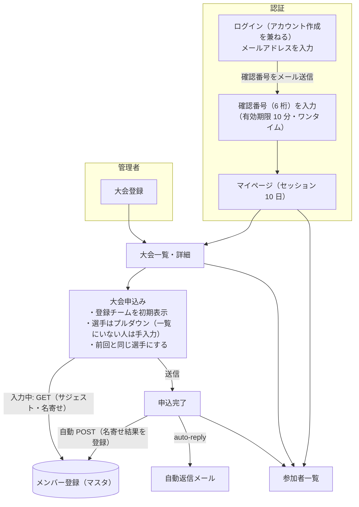

### 4.1 全体フロー（スケッチの再構成）

```mermaid
flowchart TD
  subgraph auth["認証"]
    LI["ログイン（アカウント作成を兼ねる）<br/>メールアドレスを入力"] -->|確認番号をメール送信| CD["確認番号（6 桁）を入力<br/>（有効期限 10 分・ワンタイム）"]
    CD --> MY["マイページ（セッション 10 日）"]
  end
  subgraph admin["管理者"]
    TR["大会登録"]
  end
  TR --> TL["大会一覧・詳細"]
  MY --> TL
  TL --> EN["大会申込み<br/>・登録チームを初期表示<br/>・選手はプルダウン（一覧にいない人は手入力）<br/>・前回と同じ選手にする"]
  EN -->|"入力中: GET（サジェスト・名寄せ）"| MM[("メンバー登録（マスタ）")]
  EN -->|送信| CP["申込完了"]
  CP -->|"自動 POST（名寄せ結果を登録）"| MM
  CP -->|auto-reply| ML["自動返信メール"]
  CP --> PL["参加者一覧"]
  TL --> PL
  MY --> PL
```

