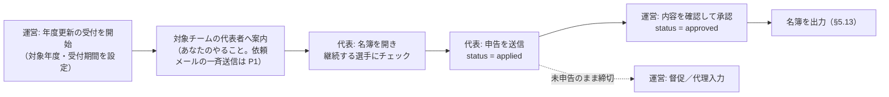

### 5.12 協会員登録と年度更新（P0）§14-22

**会員資格は年度で切り替わる**。年度の初めの受付期間（早良区協会の 2027 年度は **4 月〜6 月**・v0.9.2）に、チーム代表が「その年度も登録する選手」を申告する。現在は Excel で提出してもらっているものを、サイト上で完結させる。

#### モデル

- `memberships`: （`association_id`, `member_id`, `year`）ごとに 1 行。`status`: `applied`（申告済み） / `approved`（承認済み） / `declined`（更新しない） / `expired`
- `membership_declarations`（v0.9）: （`association_id`, `team_id`, `year`）ごとに 1 行。**チームが申告を送信したこと**を表す（送信日時・送信者・最終更新）。人物ごとの `memberships` だけでは「チェックを全部外して送信したチーム」と「まだ送信していないチーム」を区別できないため。未申告一覧はこの表に行がないチーム
- 申告で**チェックを外した選手**は、前年度の会員であれば当年度の `memberships` を `declined` で作る（「更新しない」と明示された記録）
- 「協会員かどうか」は**年度を指定して問い合わせる**（`isMember(memberId, year)`）。単一のフラグでは表現できないため、v0.3 の `members.membership_status` は**廃止**する
- 年度の定義は**テナント設定**（`associations.fiscal_year_start_month`、既定 4 月）で持つ。2026 年度 = 2026/4〜2027/3（§14-30）

#### 申告フロー

- 代表の画面は「名簿にチェックを入れて送信するだけ」。前年度の会員には初期チェックを入れておく（初年度は前年度のデータがないため、下記の取り込み（P1）を使うまでは初期チェックなし）
- 新規の選手はその場で名簿に追加してから申告できる
- **締切前なら、承認済みでも代表者が直せる**（v0.9.1 で変更）。直した人（チェックを入れた人・外した人）だけが変わり、変えていない人の状態はそのまま。チェックを入れた人は「運営の確認待ち」（`applied`）になり、自動承認（`auto_approve`）なら承認済みになる。チェックを外した人は `declined` になる。締切後の修正は運営に依頼する（§5.10 の問い合わせ）
- 「代表の申告＝ `applied`、運営が一括承認して `approved`」の 2 段階（§14-27）。会費の入金確認を挟む運用に対応できる。承認を省きたい場合は `membership_periods.auto_approve = true` にする
- 未申告のチーム（**年度更新の対象のチームだけ**・下記）が一覧で分かる。督促メールをまとめて送れる（P1）
- 運営は代理で申告・修正できる

#### 受付開始（P0）v0.9.1 で P1 から変更

- テナント管理者が `/admin/memberships` で**対象年度・受付期間（開始日・締切日）・承認を省くか**を設定して受付を開始する（`membership_periods`）。日付だけで入力し、締切はその日の 23:59:59（日本時間）とする（§5.4 と同じ）
- 受付を開始すると、対象のチームの代表者のトップページの「あなたのやること」と、チーム管理の画面に案内が出る（§5.17）
- **依頼メールの一斉送信と督促は P1**（§11.2 の 1 日の送信数の上限に合わせて複数日に分けて送る作りが要るため）

#### 年度更新の対象チーム v0.9.1

- 対象は `teams.membership_renewal_target = true` のチーム（§5.11）。**チーム自身（代表者）が設定し、テナント管理者も変えられる**
- 未申告の一覧、督促（P1）、「あなたのやること」の年度更新の案内は、**対象のチームだけ**に出す（大会ごとに作る寄せ集めチームにまで督促が届かないように）
- 個人登録は常に対象。申込の画面でその場で作ったチームは対象にしない
- 対象でないチームには、協会員の申告の画面を出さない（対象に変えれば出る）

#### 年度の途中の追加の申告 v0.9.1

- 受付期間の締切を過ぎたあとも、**その年度の末日まで**、代表者が**追加の申告**を送れる（新しく入った選手、年度の途中にできたチーム・個人登録）。協会に追加の申告の制度があるため
- 追加の申告でできるのは**会員を増やすことだけ**【仮】（外すのは運営に依頼する）
- **自動承認の設定にかかわらず、テナント管理者の承認が必要**（`memberships.source = 'additional'`、`status = applied`）
- 運営の画面（§4.2 #17）に「追加の申告」を分けて出し、承認する。依頼・督促のメールは送らない
- その年度の受付が一度も開始されていない年度には送れない【仮】

#### 初年度の取り込み（P1）v0.9.1

- 初年度は前年度のデータがなく「前年度の会員に初期チェック」ができない。そこで**運営管理者だけが使う一度きりの取り込み**を用意する（§14-6「Excel 名簿の初期投入はしない」の例外）
- 入力: 前年度の会員名簿の CSV（氏名・ふりがな・生年月日・性別・年度）
- 各行を名寄せ（§8.3）して人物に結びつけ、その年度の `memberships` を `approved`（`source = 'import'`）で作る。一致する人物がいなければ人物を作る（どのチームの選手一覧にも入れない。あとで代表者が選手を追加すると、名寄せで同じ人物に結びつく）。判断が付かない行は取り込まずに一覧で返す
- 取り込みは `admin_access_logs` に記録する。同じ協会・同じ年度には 1 回だけ【仮】
- P1 のため、初年度の年度更新に間に合わない場合は、初期チェックなしで全チームが選ぶ

#### 表示

- チーム管理画面に、選手ごとに「今年度: 会員 / 未申告 / 非会員」を表示
- 申込一覧・名簿出力に会員区分の列を出す。参加費が会員・非会員で異なる運用に使える
- **申込一覧の会員区分は、大会の開催日が属する年度で判定する**（v0.9）。3 月に申し込んで 4 月に開催する大会では、新年度の会員かどうかを出す。名簿出力は画面で選んだ年度で判定する
- **その年度の会員のデータがシステムにない場合**（受付を開始しておらず、取り込みもしていない年度）は、**協会員区分を画面に出さない**（v0.9.2。データがあれば出す。システムを使い始めた年度に、全員が非会員に見えないように）。CSV では列を残して空欄にする（列の並びを大会ごとに変えないため）
- **受付期間中（締切前）で、昨年度に協会員（`approved`）だった人の今年度の申告がまだのとき**は、「協会員ではない」ではなく「**更新の受付中（昨年度は協会員）**」と表示する（v0.9.2。受付が年度の初めの 3 か月にあり、その間に開かれる大会で昨年度の会員が非会員に見えないように）。会員判定（`isMember`）の結果は変えない
- **会員かどうかは一般ユーザーに公開しない**（§5.6）

受け入れ条件

- [ ] 年度をまたぐと会員状態が自動的に切り替わる（前年度の `approved` は今年度の会員ではない）
- [ ] 代表が申告すると当該年度の `memberships` が作られ、運営画面の未申告一覧から消える
- [ ] 締切後は代表が申告を編集できない（運営は可能）。追加の申告は送れる
- [ ] 締切前なら、承認済みの申告を代表者が直せる。チェックを入れた人は「運営の確認待ち」になり（自動承認なら承認済み）、変えていない人の状態は変わらない
- [ ] 自動承認の年度でも、追加の申告は承認待ちになる
- [ ] 年度更新の対象でないチームは、未申告の一覧にも「あなたのやること」にも出ない
- [ ] 受付期間中、昨年度の会員で今年度の申告がまだの人は「更新の受付中（昨年度は協会員）」と表示され、`isMember` は false を返す
- [ ] 受付も取り込みもない年度は、協会員区分が画面に出ず、CSV では空欄になる
- [ ] 会員判定はどの画面でも同じ関数を通る（年度を渡さない呼び出しを型で禁止する）

