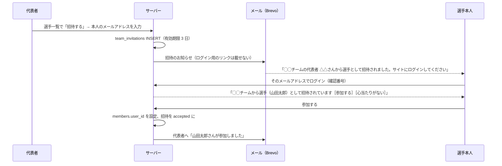

### 5.15 人・アカウント・チームの関係（重要）§14-25

v0.5 で確定した「**登録者が、別のチームの選手として参加することもある**」を正しく扱うため、3 つの概念を分けて持つ。ここを混同すると後から直しにくい。

| 概念 | テーブル | 何を表すか |
|---|---|---|
| アカウント | `users` | **ログインする人**。メールアドレスが本体。テナントに属さない |
| 人物（選手） | `members` | **名簿に載る人**。氏名・ふりがな・生年月日・性別。テナントに属する。ログインできるとは限らない |
| 所属 | `team_members` | **どの人物がどのチームの選手一覧にいるか**（名簿） |
| 代表者 | `team_admins` | **どのアカウントがどのチームを管理できるか**（v0.8）。選手でなくてもよい（監督など） |
| 本人 | `members.user_id` | **その人物本人のアカウント**（v0.8）。協会内で 1 人物 = 1 アカウント。招待で紐づける |

> v0.7 までは代表者を `team_members.role = 'admin'` で持っていたが、それだと「選手一覧に載らない代表者（監督）」を表せず、代表者にも生年月日などの入力が必要になっていた。v0.8 で**代表者（アカウントの権限）と名簿（人物の情報）を分けた**。

これで次のケースがすべて表現できる:

- **A さんはチーム X の代表者であり、同時にチーム Y の選手**: `team_admins` に（X, A さん）、`team_members` に（Y, A さんの人物）、その人物の `user_id` が A さん。X の申込は A さんが操作でき、Y は選手として閲覧だけできる
- **選手ではない監督が代表者**: `team_admins` にだけ行がある。選手一覧には載らない
- **寄せ集めチームを作って申し込む**: その都度チームを作る（承認不要・即時）。選手は、代表者を務めるほかのチームの選手一覧から選ぶか、手入力する（§5.5）。手入力でも送信時の名寄せ（氏名・生年月日・性別）で同じ人物に結びつくので、**同じ人が別のチームで出てもトラッキングできる**（§14-25 の目的）
- **ログインしない選手**: `members.user_id` が NULL。名簿に載っているだけで何も困らない
- **個人登録**: 登録した人が代表者になり、本人の人物にも自分のアカウントが紐づく。大会には個人登録では出ない（ほかのチームの申込に入れてもらうか、即席のチームを作る・§5.11）

注意点:

- **申込を操作できるのは、そのチームの代表者だけ**。「自分が選手として載っている申込」を編集することはできない（チーム Y の申込を A さんは編集できない）
- マイページには、代表者を務めるチームの申込と、**選手として出る申込**の両方を出す（§5.3）

#### 選手のアカウントとの紐づけ（招待）v0.8・P0

**代表者が招待し、本人が承諾して紐づく**。本人の承諾を挟むのは、代表者がメールアドレスを打ち間違えたときに、別の人がチームの情報を見られるようになるのを防ぐため。

- 招待メールに載せるのは**招待した協会のトップページの URL（`/[スラッグ]/`）だけ**。ログイン用のリンクは載せない（§9.3）。未ログインでも開けるページで、ログインすると「あなたのやること」に招待が出る
- 招待メールには「**このメールを受け取ったアドレス（◯◯@docomo.ne.jp）でログインしてください**」と、ログインに使うアドレスを明記する（v0.9）。別のアドレスでログインすると招待が見えないため。`/invitations` に招待が 1 件もないときは「招待のメールを受け取ったアドレスでログインしているか確かめてください」と表示する
- 「心当たりがない」を選ぶと招待は無効になり、代表者に「招待が断られました。メールアドレスを確かめてください」と知らせる
- 招待はログイン後の画面（`/invitations`）と、トップページの「あなたのやること」に出る
- 招待の有効期限は **3 日**（v0.8 で確定）。招待メールと招待の画面に「9月17日（木）まで」と期限を書く。期限が切れたら代表者に「山田太郎さんへの招待の期限が切れました」と知らせる。代表者は返事待ち・期限切れの招待を再送（期限が 3 日延びる）・取り消しできる
- **招待の状態の移り方**（v0.9）: `pending` →（参加する）`accepted` ／（心当たりがない）`rejected` ／（代表者が取り消し）`cancelled` ／（日次ジョブが `expires_at` を過ぎたものを検出）`expired`。**再送は同じ行**の `expires_at` を「再送時刻 + 3 日」に更新し、`expired` なら `pending` に戻して、招待メールをもう一度送る。`accepted` / `rejected` / `cancelled` は再送できない（新しく招待する）
- 期限切れ・承諾・拒否の知らせは**招待した代表者**に送る。その人がすでに代表者でなければ、そのチームの有効な代表者全員に送る
- **返事待ちの招待は重ねない**（v0.9）: 選手としての招待は「協会内で同じ人物に `pending` は 1 件まで」、代表者としての招待は「同じチーム・同じメールアドレスに `pending` は 1 件まで」（部分一意インデックス・付録 A）。別のチームからの招待がすでにある人物には、代表者に「この方には別の招待が届いています」と出す
- **承諾の時点で前提をもう一度確かめる**: 招待が `pending` で期限内か、人物が削除されていないか、人物にまだ誰も紐づいていないか、チームが削除されていないか、ログイン中のアカウントの確認済みメールアドレスが招待のアドレスと一致するか。どれかを満たさなければ承諾させず、理由を表示する
- 1 つの人物に紐づくアカウントは 1 つ。すでに別のアカウントに紐づいている人物には招待できない（代表者に「すでにログインできる状態です」と表示）
- 同じ協会で、1 つのアカウントに紐づく人物は 1 人まで。承諾しようとしたアカウントが同じ協会の別の人物にすでに紐づいている場合は、「すでに別の登録（山田太郎・◯◯チーム）と結びついています。協会の管理者が確認します」と出して承諾させず、運営の確認対象（人物の重複の疑い・`needs_review`）にする。これは主に、同じ人が**登録のチーム（チーム登録・個人登録）で別の人物として二重に登録されている**ときに起きる。テナント管理者が 2 つの人物をまとめる（§5.8・P0）と、まとめた人物にアカウントが紐づくので、招待し直さなくても選手として見られるようになる（v0.9.1。行き止まりにしない）
- 一度紐づけば、その人物が載っている**すべてのチーム**の**現役の選手一覧にいる間**、選手として閲覧できる（チームごとに招待し直す必要はない。脱退・削除されたチームは見られなくなる・§3.2）
- **代表者としての招待**も同じ仕組み（`team_invitations.kind = 'admin'`）。承諾すると `team_admins` に行が入る（§5.11 の委譲）
- 紐づけの解除: **本人（マイページ）とテナント管理者**が解除できる（v0.9 で代表者を外した。紐づけは協会内のすべてのチームに効くため、1 チームの代表者の操作で他のチームの閲覧まで消さない）。代表者は、選手一覧から外す（§5.11）ことで自チームの閲覧を止められる。解除しても名簿の人物は残る
- **同じ大会の別の申込に同じ人物が登録された場合は警告を出す**（v0.9.1 で同一部門から同一大会に変更・§5.5）

