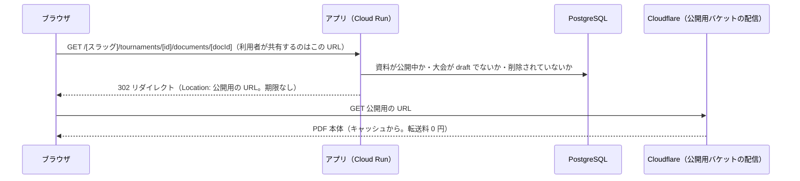

### 5.9 大会資料の掲示（P0）§14-2・v0.9.3 で P1 から変更

- **2027-03-28 の大会の大会冊子から、このシステムの大会ページで配る**（v0.9.3）。2 月の前半に作る（Phase 1c・§13）。公開用の配信方法（下記「配信の仕組み」の第 1〜3 案）は Phase 0 で必ず決めておく
- 管理者が大会ごとに PDF（大会冊子、組み合わせ表、結果、要項）をアップロードし、公開ページに一覧表示する。大会冊子にはコート割・組み合わせ・参加チームが載る
- **形式は PDF のみ**（v0.6）。PDF と画像が混在すると利用者が迷うため一方に揃える。これまで PDF での問い合わせはなかった
- 種別: `大会冊子` / `要項` / `組み合わせ` / `結果` / `その他`（v0.9.3 で `大会冊子` を追加）、タイトル、公開／非公開、並び順
- 制限: 1 ファイル 10 MB まで【仮】、拡張子 `pdf` のみ、Content-Type（`application/pdf`）とファイル先頭の `%PDF-` も検証する
- 保存先は **Cloudflare R2**（確定・§6.5）。資料は大会に関係のない人にも拡散されて繰り返しダウンロードされうるが、R2 は転送料がかからないため請求が増えない

#### 配信の仕組み（v0.9.1 で署名 URL をやめた）

大会資料は、**公開したら誰でも期限なしで開ける**ものとする（v0.9.1 で確定）。v0.9 までの「5 分だけ有効な署名 URL へ転送する」方式はやめる。大会冊子を LINE などで共有し、あとから何度でも開けるようにするため。

- 利用者が共有するのはアプリの URL（期限なし）。公開用の URL も期限なしで、どちらを共有しても開ける
- **公開用の URL の配信方法は Phase 0 で決める**（§13）
  1. 第一候補: R2 の**公開用バケット**を独自ドメイン（例: `files.entry.fukuoka-city-beachball.org`）で配信する。Cloudflare のキャッシュが効き、転送料もかからない。**Cloudflare でそのドメインを扱えることが前提**（§6.5.1・§14.9 D-4）
  2. 1 が使えない場合: Cloudflare Workers（`*.workers.dev`）で公開用バケットを読み出して返す（無料プランの 1 日のリクエスト数の上限は要確認）
  3. どちらも使えない場合: アプリが R2 から読み出して返す（Cloud Run の転送量に料金がかかるため、費用を確かめてから）
- **バケットを 2 つに分ける**: アップロードした原本を置く**非公開の保管用**と、**公開用**。公開中の資料だけを公開用にコピーし、非公開にした・削除した・大会を `draft` に戻したときは公開用から消す。公開用のファイル名は推測されにくいランダムな名前にし、差し替えたときは新しい名前にする
- Cloudflare のキャッシュの期間は短め（1 時間【仮】）にし、非公開にしたときはキャッシュも消す。消せない方式の場合は、最長その時間は開けることを管理画面に書く
- 公開用のファイルには `Content-Type: application/pdf` と `Content-Disposition: inline; filename*=UTF-8''<タイトル>.pdf` を付けて置く（ブラウザ内で開き、保存時は分かりやすい名前にする）
- 実装は `@aws-sdk/client-s3` を R2 のエンドポイント（`https://<ACCOUNT_ID>.r2.cloudflarestorage.com`）に向けて使う（アプリは保管用・公開用への書き込みと削除だけを行う）
- **アップロードはアプリを経由する**（v0.9 で変更）: 管理画面からアプリにファイルを送る → アプリがサイズ（10 MB 以下）・Content-Type・**ファイル先頭の `%PDF-`** を検証 → アプリが R2 に PUT → `tournament_documents` を作成。ブラウザから R2 に直接 PUT する方式では、サーバーが中身を検証できないため。10 MB 以下・管理者だけの操作なので、Cloud Run の負荷は問題にならない。R2 の CORS 設定は不要になる
- R2 の読み取り回数の課金（無料枠あり）は残る。Cloudflare のキャッシュで R2 まで届く回数を減らす
- **掲示物の中身（選手名が載った組み合わせ表など）は協会の判断で公開される**。システム側では中身を検査しないため、管理画面に「個人情報が含まれていないか確認してください」と注意書きを出す

