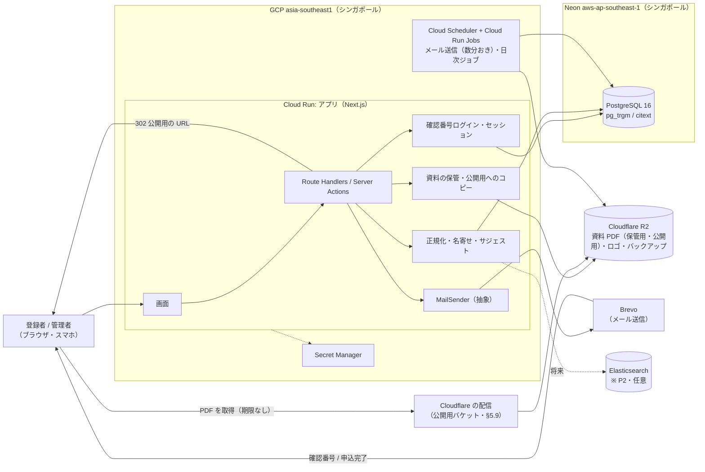

### 6.1 構成図

```mermaid
flowchart LR
  U["登録者 / 管理者<br/>（ブラウザ・スマホ）"]
  subgraph gcp["GCP asia-southeast1（シンガポール）"]
    subgraph app["Cloud Run: アプリ（Next.js）"]
      UI["画面"]
      API["Route Handlers / Server Actions"]
      AUTH["確認番号ログイン・セッション"]
      NORM["正規化・名寄せ・サジェスト"]
      MAIL["MailSender（抽象）"]
      STO["資料の保管・公開用へのコピー"]
    end
    SM["Secret Manager"]
    JOB["Cloud Scheduler + Cloud Run Jobs<br/>メール送信（数分おき）・日次ジョブ"]
  end
  subgraph neon["Neon aws-ap-southeast-1（シンガポール）"]
    PG[("PostgreSQL 16<br/>pg_trgm / citext")]
  end
  R2[("Cloudflare R2<br/>資料 PDF（保管用・公開用）・ロゴ・バックアップ")]
  CF["Cloudflare の配信<br/>（公開用バケット・§5.9）"]
  MP["Brevo<br/>（メール送信）"]
  ES[("Elasticsearch<br/>※ P2・任意")]
  U --> UI --> API
  API --> AUTH --> PG
  API --> NORM --> PG
  NORM -. 将来 .-> ES
  API --> MAIL --> MP
  API --> STO --> R2
  API -->|302 公開用の URL| U
  U -->|PDF を取得（期限なし）| CF
  CF --> R2
  app -.-> SM
  JOB --> PG
  JOB --> R2
  MP -->|確認番号 / 申込完了| U
```

