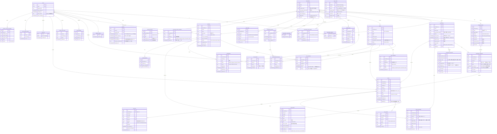

### 7.1 ER 図

```mermaid
erDiagram
  associations ||--o{ association_admins : has
  associations ||--o{ category_presets : defines
  associations ||--o{ tournaments : hosts
  associations ||--o{ teams : contains
  associations ||--o{ members : contains
  associations ||--o{ memberships : grants
  users ||--o{ association_admins : is
  associations ||--o{ deletion_logs : records
  associations ||--o{ association_home_layouts : customizes
  users ||--o{ sessions : holds
  users ||--o| platform_admins : is
  users ||--o{ team_admins : manages
  teams ||--o{ team_admins : managed_by
  users |o--o{ members : is_person
  teams ||--o{ team_invitations : invites
  users ||--o{ user_passkeys : registers
  users ||--o{ admin_access_logs : records
  associations ||--o{ association_slug_history : renamed
  teams ||--o{ team_members : roster
  members ||--o{ team_members : listed_in
  members ||--o{ memberships : yearly
  teams ||--o{ entries : submits
  users ||--o{ entries : creates
  tournaments ||--o{ tournament_categories : has
  category_presets ||--o{ tournament_categories : instantiates
  tournaments ||--o{ tournament_documents : publishes
  tournaments o|--o{ contact_messages : about
  tournaments ||--o{ entries : receives
  tournament_categories ||--o{ entries : classifies
  entries ||--|{ entry_players : includes
  entries ||--o{ entry_audits : logs
  members o|--o{ entry_players : linked_to
  members ||--o{ member_aliases : has
  entries o|--o{ mail_logs : triggers
  entries o|--o{ contact_messages : about
  users ||--o| user_totp : registers
  users ||--o{ user_recovery_codes : holds
  associations ||--o{ membership_periods : opens
  teams ||--o{ membership_declarations : declares
  membership_periods ||--o{ membership_declarations : receives
  associations ||--o{ export_logs : records
  associations ||--o{ association_admin_invitations : invites
  users o|--o{ platform_contact_messages : sends
  associations ||--o{ billing_documents : bills

  associations {
    uuid id PK
    text name
    text slug UK
    citext contact_email "問い合わせの転送先"
    int fiscal_year_start_month "既定 4"
    jsonb theme_colors "base / main / accent（P1）"
    text logo_storage_key
    text billing_plan "monthly | annual（P1）"
    text status "物理削除はしない"
  }
  billing_documents {
    uuid id PK
    uuid association_id FK
    text kind "receipt | invoice"
    text title
    text storage_key "保管用バケット"
    uuid uploaded_by FK "運営管理者"
  }
  association_admin_invitations {
    uuid id PK
    uuid association_id FK
    citext email
    uuid invited_by FK "運営管理者"
    text status "pending | accepted | rejected | cancelled | expired"
    timestamptz expires_at "招待（再送）+ 7 日"
  }
  platform_contact_messages {
    uuid id PK
    uuid user_id FK
    text subject_type
    text sender_name
    text sender_email
    text body
    text status "new | done"
  }
  association_home_layouts {
    uuid id PK
    uuid association_id FK
    text status "draft | published | archived"
    jsonb blocks
    timestamptz published_at
    uuid published_by FK
  }
  association_admins {
    uuid association_id FK
    uuid user_id FK
    timestamptz granted_at
  }
  teams {
    uuid id PK
    uuid association_id FK
    text kind "team | individual"
    text name
    text kana
    text contact_email
    text contact_phone
    bool membership_renewal_target "協会員の登録をするチーム"
    text status "active | inactive"
    timestamptz created_at
  }
  team_members {
    uuid id PK
    uuid association_id FK
    uuid team_id FK
    uuid member_id FK
    timestamptz joined_at
    timestamptz left_at "選手一覧から外した（物理削除しない）"
    uuid left_by FK "外した代表者（元に戻せる人）"
  }
  memberships {
    uuid id PK
    uuid association_id FK
    uuid member_id FK
    int year "年度"
    text status "applied | approved | declined | expired"
    text source "renewal | additional | import"
    uuid applied_by FK
    timestamptz applied_at
    uuid approved_by FK
    timestamptz approved_at
  }

  users {
    uuid id PK
    citext email UK
    text display_name
    timestamptz email_verified_at
    timestamptz last_login_at
    text terms_version "同意した利用規約の版"
    timestamptz terms_accepted_at
  }
  platform_admins {
    uuid user_id PK
    timestamptz granted_at
  }
  team_admins {
    uuid id PK
    uuid association_id FK
    uuid team_id FK
    uuid user_id FK
    uuid granted_by FK "委譲した代表者"
    timestamptz revoked_at
  }
  team_invitations {
    uuid id PK
    uuid association_id FK
    uuid team_id FK
    uuid member_id FK "選手招待のとき"
    text kind "player | admin"
    citext email
    text status "pending | accepted | rejected | cancelled | expired"
    timestamptz expires_at
  }
  user_passkeys {
    uuid id PK
    uuid user_id FK
    text credential_id UK
    bytea public_key
    bigint sign_count
  }
  user_totp {
    uuid user_id PK
    bytea secret_encrypted
    timestamptz confirmed_at
  }
  user_recovery_codes {
    uuid id PK
    uuid user_id FK
    text code_hash
    timestamptz used_at
  }
  membership_periods {
    uuid id PK
    uuid association_id FK
    int year
    timestamptz opens_at
    timestamptz closes_at
    bool auto_approve
  }
  membership_declarations {
    uuid id PK
    uuid association_id FK
    uuid team_id FK
    int year
    uuid submitted_by FK
    timestamptz submitted_at
  }
  export_logs {
    uuid id PK
    uuid association_id FK
    uuid user_id FK
    text scope "association | team | tournament"
    text format "csv | tsv | md | pdf"
    int year
    bool includes_birth_date
    int row_count
  }
  admin_access_logs {
    uuid id PK
    uuid user_id FK
    uuid association_id FK
    text action
    timestamptz created_at
  }
  association_slug_history {
    text slug PK
    uuid association_id FK
  }
  login_codes {
    uuid id PK
    text purpose "login | email_change"
    uuid user_id FK "email_change のとき"
    citext email "users はまだないことがある"
    text attempt_hash "発行したブラウザの試行 ID"
    text code_hash "HMAC-SHA-256"
    timestamptz expires_at "発行 + 10 分"
    int attempt_count "上限 5"
    timestamptz used_at "ワンタイム"
  }
  deletion_logs {
    uuid id PK
    uuid association_id FK
    text table_name
    uuid record_id
    int cascaded_count
    text reason
    uuid deleted_by FK
    timestamptz deleted_at
  }
  sessions {
    uuid id PK
    uuid user_id FK
    text session_hash UK
    timestamptz expires_at "アクセスのたびに now + 10 日へ延長"
    timestamptz absolute_expires_at "発行 + 90 日（上限）"
    timestamptz last_seen_at
    timestamptz mfa_verified_at "管理者の権限の期限の起点（P1）"
    uuid entered_association_id "運営管理者が入った協会"
    timestamptz entered_until
  }
  tournaments {
    uuid id PK
    uuid association_id FK
    text name
    date event_date
    date age_reference_date "必須。要項ごとに異なる"
    text venue
    timestamptz entry_start_at "日付で入力、0:00 JST"
    timestamptz entry_end_at "必須。日付で入力、23:59:59 JST"
    int team_size_min "既定 4"
    int team_size_max "既定 7"
    int max_entries
    text status "draft | open | closed | archived"
    uuid created_by FK
  }
  category_presets {
    uuid id PK
    uuid association_id FK
    text code "協会内で一意"
    text label_default
    text gender "male | female | mixed"
    text rule_type "free | min_age | total_age"
    int rule_value
    int court_size "既定 4"
    int mixed_min_male "既定 1"
    int mixed_min_female "既定 2"
    int sort_order
  }
  tournament_categories {
    uuid id PK
    uuid association_id FK
    uuid tournament_id FK
    uuid preset_id FK
    text code "前回コピー・集計はこれで突合"
    text label "大会ごとの表示名（混合 / MIX）"
    timestamptz entry_end_at "NULL なら大会の締切を適用"
    date age_reference_date "NULL なら大会の基準日"
    int sort_order
    int max_entries
  }
  tournament_documents {
    uuid id PK
    uuid association_id FK
    uuid tournament_id FK
    text doc_type "大会冊子 | 要項 | 組み合わせ | 結果 | その他"
    text title
    text storage_key "保管用バケットのキー"
    text public_key "公開用バケットのキー（公開中だけ）"
    text content_type
    int size_bytes
    bool is_public
    int sort_order
  }
  contact_messages {
    uuid id PK
    uuid association_id FK
    uuid tournament_id FK
    uuid entry_id FK "申込から開いたとき"
    uuid user_id FK
    text subject_type "変更 | 取消 | ログイン | 削除 | その他"
    text sender_name
    text sender_email
    text body
    text status "new | done"
    timestamptz created_at
  }
  entries {
    uuid id PK
    uuid association_id FK
    uuid tournament_id FK
    uuid category_id FK
    uuid team_id FK
    uuid created_by FK
    text team_name "申込時点のスナップショット"
    text note
    text status "submitted | cancelled"
    bool needs_admin_check
    timestamptz submitted_at
    timestamptz cancelled_at
    uuid updated_by FK "締切後の管理者編集を記録"
  }
  entry_players {
    uuid id PK
    uuid association_id FK
    uuid entry_id FK
    int position
    text name
    text kana
    date birth_date "必須"
    text sex "male | female"
    int age_at_event "基準日時点の年齢"
    text name_normalized
    text kana_normalized
    uuid member_id FK
    text match_type "picked | auto_exact | auto_new | unmatched"
  }
  entry_audits {
    uuid id PK
    uuid association_id FK
    uuid entry_id FK
    uuid actor_id FK
    text action "create | update | cancel"
    jsonb before
    jsonb after
    timestamptz created_at
  }
  members {
    uuid id PK
    uuid association_id FK
    text name
    text kana
    date birth_date "名寄せキー"
    text sex "male | female"
    text name_normalized
    text kana_normalized
    text status "active | needs_review | merged"
    uuid merged_into_id
    int entry_count
    timestamptz last_entry_at
  }
  member_aliases {
    uuid id PK
    uuid association_id FK
    uuid member_id FK
    text name_normalized
    text kana_normalized
  }
  mail_logs {
    uuid id PK
    uuid association_id FK "NULL 可"
    text mail_type
    text to_email
    uuid user_id FK
    uuid entry_id FK
    jsonb params "本文を組むための ID だけ"
    text status "queued | sent | failed | bounced"
    int attempts
    timestamptz next_attempt_at
    text provider_message_id
    timestamptz sent_at
  }
```

