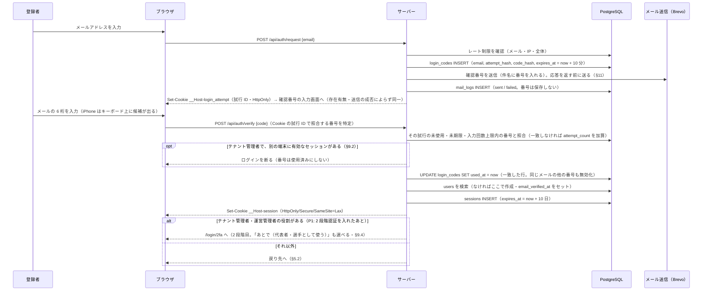

### 9.1 確認番号ログインのシーケンス

```mermaid
sequenceDiagram
  participant U as 登録者
  participant B as ブラウザ
  participant S as サーバー
  participant DB as PostgreSQL
  participant M as メール送信（Brevo）

  U->>B: メールアドレスを入力
  B->>S: POST /api/auth/request {email}
  S->>DB: レート制限を確認（メール・IP・全体）
  S->>DB: login_codes INSERT（email, attempt_hash, code_hash, expires_at = now + 10 分）
  S->>M: 確認番号を送信（件名に番号を入れる）。応答を返す前に送る（§11）
  S->>DB: mail_logs INSERT（sent / failed。番号は保存しない）
  S-->>B: Set-Cookie __Host-login_attempt（試行 ID・HttpOnly）→ 確認番号の入力画面へ（存在有無・送信の成否によらず同一）
  U->>B: メールの 6 桁を入力（iPhone はキーボード上に候補が出る）
  B->>S: POST /api/auth/verify {code}（Cookie の試行 ID で照合する番号を特定）
  S->>DB: その試行の未使用・未期限・入力回数上限内の番号と照合（一致しなければ attempt_count を加算）
  opt テナント管理者で、別の端末に有効なセッションがある（§9.2）
    S-->>B: ログインを断る（番号は使用済みにしない）
  end
  S->>DB: UPDATE login_codes SET used_at = now（一致した行。同じメールの他の番号も無効化）
  S->>DB: users を検索（なければここで作成・email_verified_at をセット）
  S->>DB: sessions INSERT（expires_at = now + 10 日）
  S-->>B: Set-Cookie __Host-session（HttpOnly/Secure/SameSite=Lax）
  alt テナント管理者・運営管理者の役割がある（P1: 2 段階認証を入れたあと）
    S-->>B: /login/2fa へ（2 段階目。「あとで（代表者・選手として使う）」も選べる・§9.4）
  else それ以外
    S-->>B: 戻り先へ（§5.2）
  end
```

