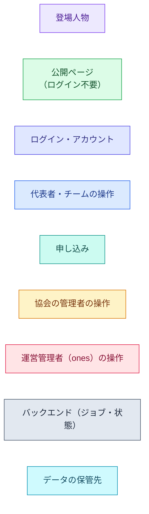
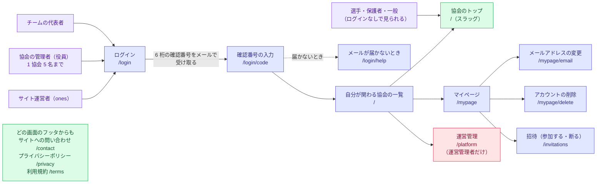
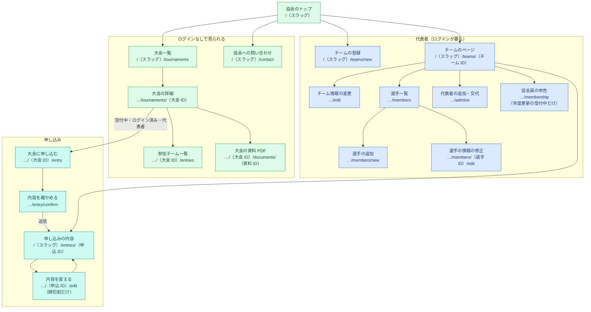
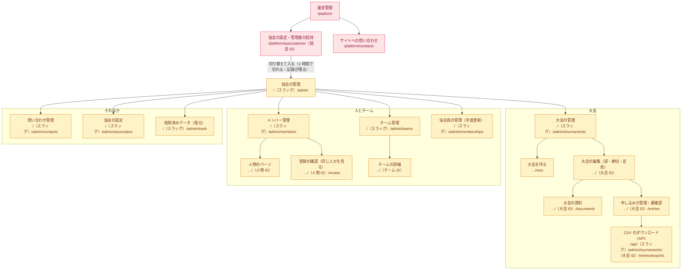
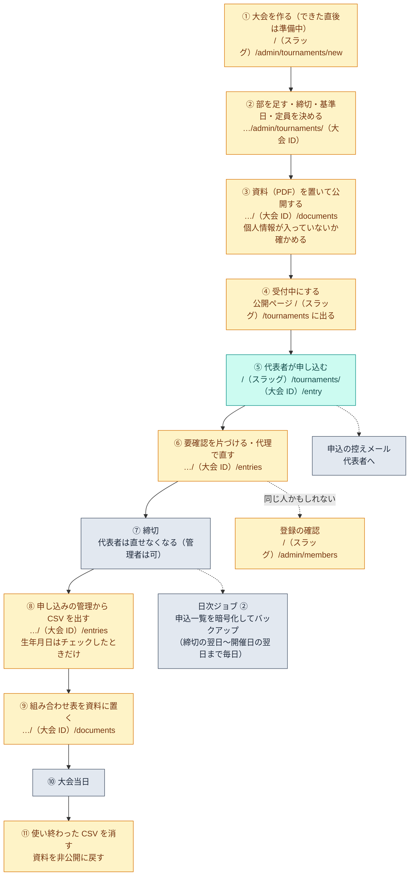
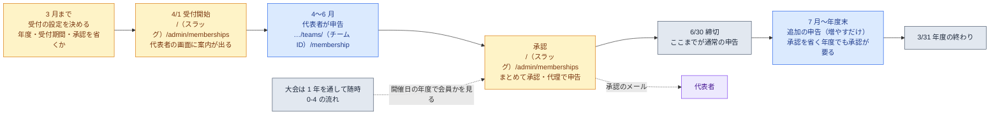
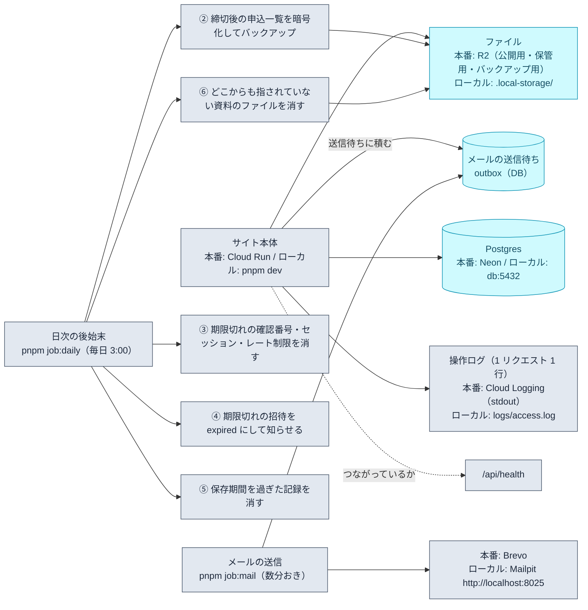

# 運用手順（Phase 1d 時点）

運営者（ones）とテナント管理者が実際に行う手順。**まだ本番はない**ので、ここは 1a・1b で決まっている範囲。
1c 以降（資料・年度更新）と本番のデプロイ手順は、その作業をするタスクで追記する。

関係する設計書: `docs/design/05-4.md`（大会）、`05-5.md`（申込）、`05-8.md`（要確認の解消）、`05-14.md`（テナント）、`05-16.md`（削除）、`05-19.md`（アカウント）、`06-5.md`（ホスティングとジョブ）、`12-0.md`（保存期間）。

## 0. 全体像（サイトマップと運用の流れ）

この章は全体を見渡すための図だけ。**具体的な手順は 1 章以降**にある。
図の中の `（スラッグ）` は協会ごとの英数字（早良区協会なら `sawara`）。`（大会 ID）` などは実際の ID に置き換わる。
子の画面は親の URL のあとを `…` で省いて書いている。色は下の凡例で全図共通。



### 0-1. 登場人物と入口



### 0-2. サイトマップ（選手・代表者が使う画面）



### 0-3. サイトマップ（協会の管理者・サイト運営者）



### 0-4. 運用の流れ（大会 1 回分）



### 0-5. 1 年の流れ（協会員の年度更新）



### 0-6. 裏で動くもの（ジョブ・メール・保存先）



## 1. 協会（テナント）を増やす

1. 運営管理者で `/platform` を開く → 「協会を追加する」→ 協会名とスラッグ（URL に出る英数字）を入れる
2. スラッグはあとから変えられるが、古い URL は転送になるだけなので、**最初に協会と相談して決める**
3. 作った協会のページで「管理者を招待する」→ 相手のメールアドレス（招待は 7 日で切れる）

**招待の前に必ず本人確認をする**（メールアドレスの取り違えは個人情報の事故になる）。
- 協会の役員名簿など、協会側の資料でアドレスを確かめる。電話か対面で「いまから招待を送ります」と伝えてから送る
- 招待を送ったら、相手がログインして `/invitations` で「参加する」を押すまで権限は付かない
- 管理者は 1 協会 5 名まで（返事待ちの招待も数える）。退任した人は `/platform` の協会のページで解除する

### 協会の設定（`/（スラッグ）/admin/association`）

テナント管理者が開く。**よく使う部門**（大会に部を足すときの候補）と、**個人での登録**の受け付けを切り替える。

- 「個人で登録する」は 1 人で大会に申し込む人のための登録（§5.11）。**使わない協会は「受け付けないようにする」を押す**。
  リンクが消え、`/（スラッグ）/teams/new?kind=individual` は 404 になる（ADR 0032）
- **すでに個人で登録した人はそのまま残る**。止めても消えない。戻せば、また登録できる

## 2. 役員・代表者へのログインの案内

パスワードはない。**メールアドレスに届く 6 桁の確認番号**で入る。案内の文面の型:

> 1. https://（サイトの URL）/（協会のスラッグ）/ を開く
> 2. 「ログイン」→ メールアドレスを入れて「確認番号を送る」
> 3. 届いたメールの 6 桁の番号を、**同じ画面・同じ端末**で入れる（番号は 10 分で切れます）

よくあるつまずき:
- メールが届かない → 迷惑メールを見てもらう。それでもなければ、アドレスの綴りを一緒に確かめる
- 番号を入れる画面を閉じてしまった → 番号は使えなくなるので、最初から送り直す（別の端末で入れても通らない）
- 協会の管理者は**同時に 1 つの端末だけ**ログインできる。別の端末で入れないときは、前の端末でログアウトしてもらう（30 分以上使っていなければ自動で切れる）

## 3. 大会と申込（1b）

### 大会を開くまで

1. `/（スラッグ）/admin/tournaments` →「大会を作る」。大会名・開催日・**年齢の基準日**（開催日を入れると同じ日が入る）・会場・申し込みの開始日と締切日・参加人数の下限と上限・申し込みの上限を入れる。作った直後は**準備中**（利用者には見えない）
2. 同じ画面で「部を足す」。よく使う部門（プリセット）から選ぶ。大会ごとに**表示名を変えられる**（「混合」→「MIX」）。部ごとに締切・基準日・上限を変えられる（空欄なら大会の値）
3. 内容を確かめて、状態を**受付中**にする。公開ページ（`/（スラッグ）/tournaments`）に出て、申し込めるようになる
4. 基準日を変えたときは、すでにある申込の年齢がずれるので、画面の警告に従って「新しい基準日で確定する」を押す

### 締切までの間

| こんなとき | すること |
|---|---|
| 申し込みを確かめたい | `/（スラッグ）/admin/tournaments/（大会）/entries`。部ごとの件数と、**要確認**の印が出る |
| 「要確認」の印が付いている | 合計年齢の部か、同じ人かもしれない選手がいる申込。内容を確かめて「確認済みにする」 |
| 代表者から「直したい」と連絡が来た | 締切前なら代表者自身が申込のページから直せる。締切後は管理者が「代理で直す」（記録が残る） |
| 同じチームが二重に申し込んでいる | 代表者に取り消してもらう。誤登録なら管理者が「誤登録として削除する」（削除済みデータから戻せる） |
| 定員を超えて入れたい | 管理者として申込ページを開けば、締切後・定員超過でも登録できる |

### 締切のあと

1. `/（スラッグ）/admin/tournaments/（大会）/entries` →「CSV をダウンロード」。1 人 1 行。**生年月日はチェックを入れたときだけ**入る（印刷して配る資料には入れない）
2. CSV を出したことは記録される（誰が・いつ・生年月日を含めたか）。**要らなくなったファイルは消す**
3. 日次ジョブが、すべての部の締切を過ぎた大会の申込一覧を、**開催日の翌日まで毎日**暗号化してバックアップに保存する（下の「4. 定期ジョブ」）

### 同じ人が二重に登録されていたら（§5.8）

1. `/（スラッグ）/admin/members` の「確認が必要」から開く。氏名・生年月日・チーム・申込の回数・ログインの有無を横に並べて比べる
2. 別の人なら「別の人です」。同じ人なら「まとめる」→ 残す登録を選んで確定（**元に戻せない**）
3. どちらの登録にも別々のアカウントが結びついているときはまとめられない。先にどちらかの結びつきを解除する（本人のマイページか、管理者の人物のページ）

## 3-2. 大会の資料（PDF・1c）

1. `/（スラッグ）/admin/tournaments/（大会）` →「大会資料（PDF）」。PDF だけ（10 MB まで）。**個人情報が含まれていないか確かめてから**上げる（選手名の載った組み合わせ表などは協会の判断で公開される）
2. 「公開」の資料は、大会が受付中・締切後・終了のときに大会ページとトップの「新しい資料」に出る。**準備中の大会の資料は公開にしても出ない**
3. 非公開にする・削除する・大会を準備中に戻すと、公開用のファイルが消えて URL は 404 になる（配信のキャッシュで最長 1 時間は開けることがある）。差し替えると新しい URL になり、古い URL は開けなくなるので、**前に LINE などで配った URL がある場合は案内も直す**
4. 利用者に配るのは大会ページの資料のリンク（`/（スラッグ）/tournaments/（大会の ID）/documents/（資料の ID）`）。期限はない
5. 削除した資料は `/（スラッグ）/admin/trash` の「大会資料」から戻せる。完全に削除するとファイルも消える

## 3-3. 協会員の年度更新（1d）

1. **受付を始める**: `/（スラッグ）/admin/memberships` → 対象年度・受付の開始日と締切日・承認を省くかを入れて「受付を開始する」（早良区協会の 2027 年度は 4/1〜6/30）。「承認を省く」に入れると、代表者が送った時点で協会員になる（会費の入金を確かめてから承認する運用なら、入れない）。対象チーム（「協会員の登録をするチーム」と個人登録）の代表者のトップページとチームのページに「◯年度も登録する人を選んでください」の案内が出る。依頼メールの一斉送信・督促は P1（当面は電話・LINE などで知らせる）
2. **申告の状況を見る**: 同じ画面の「申告の状況を見る」→ 未申告のチーム（対象チームだけ）と申告済みの内訳。未申告のチームには「代理で申告する」から管理者が入力できる（締切後も可）
3. **承認する**: 「運営の確認待ちの N 人をまとめて承認する」。承認を省く年度は代表者が送った時点で協会員になる。承認すると代表者にメールが届く
4. **締切のあと**: 年度末までは代表者が**追加の申告**（増やすだけ）を送れる。**承認を省く年度でも承認が必要**なので、「追加の申告」の欄を時々見る。登録した人を外す依頼は問い合わせで受けて、管理者が「代理で直す」
5. **どこに出るか**: 選手一覧の「今年度」、申込一覧と CSV の協会員区分（大会の開催日の年度で判定）。受付も取り込みもない年度は区分を出さない。受付期間中は、昨年度の会員で申告がまだの人が「更新の受付中（昨年度は協会員）」と出る
6. 「協会員の登録をするチーム」でないチームには申告の画面が出ない。チーム情報（代表者・管理者のどちらでも変えられる）で切り替える

## 4. 日々の運用

| いつ | すること |
|---|---|
| 問い合わせが来たら | 協会宛ては `/（スラッグ）/admin/contacts`、サイト運営者宛ては `/platform/contacts`。返事はメールで直接返し、画面では「対応済み」にする |
| 選手・チームの間違いの直し | 代表者ができるのは「選手一覧から外す」まで。**人物の削除・誤登録の行の削除は協会の管理者**（`/（スラッグ）/admin`） |
| 消したものを戻したい | `/（スラッグ）/admin/trash`（削除済みデータ）から復元。完全に削除すると戻せない（理由の入力が要る） |
| アカウントを消したいと言われたら | 本人が `/mypage/delete` から消す。代表者・管理者のままでは消せないので、先に交代してもらう |

## 5. 定期ジョブ（本番は Cloud Scheduler・§6.5.1）

| ジョブ | 間隔 | ローカルでの流し方 |
|---|---|---|
| メールの送信 | 数分おき | `pnpm job:mail` |
| 日次の後始末（期限切れの確認番号・セッション・レート制限の削除、期限切れの招待を `expired` にして知らせる、保存期間を過ぎた記録の削除、**締切後の申込一覧 CSV のバックアップ**） | 毎日 3:00（日本時間） | `pnpm job:daily` |

- 日次ジョブの **②③④⑤**が入っている。DB のバックアップ（`pg_dump`）・R2 の後始末・最小インスタンス数の切り替えは未実装（C 以降）

### 申込一覧 CSV のバックアップ（②・設計書 §5.5(f)・§6.5）

- すべての部の締切を過ぎた大会について、**開催日の翌日まで毎日**、申込一覧の CSV（生年月日は含めない）を作り、**公開鍵で暗号化して**バックアップ用の保存先に置く
  - 置き場所: ローカルは `.local-storage/backup/entries/<協会 ID>/<大会 ID>/<日付>.csv.enc`、本番は R2 のバックアップ用バケット（`R2_BACKUP_BUCKET`）
  - 鍵: 本番は `BACKUP_ENCRYPTION_KEY`（**公開鍵だけ**をジョブに渡す。復号用の秘密鍵は Secret Manager とは別の場所に保管する）。ローカルは `.local-storage/backup-test-key.json` にテスト用の鍵ができる
- 復号のしかた（中身を確かめるとき）: `src/lib/storage/encrypt.ts` の `decryptBackup(秘密鍵, ファイルの中身)`。形式は「BBP1 ＋ 使い捨ての公開鍵 32 バイト ＋ IV 12 バイト ＋ 暗号文 ＋ 認証タグ 16 バイト」（X25519 ＋ AES-256-GCM）
- 記録の保存期間は `docs/design/12-0.md` の表。人物（`members`）は自動では消さない（管理画面で確かめてから物理削除する）

### 資料のファイルの後始末（⑥・設計書 §5.9・§6.5.1）

- 大会を「完全に削除」するとファイルもその場で消える。消し損ねた分（DB のどの行からも指されていないファイル）は日次ジョブが消す
- ローカルで確かめるなら `pnpm job:daily` → ログの「資料の後始末 公開用 ◯ 件 / 保管用 ◯ 件」

## 6. 試験運用（身内で試す）の手順

本番の前に、身内（協会の役員・知り合いのチーム）に試してもらうときの順番。

1. 準備: `pnpm db:seed`（協会と部のプリセット）→ `pnpm db:seed:dev`（サンプルのチームと選手）→ `pnpm dev`
2. 管理者を作る: `pnpm dev:grant-admin （自分のアドレス） sawara` → ログイン → `/sawara/admin`
3. 大会を 1 つ作る（上の「3. 大会と申込」）。**部は 2 つ以上**にして、片方の締切を近い日にしておくと、締切の動きも試せる
4. 試してもらう人に案内を送る（上の「2. 役員・代表者へのログインの案内」の文面）。チームの登録 → 選手の登録 → 申込 → 変更 → 取消 まで、**スマートフォンで**通してもらう
5. 見てもらう点: 文字の大きさ・押しやすさ・言葉の分かりにくさ・迷った場所。**画面の写真を撮ってもらう**と直しやすい
6. メールは `pnpm job:mail` を流さないと届かない（ローカル）。届いたメールは http://localhost:8025 で確認できる
7. 終わったら: 気づいたことを `docs/progress.md` の申し送りに書く。個人情報を含むサンプルは `pnpm db:reset` で消す

## 6-2. 画面の見え方を確かめる（3 つの幅・文字サイズ拡大・タップ領域）

画面を直したら、**主要な 10 画面**を 375 / 768 / 1280 の幅 × 文字サイズ 100% / 150% / 200% で開いて、
横にはみ出さないか・押せるものが 44px 以上あるかを機械で確かめる（設計書 §4.3「検証」・§12「動作確認の範囲」・U-06）。

```bash
pnpm dev                       # 別の端末で起こしておく
pnpm test:e2e --project=chromium-1280x800 tests/e2e/screens.spec.ts
```

- 幅はテストの中で変えるので、**プロジェクトは 1 つだけ**指定する（指定しないと同じことを 3 回流す）
- スクリーンショットは `test-results/screens-…/<画面>-<幅>-<文字サイズ>.png` に 90 枚出る。目で見るのはここ
- 失敗したときは、はみ出している要素（いちばん内側から 5 つ）と、44px に足りない操作が
  エラーの文に出る。よくある原因は次の 2 つ:
  - **格子・flex の升目が縮まない**（既定の `min-width: auto`）。長い大会名・チーム名で起きる。
    格子は `globals.css` でまとめて `min-width: 0` にしてあるので、flex のときだけ `min-w-0` を足す
  - **丸・アイコンが rem で大きくなって 1 行に入らない**。`flex-wrap` を足して折り返す
- 文字サイズの拡大は、根の文字サイズ（`html { font-size }`）を 24px・32px にして真似る。
  端末の「文字を大きく」と同じ効き方になる（大きさはすべて rem で書いてあるため）
- らくらくスマートフォンの実機は運営が持っていないので、**試用のときに利用者の端末を見せてもらう**（§12）

## 7. 障害・問い合わせの記録

- ジョブが失敗したときの知らせ先、本番へのアクセス権を持つ人、担当者が欠けたときの引き継ぎは**運営者（ones）が決める**（設計書 §14.9 D-5）。決めたらここに書く
- 個人情報を含む画面を運営管理者が見るには、その協会に「切り替えて入る」必要があり、記録が残る（`admin_access_logs`）。**入ったままにしない**（1 時間で切れる）

### 操作ログ（誰がどの画面で何をしたか・docs/adr/0027）

「申し込んだはずなのに入っていない」「締切に間に合ったはず」という問い合わせの切り分けに使う。
**リクエストだけ**を 1 行 1 件（JSON）で残す。応答の結果は残らない。

- ローカル・自前サーバー: `logs/access.log`（`ACCESS_LOG_DRIVER=file`）。
  日本時間の月が変わるか 100 MB を超えると `access-YYYYMMDD-HHMMSS-NN.log` に退避し、**6 世代（半年分）**残して古いものから消える
- 本番（Cloud Run）: 標準出力 → Cloud Logging（`ACCESS_LOG_DRIVER=stdout`）。ファイルは残らない

```bash
# 9/21 の、ある協会の申込まわりの動き
grep '"slug":"sawara"' logs/access.log | grep '"at":"2026-09-21' | grep entries

# ある人の動きを追う（① セッションのハッシュを調べる → ② そのハッシュで絞る）
#   ① psql で: select session_hash from sessions where user_id = '…';
grep '"session":"<①のハッシュ>"' logs/access.log
```

- 氏名・メールアドレス・生年月日は**ログに入らない**（URL に載せない決まり。万一入ってもクエリの値は `***` になる）。
  人をたどるのはセッションのハッシュから。セッションは期限切れで消えるため、**古いログからは人をたどれない**
- 見た結果を問い合わせの返事に使うときは、ログの中身をそのまま貼らない（IP と User-Agent が入っている）

## 8. まだ決めていないこと（本番の前に決める）

- 本番のデプロイ手順（Cloud Run・Neon・R2 の作成と Secret の置き場所）
- バックアップの復元手順（Phase 0 で確認する）
- 監視の知らせ先（メール・電話）と、深夜・休日の扱い
- プライバシーポリシー・利用規約の【要確認】（`docs/legal/*.md` の末尾）を専門家に見てもらう

## 9. 本番の環境変数（X-01・設計書 §6.3）

- **起動時に検査する**。本番（`NODE_ENV=production`）で必須の変数が足りない・値がおかしいと、アプリは起き上がらずに止まる
  （`src/instrumentation.ts` → `src/lib/env/production.ts`）。ジョブも同じ検査を最初に通す。**出るのは変数の名前と理由だけで、値は出ない**
- **秘密の値はチャットに貼らない・リポジトリに入れない**。Secret Manager に入れる手順（`gcloud secrets versions add`）は X-02 で書く
- 控えた値は `docs/deploy-values.local.md`（Git に入れない）

| 変数 | 置き場所 | 渡す先 |
|---|---|---|
| `DATABASE_URL` | Secret | アプリだけ |
| `MIGRATION_DATABASE_URL` | Secret | `migrate` の Job だけ |
| `JOB_DATABASE_URL` | Secret | メールのジョブ・日次ジョブ |
| `BACKUP_DATABASE_URL` | Secret | 日次ジョブだけ（`pg_dump`。X-03 で使う） |
| `SESSION_SECRET` / `LOGIN_CODE_HMAC_KEY` | Secret | アプリだけ |
| `MAIL_API_KEY` | Secret | アプリ・メールのジョブ |
| `BREVO_WEBHOOK_TOKEN` | Secret | アプリだけ（Y-06 で使う） |
| `BACKUP_ENCRYPTION_KEY` | Secret（中身は公開鍵） | 日次ジョブだけ |
| `R2_ACCESS_KEY_ID` / `R2_SECRET_ACCESS_KEY` | Secret | アプリ・日次ジョブ |
| `R2_BACKUP_ACCESS_KEY_ID` / `R2_BACKUP_SECRET_ACCESS_KEY` | Secret | **日次ジョブだけ**（アプリには渡さない） |
| `NODE_ENV=production` | 環境変数 | アプリ・ジョブ・`migrate` |
| `APP_BASE_URL`（`https://…`） | 環境変数 | アプリ・メールのジョブ |
| `TERMS_VERSION` | 環境変数 | アプリ |
| `MAIL_PROVIDER=brevo` / `MAIL_FROM` / `CONTACT_TO` | 環境変数 | アプリ・メールのジョブ |
| `MAIL_DAILY_LIMIT`（省略時 300） | 環境変数 | メールのジョブ |
| `ACCESS_LOG_DRIVER=stdout` | 環境変数 | アプリ（Cloud Run にファイルは残らない） |
| `STORAGE_DRIVER=r2` / `R2_ACCOUNT_ID` / `R2_BUCKET` / `R2_PUBLIC_BUCKET` | 環境変数 | アプリ・日次ジョブ |
| `R2_BACKUP_BUCKET` | 環境変数 | 日次ジョブだけ |
| `PUBLIC_FILES_BASE_URL` | 環境変数 | アプリ |
| `DB_POOL_MAX=5` | 環境変数 | アプリ |
| `SUPER_ADMIN_EMAILS` | 環境変数 | `migrate` の Job だけ（seed が読む） |

- 既定値のあるもの（`LOGIN_CODE_TTL_MINUTES`・`LOGIN_CODE_MAX_ATTEMPTS`・`SESSION_TTL_DAYS` ・`SESSION_SLIDING`）は、既定でよければ渡さない
- P1 の `WEBAUTHN_RP_ID` ・`WEBAUTHN_ORIGIN`・`MFA_ENCRYPTION_KEY` は P-01 まで渡さない

### DB の接続（Neon）

| 使うもの | 接続 |
|---|---|
| アプリ | **プール経由**（ホスト名に `-pooler`）＋ `sslmode=require`。`DB_POOL_MAX=5`（インスタンス数 × 5 が Neon の上限を超えないように） |
| `migrate`・seed・ジョブ | **直接接続**（`-pooler` なし）＋ `sslmode=require` |

- プールはトランザクション単位なので、`withTenant` の `SET LOCAL` は `BEGIN`〜`COMMIT` の中だけに効く（接続を使い回しても混ざらない。`tests/db/with-tenant.test.ts`）。**セッション単位の `SET` は使わない**
- `sslmode=require` が入っていない接続文字列は、起動時の検査で止まる

### Cookie

`__Host-` と `Secure` は **`APP_BASE_URL` が `https://` のときだけ**付く（`src/lib/auth/cookies.ts` の 1 か所で決まる）。
本番で `APP_BASE_URL` が `http://` だと起動時の検査で止まるので、本番では必ず付く（`tests/unit/cookies.test.ts`）。

### R2 につながることを確かめる

```bash
# 本番の値を .env.production.local に書いてから（Git に入れない）
pnpm storage:check
```

3 つのバケットで「置く・情報を取る・読む・一覧に出る・消す」を順に試し、公開用バケットでは
`Content-Type`・`Content-Disposition`・`Cache-Control` がそのまま返ることも見る。確かめ用のファイルは最後に消す。
`PUBLIC_FILES_BASE_URL` が `https://` なら、配信の URL からも取ってみる（Workers は X-05・H-06）。

### Brevo の画面でしておくこと

- **クリック計測（リンクの書き換え）を切る**。1 通ごとに切るフィールドは API にないため（docs/adr/0036）。切り忘れると本文の URL が Brevo 経由になる
- 開封・クリックの記録は、送るときに 1 通ずつ匿名化している（`contactPixelTrackingConsent: false`）
- SPF・DKIM・DMARC（§11.1）。ルートの `_dmarc` が未設定なら `p=none` から（X-05）
- 送信数が 1 日の上限の 8 割に達した日は、メールのジョブが `{"alert":"mail_daily_limit",…}` を 1 行だけログに出す。
  これを拾って知らせる設定は X-04

## 10. 本番の DB のロールを作る（H-01）

ロール（`app_owner`・`app_user`・`app_job`・`app_backup`・`app_definer`）は `pnpm db:roles` が作る。**本番では人が手元の PC で 1 回流す**。

1. パスワードを 5 つ作る（例: `openssl rand -base64 32`）。**チャットに貼らない**
2. `.env.production.local` に、Neon の管理用ロール（`neondb_owner`）の `POSTGRES_ADMIN_URL` と、
   ロールごとの接続 URL（`MIGRATION_DATABASE_URL`・`DATABASE_URL`・`JOB_DATABASE_URL`・`BACKUP_DATABASE_URL`）を書く。
   **ユーザー名はロール名と同じにする**（`db:roles` が突き合わせる）
3. `pnpm db:roles` を流す（何度流してもよい。既にあるロールはパスワードを合わせるだけ）
4. 4 つの接続 URL を Secret Manager に入れる（アプリ用はプール経由の `-pooler`、ほかは直接接続。どちらも `sslmode=require`）
5. `.env.production.local` は消すか、PC の中だけに残す（Git に入れない）

- Neon の管理用ロールで `CREATE ROLE` ができるかは H-01 で確かめる。できなければ Neon の画面でロールを作り、`db:roles` は属性とパスワードの更新だけに使う
- 表ごとの権限と RLS はマイグレーションが付ける（`migrate` の Job）。`db:roles` は入り口の権限だけ

## 11. Secret に値を入れる（X-02）

`tools/gcp-bootstrap.sh` は Secret の**器だけ**を作る。値は人が入れる。**標準入力から入れる**（コマンドの履歴に残さない）。

```bash
# 改行を付けない（printf。echo は改行が入る）
printf '%s' '（値）' | gcloud secrets versions add DATABASE_URL --data-file=- --project=（プロジェクト ID）

# ファイルから（バックアップの公開鍵など）
gcloud secrets versions add BACKUP_ENCRYPTION_KEY --data-file=./backup-public-key.txt --project=（プロジェクト ID）
```

- 入れる Secret の一覧と、どのサービスが読むかは §9 の表。**アプリにマイグレーション用・バックアップ用の値を渡さない**
- 値を替えるときは新しいバージョンを足すだけ（`:latest` を指しているので次のデプロイから効く）。古いバージョンは消さずに `disable` する
- 入れた値は人のパスワード管理と `docs/deploy-values.local.md`（Git に入れない）に控える

### GitHub の Environment「production」に入れるもの

| 種類 | 名前 |
|---|---|
| Variables（識別子） | `GCP_PROJECT_ID` `GCP_REGION` `GCP_REPOSITORY` `CLOUD_RUN_SERVICE` `WIF_PROVIDER` `DEPLOYER_SERVICE_ACCOUNT` `APP_SERVICE_ACCOUNT` `MIGRATE_SERVICE_ACCOUNT` |
| Variables（アプリの設定） | `APP_BASE_URL` `TERMS_VERSION` `MAIL_FROM` `CONTACT_TO` `R2_ACCOUNT_ID` `R2_BUCKET` `R2_PUBLIC_BUCKET` `PUBLIC_FILES_BASE_URL` |
| Secrets | `SUPER_ADMIN_EMAILS`（運営管理者のアドレス。ログに出ないよう Secret にする） |

`tools/gcp-bootstrap.sh` は、終わったときに入れる値を並べて出す。**リポジトリには書かない**（公開リポジトリのため）。

## 12. デプロイとロールバック（X-02・設計書 §6.6）

`main` に push すると `.github/workflows/deploy.yml` が動く。鍵ファイルは使わない（Workload Identity Federation。**このリポジトリの `main` だけ**が入れる）。

| 手順 | 中身 | 失敗したら |
|---|---|---|
| 1 | テスト（`ci.yml` を呼ぶ。lint・typecheck・test・まとめたジョブ・`docker build`） | 何も起きない |
| 2 | イメージを作って Artifact Registry へ（タグはコミットの SHA） | 何も起きない |
| 3 | `migrate` の Job（マイグレーション ＋ 初期データ）を実行して待つ | リビジョンは作られない |
| 4 | Cloud Run に新しいリビジョン（最小 0・最大 4・未認証の呼び出しを許可） | 直前のリビジョンのまま |
| 5 | `/api/health` が `{"ok":true}` か | **直前のリビジョンにトラフィックを戻す** |

- **マイグレーションは「前のバージョンのアプリでも動く」形にする**（§6.6）。手順 3 と 4 の間は古いアプリが動いている
- 手で戻すとき:

```bash
gcloud run revisions list --service=（サービス名）--region=（リージョン）--project=（プロジェクト ID）
gcloud run services update-traffic （サービス名）--to-revisions=（戻す先）=100 --region=（リージョン）--project=（プロジェクト ID）
```

### 初回のデプロイ（H-02）

1. `tools/gcp-bootstrap.sh` を実行（§9 の表のとおりに Secret の器ができる）
2. Secret に値を入れる（§11）。**`DATABASE_URL`・`MIGRATION_DATABASE_URL`・`SESSION_SECRET`・`LOGIN_CODE_HMAC_KEY`・`MAIL_API_KEY`・`R2_ACCESS_KEY_ID`・`R2_SECRET_ACCESS_KEY` は 1 つでも空だとデプロイが失敗する**（空の Secret は Cloud Run が受け取れない）
3. GitHub の Environment「production」に Variables と Secrets を入れる（§11）
4. `main` に push → 緑になり、`https://（サービス名）-…run.app/api/health` が `{"ok":true}`
5. `BREVO_WEBHOOK_TOKEN`（Y-06）・`BACKUP_DATABASE_URL`・`R2_BACKUP_*`（X-03）は、そのタスクのときに `deploy.yml` へ足す。
   **値の入っていない Secret を渡すとデプロイが落ちる**ので、器だけ作って渡さない状態にしてある

### 定期ジョブ

ジョブ用のイメージ（`Dockerfile.jobs`）には、まとめた 1 ファイルずつのジョブ（ADR 0035）と PostgreSQL 16 のクライアントが入っている。

```
node dist/jobs/migrate.mjs   # マイグレーション ＋ 初期データ（deploy.yml が毎回流す）
node dist/jobs/mail.mjs      # 送信待ちのメールを送る（数分おき）
node dist/jobs/daily.mjs     # 日次の後始末（毎日 3:00 日本時間）
```

`job-mail` と `job-daily` の Cloud Run Jobs と Cloud Scheduler は X-03（`tools/gcp-jobs.sh`）で作る。

### コンテナの中身をローカルで確かめる

`docker` は Dev Container の中では使えないので、`docker build` は CI でだけ確かめる。中身は standalone で確かめられる。

```bash
pnpm build
cp -r .next/static .next/standalone/.next/
cd .next/standalone
PORT=3100 DATABASE_URL="postgres://app_user:app_user@db:5432/beach" \
  APP_BASE_URL="https://localhost:3100" SESSION_SECRET="（32 文字以上）" LOGIN_CODE_HMAC_KEY="（32 文字以上）" \
  TERMS_VERSION=2027-01-31 MAIL_PROVIDER=brevo MAIL_API_KEY=dummy MAIL_FROM=noreply@localhost \
  CONTACT_TO=contact@localhost ACCESS_LOG_DRIVER=stdout STORAGE_DRIVER=r2 R2_ACCOUNT_ID=dummy \
  R2_BUCKET=dummy R2_PUBLIC_BUCKET=dummy R2_ACCESS_KEY_ID=dummy R2_SECRET_ACCESS_KEY=dummy \
  PUBLIC_FILES_BASE_URL=https://example.invalid node server.js
```

- `server.js` は中で `NODE_ENV=production` にするので、**§9 の検査がそのまま効く**（足りないと名前を出して終了コード 1）。
  上の値は確かめ用。`DATABASE_URL` が同じ機械の中（`db`・`localhost`）なら `sslmode=require` は求められない
- 止めるときは `pgrep -af next-server` で PID を見て `kill`（プロセスの名前は `next-server` になる。`pkill -f server.js` はエディタの補助プロセスまで止めるので使わない）
- **`.next/standalone` には `src/`・`tests/`・`logs/` など動かすのに要らないものも入る**。
  `proxy.ts` が操作ログを書く先が実行時に決まるため、Next がリポジトリ全体を「必要」と見なすせい。
  `Dockerfile` が消し、`.dockerignore` でも入らないようにしている（**どちらも消さない**。`logs/` には IP と User-Agent が入る）
- `pg` が使う `pg-protocol` は、Next が `package.json` だけを写して本体を入れないため、
  `next.config.ts` の `outputFileTracingIncludes` で明示的に入れている（入れないと DB につなげず `/api/health` が 503 になる）
