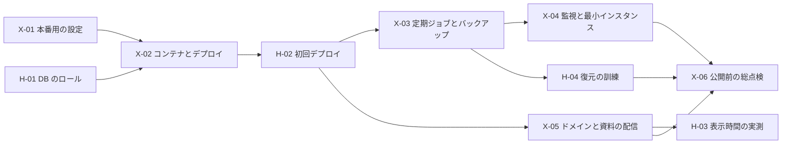

# 本番公開とその後の小分けタスク（X・H・Y・P）

| 項目 | 内容 |
|---|---|
| 対象 | P0 の実装が一巡したあと（2026-10-02 時点）の残り。本番環境づくり（X）、人の作業（H）、P0 の申し送りの片づけ（Y）、P1 の機能（P） |
| 作成日 | 2026-10-02 |
| 使い方 | `docs/p0-tasks.md` と同じ。**1 タスク = 1 セッション**。タスクの見出しから次の見出しの前までを、`p0-tasks.md` §3 の定型文と一緒に貼る。大きさ（S・M・人）の決め方も `p0-tasks.md` §1 のとおり |
| 期限 | **1b の本番公開（2027-01-31）より前に X-01〜X-06 と H-01〜H-07 を終える**（設計書 §13） |
| 前提 | 人の準備（`docs/deploy-prep.md`）は 2026-10-02 に完了。控えた値は `docs/deploy-values.local.md`（Git に入れない。リポジトリは公開なので、識別子もコミットしない） |

---

## 1. 順番

| 区分 | タスク | 数 | 目安の時期 |
|---|---|---|---|
| X: 本番環境 | X-01〜X-06 | 6 | 2026-10〜11 |
| H: 人の作業 | H-01〜H-07 | 7 | X と並行 |
| Y: 申し送りの片づけ | Y-01〜Y-06 | 6 | X のあと、本番公開まで（Y-01 は公開前に必須） |
| P: P1 の機能 | P-01〜 | — | 本番公開のあと。節を読んでから分ける（§5） |

- X のタスクは、本物のクラウドに触る部分を**人が手元の PC で実行するスクリプト**にする。Claude Code は Dev Container の中で動き、`gcloud`・`docker`・`wrangler` を使えない（`.devcontainer/` は変えない）
- **秘密の値（パスワード・API キー・秘密鍵）はチャットに貼らない・リポジトリに入れない**。スクリプトは値を標準入力やファイルから読み、Secret Manager に直接入れる
- 設計にない判断は `docs/adr/` に残す（タスクの中に「ADR」と書いたもの）

---

## 2. X: 本番環境

### X-01 本番用の設定（DB 接続・R2・Brevo・Cookie）［M］

- 前提: `docs/deploy-prep.md` 完了
- 読む設計書: `06-3.md`、`06-5.md`、`11-2.md`（計 約 15 KB）。ADR 0026・0027
- やること
  - **本番の環境変数の検査**: 起動時（`instrumentation.ts` など）に、本番で必須の変数（§6.3 の表のうち P0 のもの）がなければ止める。値はログに出さない。`.env.example` と `docs/ops.md` に本番の一覧（どれが Secret Manager か、どのサービスに渡すか）を書く
  - **DB 接続**: アプリの `DATABASE_URL` は Neon の pooled（`-pooler`）＋`sslmode=require`、プールは 1 インスタンス 5（`DB_POOL_MAX`）。マイグレーション・seed・ジョブは direct。pooled（トランザクション単位のプール）でも `withTenant` の `SET LOCAL` が効くことをテストで確かめる
  - **ロールのパスワードと接続 URL**: `pnpm db:roles` を本番に流す手順を決める（`deploy-prep.md` §3 の「X-01 で決める」）。パスワードは人の PC で作り、Secret Manager に直接入れる。Neon の管理用ロール（`neondb_owner`）で `CREATE ROLE` できるかは【要確認】→ 手順は H-01 に書く
  - **R2**: `src/lib/storage/r2.ts` を本物の R2 で確かめるスクリプト（`pnpm storage:check`。人が本番のキーを `.env.production.local` に入れて実行。3 つのバケットへの置く・読む・消す、公開用の `Content-Type`・`Content-Disposition`・`Cache-Control`）
  - **バックアップ用のキーを分ける**: `R2_BACKUP_ACCESS_KEY_ID` / `R2_BACKUP_SECRET_ACCESS_KEY` を足し、バックアップ用バケットだけはこのキーで触る（`src/lib/storage/index.ts:30-34` はいま 1 組のキーで 3 つのバケットに触る）。アプリ本体には渡さず、日次ジョブだけに渡す。`R2_BACKUP_BUCKET` が空文字のときに既定の名前に戻らない（`??`）のも直す
  - **Brevo の `MailSender`**: `MAIL_PROVIDER=brevo`（HTTP API `POST /v3/smtp/email`）。差出人名は協会の名前、Reply-To は `associations.contact_email`（§11.1）、送信元は `MAIL_FROM`（`no-reply@mail.fukuoka-city-beachball.org`）。タイムアウトと再試行は既存の送信待ちの仕組みに合わせる。エラー文に API キー・宛先を含めない（`sanitizeError()`）
  - **開封・クリックの計測をオフ**（§11.2）: API で 1 通ごとに指定できるか【要確認】。できなければ Brevo の画面の設定で切る（H-01 に書く）
  - **1 日の送信数の 8 割の警告**（§11.2・`progress.md` の申し送り）: `mail_logs` の当日（日本時間・`date.ts`）の送信数が `MAIL_DAILY_LIMIT`（既定 300）の 8 割に達したら、決まった形のログ（例: `{"alert":"mail_daily_limit"}`）を 1 日 1 回出す。知らせる仕組みは X-04
  - **Cookie**: `NODE_ENV=production` で `__Host-` と `Secure` が付くことをテストで確かめる（`src/lib/auth/cookies.ts`。設定は 1 か所のまま）
- テスト: Brevo の送信（`fetch` を差し替え。送る中身・ヘッダ・失敗時の文言に秘密や宛先がない）、8 割の警告（境界・日本時間の日付の変わり目）、本番の Cookie の属性、必須の変数がないときに止まる、pooled での `SET LOCAL`
- ローカルでの動作確認: `.env.local` に人が Brevo の API キーを入れ、`MAIL_PROVIDER=brevo` で自分宛てに確認番号のメールを 1 通送る → 届く・ヘッダの SPF・DKIM・DMARC が `pass`・Brevo のロゴやリンクの書き換えの有無を記録。`pnpm storage:check` が 3 つのバケットで通る

### X-02 コンテナ・マイグレーションの Job・デプロイの GitHub Actions［M］

- 前提: X-01
- 読む設計書: `06-6.md`、`06-5.md` の「構成と契約先」の部分（計 約 5 KB）。ADR 0029
- やること
  - **コンテナ**: `next.config.ts` に `output: "standalone"`、`Dockerfile`（マルチステージ・root で動かさない・ポート 8080）、`.dockerignore`（`.env*`・`.local-storage/`・`*.local.md`・`docs/`（`docs/legal/` は残す）を入れない）
  - **ジョブは esbuild で 1 ファイルにまとめる**（ADR 0029）: `src/jobs/*.ts` と `migrate.ts` を `dist/jobs/*.mjs` に。CI で、まとめたファイルを使い捨ての DB で 1 回ずつ動かす。Artifact Registry に古いイメージを消すルール（無料枠 0.5 GB）。日次ジョブは X-03 で `pg_dump` を使うので、ジョブ用のイメージには PostgreSQL 16 のクライアントを入れる
  - **マイグレーション**: `drizzle-kit`（開発用）ではなく `drizzle-orm` の `migrate()` を呼ぶ小さなスクリプト（`src/db/scripts/migrate.ts`）。Cloud Run Jobs の `migrate` から動かし、`MIGRATION_DATABASE_URL` だけを渡す。初期データ（`seed`）も同じ Job から流す（何度流してもよい作りなので）
  - **GCP の初期設定スクリプト** `tools/gcp-bootstrap.sh`（人が手元の PC で 1 回実行。何度流しても同じ結果になる）: API の有効化、Artifact Registry、サービスアカウント（デプロイ用・アプリ・メールのジョブ・日次ジョブ・migrate）、Workload Identity Federation（`naki27/beachball-portal` の `main` だけ）、Secret の器（値は入れない）と、**Secret ごと・サービスアカウントごとの読み取り権限**（§6.3「使うサービスにだけ」）。プロジェクト ID などは引数か環境変数で受け取り、スクリプトに書かない
  - **Secret に値を入れる手順**: `gcloud secrets versions add <名前> --data-file=-`（標準入力から）を `docs/ops.md` に書く
  - **デプロイ** `.github/workflows/deploy.yml`（`main` へのプッシュ）: テスト → イメージを作って Artifact Registry へ（タグはコミットの SHA）→ `migrate` の Job を実行して待つ → Cloud Run に新しいリビジョンを作る → `/api/health` を確かめる → 失敗なら直前のリビジョンに戻す（§6.6）。Cloud Run の設定は `asia-southeast1`・最小 0・最大 4・未認証の呼び出しを許可。識別子は GitHub の Environment `production` の Variables から読む（リポジトリに書かない）
  - `docs/ops.md` にデプロイ・ロールバックの手順
- テスト: `migrate.ts` は CI の使い捨ての DB に 2 回流しても通る。`docker build` は CI で確かめる（コンテナの中では動かせない）
- ローカルでの動作確認: `pnpm build` のあと `node .next/standalone/server.js` で起動し、http://localhost:3000/api/health が ok。`/privacy`・`/terms` が開く（`docs/legal/` がイメージに入っている）

### X-03 定期ジョブ・DB のバックアップ・復元の手順［M］

- 前提: H-02
- 読む設計書: `06-5.md` の「定期ジョブ」と「補足」の部分（約 4 KB）
- やること
  - **Cloud Run Jobs と Cloud Scheduler**: `job-mail`（数分おき【仮】）と `job-daily`（毎日 3:00・タイムゾーンは `Asia/Tokyo`）。Scheduler の無料枠のジョブ数に収める（§6.5.1）。設定は `tools/gcp-jobs.sh`（人が実行）
  - **① DB のバックアップ**（`progress.md` の申し送り）: `BACKUP_DATABASE_URL`（`app_backup`）で `pg_dump` → 既存の公開鍵の暗号化（申込一覧の CSV と同じ）→ バックアップ用バケットに `daily/YYYY-MM-DD…`。毎月 1 日は `monthly/` にも置く。メモリに全部載せずにストリームで流す
  - **保持**（日次 30 世代＋月初 3 世代・§12）: R2 のライフサイクルのルール（`daily/` は 30 日、`monthly/` は 93 日で消す）。人が画面で設定する手順を `docs/ops.md` に書く
  - **書き込みだけのトークン**（§6.5 補足）: R2 の画面のトークンでは書き込みだけにできない（2026-10-02 に確認）。「バックアップ用バケットだけの Read & Write で受け入れる」か「ほかの方法」かを決める（ADR）
  - **鍵の作り方**: `tools/backup-keygen` を用意し、人が手元の PC で実行する。秘密鍵はその PC にだけ作られ、人が保管する（`deploy-prep.md` §7）。公開鍵だけを `BACKUP_ENCRYPTION_KEY` に入れる。**秘密鍵の中身はチャットに貼らない**
  - **復元の手順**: 人の PC で復号 → Neon のブランチ（無料）に `pg_restore` → 件数を確かめる、を `docs/ops.md` に書く（訓練は H-04）
  - ジョブの失敗は終了コード 0 以外にする（X-04 の監視が拾う）。ログに個人情報を出さない
- テスト: 暗号化 → 復号の往復（テスト用の鍵）、置き場所の名前（日次・月初）、`pg_dump` が失敗したときに途中のファイルを残さない
- ローカルでの動作確認: `pnpm job:daily` で `.local-storage/backup/` に暗号化したダンプができ、テスト用の鍵で復号してローカルの別の DB に復元できる

### X-04 監視と最小インスタンス数の切り替え［S］

- 前提: X-03
- 読む設計書: `06-7.md`、`06-5.md` の「リージョン」の部分（計 約 4 KB）
- やること
  - **監視**（`tools/gcp-monitoring.sh`。人が実行）: `/api/health` の稼働時間チェック、5xx の急増（ログベースの指標）、ジョブの失敗、メールの停止（日次ジョブが「30 分以上 `queued`」「`failed` がある」を見つけて決まった形のログを出す）、1 日の送信数の 8 割（X-01 のログ）。知らせる先は運営の Gmail（**Brevo を経由しない**・Cloud Monitoring の通知チャネル）
  - **⑦ 最小インスタンス数の切り替え**: 日次ジョブが、全協会の「受付中の大会の有効な締切」と「年度更新の締切」のどれかが 7 日以内なら 1、なければ 0 に Cloud Run を更新する。判定は純粋関数にし（日付は `date.ts`、締切は `deadline.ts`）、Cloud Run の更新は差し替えられる口にする。ジョブのサービスアカウントには、そのサービスの設定変更だけの最小限の権限（カスタムロール）
- テスト: 切り替えの判定（6 日・7 日・8 日、日本時間の日付の変わり目、締切の延長、協会が複数）
- ローカルでの動作確認: `pnpm job:daily` のログに「最小インスタンス数: 0（変更なし）」などが出る（ローカルでは Cloud Run を呼ばない）

### X-05 本番のドメイン・大会資料の配信（Workers）・Brevo の仕上げ［S］

- 前提: H-02
- 読む設計書: `11-1.md`、`05-9.md` の「配信の仕組み」の部分（計 約 6 KB）。ADR 0027
- やること
  - **本番のドメインは `portal.fukuoka-city-beachball.org`**（ADR 0028）
  - **Cloud Run にドメインをつなぐ**（ADR 0028）: ドメインマッピング（`asia-southeast1` で使える・プレビュー）で始める。Wix の DNS に CNAME（`ghs.googlehosted.com`）と所有確認の TXT を入れる手順を書く。H-03 の実測で遅延が目標を壊すなら、Firebase Hosting に切り替える（Cookie を `__session` 1 つにまとめる・別の ADR）
  - **Workers**（ADR 0027）: `workers/public-files/`（TypeScript・`wrangler.toml` に公開用バケットのバインディング）。GET と HEAD だけ、オブジェクトのメタデータ（`Content-Type`・`Content-Disposition`・`Cache-Control`）をそのまま返す、なければ 404、一覧は返さない。人が手元の PC で `wrangler deploy` する手順を書き、`PUBLIC_FILES_BASE_URL` に `https://<名前>.<アカウント>.workers.dev` を入れる。ロゴも同じ道で配る
  - **Brevo**: ルートの `_dmarc` が未設定なら `p=none` で始める手順（§11.1）。テスト送信（H-05）の結果を `docs/ops.md` に書く
  - 設計書の `files.entry.…` の例は ADR 0027 に合わせて読み替える旨を `docs/ops.md` に書く（設計書は次の版で直す）
- テスト: Workers の応答（メタデータを通す・404・POST を拒む）を、バケットを差し替えて確かめる
- ローカルでの動作確認: 本番で資料を公開 → アプリの URL → 302 → workers.dev で PDF がブラウザ内で開く → 非公開にするとアプリの URL が 404・Workers の URL も 404

### X-06 本番公開前の総点検［S］

- 前提: X-04・X-05・H-03・H-04・Y-01
- 読む設計書: `13-0.md` の 1b の公開の部分
- やること: 下の表を 1 つずつ確かめ、結果を `docs/ops.md` に書く。直すものが見つかったら Y か新しいタスクにする（このタスクの中で直さない）
  - 運営管理者で本番にログインできる（`SUPER_ADMIN_EMAILS`）。早良区協会の連絡先メール・色・ロゴ
  - 確認番号のメールが docomo・au・SoftBank・Gmail・iCloud に届く（H-05 の結果）
  - 法務の【要確認】（`docs/legal/*.md` の末尾）と `TERMS_VERSION`
  - `docs/ops.md` §8 の未決事項、A-12 の人の確認
  - 本番の DB に開発用のデータ（`seed-dev`）が入っていない
  - 監視の通知が届く（テスト通知）。予算アラート
- ローカルでの動作確認: なし（本番で確かめる）

---

## 3. H: 人の作業

Claude Code はほとんど使わない。手順は X のタスクで `docs/ops.md` に書いたものに従う。

| ID | やること | 前提 | 結果を書く先 |
|---|---|---|---|
| H-01 | Neon の控えを直す（「プロジェクト ID」が `br-…` のブランチの ID になっている。Settings のプロジェクト ID に）。ロールのパスワードを作り、`pnpm db:roles` を本番に流し、接続 URL を Secret Manager に入れる。Brevo の開封・クリックの計測を切る（X-01 でそうなった場合） | X-01 | `deploy-values.local.md` |
| H-02 | `tools/gcp-bootstrap.sh` を実行 → Secret に値を入れる → GitHub の Environment `production` に Variables → **`feature/cd` を `main` に取り込む** → 初回のデプロイが緑・`*.run.app/api/health` が ok | X-02・H-01 | `deploy-values.local.md` |
| H-03 | 表示時間の実測（§6.5.2）: 福岡のスマホ（4G）で、通常時とコールドスタート時（30 分以上あけて）を 3 回ずつ。`*.run.app` と `portal.`（ドメインマッピング）の両方で測る（ADR 0028）。目標は 1 秒以内・4 秒以内【仮】 | H-02・X-05 | `docs/ops.md` |
| H-04 | 復元の訓練（§6.5 補足・§13）: バックアップを手元で復号し、Neon のブランチに復元して件数を確かめる。終わったらブランチを消す | X-03 | `docs/ops.md` |
| H-05 | テスト送信: 確認番号のメールを、docomo・au・SoftBank・Gmail・iCloud のアドレスに送り、届くか・迷惑メールに入るかを見る | X-01・H-02 | `docs/ops.md` |
| H-06 | Workers をデプロイし、R2 のライフサイクルのルールを入れる | X-03・X-05 | `deploy-values.local.md` |
| H-07 | らくらくスマートフォンの実機で、ログイン・申込・資料を開くまでを通す | H-02 | `docs/ops.md` |

---

## 4. Y: P0 の申し送りの片づけ

`docs/progress.md` の「残っている申し送り」から。Y-01 は本番公開の前に必須、ほかは公開の前後どちらでもよい。

### Y-01 保存期間の対象に `entry_audits`・`export_logs` を足す［S］

- 前提: なし
- 読む設計書: `12-0.md` の保存期間の表の部分
- やること: `RETENTION_DAYS`（`src/lib/jobs/daily.ts`）に 2 つの表を足す。`app_job` に delete の権限を足すマイグレーション（`0012` は select・insert だけ）
- テスト: 期限を過ぎた行だけが消える・ほかの協会の行は消えない

### Y-02 E2E を CI に入れるか決めて入れる［S］

- 前提: X-02
- 読む設計書: `12-1.md`
- やること: 入れるか決める（ADR。かかる時間と、Turbopack で 1 本ずつ流す制約・`progress.md` の「作業の注意」）。入れるなら、`main` への pull request だけで、主要な spec に絞って流す

### Y-03 運営画面に「アクセス記録」と「メールの送信記録」を出す［M］

- 前提: なし
- 読む設計書: `05-14.md`
- やること: `admin_access_logs`・`mail_logs` を読む画面（運営管理者だけ）。RLS の外の表なので、読み出しは `SECURITY DEFINER` の関数にする（マイグレーション）。宛先のメールアドレスは一部を伏せて出す
- テスト: 運営管理者以外は 403、協会をまたいで見えない

### Y-04 申込の小さな未実装［S］

- 前提: なし
- 読む設計書: `05-5.md` の申込の部分、`05-10.md`
- やること
  - 管理者が申込で定員を超えるときに「定員を超えています」の確認を出す（サーバーは管理者なら通す・`submit-entry.ts`）
  - 問い合わせに `tournament_id` も入れる。申込の画面から `?entryId=` 付きで問い合わせへ飛ぶ導線（変更画面の 409 のとき）

### Y-05 表示の小さな直し［S］

- 前提: なし
- 読む設計書: `04-4.md`（用語の対応表）
- やること: 個人登録だけの人に「チームの代表者」と出る（`ROLE_LABEL`・`getMembership` がチームの種類を持たない）。`/admin/trash` を 1 ページに全件出している（ページ分け）。ADR 0007 の表示名 30 文字を §14-13 と突き合わせる

### Y-06 Brevo の Webhook（配信失敗・受信拒否）［S］

- 前提: X-05
- 読む設計書: `11-2.md`、`10-0.md` の Webhook の部分
- やること: `POST /api/webhooks/brevo/:token`（`BREVO_WEBHOOK_TOKEN` で認証・重複は無視）で `mail_logs.status` を `bounced` などに更新する（設計書は P1）。Brevo の画面での Webhook の登録手順を `docs/ops.md` に書く

---

## 5. P: P1 の機能（本番公開のあと）

設計書の P1 の節を読んでから、`p0-tasks.md` と同じ大きさに分けてこの節に書き足す。いま分かっているものだけを挙げる（中身はまだ設計書と突き合わせていない）。

| ID | 機能 | 主な節 |
|---|---|---|
| P-01 | 2 段階認証（パスキー・認証アプリ・リカバリーコード・ログイン通知）。`authz.ts` に条件を足す | `09-4.md` |
| P-02 | 契約・請求（`/admin/contract`・領収書と請求書の PDF・テナント管理者の人数） | 契約の節（`docs/design/index.md` で探す） |
| P-03 | 一斉送信を複数日に分ける（年度更新の依頼・督促） | `11-2.md`、`06-5.md` の「定期ジョブ」の部分 |
| P-04 | 年度更新の初年度の取り込み・名簿の出力 | 年度更新の節 |
| P-05 | 規約の改定で同意を取り直す（`users.terms_version`） | `05-18.md` |

- 協会を増やす（早良区協会のほかに）ときの手順も、このあとで決める
